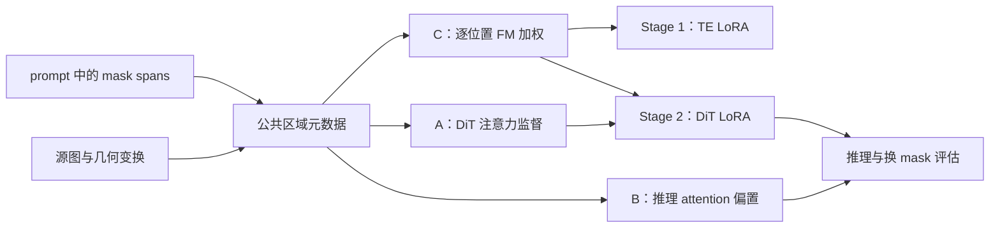
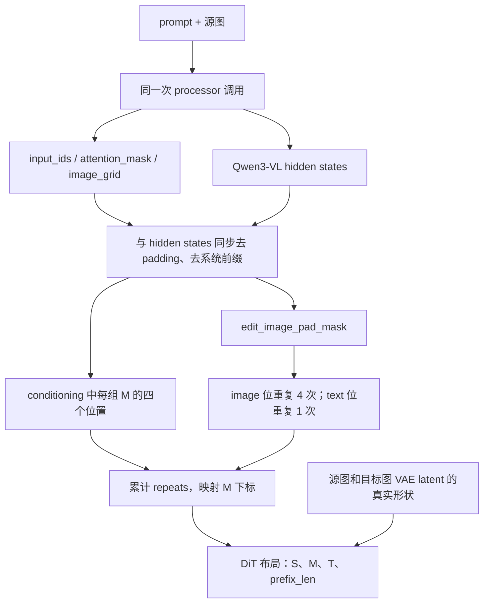
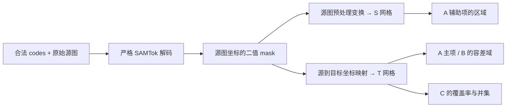
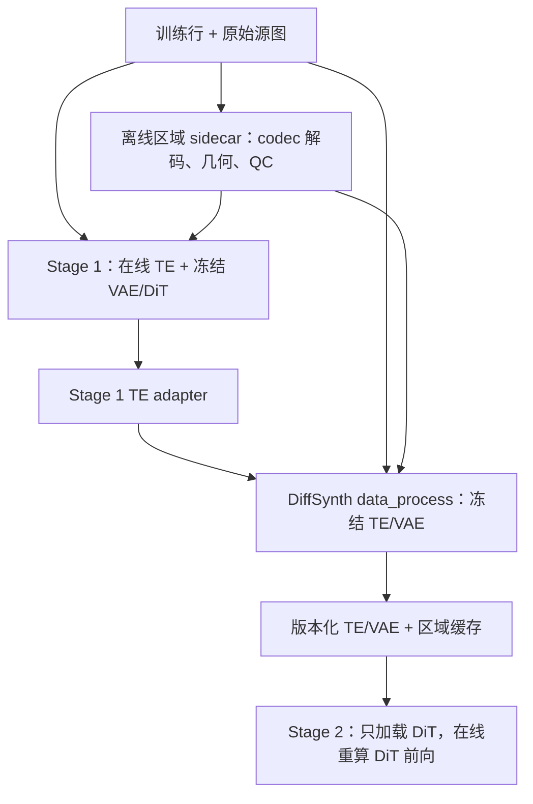
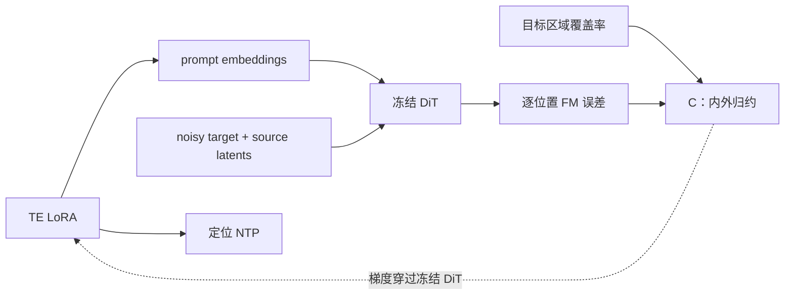
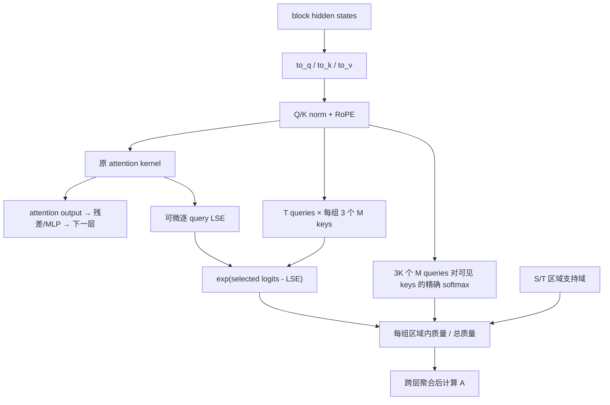
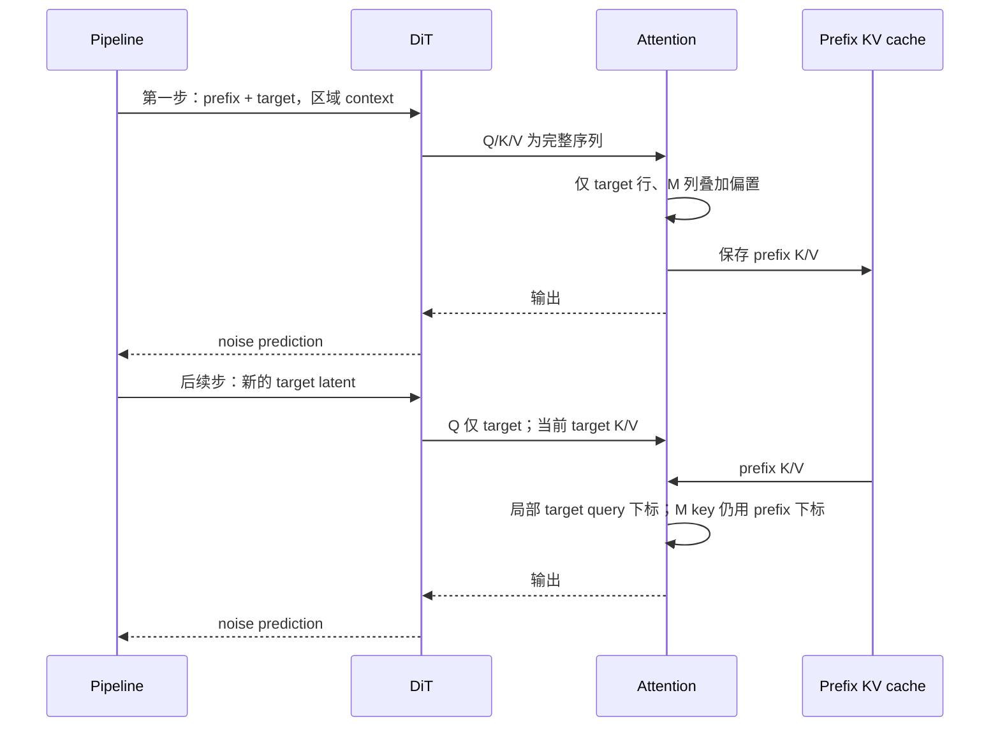

# SAMTokEdit Qwen-Image-2.1：mask 区域约束实现规划

> 状态：设计规划，尚未实现、尚未开展本轮训练实验。
> 日期：2026-09-26。
> 对照代码：`qwen-image-2.1-dev`，commit `1859744d618611f8e203edbb7b0d7be42500a0b7`。
> 方案来源：`/opt/tiger/tanyue/SAMTok_mask_attention_constraints.md`。
> 本文中的新文件、函数、配置和命令均为拟议接口，不代表当前已经可用。

## 1. 目标、结论与实施顺序

目标是让编辑结果随 prompt 中 SAMTok mask tokens 指定的区域变化，同时保留当前两阶段训练方法：

- Stage 1：训练 Qwen3-VL TE LoRA，使用定位 NTP 和编辑 FM。
- Stage 2：冻结 TE，缓存 TE/VAE 特征，训练 Qwen-Image-2.1 DiT LoRA。
- 优先扩展当前 DiffSynth 模型、pipeline、训练 runner；噪声调度、模型初始化、LoRA 保存加载继续复用现有代码。

拟实现三项能力：

| 名称 | 作用 | 应用位置 | 可行性判断 |
|---|---|---|---|
| C：区域加权 FM | 提高局部编辑区域在误差中的权重，同时保留区域外监督 | Stage 1/2 的局部 UMT 样本 | 接入直接；必须明确整体 loss 尺度和 mask 几何 |
| A：注意力监督 | 约束目标图读取 mask tokens、mask tokens 读取源图的空间分布 | Stage 2 的局部 UMT 样本 | 架构支持；需要可微 LSE 和 checkpoint 安全的统计返回 |
| B：推理软偏置 | 降低区域外目标位置对 mask tokens 的注意力 | 含有效局部 mask 的推理请求 | 可保留 prefix KV cache；必须覆盖首步和后续步 |

**实施顺序：建立 2.1 基线 → 公共区域元数据 → C → A → B → 消融评估。**

实现正确性与研究效果分别验收。数值和梯度测试可以验证实现是否符合公式；注意力集中是否带来正确编辑，需要换 mask 实验验证。旧 2511 的观察作为研究动机，不能直接当作 2.1 基线的实测结论。



## 2. 当前代码的接入地图

下表的源码链接固定到审查时的 commit，便于后续修改后仍能核对原始行为；文件列链接到仓库中的文件。

| 代码文件 | 当前行为与源码定位 | 计划改动 |
|---|---|---|
| [model.py](samtok_edit21/model.py) | [`encode_edit`](https://github.com/Tangent0308/samtok_edit/blob/1859744d618611f8e203edbb7b0d7be42500a0b7/samtok_edit21/model.py#L210) 复用 PromptEmbedder；[`edit`](https://github.com/Tangent0308/samtok_edit/blob/1859744d618611f8e203edbb7b0d7be42500a0b7/samtok_edit21/model.py#L266) 串联定位与编辑 | 接收精确 token 布局；推理准备区域约束并传入 pipeline |
| [codec.py](samtok_edit21/codec.py) | [`decode`](https://github.com/Tangent0308/samtok_edit/blob/1859744d618611f8e203edbb7b0d7be42500a0b7/samtok_edit21/codec.py#L179) 用于可视化，会调用格式修复 | 新增严格解码接口，监督路径不修复、不丢弃 span |
| [data.py](samtok_edit21/data.py) | [`load_images`](https://github.com/Tangent0308/samtok_edit/blob/1859744d618611f8e203edbb7b0d7be42500a0b7/samtok_edit21/data.py#L86) 读取源图并缩放目标图 | 记录实际几何变换，校验区域与图像网格 |
| [protocol.py](samtok_edit21/protocol.py) | [`validate_row`](https://github.com/Tangent0308/samtok_edit/blob/1859744d618611f8e203edbb7b0d7be42500a0b7/samtok_edit21/protocol.py#L288) 校验数据类型、span；UMT/NTP 仅允许单源图 | 增加区域适用性检查；保留主输入协议，派生信息进入 sidecar/cache |
| [training.py](samtok_edit21/training.py) | [`prepare_fm`](https://github.com/Tangent0308/samtok_edit/blob/1859744d618611f8e203edbb7b0d7be42500a0b7/samtok_edit21/training.py#L175) 构造 TE/VAE 输入；[`flow_loss`](https://github.com/Tangent0308/samtok_edit/blob/1859744d618611f8e203edbb7b0d7be42500a0b7/samtok_edit21/training.py#L190) 使用全图 MSE | 构造区域输入；逐位置 FM；汇总 A/C 和诊断指标 |
| [train.py](samtok_edit21/train.py) | [`SamtokTrainingModule.forward`](https://github.com/Tangent0308/samtok_edit/blob/1859744d618611f8e203edbb7b0d7be42500a0b7/samtok_edit21/train.py#L177) 适配数据处理、Stage 1、Stage 2 | 扩展 cache schema、配置、warmup 计数、日志与导出配置 |
| [qwen_image_21.py](DiffSynth-Studio/diffsynth/pipelines/qwen_image_21.py) | [`PromptEmbedder.process`](https://github.com/Tangent0308/samtok_edit/blob/1859744d618611f8e203edbb7b0d7be42500a0b7/DiffSynth-Studio/diffsynth/pipelines/qwen_image_21.py#L174) 丢弃系统前缀；[`model_fn`](https://github.com/Tangent0308/samtok_edit/blob/1859744d618611f8e203edbb7b0d7be42500a0b7/DiffSynth-Studio/diffsynth/pipelines/qwen_image_21.py#L314) 构造图像序列 | 同次 processor 调用返回可选布局；透传约束配置；兼容可选 attention 统计输出 |
| [qwen_image_21_dit.py](DiffSynth-Studio/diffsynth/models/qwen_image_21_dit.py) | [`AttnProcessor`](https://github.com/Tangent0308/samtok_edit/blob/1859744d618611f8e203edbb7b0d7be42500a0b7/DiffSynth-Studio/diffsynth/models/qwen_image_21_dit.py#L200)、[`DiT.forward`](https://github.com/Tangent0308/samtok_edit/blob/1859744d618611f8e203edbb7b0d7be42500a0b7/DiffSynth-Studio/diffsynth/models/qwen_image_21_dit.py#L459) | 接入 A 的概率统计、B 的 score_mod；返回 checkpoint 安全的辅助统计 |
| [attention.py](DiffSynth-Studio/diffsynth/core/attention/attention.py) | [`flex_attention/attention_forward`](https://github.com/Tangent0308/samtok_edit/blob/1859744d618611f8e203edbb7b0d7be42500a0b7/DiffSynth-Studio/diffsynth/core/attention/attention.py#L221) 支持部分路径传 score_mod，目前不返回 LSE | 增加可选 LSE 返回；保证启用偏置时选择支持它的后端 |
| [runner.py](DiffSynth-Studio/diffsynth/diffusion/runner.py) | [`训练循环`](https://github.com/Tangent0308/samtok_edit/blob/1859744d618611f8e203edbb7b0d7be42500a0b7/DiffSynth-Studio/diffsynth/diffusion/runner.py#L115) 管理 DDP、accumulation、optimizer | 仅在必要处扩展通用 step/metrics hook；提供真实 optimizer update 计数 |
| [cli.py](samtok_edit21/cli.py) | [`inference`](https://github.com/Tangent0308/samtok_edit/blob/1859744d618611f8e203edbb7b0d7be42500a0b7/samtok_edit21/cli.py#L200) 加载 adapter、处理交互与在线推理 | 新增区域配置入口、B 配置与输出诊断信息 |

拟新增项目模块：

```text
samtok_edit21/
  mask_constraints.py       # 区域配置、严格元数据、空间映射、布局校验
  mask_attention.py         # A 的聚合与 B 的 score_mod 构造
tests/mask_attention/
  ...                       # 数值对照、梯度检查、分布式检查、评估脚本
```

当前已有 `regions.py`，负责点/框候选和解码预览；新训练约束模块独立命名，避免把监督逻辑混入交互预览。`training.py` 还保留旧的自定义训练入口；新功能以 `train.py` 为主入口，共享 loss/区域函数，旧入口须明确支持或显式拒绝新配置，防止同名配置产生不同训练行为。

## 3. 公共数据流：从 mask codes 到 DiT 网格

### 3.1 两种位置与三种图像网格

需要区别：

1. processor 生成的 TE token 下标；
2. 去 padding、去系统前缀后的 conditioning 下标；
3. 图像占位展开后的 DiT joint sequence 下标。

TE 图像特征的空间位置数量与源图 VAE latent 数量相差 4 倍。当前 DiT 用 `repeat_interleave` 将每个图像占位展开四次，再填入 VAE latents。因此不能把 TE 下标直接当作 DiT 下标。



令 conditioning 位置为 `p`，则其在 joint sequence 中的起始位置为：

$$p_{\mathrm{DiT}}=\sum_{u<p}\mathrm{repeats}_u,\qquad
\mathrm{repeats}_u=\begin{cases}4,&\text{image-pad}\cr1,&\text{text}\end{cases}$$

布局构造复用 DiT 的展开和 `build_token_metadata` 规则。提取 span 时按出现顺序编号，同一组 codes 出现两次也保留两个 occurrence，不按 token ID 去重。

实现断言：

- 每组恰好是 start、code1、code2、end 四个原子 token；四个位置连续且完整。
- `mask_positions` 指向文本位置，不指向 image/padding。
- 图像占位展开数等于源图 latent 数；目标位置数等于目标 latent 数。
- flatten/unflatten 使用与 `patchify` 相同的行优先顺序。
- 当前 UMT 仍限制单源图；多源图与 mask 的绑定尚未定义，不能自动猜测。

### 3.2 解码与坐标处理

严格解码只接受已经验证的 span，调用现有 VQ-SAM2 权重。不调用可视化用的 `fix_mt_format_comprehensive`。每条样本的解码结果与 span 数量必须一致。



解码输入图像的约定必须在训练和推理中一致：使用原始源图，codec 内部继续使用其 `DirectResize(1024)`；解码后映射回原始源图坐标，再应用编辑模型的几何变换。已有 `decoded_path` 只有在源图内容、codes、codec 权重和预处理配置匹配时才复用。

目标图区域可以由源图 mask 推出，前提是源目标已配准，或存在可信的显式坐标变换。**尺寸相同不等于已配准。** 首版对已知配准的局部编辑数据启用约束；不支持的裁剪、平移、重新取景样本记录原因，只保留普通 FM。不能把未配准图像强行 resize 后当作正确监督。

SAMTok 解码 mask 是 token 对应的监督区域，不等于经过人工确认的编辑真值。对 add、跨位置 action、background 补集等形状，应检查 codec 重建是否保留所需区域；解码后为空、严重失真或与目标编辑不相容时，需要数据质量诊断。解码只能依赖源图和 codes，不读取目标内容来生成监督 mask。

### 3.3 覆盖率图与容差图分开

拟提供两种显式配置用于消融：

| 配置 | A/B 使用的区域 | C 使用的区域 | 用途 |
|---|---|---|---|
| `proposal` | 原文的 area resize 后 3×3 maxpool | 原文的外扩覆盖率并集 | 忠实对照原始方案 |
| `support`，推荐首版改进 | `maxpool((coverage > 0).float(), 3)` | 未外扩的面积覆盖率并集 | 避免小目标无法达到 r=1，并避免 C 将容差带当作编辑核心 |

这些名字是拟议配置。两种版本在报告中分开标记，不把公式改动隐藏在实现中。

原式存在一个小目标问题：若所有 token 覆盖率均小于 1，则 `r <= max(mask) < 1`，完美定位仍留下不可消除的 A loss。maxpool 不会把覆盖率自动变成 1。支持域版本解决这个目标定义问题，但会扩大极小区域，因此必须记录原始面积、支持域面积和膨胀后的面积；边界噪点也需要 QC。

对 background，区域外是受保护前景，外扩背景会侵入保护带；需单独检查前景边缘保持。建议 C 使用未外扩覆盖率，A/B 的外扩半径保留为可配项。

在 1024×1024 输出下，T 网格为 64×64；在 256×256 下为 16×16。外扩一个 token 在这些设置中都对应约 16 个输出像素，但占全图的比例不同，低分辨率 smoke 不能用来决定正式训练的边界参数。

多区域 C 的推荐并集：先在像素空间求二值并集，再映射和面积下采样。`max` 各个软覆盖率不总等于真实并集覆盖率，例如同一网格内两个互不重叠的半格区域。原文逐网格 max 的版本保留在 `proposal` 对照中。

### 3.4 适用性与失败处理

| 样本情况 | 处理 |
|---|---|
| `edit_ntp` | 只做既有 NTP，不计算 A/C |
| plain `edit` | 既有 FM，不计算 A/C |
| 局部 `edit_umt` ref/noref | 元数据有效时计算 C；Stage 2 另计算 A |
| `global` | 不启用本轮区域约束；即使 prompt 有全图 M 也不例外 |
| composite 全部为局部单元 | 每组 A/B，区域并集 C |
| composite 含全局单元 | 需要 sidecar 单元类型；首版保守跳过整条的区域约束，不按面积猜类型 |
| 空解码区域、未知空间映射 | 保留普通 FM，并记录 skip reason；不动态重采样 |
| span 损坏、索引越界、缓存身份冲突 | 数据构建/加载时明确报错，不能静默当普通样本 |

原文提到的动态截断不是当前已存在的训练策略。首版不新增截断；如果未来启用，应重新校验实际输入中的完整 span，不能沿用截断前的位置。

## 4. 区域缓存与版本一致性

### 4.1 缓存的是什么

当前 Stage 2 缓存 TE embeddings、目标 VAE latent、源图 VAE latents。新版本增加派生区域元数据，不缓存训练中的 DiT KV。



Stage 1 可复用区域 sidecar，但 TE 正在训练，FM 所需 TE embeddings 必须在线计算。Stage 2 每次更新 DiT 参数后，prefix 的 hidden states 和 KV 都可能变化，不能跨训练步缓存这些值。

### 4.2 拟议缓存结构

以下为字段设计示意，不是当前可读取的格式：

```text
samtok21-cache-v2
  existing:
    input_latents, edit_latents
    prompt_embeds, prompt_embeds_mask, edit_image_pad_mask
  region_context:
    schema_version
    sample_type, edit_type, instr_variant
    eligible, skip_reason
    span_codes[K, 2]
    mask_positions_cond[K, 4]      int64
    source_grid, target_grid
    source_coverage[K, Hs, Ws]
    target_coverage[K, Ht, Wt]
    target_union_coverage[Ht, Wt]  像素并集下采样所得
    geometry_identity, codec_identity
```

DiT joint 下标和 tolerance support 可由缓存信息确定性生成；不同时存多套独立位置而不校验。覆盖率可经误差验证后用较低精度落盘，训练归约使用 FP32；索引保持 int64，valid mask 保持 bool。

在 `_cache_manifest`、`verify_cache` 中扩展身份检查：源图内容 hash、codes、codec 权重 hash、模型/TE adapter、模板/processor、分辨率和几何配置。文件路径本身不足以识别缓存内容。新功能开启而输入为旧缓存时明确要求补充区域缓存；功能关闭时保留旧缓存兼容。

Stage 2 的 `ScheduledCache` 当前只返回缓存 tensor 字典，训练 forward 收不到原始行。区域 eligibility 和样本类型必须随缓存传入，否则无法区分 plain edit、local UMT 与 global。

两张 64×64 的 FP32 单组区域图约 32 KiB，多组、并集图和元数据另计。因此不沿用“每条几 KB”的固定估计，实际报告序列长度、K 与缓存大小。

## 5. C：区域加权 FM 的实现

### 5.1 保持基础 FM 语义

当前 `flow_loss` 生成 noise、采样 scheduler timestep、构造 noisy latent 和 training target，调用 `pipe.model_fn` 后取全图 MSE。计划保持这些步骤，将 MSE 的归约延后：

```python
# 设计伪代码：pred/target 为 [B, 64, Ht, Wt]
e = (pred.float() - target.float()).square().mean(dim=1)
base = e.mean(dim=(-2, -1))
inside = (m_union * e).sum(dim=(-2, -1)) / area_in.clamp_min(n_min)
outside = ((1 - m_union) * e).sum(dim=(-2, -1)) / area_out.clamp_min(n_min)
regional = base + lambda_c * (inside + outside)
fm = scheduler_weight * regional
```

通道维使用 mean，使 `lambda_c=0` 恢复当前 `mse_loss` 的尺度。目标值直接来自 scheduler 的 `training_target`，不另写一套 target；保留 scheduler 的时间步权重并作用于 FM 与 C 的整体。

对无效/不适用样本，直接使用基础 FM 分支。空区域不是除以 epsilon 后继续参与监督；全图/global 也不能靠通用公式自动视为局部样本。

### 5.2 两阶段的完整损失

记 `w(t)` 为当前 scheduler 的训练权重，`R = e_in + e_out`，`I_local` 为本轮约束适用标识。

Stage 1 按样本类型分支：

$$L_1=\begin{cases}
\lambda_{\mathrm{NTP}}L_{\mathrm{NTP}},&\text{edit\_ntp}\cr
\lambda_{\mathrm{FM}}w(t)[L_{\mathrm{MSE}}+I_{\mathrm{local}}\lambda_C R],&\text{编辑样本}
\end{cases}$$

Stage 2：

$$L_2=w(t)[L_{\mathrm{MSE}}+I_{\mathrm{local}}\lambda_C R]
+I_{\mathrm{local}}\lambda_A(u)[L_{\mathrm{attn}}+\mu L_{\mathrm{read}}]$$

`u` 是 optimizer update 数。A 暂不额外乘 scheduler 权重，遵循方案中所有采样时间步均计算 A 的设计。



图中为 Stage 1 的编辑梯度路径；冻结 DiT 参数不代表对 DiT 前向使用 `no_grad`，否则 C/FM 无法训练 TE。

### 5.3 尺度与小目标校验

默认候选 `lambda_c=0.5`、`n_min=16`，同时测试 `lambda_c=0,0.25`。当内外分母未截断、各位置误差相等时，加法式会将 UMT FM 放大约 `1+2*lambda_c` 倍；它改变空间权重，也改变 UMT 相对 plain/NTP 的权重。

为隔离这两个因素，增加有效总权重归一化对照。若逐位置基础权重为 `1/N`，附加权重分别为 `lambda_c*m/den_in` 和 `lambda_c*(1-m)/den_out`，则归一化除数取：

$$Z=1+\lambda_C\left[\frac{a_{in}}{\max(a_{in},n_{min})}+\frac{a_{out}}{\max(a_{out},n_{min})}\right]$$

该对照用 `regional / Z`；不在分母截断时仍机械地除以 `1+2*lambda_c`。主实验保留原文加法式，二者单独记录。

原文 27.5% 等比例描述的是特定条件下的误差权重份额，不是实际参数梯度范数。记录内外面积、分母截断率、loss、加权总量和梯度范数，再判断 NTP/FM 比例是否需要调整。

## 6. A：注意力监督的实现

### 6.1 可见性与监督方向

当前 `build_qwenimage21_block_causal_mask` 允许 `q_idx >= kv_idx` 或同图像块双向访问；M 位于源图后、目标图前。

| query → key | 之前的文本/模板 | S | M | T |
|---|---|---|---|---|
| S | 可见 | 同块双向 | 不可见 | 不可见 |
| M | 可见 | **A 辅助项** | 因果可见 | 不可见 |
| T | 可见 | 可见 | **A 主项 / B** | 同块双向 |

使用 code1、code2、mt_end；mt_start 不包含本组后续 codes。这里并不是说所有 mt_start hidden states 完全一样：它仍受前文、源图和之前 mask 组影响。首版沿用三个 token 的选择，必要时再单独对照 mt_end。

### 6.2 使用真实 Q/K 和可微 LSE



主项：在选定层，用完成 norm/RoPE 的 Q/K 计算 `T × 3K` logits，结合原 kernel 的 LSE 恢复概率。LSE 对应该 query 的全部可见 keys，包含正确的 block mask 和 padding 规则。

辅助项：只对 `3K` 行重算完整可见 softmax，取源图列，再按原文顺序聚合和归一化。先对 S 单独 softmax、再跨头平均一般不等于该公式。

当前 DiffSynth wrapper 不返回 LSE，需要增加可选返回值；禁用监督时继续返回原来的 tensor。PyTorch 2.8 的 `flex_attention` 已公开 `return_lse` 和 `score_mod`，实现将以本地安装版本为准。[PyTorch 2.8 接口文档](https://docs.pytorch.org/docs/2.8/nn.attention.flex_attention.html)

**不 detach LSE。** 忽略分母梯度会改变对 Q 和所有可见 K 的梯度；单个注意力概率小不足以证明参数梯度误差可忽略。先建立 FP32 dense reference，再核对 compiled Flex 前向与反向。若当前环境的组合不支持精确反向，先使用分块精确重算路径进行验证，不静默降为近似梯度。

归约使用 FP32，并评估 log-domain 聚合以防极小概率下溢；不以较大的 epsilon 人为改变概率归一化。记录接近零的总质量和数值异常。

### 6.3 保留原式的聚合顺序

每层返回每组主项的 `inside_mass` 与 `total_mass`，辅助项返回对应两项。层、头、组内 token 的常数平均因子可在比例中抵消；最终：

$$r_k=\frac{\sum_l \mathrm{inside\_mass}_{l,k}}{\sum_l \mathrm{total\_mass}_{l,k}},\qquad
L_{attn}=\frac{1}{K}\sum_k(1-r_k)^2$$

辅助项同理。不能把“各层分别求 r 再取平均”当作原式，也不能把各层平方损失的平均当作原式。逐层 r 另行作为日志输出。

同一张图先对有效 K 取均值，再按当前训练批次约定归约，避免多 mask 样本仅因 K 大获得更大权重。功能关闭或样本不适用时不提取统计量。

### 6.4 显式返回统计，兼容 checkpoint

拟议返回链路：

```text
AttnProcessor
  → attention_output, optional_stats
TransformerBlock
  → hidden_states, optional_stats
gradient_checkpoint_forward
  → 对 hidden_states 和 stats 保留可微返回
DiT.forward
  → model_output, optional_aggregated_stats
model_fn_qwen_image_21
  → unpatchify(target_output), optional_stats
flow_loss
  → FM + C + A
```

默认返回类型保持旧行为；启用 A 时采用显式可选辅助返回，并验证当前 non-reentrant checkpoint 能正确传播。推理不开 A 时仍使用普通预测 tensor，避免破坏 CFG/scheduler。

不通过全局 hook 列表缓存 attention：checkpoint 重算可能重复写入、错配层和保留计算图。每次前向的区域 context 是只读输入，统计量是显式输出；不能在 backward 重算时依赖已被下一样本覆盖的模块属性。

### 6.5 参数和诊断

| 项目 | 首轮配置/策略 |
|---|---|
| 监督阶段 | Stage 2；Stage 1 暂只加入 C |
| 层 | 第 8/12/16/20/24 层，即零基下标 `[7,11,15,19,23]` |
| 头 | 全部头，按原式聚合 |
| M 位置 | code1、code2、mt_end |
| `mu` | 0.5 为初始候选，并有 0 的辅助项消融 |
| `lambda_a` | 校准同一噪声/时间步下 A 与基础 FM 的梯度范数比，候选 0.1–0.3；另记录相对 FM+C 的比例 |
| warmup | 按 optimizer update 线性增长；正式训练以 500 updates 为候选，短实验另配 |
| LoRA | 当前所有 DiT Linear 已包含 to_q/to_k；检查真实梯度，不只检查模块名称 |

梯度校准在独立诊断运行中进行，使用同一组参数计算范数和夹角，不把额外 backward 混入正常 accumulation。LoRA 初始化可能使部分 A/B 矩阵初始梯度为零，不能要求每个 LoRA tensor 第一刻都非零；要检查应有的参数组信号和实际参数更新。

除 r 以外记录：M 的绝对 attention 总质量、逐层 r、按区域面积与时间步分桶的统计、FM/C/A 分量及梯度夹角。面积不同的 r 不能直接横比，需同时报告均匀注意力对应的区域覆盖基线。

## 7. B：推理软 mask 的实现

### 7.1 偏置定义与局限

对目标图 query i 和第 k 组 M 的三个 key j：

$$z'_{ij}=z_{ij}-\beta(1-m^{(k)}_{support,i})$$

其他位置不加偏置。训练时先不启用 B；推理测试 `beta=0,2,4`，全部层为原文配置，同时保留层范围开关。

`exp(-beta)` 是未归一化权重的倍率。若同一组被均匀抑制的 keys 原总概率为 p，则新概率：

$$p'=\frac{e^{-\beta}p}{1-p+e^{-\beta}p}$$

B 降低区域外读取 M 的概率，不保证区域内一定使用 M，也不限制其他文本/源图信息传播。训练推理偏移是否小需要评估，不能由 beta 的数值直接保证。

### 7.2 通过 pipeline 显式传递

计划扩展 pipeline 的可选区域 context 和偏置配置输入，通过 `inputs_posi` / `model_fn` 传到 DiT；不要只把新参数放入 `**kwargs` 后被当前 model_fn 忽略。负分支 context 必须为空。

在线模式先由 pass-1 生成 codes，再在原始源图上严格解码；交互模式先 encode 用户选区，再 decode 同一组 codes。训练和推理使用同一几何与区域函数。在线定位失败按现有 plain fallback 推理，同时清空约束 context，不能复用上一请求的 mask。

### 7.3 KV cache 前后的索引



首步：目标行的全局位置减 `prefix_len` 后索引目标区域图。后续步：query 已只含 T，本地下标直接对应目标网格。key 序列仍为 prefix + T，M 的 key 下标保持不变。

偏置只影响 T 的输出，block-causal 阻止 prefix 读取 T，因此不改变 prefix KV 的数学值。继续缓存 prefix，但要求 cache on/off 的预测数值对照通过。

### 7.4 后端分发与内存

用 Flex `score_mod` 根据 query 位置、key 对应 mask 组、区域覆盖值计算偏置，不物化完整 N×N 浮点矩阵。提前准备 key→mask-group 查表及目标区域张量；kernel 对 padding 和无组 key 的索引必须安全，不能依赖 `where` 隐藏越界访问。

当前 `attention_forward` 的后端分发并非所有路径都处理 score_mod。尤其缓存后 `attention_mask=None` 时可能进入其他后端；启用 B 时必须显式选择支持偏置的路径，或调整通用分发优先级，并测试无 block mask 的 decode。

当前无 Flex 的 `use_two_pass` fallback 对 prefix 使用普通 causal attention，与源图块内双向语义并不完全一致。本轮不能把它当作等价基线：生产约束路径要求正确的 block-causal 后端；若提供 fallback，需显式构造相同规则并通过数值对照，否则报错。

## 8. 分布式训练、日志与配置

继续使用 `make_schedule → ScheduledMetadata/ScheduledCache → DiffSynth runner → Accelerate`。区域无效时只跳过 A/C，不在线替换成另一类样本，避免破坏每卡混合比例。

拟新增配置组，最终命名以实现后文档为准：

```yaml
# 设计示意，当前 CLI 尚不支持加载此配置
mask_constraints:
  region_mode: support
  dilation_tokens: 1
  invalid_region_policy: fm_only_with_reason
  fm:
    lambda_c: 0.5
    min_tokens: 16
    normalization: additive
  attention:
    stage: stage2
    layers: [7, 11, 15, 19, 23]
    token_selection: [code1, code2, mt_end]
    lambda_a: null              # 梯度校准后填写；启用 A 时必须明确指定
    read_weight: 0.5
    warmup_optimizer_updates: 500
  inference:
    beta: 2.0
    layers: all
```

配置写入训练 run metadata、adapter 配置和推理输出 JSON。cache 记录构建身份，adapter 记录训练约束，推理输出记录实际 beta/区域模式，三者分别可追溯。

runner 提供可选 update hook，warmup 只在真实 optimizer step 成功后推进；accumulation、跳过更新和后续断点恢复都不能造成计数漂移。现有 `--init-adapter` 是权重 warm start，不能假装恢复 optimizer/warmup 状态；要明确新运行从何处计数。

补充模型初始化与噪声 RNG 的可复现设置并记录 rank seed；当前 schedule seed 不能替代训练随机数种子。分布式日志按指标记录 sum/count，再统一聚合，不能把不同有效样本数的 rank 均值直接平均，也不能为汇总日志 detach 真正的训练 loss。

## 9. 正确性验证与实验设计

### 9.1 测试目录和输出位置

测试源码统一放在 `tests/mask_attention/`，包括数值 reference、单卡检查、8 卡检查和评估脚本。实验产物放在：

```text
/mnt/bn/strategy-mllm-train/user/tanyue/experiments/SAMTokEdit/
  qwen_image_2_1_mask_attention_debug/
    region_audit/
    numerical_reference/
    single_gpu/
    eight_gpu/
    ablations/
    evaluation/
```

源数据只读。当前可用的 RefEdit debug 数据用于检查链路，不据此宣布最终效果；用于效果判断的数据需有足够的多实例、非显著目标及各类局部编辑覆盖。

### 9.2 数值与梯度测试矩阵

| 测试 | 关键输入 | 验收标准 |
|---|---|---|
| token 映射 | 非方图、多 span、重复 codes、不同模板长度、padding | 与实际 DiT joint sequence 逐位置一致；不误标 S/T |
| 几何 | 已知矩形、边界 mask、小目标、不同 S/T 网格 | 覆盖率、并集、坐标方向与手算一致；可视化 overlay 正确 |
| C | 固定 pred/target/noise/t，空/满/部分区域 | FP32 手算一致；lambda_c=0 与旧 loss/梯度一致 |
| A 主/辅助项 | 小型随机 Q/K、真实 block-causal 规则、多层多头 | 与 dense FP32 reference 的概率、loss、Q/K 梯度一致 |
| 聚合顺序 | 各头/各层对 M 的绝对质量差异大 | 确认先聚合概率再归一化；测试能识别错误的均值实现 |
| checkpoint | 同样输入分别开关 checkpoint | loss/参数梯度一致；统计没有重复计入 |
| B | beta=0/2/4，多组和重叠区域 | 与显式 additive bias reference 一致；未指定位置不加 bias |
| prefix cache | 首步、至少两个后续步，CFG=1 与大于1 | cache on/off 预测在预设容差内一致；负分支不加偏置 |
| 数值极端 | 很小 attention 质量、极小 mask、长序列 padding | 无 NaN/Inf、越界或被 epsilon 主导的假分布 |
| 缓存 | 旧版、混合 codec、替换源图、损坏 checksum | 按兼容规则读取或明确拒绝，不能静默错配 |

FP32 reference 在实现前确定容差；bf16/compiled kernel 单独使用合理容差，同时报告最大误差与相对误差，避免测试失败后任意放宽阈值。小规模 dense attention 仅用于 reference，不进入正式分辨率训练路径。

### 9.3 模型链路与 8 卡 smoke

1. Stage 1：NTP、plain FM、UMT+C 都能运行，C 经冻结 DiT 回传到 TE LoRA；冻结参数无梯度。
2. 缓存：分布式生成、加载、身份检查、区域 eligibility 透传正确。
3. Stage 2：FM+C+A 产生有限 loss，Q/K LoRA 参数组收到预期信号并发生更新。
4. 每个 rank 从真实 DataLoader 记录 sample ID、类别、有效约束数和 skip reason；核对每卡 accumulation 窗口内比例。
5. 跑多个 optimizer updates，观察 checkpoint 重算、warmup 计数和显存是否稳定，不能只测一个 forward。
6. 保存 adapter 后重新加载，验证同配置同输入的预测；覆盖 online、inline、interactive 和 plain fallback。
7. 记录每卡显存、编译耗时、编译后 step 时间和缓存体积；分别测 256 调通分辨率与至少一个正式候选分辨率。

8 卡 smoke 证明链路和被测条件的正确性，不替代正式训练效果评估，也不承诺“绝对没有任何 bug”。

### 9.4 消融与评估

| 实验 | 训练 | 推理 | 要回答的问题 |
|---|---|---|---|
| 基线 | 原 FM/NTP | beta=0 | 当前 2.1 的实际 mask 跟随水平 |
| C | FM+C | beta=0 | 区域加权是否改善局部编辑 |
| C 归一化 | FM+C，总权重归一化 | beta=0 | 收益是否主要来自放大 UMT 权重 |
| A | FM+A | beta=0 | 注意力约束是否独立有效 |
| A+C | FM+A+C | beta=0 | 两项是否互补 |
| A+C+B | 与 A+C 同 checkpoint | beta=2/4 | 推理偏置的增益与副作用 |
| 区域定义 | proposal 对 support | 对应区域定义 | 极小区域、边界、background 上的差异 |

先固定 Stage 1 adapter 对比 Stage 2 消融，再比较加入 Stage 1 C 后的完整两阶段结果，避免同时更换 TE 和 DiT 目标导致归因不清。

评估固定源图、指令和生成噪声，仅替换 M，检查注意力与实际编辑是否一同迁移。记录区域面积、r、M 绝对质量、编辑完成度、区域外 PSNR/LPIPS。差异图 IoU 易受重建误差和边缘变化影响，只作为辅助指标；全局、plain edit 和已有 benchmark 用于能力回归。

若 r 上升但编辑不跟随，先检查 M 的绝对质量、数据捷径、value/残差信息路径和梯度冲突，再决定调大 C/B；不能将“加大权重”作为唯一诊断。A 只约束注意力分布，不直接保证因果使用 M。

## 10. 分步交付与验收门槛

| 步骤 | 交付 | 进入下一步的条件 |
|---|---|---|
| 0 | 固定基线配置与换 mask 评估集 | 2.1 基线可复现，明确问题表现 |
| 1 | 严格 codec、布局、几何、sidecar/cache v2 | 数据与索引测试通过，overlay 人工抽查通过 |
| 2 | C、分量日志、归一化对照 | 零权重回归和 Stage 1/2 梯度检查通过 |
| 3 | 可微 LSE、A 主/辅助项、checkpoint 返回 | dense reference 的前向/反向与 checkpoint 对照通过 |
| 4 | B、首步/decode/CFG 路径 | bias reference 和 cache on/off 对照通过 |
| 5 | 8 卡链路、性能与实验记录 | 每卡采样/梯度/更新/保存加载检查通过 |
| 6 | 消融和推荐参数 | 编辑跟随与区域外保持共同支持结论 |

实现过程中把已完成改动、实际命令和代码引用更新到 [代码实现与使用文档](SAMTokEdit_Qwen21_代码实现与使用.md)，把测试命令、结果路径、问题和修复写入 [实验记录](SAMTokEdit_Qwen21_实验记录.md)。本文保留设计依据，并用日期记录后续与原规划的差异。

### 首轮计划采用的决策

- 保留现有两阶段、样本混合和 DiffSynth runner 框架。
- 主协议不增加模型输入字段；区域信息通过可追溯 sidecar/cache 派生。
- A 使用精确可微 LSE，不使用 detach 近似。
- C 的原文加法式与总权重归一化式分开评估。
- 原文覆盖率区域与建议的支持域区域分开评估，改动有明确配置标识。
- B 通过 score_mod 接入，保留 prefix KV cache；显式验证后端分发。
- `lambda_c=0.5`、`mu=0.5`、`beta=2–4` 是待验证起点；不预先承诺效果或低于 1% 的开销。

## 11. 文档变更记录

| 日期 | 状态 | 内容 |
|---|---|---|
| 2026-09-26 | 规划 | 根据方案与 commit 1859744 的实际代码整理数据流、接入点、公式修正、测试矩阵与交付顺序；尚未实现 A/B/C |
