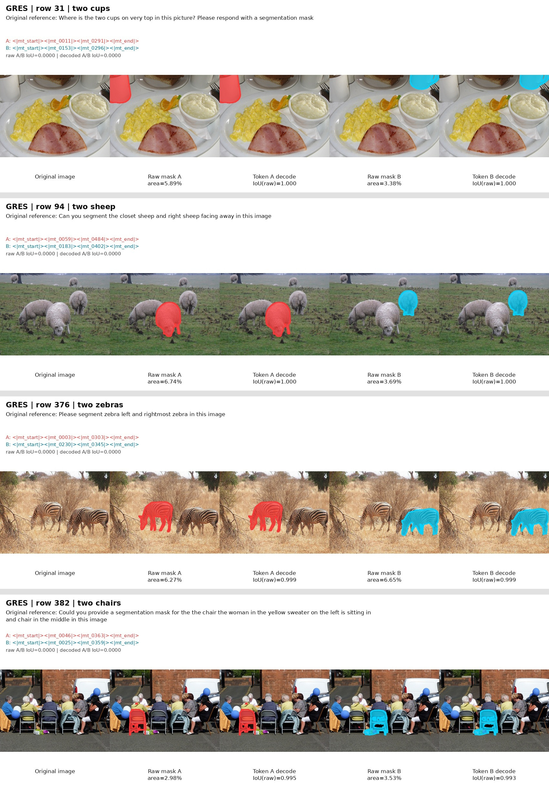
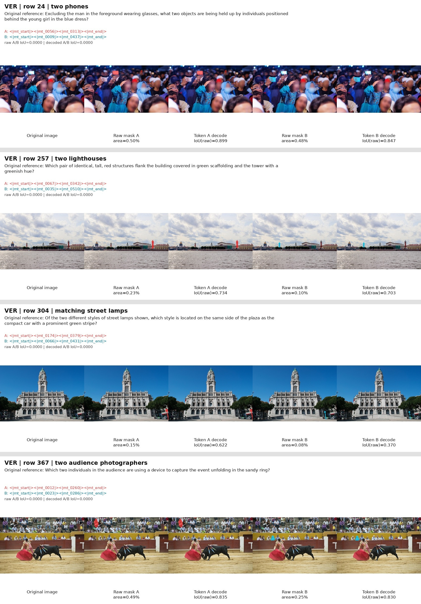

# SAMTok 派生 Edit 数据构造方案

## 1. 目标与当前状态

本文档定义如何从 SAMTok 训练数据中选取原图、自然语言指代、raw mask 和
canonical mask token，并将它们派生为 SAMTokEdit 可用的新图像编辑数据。当前首选两个
逻辑子集是 GRES-8k 和 VER-4k，两者都存储在同一个自包含 parquet 中。

这些数据已经提供了编辑数据的源侧：

- 真实原图；
- 自然语言指代或关系描述；
- COCO RLE raw mask；
- 与 raw mask 对应的 canonical SAMTok span。

但它们不包含编辑后的 target image，因此还不是可直接训练的 image-edit pair。
完整构造还需为所选 source/mask 生成或收集 `edit_image`，执行局部性和指令一致性质检，
最后转换成当前 `edit_mt` / `edit_umt` 规范。

## 2. 数据路径与物理文件

SAMTok 训练数据根目录：

```text
/mnt/bn/strategy-mllm-train/user/tanyue/datasets/SAMTok_Training_Data
```

本方案的 canonical 输入：

```text
/mnt/bn/strategy-mllm-train/user/tanyue/datasets/SAMTok_Training_Data/mix_gres8k_ver4k_train.parquet
```

与它相关的文件为：

| 文件 | 内容 | 是否建议作为本方案输入 |
|---|---|---|
| `mix_gres8k_ver4k_train.parquet` | 8,337 条 GRES + 4,000 条 VER；内嵌图片字节、RLE mask 和 mask token | 是 |
| `mix_gres8k_ver4k_with_thinking_train.parquet` | annotation 与上一文件相同，仅 `source` 改为 `thinking_gres/thinking_ver` | 否，不应重复采样 |
| `gres8k_train.parquet` | GRES-8k 标注，但图片字节为空，原始绝对路径在当前机器不可用 | 否，使用 mix 内的自包含副本 |
| `mask_generation_gres209k.json` | 209,344 条大规模 GRES token-mask 数据，无 raw RLE | 可作后续扩展，不是本轮首选 |

parquet 的核心字段为：

| 字段 | 含义 |
|---|---|
| `images` | 长度为 1 的图片列表；同时保存原路径和内嵌图片 bytes |
| `problem` | 指代分割问题或关系推理问题；GRES 原文件为 string，mix 中统一为单元素 list |
| `answer` | 自然语言回答及一个或多个 canonical SAMTok span |
| `masks` | 与 `answer` 中 span 顺序对应的 COCO compressed RLE mask 列表 |
| `source` | `gres` 或 `ver`，用于子集路由 |

构造时必须从 `images[0].bytes` 读取图片，不依赖 `images[0].path` 中已过期的绝对路径。

## 3. GRES-8k 概况

GRES 侧重 referring expression segmentation，包含大量 left/right/front/middle/second/closest
等实例区分信息。多 mask 样本常直接描述同类多实例，例如两个杯子、两只羊、
左右两只斑马或两把椅子，因此很适合构造只替换 mask span 的 A/B 反事实对。

| 统计项 | 数值 |
|---|---:|
| 总行数 | 8,337 |
| 含至少一个 mask 的正样本 | 3,671 |
| `No target` 负样本 | 4,666 |
| mask 总数 | 5,017 |
| 多 mask 行 | 1,301 |
| 唯一图片 | 7,639 |
| mask 面积中位数 | 8.35% |
| mask 面积 `<5%` | 1,134 / 5,017 |
| mask 面积 `<10%` | 2,925 / 5,017 |

需要注意：

- `No target` 不能转换成局部编辑对；
- 部分多 mask 问题同时指代不同类别，需要语义过滤；
- 一条 group expression 中的两个 mask 可以拆成 A/B region，但不应伪造数据中没有的单实例自然语言标签；
- GRES 和当前 SAMTok/gres-ft 以及 SAMTokEdit Stage 1 的 GRES 来源存在训练暴露，
  可用于新训练数据和机制分析，不应声称为严格 held-out 评测。

## 4. VER-4k 概况

VER 侧重关系性、推理性指代，例如“位于两个物体之间的车辆”、“三个穿橙色衣服的人中
离某人最近的一个”。它的目标显著小于 GRES，适合构造小物体、精确局部编辑与
codec 极限样本。

| 统计项 | 数值 |
|---|---:|
| 总行数 / 正样本 | 4,000 / 4,000 |
| mask 总数 | 5,616 |
| 多 mask 行 | 1,126 |
| 唯一图片 | 4,000 |
| mask 面积中位数 | 0.893% |
| mask 面积 `<1%` | 2,934 / 5,616（52.2%） |
| mask 面积 `<5%` | 4,346 / 5,616（77.4%） |
| mask 面积 `<10%` | 4,808 / 5,616（85.6%） |

需要注意：

- 多 mask 答案不一定是同类实例，也可能是功能相关的不同物体；
- 极小或细长区域对两 token codec 更困难，必须在入选前做 raw-to-decode IoU 门禁；
- VER 是 SAMTok 训练包中的数据，可作为派生训练源，不能直接当作 TE 的严格训练外测试。

## 5. 当前抽样与可视化审计

当前已从两个子集各选 4 个同图双 mask case，总计 8 个 case、16 个 raw mask。
对每个 mask 使用数据自带的 canonical span 走真实 gres-ft codec decode，没有使用
SAM2 重新生成或移动 mask。每行图从左到右为原图、raw A、decode A、raw B、decode B；
A 为红色，B 为青色。

抽样实验目录：

```text
/mnt/bn/strategy-mllm-train/user/tanyue/experiments/SAMTokEdit/crispedit_refined/interpretability/samtok_training_source_preview
```

### 5.1 GRES 抽样

| Parquet row | 对象 | raw area A/B | raw-to-decode IoU A/B |
|---:|---|---:|---:|
| 31 | two cups | 5.89% / 3.38% | 0.9998 / 0.9997 |
| 94 | two sheep | 6.74% / 3.69% | 0.9998 / 0.9996 |
| 376 | two zebras | 6.27% / 6.65% | 0.9993 / 0.9987 |
| 382 | two chairs | 2.98% / 3.53% | 0.9945 / 0.9929 |

8 个 mask 的平均 raw-to-decode IoU 为 `0.9980`，最小值为 `0.9929`；四组 raw A/B
与 decoded A/B 的 pair IoU 均为 `0`。这四个 case 都适合作为干净的实例级反事实候选。



### 5.2 VER 抽样

| Parquet row | 对象 | raw area A/B | raw-to-decode IoU A/B |
|---:|---|---:|---:|
| 24 | two phones | 0.50% / 0.48% | 0.8990 / 0.8474 |
| 257 | two lighthouses | 0.23% / 0.10% | 0.7337 / 0.7035 |
| 304 | matching street lamps | 0.15% / 0.08% | 0.6215 / 0.3700 |
| 367 | two audience photographers | 0.49% / 0.25% | 0.8348 / 0.8299 |

8 个 mask 的平均 raw-to-decode IoU 为 `0.7300`。手机和观众拍摄者适合作为干净候选；
灯塔可作为困难样例；路灯 B 的 IoU 仅 `0.3700`，只用于 codec 极限分析，
不进入干净主训练池。



完整的逐 case 二值 mask、预览图与字段级报告分别位于 `cases/`、`selection.jsonl`
和 `report.json`。

## 6. 候选筛选与分层门禁

所有门禁在生成 target image 之前执行。推荐将候选分为 clean 主池和 hard-small 分析池。

### 6.1 通用硬门禁

1. `source` 必须是 `gres` 或 `ver`，并保存 parquet row index 作为稳定 provenance。
2. 图片 bytes 必须可 decode 为 RGB；RLE size 必须与原图尺寸完全一致。
3. mask 必须非空、finite，连通域和边界框不能显著越界或破碎。
4. `answer` 中 canonical span 数量必须与 `masks` 数量一致，且 span 必须通过
   `valid_span_codes` 检查。
5. A/B span 必须不同；raw A/B IoU 建议 `<=0.05`，decoded A/B IoU 建议 `<=0.10`。
6. 人工或语义规则必须确认 A/B 是同类实例或者是明确需要的关系对，不能只因为
   同一行有两个 mask 就视为合格反事实。
7. 用于当前英文模型的 prompt 必须是 ASCII English，不引入中文或未经审核的自动翻译。

### 6.2 clean 主池

- 每个 mask 面积建议为原图的 `0.2%--15%`；
- raw-to-decode IoU `>=0.75`；
- 目标可在原图中清晰确认，且有足够非目标区域评估局部保持；
- 作为 A/B 机制对时，两次编辑的可读文本、操作、seed 和全部 diffusion 超参数相同，
  只允许 mask span 变化。

### 6.3 hard-small 分析池

- mask 面积可放宽到 `0.05%--0.2%`；
- raw-to-decode IoU 不低于 `0.50`；
- 必须标注为 hard-small，与 clean 主池分开汇报；
- raw-to-decode IoU `<0.50` 的样本只做 codec failure analysis，不进入编辑训练数据。

## 7. 派生编辑对的构造流程

### 7.1 固定源侧身份

对入选 row 保存以下不可变字段：

```text
dataset_file
source_subset                 # gres / ver
parquet_row_index
embedded_image_sha256
raw_rle
raw_mask_sha256
mask_span
reference_text
source_width / source_height
selection_tier                # clean / hard-small
```

样本身份建议由 `dataset_file + row_index + mask_index + image_sha256` 决定，避免因文本清洗或
输出文件改名导致训练/验证去重失效。

### 7.2 生成编辑任务

首轮只构造容易质检的局部任务：

- `remove`：删除指定实例并合理补全背景；
- `replace`：将指定实例替换为语义和几何尺度合理的物体；
- 暂不从现有 region mask 直接派生 `add`，因为 add 需要的是新物体放置区域，语义不同。

机制分析样本使用不含位置词的直接 mask-token prompt：

```text
Remove <|mt_start|><|mt_xxxx|><|mt_yyyy|><|mt_end|>.
Replace <|mt_start|><|mt_xxxx|><|mt_yyyy|><|mt_end|> with <replacement>.
```

GRES/VER 原始指代用于数据选择、人工质检和 provenance；若目标是单独检验 DiT 是否理解
mask token，不将 left/right/关系文字同时注入 DiT，避免定位泄漏。

### 7.3 生成并验收 target image

每个派生任务需要生成或人工获取编辑后图像，并通过：

1. 指令一致性：目标实例确实被删除或替换；
2. 局部性：非 mask 区域的主体、布局、色彩与几何不得大幅改写；
3. 实例专一性：同类的非目标实例必须保留；
4. 边界质量：不得出现 mask 轮廓泄漏、粘贴边缘、大块模糊或不合理纹理；
5. 图像完整性：尺寸、颜色模式、解码和 SHA256 全部可复现。

生成模型、seed、prompt、negative prompt、steps、CFG 和输入/输出 SHA256 都必须写入
provenance。质检失败的样本不得通过更改 raw mask 来迁就生成结果。

### 7.4 转换为 SAMTokEdit metadata

通过质检后，每个编辑对至少输出：

```json
{
  "image": "/absolute/path/to/edited_target.png",
  "edit_image": "/absolute/path/to/source.png",
  "prompt": "Replace <|mt_start|><|mt_xxxx|><|mt_yyyy|><|mt_end|> with a ... .",
  "sample_type": "edit_umt",
  "provenance": {
    "source_dataset": "samtok_ver",
    "parquet_row_index": 24,
    "mask_index": 0,
    "selection_tier": "clean"
  }
}
```

字段方向必须与当前 runner 一致：`image` 是作为 FM GT 的编辑后 target，
`edit_image` 是作为条件输入的 source。与之对应的 `edit_mt` 行使用可读英文
instruction 作为 `prompt`，并在 canonical `mt_cot` 中监督 GT mask span；`edit_umt`
行不含 `mt_cot`，但 `prompt` 必须包含恰好一个 canonical span。最终数据仍需通过
`validate_training_metadata.py`、路径/图片解码检查、codec decode 抽检以及
train/eval identity 和图像 SHA256 去重。

## 8. 数据划分与泄漏约束

1. 先按 source image SHA256 分组，再划分 train/validation/test，不能将同一原图的不同 mask
   分到不同 split。
2. 去重同时覆盖 embedded image SHA256、raw mask SHA256、mask span、parquet row index
   和最终 edit image SHA256。
3. GRES/VER 均属于 SAMTok 训练资源；GRES 还与当前 SAMTokEdit Stage 1 的 GRES
   数据有源重合。因此派生数据可用于继续训练、ablation 和机制分析，但不能作为
   “TE 从未见过”的严格泛化证据。
4. 若后续需要严格 held-out 评测，必须使用不属于 SAMTok 训练混合、也不属于
   SAMTokEdit 两阶段训练池的外部数据。

## 9. 后续实现顺序

1. 实现专用 parquet 候选构建器，只读取所需嵌套列，避免一次性加载全部 5 GB 图片字节。
2. 生成全量候选统计，将 clean/hard-small/reject 的原因写入 manifest。
3. 先用 32--64 个 clean case 小规模试产 target image，完成人工盲审与局部保持审计。
4. 通过后再扩展数量，并生成 `edit_mt` / `edit_umt` 成对 metadata。
5. 在任何训练前固定 split manifest、产物 SHA256、构建报告和完整可复现命令。
