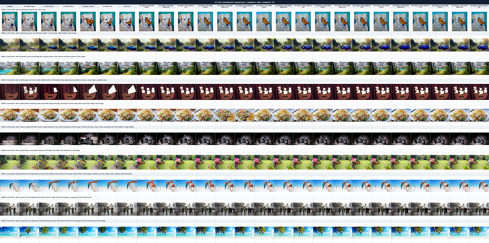
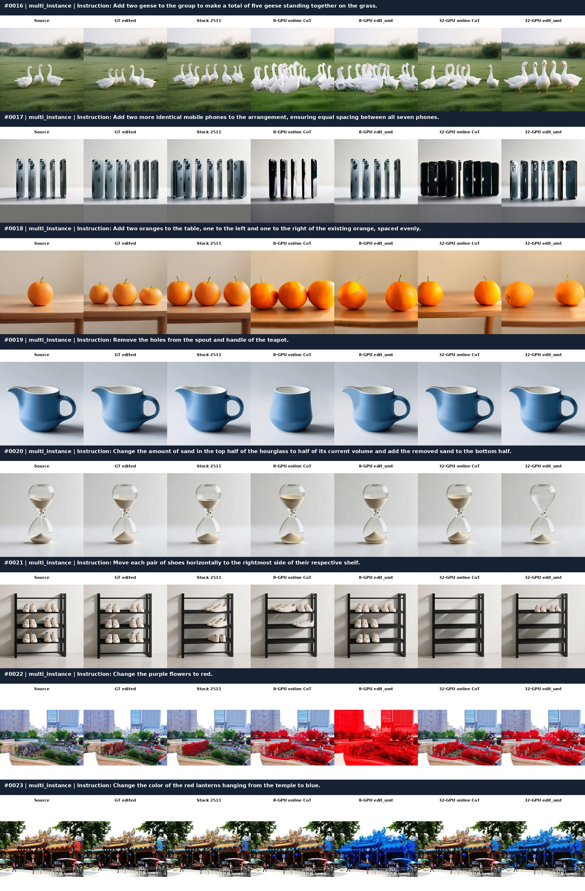
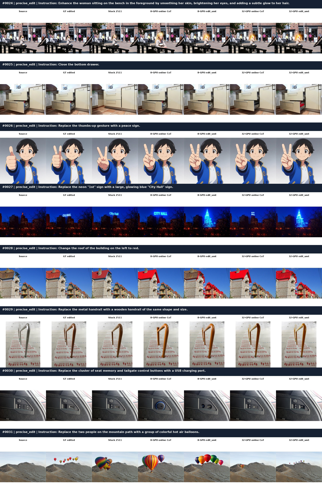
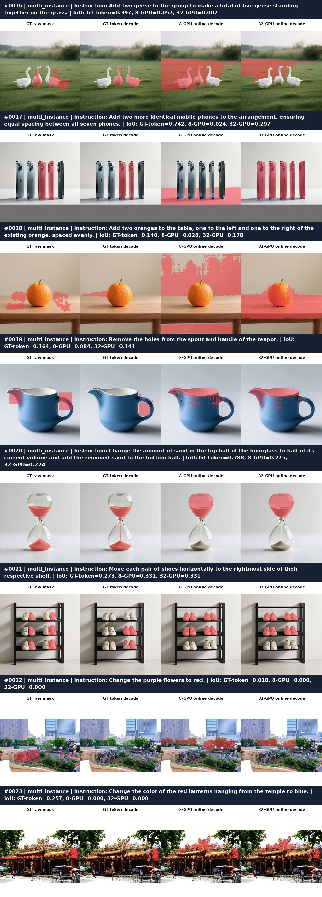
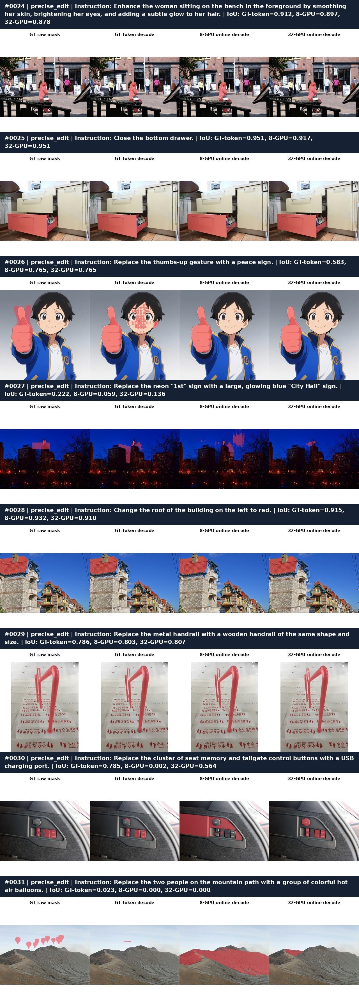
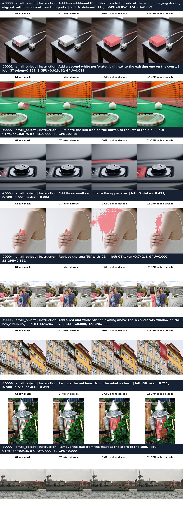

# SamtokEdit 实验记录

本文只记录已经实际运行的实验、数据构建验收和回归检查，不描述代码设计。代码实现、
数据 schema、训练入口和 CLI 参数见仓库内的
[`SamtokEdit_训练方案_当前实现.md`](SamtokEdit_训练方案_当前实现.md)。

所有实验产物统一放在：

```text
/mnt/bn/strategy-mllm-train/user/tanyue/experiments/SAMTokEdit/
```

截至本文记录，Stage 1 单卡/8 卡 smoke 训练已经跑通，Stage 1 放大规模数据已经构建并
验收，8 卡正式训练已经完整结束，64 条训练外 `edit_mt` 验证集已经构建；
Stage 1 五 setting 正式评测已于 2026-08-23 用 8 卡完整结束；Stage 2
8 卡 smoke metadata、Stage 2a 离线 cache 和 Stage 2b 30-step 训练均已完整结束并通过
强审计；Stage 2 DiT LoRA checkpoint、CSV 和 W&B 曲线均已保存；Stage 2 放大规模
训练数据已完成真实 codec 构建、内容净化与 8 卡分片验收。正式 Stage 2 训练已于
2026-08-26 12:36:35 UTC 在另一台共享机器上完成；本机已先后对 step-4,000、step-8,000、
step-16,000、step-24,000、step-32,000 和最终 step-41,490 checkpoint 完成同协议的
direct/online CoT/GT CoT 评测，并将已有 S1–S5 与六组 Stage 2 结果合并完成 S1–S23
分类审计和可视化。Refined Stage 1/2
全量数据的单机 8 卡与四机 32 卡单 epoch 训练均已正常结束；四机权重也已在同一组
ScaleEdit 32 条训练外验证集上完成 online CoT 和 `edit_umt` 评测，并与单机结果联合可视化。

## 实验索引

| 编号 | 实验 | 目的 | 状态 |
|---|---|---|---|
| E1 | Stage 1 smoke 数据构建 | 跑通真实 metadata、codec、canonical 和图片落盘链路 | 通过 |
| E2 | Stage 1 smoke 单卡训练 | 检查比例、双 loss、梯度回传和 checkpoint | 通过 |
| E3 | Stage 1 20k `edit_mt` 数据构建 | 准备 40k 行放大训练集并做完整规范验收 | 通过 |
| E4 | 代码回归测试 | 检查 canonical、schedule、codec、KV-cache 等实现 | 13/13 通过 |
| E5 | Stage 1 8 卡 smoke + λ 尺度对比 | 审计 DDP、双 loss、GT、梯度、精度和权重选择 | 通过 |
| E6 | Stage 1 20k `edit_mt` 8 卡正式训练 | 在 40k 数据上执行单 epoch Stage 1 训练 | 完成（未评测） |
| E7 | 64 条训练外 `edit_mt` 验证集构建 | 准备与 `edit_mt`/纯 `edit` 训练源严格互斥的验证数据 | 通过 |
| E8 | Stage 1 五 setting 8 卡正式评测 | 依次对比 stock/初始 TE/Stage 1 TE/online CoT/GT CoT | 完成（320/320） |
| E9 | Stage 2 8 卡 smoke 数据构建 | 准备每卡同比例的 `edit_mt + edit` 小规模 metadata | 通过 |
| E10 | Stage 2 8 卡 smoke 训练 | 验证 TE 融合/cache、纯 FM、DiT LoRA 梯度和 DDP 更新 | 通过（30/30 step） |
| E11 | Stage 2 放大规模数据构建 | 使用全部安全 `edit_mt`，按 2:1 配纯 edit 并做内容级验证隔离 | 通过 |
| E12 | Stage 2 正式 8 卡训练 | 融合 Stage 1 TE 并在 165,960 份 cache 上训练 DiT LoRA | 完成（41,490 步） |
| E13 | Stage 2 训练结果评测 | 在固定 64 张验证集上评测中间及最终 checkpoint 的 direct/online CoT/GT CoT | 完成（6 个 checkpoint，S1–S23 对比） |
| E14 | Refined Stage 1 四类数据与 8 卡 smoke | 验证新 mask/fact 数据、UMT、无空 CoT、4:2:1:1、loss/梯度/DDP | 通过 |
| E15 | Refined Stage 1 全量数据构建 | 最大类使用全部合格样本，完成 8 卡步对齐和完整回源审计 | 通过 |
| E16 | Refined Stage 1 全量 8 卡训练 | 在 84,672 行四类新数据上训练 1 epoch，并在线记录 W&B | 完成（训练审计通过，未评测） |
| E17 | Refined Stage 2 数据与 8 卡 smoke | 验证 2:1:1、cache、FM loss、DiT LoRA 和 DDP | 通过 |
| E18 | Refined Stage 2 全量数据构建 | 使用全部 edit_mt 构建 84,640 行 2:1:1 数据 | 通过 |
| E19 | Refined Stage 2 全量 8 卡训练 | 执行单 epoch DiT LoRA 训练并审计 | 完成（训练审计通过） |
| E20 | Refined Stage 2 ScaleEdit 评测 | 对比 stock、online CoT 和 edit_umt | 完成（96/96） |
| E21 | Refined 四机首次启动 | 验证裸 worker 环境、clone 和四机 pipeline 入口 | bootstrap 两次失败均已定位，后续已修复 |
| E22 | Refined 四机权重 ScaleEdit 对比评测 | 在同一验证集上对比单机/四机 online CoT 与 edit_umt | 完成（新增 64/64；联合审计通过） |

## E1：Stage 1 smoke 数据构建

### 实验目的

在极小数据量上验证真实的数据构建路径，而不是手写 JSONL：

- CrispEdit raw parquet 与 mask parquet 按文件名和 `row_idx` 正确 join；
- 真实 VQ-SAM2/SAMTok codec 编码 source image mask；
- canonical `mt_cot` 写入；
- source/target 图片实际落盘；
- 三类 metadata 能被 compose 脚本读取。

### 数据和运行

输入数据为：

```text
/mnt/bn/strategy-mllm-train/user/tanyue/datasets/CrispEdit-2M
/mnt/bn/strategy-mllm-train/user/tanyue/datasets/CrispEdit-2M-mask-parquet-101697
/mnt/bn/strategy-mllm-train/user/tanyue/datasets/SAMTok_Training_Data/mask_generation_gres209k.json
/mnt/bn/strategy-mllm-train/intern/common_datasets/Sa2VA-Training/osprey-724k
```

构建器使用了真实 codec checkpoint：

```text
/mnt/bn/strategy-mllm-train/user/tanyue/models/SAMTok/Qwen2.5-VL-7B-SAMTok-gres-ft/sam2.1_hiera_large.pt
/mnt/bn/strategy-mllm-train/user/tanyue/models/SAMTok/Qwen2.5-VL-7B-SAMTok-gres-ft/mask_tokenizer_256x2.pth
```

有效 smoke 配置为 `edit_mt=8`、`edit_ntp=4`、`edit=4`，CrispEdit 使用 `max_rows=8`，
GRES 使用 4 条源数据，最终由 `compose_training_metadata.py` 生成 16 行 Stage 1 metadata。

实际调用了 `build_edit_ntp_metadata.py --max_rows 4 --global_ratio 0.10 --seed 0 --check_images`、
`build_edit_mt_metadata.py --max_rows 8 --device cuda --dtype float32 --codec_batch_size 4`，
随后调用 `compose_training_metadata.py --max_edit_mt 8 --max_edit_ntp 4 --max_edit 4 --seed 0`。

训练前验收使用：

```bash
python scripts/data/validate_training_metadata.py \
  --metadata_jsonl /mnt/bn/strategy-mllm-train/user/tanyue/experiments/SAMTokEdit/stage1_single_gpu_smoke/data/crispedit_samtok/stage1.jsonl \
  --base_path /mnt/bn/strategy-mllm-train/user/tanyue/experiments/SAMTokEdit/stage1_single_gpu_smoke/data/crispedit_samtok \
  --expected_counts edit_mt:8,edit_ntp:4,edit:4 \
  --require_ascii --check_paths --decode_image_sample 8 --io_workers 16 --seed 0 \
  --report_json /mnt/bn/strategy-mllm-train/user/tanyue/experiments/SAMTokEdit/stage1_single_gpu_smoke/reports/data_validation.json
```

### 结果

- 16 行 metadata：`edit_mt=8`、`edit_ntp=4`、`edit=4`；
- canonical、ASCII prompt/CoT 检查通过；
- 17 个唯一图片引用全部存在；
- 随机解码 8 张图片全部成功；
- `edit_mt` 8 条全部来自 `add`，QC flag 为 `OK`；
- 空 CoT 1 条，使用 `to_cot([])` 产生的 canonical 空表，不是缺失字段；
- 结果符合预期，没有数据格式或图片落盘问题。

### 结果文件

- [stage1.jsonl](</mnt/bn/strategy-mllm-train/user/tanyue/experiments/SAMTokEdit/stage1_single_gpu_smoke/data/crispedit_samtok/stage1.jsonl>)
- [data_validation.json](</mnt/bn/strategy-mllm-train/user/tanyue/experiments/SAMTokEdit/stage1_single_gpu_smoke/reports/data_validation.json>)
- [edit_mt.jsonl](</mnt/bn/strategy-mllm-train/user/tanyue/experiments/SAMTokEdit/stage1_single_gpu_smoke/data/crispedit_samtok/edit_mt.jsonl>)
- [edit_ntp_gres.jsonl](</mnt/bn/strategy-mllm-train/user/tanyue/experiments/SAMTokEdit/stage1_single_gpu_smoke/data/crispedit_samtok/edit_ntp_gres.jsonl>)

## E2：Stage 1 smoke 单卡训练

### 实验目的

验证 Stage 1 训练入口在单卡上是否按照预期执行：

- 每个累积窗口按 `edit_mt:2, edit_ntp:1, edit:1` 取样；
- 三类数据的 loss 分派正确；
- `edit_mt` 同时计算 NTP 和 FM；
- 只有 text encoder LoRA 解冻并获得梯度；
- 梯度 finite、optimizer step 和 checkpoint 正常。

### 运行配置

使用 [stage1_te_lora.sh](</opt/tiger/tanyue/samtok_edit/scripts/train/stage1_te_lora.sh>)，
关键配置为：

```text
CUDA_VISIBLE_DEVICES=0
NUM_PROCESSES=1
DATASET_WORKERS=0
MAX_PIXELS=262144
GRADIENT_ACCUMULATION_STEPS=4
NUM_EPOCHS=1
DEBUG_TRAIN_METRICS=1
DEBUG_LOG_STEPS=1
sample_type_ratio=edit_mt:2,edit_ntp:1,edit:1
ntp_loss_weight=1.0
fm_loss_weight=1.0
zero_cond_t=True
```

实际启动命令为：

```bash
CUDA_VISIBLE_DEVICES=0 NUM_PROCESSES=1 DATASET_WORKERS=0 \
DATASET_BASE=/mnt/bn/strategy-mllm-train/user/tanyue/experiments/SAMTokEdit/stage1_single_gpu_smoke/data/crispedit_samtok \
STAGE1_METADATA=/mnt/bn/strategy-mllm-train/user/tanyue/experiments/SAMTokEdit/stage1_single_gpu_smoke/data/crispedit_samtok/stage1.jsonl \
MERGED_TE_DIR=/mnt/bn/strategy-mllm-train/user/tanyue/experiments/SAMTokEdit/artifacts/merged_samtok_te \
OUTPUT_PATH=/mnt/bn/strategy-mllm-train/user/tanyue/experiments/SAMTokEdit/stage1_single_gpu_smoke/train_success \
MAX_PIXELS=262144 GRADIENT_ACCUMULATION_STEPS=4 NUM_EPOCHS=1 \
SAVE_STEPS=2000 DEBUG_TRAIN_METRICS=1 DEBUG_LOG_STEPS=1 \
bash scripts/train/stage1_te_lora.sh
```

使用的模型/processor 路径为：

```text
Qwen-Image-Edit-2511
/mnt/bn/strategy-mllm-train/user/tanyue/models/pretrained_models/Qwen-Image-Edit-2511

SAMTok gres-ft
/mnt/bn/strategy-mllm-train/user/tanyue/models/SAMTok/Qwen2.5-VL-7B-SAMTok-gres-ft

merged processor
/mnt/bn/strategy-mllm-train/user/tanyue/experiments/SAMTokEdit/artifacts/merged_samtok_te
```

### 结果

以 `train_success` 作为成功运行结果：

- 16/16 micro-step 完成；
- 4/4 optimizer step 完成；
- 每个累积窗口严格为 `edit_mt ×2 + edit_ntp ×1 + edit ×1`；
- `edit_ntp` 只产生 `loss_ntp`，`edit` 只产生 `loss_fm`，`edit_mt` 同时产生两者；
- `edit_mt` 满足 `loss_total = loss_ntp + loss_fm`；
- 392 个 text-encoder LoRA tensor、共 161,480,704 个可训练参数；
- DiT/VAE 可训练参数为 0，冻结参数梯度为 0；
- 所有梯度 finite，4 个同步步的 LoRA probe update 均非零；
- 最后一个同步步：`loss=0.7283892035`、`loss_ntp=0.6897995472`、`loss_fm=0.0385896638`；
- 最终 `probe_update_l2_norm=0.0015350154`；
- checkpoint 正常写出；
- 没有运行评测。

另外保留了一次同配置的 `train_latest_diffsynth` 调试运行，亦完成 16 micro-step/4 optimizer
step；其最后一步为 `loss=0.7916867733`、`loss_ntp=0.6915322542`、`loss_fm=0.1001545414`。
两次 loss 数值不同属于小规模随机训练的正常差异，结构性检查均符合预期。

### 结果文件

- [train_success/loss.csv](</mnt/bn/strategy-mllm-train/user/tanyue/experiments/SAMTokEdit/stage1_single_gpu_smoke/train_success/loss.csv>)
- [train_success/step-16.safetensors](</mnt/bn/strategy-mllm-train/user/tanyue/experiments/SAMTokEdit/stage1_single_gpu_smoke/train_success/step-16.safetensors>)
- [train_success/training_args.json](</mnt/bn/strategy-mllm-train/user/tanyue/experiments/SAMTokEdit/stage1_single_gpu_smoke/train_success/training_args.json>)
- [train_latest_diffsynth/loss.csv](</mnt/bn/strategy-mllm-train/user/tanyue/experiments/SAMTokEdit/stage1_single_gpu_smoke/train_latest_diffsynth/loss.csv>)
- [train_latest_diffsynth/step-16.safetensors](</mnt/bn/strategy-mllm-train/user/tanyue/experiments/SAMTokEdit/stage1_single_gpu_smoke/train_latest_diffsynth/step-16.safetensors>)

## E3：Stage 1 20k `edit_mt` 放大数据构建

### 实验目的

准备正式 Stage 1 训练使用的 40k 行数据，不启动训练和评测。重点检查全局无偏抽样、英文
约束、真实 codec 编码、图片落盘、canonical CoT 和训练 schedule。

### 数据配比和运行方式

最终数据为：

```text
edit_mt  20,000
edit_ntp 10,000
edit      10,000
total     40,000
```

`edit_mt` 在全部 `filter_decision=keep` 且通过 ASCII 约束的候选中，以 `seed=0` 全局随机
抽样；没有按排序后的 parquet 前缀截断。`edit_ntp` 随机抽 9,000 条 GRES 局部行，并按
`global_ratio=0.10` 增加 1,000 条 global 空 CoT。`edit` 从同一批 20k CrispEdit 对中抽 10k。

codec 构建使用 8 个 H100 worker，worker 共享同一随机抽样集合，按 parquet 分片分工；全部
shard 完成后用 `build_edit_mt_metadata.py --combine_only` 合并。随后运行
`compose_training_metadata.py`，再运行 `validate_training_metadata.py`。

每个 worker 的实际构建参数为：

```text
--sample_rows 20000 --seed 0 --ascii_only --resume
--codec_batch_size 64 --num_workers 8 --worker_index 0..7 --skip_combine
```

GRES 分支使用：

```text
--sample_rows 9000 --global_ratio 0.10 --seed 0 --check_images --ascii_only
```

8 个 worker 完成后执行 `build_edit_mt_metadata.py --combine_only`，再以
`--max_edit_mt 20000 --max_edit_ntp 10000 --max_edit 10000 --seed 0` 调用
`compose_training_metadata.py`。

### 结果

- `edit_mt.jsonl`：20,000 行；其中 12,902 条为真实非空 SAMTok codec CoT，7,098 条为合法空 CoT；
- `edit_ntp_gres.jsonl`：10,000 行，其中 8,190 条非空 CoT、1,810 条空 CoT；
- `stage1.jsonl`：40,000 行，精确 20k/10k/10k；
- 591 个 `edit_mt` shard 和 591 个 `edit` shard 全部存在；
- 40,000 张 CrispEdit source/target 图片已落盘；
- 46,931 个唯一图片引用全部存在；
- 随机抽取 1,024 张图片全部成功解码；
- prompt 和 CoT 全部通过 ASCII 检查；
- 所有带 CoT 行通过 canonical round-trip；
- 7 类 CrispEdit edit type 均有覆盖：background 3,559、style 3,367、color 3,086、
  motion 2,870、replace 2,841、add 2,301、remove 1,976；
- 输出目录约 58 GB，临时文件数为 0；
- 单卡 `P=1,A=4` 和 8 卡 `P=8,A=4` 的 schedule 均逐窗口满足 2:1:1；
- 结果符合预期，没有发现缺图、坏图、非 canonical CoT、非英文文本或比例错误。

### 结果文件

- [stage1.jsonl](</mnt/bn/strategy-mllm-train/user/tanyue/experiments/SAMTokEdit/stage1_20k_mt/data/crispedit_samtok/stage1.jsonl>)
- [edit_mt.jsonl](</mnt/bn/strategy-mllm-train/user/tanyue/experiments/SAMTokEdit/stage1_20k_mt/data/crispedit_samtok/edit_mt.jsonl>)
- [edit_ntp_gres.jsonl](</mnt/bn/strategy-mllm-train/user/tanyue/experiments/SAMTokEdit/stage1_20k_mt/data/crispedit_samtok/edit_ntp_gres.jsonl>)
- [edit.jsonl](</mnt/bn/strategy-mllm-train/user/tanyue/experiments/SAMTokEdit/stage1_20k_mt/data/crispedit_samtok/edit.jsonl>)
- [stage1_data_validation.json](</mnt/bn/strategy-mllm-train/user/tanyue/experiments/SAMTokEdit/stage1_20k_mt/reports/stage1_data_validation.json>)

Stage 1 metadata SHA256：

```text
2a3e491b5ad239ba1134976d4ae32aaf1e608f88a2acf0bc5dc33615db78f2a5
```

本实验只完成数据构建与验收，没有加载 Qwen-Image-Edit-2511 训练模型，没有启动正式规模
训练，也没有准备评测数据。

## E4：代码回归测试

### 目的和运行

检查代码改动没有破坏 canonical CoT、分层 parser、单/8-rank DDP schedule、NTP shift 监督、
加权 loss 分派、非 canonical 拒绝、codec 空 mask 拒绝、英文模板、全局抽样/worker 分区、
state-dict converter、KV-cache 转发和新版 DiffSynth 分片路径兼容：

```bash
cd /opt/tiger/tanyue/samtok_edit
python -m unittest tests/test_samtok_edit.py
```

### 结果

13/13 tests passed。

## E5：Stage 1 8 卡 smoke 与 λ 尺度对比

### 实验目的

在 8 张 H100 80GB 上实际跑通 Stage 1，不运行评测，重点检查：

- `edit_mt:edit_ntp:edit=2:1:1` 是否在每个全局 optimizer window 精确落实；
- Accelerate 分片后同一 micro-step 的 8 个 rank 是否同型且获得不同样本；
- 三类样本的 NTP/FM 分派和加权恒等式是否正确；
- NTP hidden 是否从 `L_T-1` 开始对齐全部 CoT label，且最后监督
  `<|im_end|>`；
- FM 的 GT 是否来自 metadata `image` 目标图，条件 latent 是否来自
  `edit_image` 源图；
- 只有 TE LoRA 可训练，梯度是否 finite/非零，冻结参数是否无梯度；
- 同步步梯度和更新后的 LoRA 参数是否在 8 卡上一致；
- bf16/fp32 精度和 LR/warmup/cosine/clip 等超参是否实际生效；
- 用纯 NTP/纯 FM 的首累积槽梯度尺度为 λ 选择提供依据。

### smoke 数据准备

从 E3 已通过验收的 40k metadata 用真实 compose 脚本再抽样，没有手写 JSONL：

```bash
python scripts/data/compose_training_metadata.py \
  --edit_mt_jsonl /mnt/bn/strategy-mllm-train/user/tanyue/experiments/SAMTokEdit/stage1_20k_mt/data/crispedit_samtok/edit_mt.jsonl \
  --edit_ntp_jsonl /mnt/bn/strategy-mllm-train/user/tanyue/experiments/SAMTokEdit/stage1_20k_mt/data/crispedit_samtok/edit_ntp_gres.jsonl \
  --edit_jsonl /mnt/bn/strategy-mllm-train/user/tanyue/experiments/SAMTokEdit/stage1_20k_mt/data/crispedit_samtok/edit.jsonl \
  --stage1_output /mnt/bn/strategy-mllm-train/user/tanyue/experiments/SAMTokEdit/stage1_8gpu_smoke/data/stage1.jsonl \
  --stage2_output /mnt/bn/strategy-mllm-train/user/tanyue/experiments/SAMTokEdit/stage1_8gpu_smoke/data/stage2.jsonl \
  --max_edit_mt 128 --max_edit_ntp 64 --max_edit 64 --seed 8
```

验收命令：

```bash
python scripts/data/validate_training_metadata.py \
  --metadata_jsonl /mnt/bn/strategy-mllm-train/user/tanyue/experiments/SAMTokEdit/stage1_8gpu_smoke/data/stage1.jsonl \
  --base_path /mnt/bn/strategy-mllm-train/user/tanyue/experiments/SAMTokEdit/stage1_20k_mt/data/crispedit_samtok \
  --expected_counts edit_mt:128,edit_ntp:64,edit:64 \
  --require_ascii --check_paths --decode_image_sample 64 --io_workers 16 --seed 8 \
  --report_json /mnt/bn/strategy-mllm-train/user/tanyue/experiments/SAMTokEdit/stage1_8gpu_smoke/reports/data_validation.json
```

结果是 256 行精确 128/64/64，448 个唯一图片引用全部存在，64 张抽样解码全部
通过，canonical 和 ASCII 检查通过。SHA256 为
`be2ee07e90377f806ff6385b9217054fd01a94b4bea897aa78f1502bc4b47be1`。

8 卡、梯度累积 4 时，每个 optimizer step 全局消费 32 条：
`edit_mt=16, edit_ntp=8, edit=8`。因此该 smoke 每卡 32 个 micro-step，共 8 个 optimizer
step。训练 `seed=2` 时首累积槽覆盖 3 次 `edit_mt`、2 次纯 `edit_ntp`和 3 次纯
`edit`。

### 运行配置和命令

两次成功运行的共同配置：

```text
8 x H100 80GB
Qwen-Image-Edit-2511 + SAMTok gres-ft
world_size=8, gradient_accumulation_steps=4
global effective batch=32, optimizer_steps=8
max_pixels=262144, dataset_workers=0
LoRA rank=64, dropout=0.05, fp32
frozen base/activation=bf16, loss=fp32
AdamW lr=4e-5, weight_decay=0.05, max_grad_norm=1.0
warmup_ratio=0.05, smoke warmup_steps=0, cosine decay to 0
zero_cond_t=True, seed=2
```

基线命令（λ=1:1）：

```bash
CUDA_VISIBLE_DEVICES=0,1,2,3,4,5,6,7 \
NUM_PROCESSES=8 MAIN_PROCESS_PORT=50673 DATASET_WORKERS=0 \
DATASET_BASE=/mnt/bn/strategy-mllm-train/user/tanyue/experiments/SAMTokEdit/stage1_20k_mt/data/crispedit_samtok \
STAGE1_METADATA=/mnt/bn/strategy-mllm-train/user/tanyue/experiments/SAMTokEdit/stage1_8gpu_smoke/data/stage1.jsonl \
MERGED_TE_DIR=/mnt/bn/strategy-mllm-train/user/tanyue/experiments/SAMTokEdit/artifacts/merged_samtok_te \
OUTPUT_PATH=/mnt/bn/strategy-mllm-train/user/tanyue/experiments/SAMTokEdit/stage1_8gpu_smoke/train_lambda_1_1 \
MAX_PIXELS=262144 GRADIENT_ACCUMULATION_STEPS=4 NUM_EPOCHS=1 SAVE_STEPS=2000 \
DEBUG_TRAIN_METRICS=1 DEBUG_LOG_STEPS=1 SEED=2 \
NTP_LOSS_WEIGHT=1.0 FM_LOSS_WEIGHT=1.0 \
bash scripts/train/stage1_te_lora.sh
```

候选命令与上面相同，仅替换：

```text
MAIN_PROCESS_PORT=50679
OUTPUT_PATH=.../train_lambda_0.05_1
NTP_LOSS_WEIGHT=0.05
FM_LOSS_WEIGHT=1.0
```

### 8 卡正确性结果

两次运行均 32/32 micro-step、8/8 optimizer step 完成，退出码 0；没有 OOM、NaN/Inf、
NCCL 通信错误、loss 分派错误或 rank 参数分叉。

- 32 个 micro-step 中，每次 8 个 `rank_sample_type_ids` 都一致；
- rank schedule position 严格为 `[0..7]`、`[8..15]` 一直到 `[248..255]`，每次的 source
  row id 不同；
- 全局实际消费 `edit_mt=128, edit_ntp=64, edit=64`，每个累积窗口都是 2:1:1；
- `edit_ntp` 只有 NTP，`edit` 只有 FM，`edit_mt` 同时有两者；最大加权 loss
  恒等式误差为 `2.24e-7`（λ=1）和 `3.10e-8`（λ=0.05）；
- 所有 NTP 样本满足 `cot_hidden_start=template_tokens-1`、hidden/label 数量相同，最后 label
  id 等于 `<|im_end|>` id `151645`；
- 带 FM 的样本都有 `input_latents` 目标，`edit_ntp` 都没有；所有样本都有
  `edit_latents` 条件；
- 28,850,284,595 个冻结参数为 bf16；392 个 TE LoRA tensor、共 161,480,704
  参数为 fp32；DiT/VAE 可训练参数为 0；
- 首个 micro-step 因 LoRA-B 零初始化，196 个 B tensor 先有非零梯度；第一次更新后
  A/B 共 392 个 tensor 都有非零梯度，符合 LoRA 预期；
- 冻结参数 `.grad` 始终为 0，所有梯度/loss finite；
- 8 个同步步的梯度范数在 8 个 rank 完全相同，每次 optimizer step 后 probe 参数
  范数也完全相同，8 次 probe update 均非零；
- prompt embedding/latent 为 bf16，NTP/FM/total loss 为 fp32，LoRA 参数和 checkpoint 为
  fp32；
- 实际 LR 在 8 个同步步按 cosine 为 `3.8478e-5, 3.4142e-5, 2.7654e-5, 2e-5,
  1.2346e-5, 5.8579e-6, 1.5224e-6, 0`；smoke 只有 8 步，`int(0.05*8)=0` 因而无 warmup，
  40k 正式数据单 epoch 将是 1,250 步、62 个 warmup step。

checkpoint 检查：两个 checkpoint 均恰好 392 个 LoRA A/B key、161,480,704 个 fp32 参数，
0 个非 finite tensor、0 个全零 tensor、0 个非 LoRA key。

### λ 对比与结论

λ=1:1 下，两分量在全部激活样本上的未加权分布为：

| 分量 | 样本数 | mean | median |
|---|---:|---:|---:|
| NTP | 192 | 1.0383 | 0.7725 |
| FM | 192 | 0.06286 | 0.05128 |

两者激活次数同为 192，但 NTP loss mean 约是 FM 的 16.5 倍。更直接的纯 loss 首槽
梯度为：

| λ | 纯 NTP 梯度 mean / median | 纯 FM 梯度 mean / median | 同步范数 mean / max | 裁剪步数 |
|---|---:|---:|---:|---:|
| 1:1 | 2.2166 / 1.7317 | 0.1129 / 0.08088 | 2.9475 / 7.4450 | 6/8 |
| 0.05:1 | 0.1127 / 0.08256 | 0.1784 / 0.14363 | 0.2472 / 0.4415 | 0/8 |

λ=1:1 的纯 NTP 梯度约为纯 FM 的 20 倍，且 8 个 optimizer step 有 6 个被 `max_grad_norm=1`
裁剪；这会让 Stage 1 主要受 NTP 驱动。将 `lambda_ntp` 降到 0.05 后，纯 NTP 和纯 FM 梯度
落在同一数量级，且无同步步触发裁剪；两条 loss 路径均保持 finite/非零，8 次
LoRA update 也均非零。

因此当前 Stage 1 的起始值改为：

```text
lambda_ntp = 0.05
lambda_fm  = 1.0
```

这是梯度尺度意义上的选择，还不是最终任务质量最优的证明。后续仍应对 0.05/0.1（必要时
0.2）使用 NTP token accuracy/解析成功率/mask 指标和编辑质量做正式评测。本实验没有运行评测。

### 问题与修正

- 前两次 launcher 尝试在模型加载前因 TCP rendezvous 端口 `29500`/`29617` 被占用而
  退出；不是模型、数据、NCCL 或显存问题。launcher 已增加 `MAIN_PROCESS_PORT`。
- λ=1 baseline 开启 `find_unused_parameters=True` 时，DDP 提示当前计算图没有 unused
  parameter。NTP 和 FM 都经过所有 28 层 TE LoRA，所以默认已改为 false；λ=0.05
  8 卡完整运行验证无 hang。
- 两次成功运行退出时均有 PyTorch 提示未显式 destroy process group，不影响该次结果；
  runner 已在保存完 checkpoint 后调用 `accelerator.end_training()`。

### 结果文件

- [stage1.jsonl](</mnt/bn/strategy-mllm-train/user/tanyue/experiments/SAMTokEdit/stage1_8gpu_smoke/data/stage1.jsonl>)
- [data_validation.json](</mnt/bn/strategy-mllm-train/user/tanyue/experiments/SAMTokEdit/stage1_8gpu_smoke/reports/data_validation.json>)
- [train_audit_summary.json](</mnt/bn/strategy-mllm-train/user/tanyue/experiments/SAMTokEdit/stage1_8gpu_smoke/reports/train_audit_summary.json>)
- [λ=1 train.log](</mnt/bn/strategy-mllm-train/user/tanyue/experiments/SAMTokEdit/stage1_8gpu_smoke/train_lambda_1_1/train.log>)
- [λ=1 loss.csv](</mnt/bn/strategy-mllm-train/user/tanyue/experiments/SAMTokEdit/stage1_8gpu_smoke/train_lambda_1_1/loss.csv>)
- [λ=1 checkpoint](</mnt/bn/strategy-mllm-train/user/tanyue/experiments/SAMTokEdit/stage1_8gpu_smoke/train_lambda_1_1/step-32.safetensors>)，SHA256
  `eda74c25900b05d168b9fff516ae8172deef52e2d0d4cf7e4570df7032ffdf13`
- [λ=0.05 train.log](</mnt/bn/strategy-mllm-train/user/tanyue/experiments/SAMTokEdit/stage1_8gpu_smoke/train_lambda_0.05_1/train.log>)
- [λ=0.05 loss.csv](</mnt/bn/strategy-mllm-train/user/tanyue/experiments/SAMTokEdit/stage1_8gpu_smoke/train_lambda_0.05_1/loss.csv>)
- [λ=0.05 checkpoint](</mnt/bn/strategy-mllm-train/user/tanyue/experiments/SAMTokEdit/stage1_8gpu_smoke/train_lambda_0.05_1/step-32.safetensors>)，SHA256
  `168474b25e1796c37bd66807efe8bf4d6d6108ab3fdcaca1b7bee7a145cade59`
- [training_args.json](</mnt/bn/strategy-mllm-train/user/tanyue/experiments/SAMTokEdit/stage1_8gpu_smoke/train_lambda_0.05_1/training_args.json>)
- 端口冲突日志：[29500](</mnt/bn/strategy-mllm-train/user/tanyue/experiments/SAMTokEdit/stage1_8gpu_smoke/train_lambda_1_1/launch_failed_port29500.log>)、
  [29617](</mnt/bn/strategy-mllm-train/user/tanyue/experiments/SAMTokEdit/stage1_8gpu_smoke/train_lambda_1_1/launch_failed_port29617.log>)

## E6：Stage 1 20k `edit_mt` 8 卡正式训练

### 实验目的

使用 E3 已通过验收的 40k Stage 1 数据和 E5 选定的 loss 权重，在 8 张 H100 80GB 上执行
单 epoch 正式训练，不进行评测。训练数据精确为 `edit_mt=20,000`、`edit_ntp=10,000`、
`edit=10,000`，每个全局 optimizer window 消费 32 条，保持 `16:8:8`。

### 启动前检查

2026-08-22 启动前重新检查了完整 metadata：

- SHA256 为 `2a3e491b5ad239ba1134976d4ae32aaf1e608f88a2acf0bc5dc33615db78f2a5`；
- 40,000 行的类型计数精确为 20k/10k/10k，46,931 个唯一图片引用全部存在；
- ASCII、canonical 和 1,024 张抽样图片解码检查均通过；
- 以 `world_size=8, gradient_accumulation_steps=4, seed=0` 实例化真实 schedule，全部
  1,250 个 optimizer window 均精确为 `edit_mt=16, edit_ntp=8, edit=8`。

### 运行配置

```text
8 x H100 80GB
Qwen-Image-Edit-2511 + SAMTok gres-ft
world_size=8, gradient_accumulation_steps=4
local microsteps=5,000, global effective batch=32, optimizer_steps=1,250
max_pixels=1,048,576, dataset_workers=8/rank
LoRA rank=64, dropout=0.05, fp32
frozen base/activation=bf16, loss=fp32
AdamW lr=4e-5, weight_decay=0.05, max_grad_norm=1.0
warmup_ratio=0.05 (62 optimizer steps), cosine decay to 0
lambda_ntp=0.05, lambda_fm=1.0
zero_cond_t=True, gradient_checkpointing=True
find_unused_parameters=False, seed=0
save_steps=2,000 local microsteps
```

训练于 2026-08-22 17:27:30 UTC 使用 `nohup + setsid` 启动，stdin 重定向到
`/dev/null`，stdout/stderr 写入 `train.log`。独立 session/进程组 ID 为 `2028446`，其 PPID
已变为 1，因此退出启动它的终端或 tmux 不会向训练进程传递挂断信号。启动参数等价于：

```bash
CUDA_VISIBLE_DEVICES=0,1,2,3,4,5,6,7 \
NUM_PROCESSES=8 MAIN_PROCESS_PORT=60000 DATASET_WORKERS=8 \
DATASET_BASE=/mnt/bn/strategy-mllm-train/user/tanyue/experiments/SAMTokEdit/stage1_20k_mt/data/crispedit_samtok \
STAGE1_METADATA=/mnt/bn/strategy-mllm-train/user/tanyue/experiments/SAMTokEdit/stage1_20k_mt/data/crispedit_samtok/stage1.jsonl \
MERGED_TE_DIR=/mnt/bn/strategy-mllm-train/user/tanyue/experiments/SAMTokEdit/artifacts/merged_samtok_te \
OUTPUT_PATH=/mnt/bn/strategy-mllm-train/user/tanyue/experiments/SAMTokEdit/stage1_20k_mt/train_8gpu_lambda_0.05_1 \
MAX_PIXELS=1048576 GRADIENT_ACCUMULATION_STEPS=4 NUM_EPOCHS=1 SAVE_STEPS=2000 \
NTP_LOSS_WEIGHT=0.05 FM_LOSS_WEIGHT=1.0 SEED=0 \
bash scripts/train/stage1_te_lora.sh
```

### 结果

训练于 2026-08-22 22:39:16 UTC 正常退出，wrapper `exit_code=0`。5,000/5,000 local
microstep 和 1,250/1,250 optimizer step 全部完成；进度条内训练耗时 5:10:42，包含启动和
最终保存的总墙钟时间约 5:11:46，平均约 3.73 秒/local microstep，即全局约 2.15
sample/s。日志中没有 OOM、Traceback、NaN/Inf、NCCL/数据读取错误或未销毁 process group
警告。

`loss.csv` 的 5,000 个 rank-0 local step 中精确为 `edit_mt=2,500`、`edit_ntp=1,250`、
`edit=1,250`；1,250 个连续四步窗口全部为 2:1:1。结合启动前已逐窗口验证的 8-rank
schedule 和完整 5,000 步运行，40k 数据按 20k/10k/10k 完整消费。所有已记录 loss 均为
finite，加权恒等式 `loss = 0.05 * loss_ntp + loss_fm` 的最大误差为 `2.38e-8`。

需要注意，正式运行关闭了 smoke 专用的逐-rank debug collective，因此 `loss.csv` 只记录
rank 0 的本地样本，并不是 8 卡 loss 的全局均值。下列趋势可用于判断稳定性和大致学习
方向，但不能替代全量训练集统计或评测：

| rank-0 指标 | 全程 mean | 全程 median | 首 500 mean | 末 500 mean | 变化 |
|---|---:|---:|---:|---:|---:|
| total loss | 0.04713 | 0.03304 | 0.05957 | 0.04134 | -30.6% |
| NTP loss | 0.21344 | 0.16585 | 0.53560 | 0.16568 | -69.1% |
| FM loss | 0.05216 | 0.03846 | 0.05265 | 0.04684 | -11.0% |
| `edit_mt` NTP | 0.24827 | 0.21697 | 0.61620 | 0.19733 | -68.0% |
| `edit_ntp` NTP | 0.14379 | 0.11649 | 0.37439 | 0.10237 | -72.7% |
| `edit_mt` FM | 0.05094 | 0.03752 | 0.05268 | 0.04461 | -15.3% |
| `edit` FM | 0.05461 | 0.04152 | 0.05260 | 0.05128 | -2.5% |

NTP 的下降清晰；FM 总体和带 mask-token 条件的 `edit_mt` 分支也下降，但纯 `edit` FM
基本持平。FM 每步使用随机 timestep/noise，且单 epoch 中每个样本只见一次，因此不同区间
并不是同一批样本的可比复测，纯 `edit` 的平坦曲线不能单独证明没有学习，也不能证明编辑
质量提升。全程 total loss 最大值为 0.4289，FM 最大值为 0.2691；3 个 NTP 大于 5 的点
全部出现在前 30 步，之后未见发散迹象。

checkpoint 按预期写于 local microstep 2,000、4,000、5,000。三个 checkpoint 均为：

- 392 个 TE LoRA A/B key，0 个非 LoRA key；
- 161,480,704 个 fp32 参数；
- 0 个非 finite 参数，0 个全零 tensor；
- 文件大小均为 645,978,056 bytes。

从 step 2,000 到 4,000、以及 4,000 到 5,000，392/392 个 tensor 都有变化，global delta
L2 分别为 3.2656 和 0.2348。末段更新较小符合 cosine LR 接近 0，说明参数持续训练到结尾，
没有提前冻结或静默停止。

因此，本实验在“训练执行正确性和数值稳定性”上通过；NTP loss 显示出明确学习信号，FM
没有异常发散并有有限下降。但当前仍没有证据判断生成编辑质量、mask 定位质量或最终任务
指标，也不能仅凭训练 loss 决定 step-4,000 与 step-5,000 哪个泛化更好。

### 结果文件

- [train.log](</mnt/bn/strategy-mllm-train/user/tanyue/experiments/SAMTokEdit/stage1_20k_mt/train_8gpu_lambda_0.05_1/train.log>)
- [loss.csv](</mnt/bn/strategy-mllm-train/user/tanyue/experiments/SAMTokEdit/stage1_20k_mt/train_8gpu_lambda_0.05_1/loss.csv>)
- [loss_curves_smoothed.png](</mnt/bn/strategy-mllm-train/user/tanyue/experiments/SAMTokEdit/stage1_20k_mt/train_8gpu_lambda_0.05_1/loss_curves_smoothed.png>)：总 loss、未加权 NTP/FM 分量，含淡化原始曲线和 101-observation rolling mean。
- [training_args.json](</mnt/bn/strategy-mllm-train/user/tanyue/experiments/SAMTokEdit/stage1_20k_mt/train_8gpu_lambda_0.05_1/training_args.json>)
- [launcher.pid](</mnt/bn/strategy-mllm-train/user/tanyue/experiments/SAMTokEdit/stage1_20k_mt/train_8gpu_lambda_0.05_1/launcher.pid>)
- [step-2000.safetensors](</mnt/bn/strategy-mllm-train/user/tanyue/experiments/SAMTokEdit/stage1_20k_mt/train_8gpu_lambda_0.05_1/step-2000.safetensors>)，SHA256
  `d7c084ef28c888f799ca2d03cf9f58422deb4bd72bd030c275cc045ff4455f46`
- [step-4000.safetensors](</mnt/bn/strategy-mllm-train/user/tanyue/experiments/SAMTokEdit/stage1_20k_mt/train_8gpu_lambda_0.05_1/step-4000.safetensors>)，SHA256
  `fdc107c2371626d557a4a2a085fb71a53b286f880f80afed7a9721e24e642834`
- [step-5000.safetensors](</mnt/bn/strategy-mllm-train/user/tanyue/experiments/SAMTokEdit/stage1_20k_mt/train_8gpu_lambda_0.05_1/step-5000.safetensors>)，SHA256
  `940da3dbf49b8bd8352f92efca008ddb46caa622fb52938c014e2dc2b0347c52`
- [exit_code](</mnt/bn/strategy-mllm-train/user/tanyue/experiments/SAMTokEdit/stage1_20k_mt/train_8gpu_lambda_0.05_1/exit_code>)：`0`

## E7：64 条训练外 `edit_mt` 验证集构建

### 目的与抽样约束

从 CrispEdit mask keep rows 中构建 64 条 `edit_mt` 验证数据，要求：

- 不属于正式 Stage 1 的 20,000 条 `edit_mt` 训练 source；
- 不属于正式 Stage 1 的 10,000 条纯 `edit` 训练 source；
- 走真实 SAMTok codec、canonical CoT 和图片落盘链路；
- prompt/CoT 为 ASCII，图片完整可解码，验证集内部无重复。

规范化 `(parquet stem, row_idx)` 后，纯 `edit` 的 10,000 个 source 是 20,000 个
`edit_mt` source 的子集。构建器仍同时读取正式 `edit_mt.jsonl` 与实际 `stage1.jsonl` 作为
排除依据，并在全局采样前排除训练 source。固定使用 `seed=64`，从排除后的 90,716 个英文
合格候选中抽取 64 条。

### 构建命令

```bash
CUDA_VISIBLE_DEVICES=0 python scripts/data/build_edit_mt_metadata.py \
  --output_root /mnt/bn/strategy-mllm-train/user/tanyue/experiments/SAMTokEdit/validation_edit_mt_64/data/crispedit_samtok \
  --edit_mt_jsonl /mnt/bn/strategy-mllm-train/user/tanyue/experiments/SAMTokEdit/validation_edit_mt_64/data/crispedit_samtok/validation_edit_mt.jsonl \
  --edit_jsonl /mnt/bn/strategy-mllm-train/user/tanyue/experiments/SAMTokEdit/validation_edit_mt_64/data/crispedit_samtok/paired_edit.jsonl \
  --sample_rows 64 --seed 64 --ascii_only \
  --exclude_metadata_jsonl /mnt/bn/strategy-mllm-train/user/tanyue/experiments/SAMTokEdit/stage1_20k_mt/data/crispedit_samtok/edit_mt.jsonl \
  --exclude_metadata_jsonl /mnt/bn/strategy-mllm-train/user/tanyue/experiments/SAMTokEdit/stage1_20k_mt/data/crispedit_samtok/stage1.jsonl \
  --device cuda --dtype float32 --codec_batch_size 64
```

初次构建发现采样后仍会读取全部 591 个 raw image parquet，任务在未完成时主动中止；构建器
随后改为只处理实际命中的 61 个 parquet，并以同一 seed 重跑。成功构建后又以 `--resume`
复核 61 个原子 shard，最终 metadata SHA256 保持不变。

### 格式验收与互斥检查

统一 metadata validator 对 64 行和全部 128 张引用图片执行 schema、canonical、ASCII、路径
与解码检查。独立 disjointness audit 以正式 `stage1.jsonl` 中 `edit_mt/edit` 的 30,000 行为
reference，检查 source identity、相对图片引用和图片内容 SHA256。

结果：

- 64 行全部为 `edit_mt`，64 个唯一 source identity；
- 64 张 source、64 张 target 全部存在并成功解码；
- 39 条非空真实 codec CoT，25 条合法 canonical 空 CoT；
- QC 全部为 `OK`，7 类 edit type 全覆盖：add 10、background 13、color 13、motion 5、
  remove 6、replace 6、style 11；
- 与 `edit_mt` 训练 source identity 交集为 0；
- 与纯 `edit` 训练 source identity 交集为 0；
- source/target 相对引用的各方向交集均为 0；
- 验证集 128 张图片与训练集 40,000 张图片的精确内容 SHA256 交集为 0；
- 验证集内部 source identity 重复为 0、图片内容重复为 0；
- disjointness audit `passed=true`，构建和全部检查均符合预期。

### 结果文件

- [validation_edit_mt.jsonl](</mnt/bn/strategy-mllm-train/user/tanyue/experiments/SAMTokEdit/validation_edit_mt_64/data/crispedit_samtok/validation_edit_mt.jsonl>)，SHA256
  `b4122cf8016915e8c7158e592f30b61bab8bd2f6219c075feb0924392cbed02e`
- [metadata_validation.json](</mnt/bn/strategy-mllm-train/user/tanyue/experiments/SAMTokEdit/validation_edit_mt_64/reports/metadata_validation.json>)
- [disjointness_audit.json](</mnt/bn/strategy-mllm-train/user/tanyue/experiments/SAMTokEdit/validation_edit_mt_64/reports/disjointness_audit.json>)
- [build.log](</mnt/bn/strategy-mllm-train/user/tanyue/experiments/SAMTokEdit/validation_edit_mt_64/reports/build.log>)

## E8：Stage 1 五 setting 8 卡正式评测

### 目的与调度方式

在 E7 的 64 条训练外 `edit_mt` 验证数据上依次运行五组 Stage 1 评测：
stock 2511、初始 gres-ft TE 直接编辑、Stage 1 TE 直接编辑、Stage 1 TE online
CoT 和 Stage 1 TE GT CoT。五个 setting 严格串行，一次只有一个 setting 在卡上；
每个 setting 内部启动 8 个独立 rank，按 `selected_rows[rank::8]` 分片，每卡 8 条。

启动前已完成 18/18 单元测试、2-rank distributed dry-run 和全部 64 条数据/模型
artifact preflight；预期总生成数为 320。

### 启动信息

启动时间：`2026-08-23T09:34:45Z`。实际 controller 入口：

```bash
bash scripts/eval/run_stage1_eval_8gpu.sh
```

实际使用 `nohup + setsid` 脱离当前终端，controller PID 为 `2207435`。controller
循环使用以下形式启动 setting 1–5：

```bash
torchrun --standalone --nnodes=1 --nproc-per-node=8 --max-restarts=0 \
  scripts/eval/run_eval.py --settings <1..5> \
  --output_dir /mnt/bn/strategy-mllm-train/user/tanyue/experiments/SAMTokEdit/stage1_evaluation/five_settings \
  --no-make_panels
```

启动后已确认 controller 的 PPID 为 1、独立 session/PGID 为 `2207435`，因此退出
tmux 或终端不会中止评测。任务于 `2026-08-23T10:55:34Z` 正常完成，五个
setting 均产生 64 张 PNG 和 64 个 sidecar，总计 320/320；64 张总对照 panel 也已
生成。全过程未见 traceback、OOM 或 distributed error。

### 产物和运行完整性

- 结果根目录：`/mnt/bn/strategy-mllm-train/user/tanyue/experiments/SAMTokEdit/stage1_evaluation/five_settings`；
- controller log：`.../five_settings/logs/controller.log`；
- controller PID：`.../five_settings/controller.pid`；
- 运行状态：`.../five_settings/controller.status`；
- torchrun 逐 setting/逐 rank 日志：`.../five_settings/logs/setting_<1..5>/`。

完整性检查已通过。online-CoT setting 的 parser 分布为 `strict=39, empty=25`；
GT-CoT setting 为 `provided:strict=39, provided:empty=25`。五组单样本平均生成耗时约
96.2–96.8 秒。

### 完成后审计与对比图

评测结束后没有重新加载模型或出图，只基于现有 sidecar/PNG 运行：

```bash
python scripts/eval/run_eval.py \
  --settings all \
  --output_dir /mnt/bn/strategy-mllm-train/user/tanyue/experiments/SAMTokEdit/stage1_evaluation/five_settings \
  --finalize_only
python scripts/eval/analyze_stage1_eval.py
```

结果完整性和设置一致性均通过：五组各 64 张，320/320 PNG 全部可解码；每组均有
64 个唯一输出 hash，没有组内意外复用。对每个样本，五组的 seed、40 steps、CFG
4.0、prompt、source、target、GT CoT、输出尺寸和 `world_size=8` 全部一致。前三个
direct setting 的 `conditioned_mt_cot/pass1_raw/parse_layer` 均为 null，S5 的 64 条
实际 conditioning 全部与 GT 相等。

online CoT 的结果说明“可解析”与“预测正确”需要分开看：

- 64/64 均生成合法 canonical 结果，空/非空分类和对象数量均为 64/64 正确；
- 空 CoT 为 25/25 完全匹配，来自 13 条 background、11 条 style 和 1 条 motion；
- 对 39 条非空 GT，label 完全匹配 32/39（82.1%），但 mask token 序列仅 2/39
  （5.1%）完全匹配；
- canonical 全串匹配为 27/64，其中 25 条是空 CoT，另外 2 条是非空 motion；add、
  color、remove 和 replace 的非空 mask 均为 0 exact match。

由于 token exact 会把空间上接近但 code 不同的 mask 全部判错，随后使用构建数据时相同的
released VQ-SAM2 codec，把 39 条非空 Online/GT span 在同一张 source image 上 decode，
并额外恢复原始 CrispEdit raster mask 做 codec 重建校验：

```bash
CUDA_VISIBLE_DEVICES=7 python scripts/eval/analyze_stage1_cot_masks.py --device cuda:0
```

Online decoded mask 相对 GT decoded mask 的空间结果为：mean IoU 0.4743、median IoU
0.4109、mean Dice 0.5344、median Dice 0.5825；23/39 的 IoU ≥ 0.25，19/39 ≥ 0.50，
13/39 ≥ 0.75。即使排除 2 条 token-exact 样本，37 条 token 不同的样本中仍有 17 条
IoU ≥ 0.50、11 条 ≥ 0.75，最高 non-exact IoU 为 0.9990。因此 2/39 token exact
明显低估了模型已学到的空间定位能力。

按 edit type 的 Online-vs-GT decoded mask IoU：

| edit type | 数量 | mean IoU | median IoU | IoU ≥ 0.50 |
|---|---:|---:|---:|---:|
| add | 10 | 0.2111 | 0.1307 | 1/10 |
| color | 13 | 0.5768 | 0.7363 | 8/13 |
| motion | 4 | 0.8392 | 0.8714 | 4/4 |
| remove | 6 | 0.2342 | 0.0218 | 1/6 |
| replace | 6 | 0.6879 | 0.7800 | 5/6 |

分布明显两极化：color/motion/replace 已有不少 token 不同但空间 mask 高度重合的样本；
add/remove 仍较弱，多个样本定位到错误区域或面积严重膨胀。相对原始 raster annotation，
Online decoded mask 的 mean/median IoU 为 0.4152/0.2440，GT decoded mask 为
0.6137/0.7476。这同时说明 released 两-token codec 本身是有损的，特别是 add/remove
小目标；以 GT decoded mask 为参照能直接衡量 CoT code 的相对空间效果，但不能替代与
原始标注的比较。

S4 online-CoT 与 S5 GT-CoT 有 27/64 张 PNG 逐字节相同，这 27 个 index 与 CoT
完全匹配的 27 条精确一一对应；其余 37 条图片均不同。全体 S4/S5 归一化 RGB MAE
均值为 0.0105，最大为 0.0710。这证明 CoT 条件确实进入了生成路径，没有出现跨
setting 读错结果；但 RGB MAE 仅用于检查“条件是否改变输出”，不能衡量编辑语义质量。

人工查看了所有类型的代表样本，并重点扩展检查 motion、style 和 S4/S5 差异较大的
样本。当前可得出的保守结论是：

- Stock 2511 和初始 SAMTok direct 都是很强的 baseline，能够稳定完成 add、background、
  color、remove、replace 和 style；初始 SAMTok direct 通常与 stock 接近但不是相同输出；
- Stage-1 direct 和 CoT 路径在多个局部编辑上能更强地落实 instruction，例如新增物体、
  背景替换、局部改色和风格化；但也偶尔过度改变非目标区域，例如 `#0025` 的 Stage-1
  direct 把黑车样本整体场景明显变暗；
- online 与 GT CoT 的可见结果大多接近，GT CoT 在该小集合上没有呈现稳定、显著的
  视觉优势；decoded mask 表明部分 color/motion/replace 定位已较好，但 add/remove
  和整体长尾仍不稳定，当前不能声称 online localization 已整体学好；
- CoT 路径存在值得优先排查的 framing/crop 伪影：`#0036` 出现大面积黑底圆形区域，
  `#0038/#0040` 出现椭圆裁切，`#0037/#0055/#0057` 出现额外画框/圆角边框。
  其中 `#0036/#0037/#0038` 的 online CoT 与 GT 完全相同且 S4/S5 图片逐字节相同，
  因而这些现象不能归因于 online parser 出错，更可能来自 CoT conditioning/template、
  训练数据关联或当前仅更新 TE 的能力边界。

总体上，五 setting 的评测实现与产物完整性正常，Stage 1 已学到 canonical 结构、
空/非空路由和大部分 label 语义；mask 空间指标优于 token exact 所显示的结果，但类别间
差异和失败长尾较大，并存在 CoT 路径构图伪影。
在进入正式结论前应增加语义编辑指标/人工盲评，并针对 CoT framing 和 mask token
监督继续诊断。

新增可视化与审计产物：

- 64 张带完整 instruction 的逐样本对比图：
  `/mnt/bn/strategy-mllm-train/user/tanyue/experiments/SAMTokEdit/stage1_evaluation/five_settings/panels_with_instruction/`；
- 7 个 edit type 的单张总览：
  `/mnt/bn/strategy-mllm-train/user/tanyue/experiments/SAMTokEdit/stage1_evaluation/five_settings/panels_with_instruction/overview_representative_7types.jpg`；
- 定量审计报告：
  `/mnt/bn/strategy-mllm-train/user/tanyue/experiments/SAMTokEdit/stage1_evaluation/five_settings/analysis/quantitative_audit.json`。
- decoded mask 空间重合报告和 39 张叠图：
  `/mnt/bn/strategy-mllm-train/user/tanyue/experiments/SAMTokEdit/stage1_evaluation/five_settings/analysis/decoded_mask_overlap/`。


## E9：Stage 2 8 卡 smoke 数据构建

### 目标与配比

Stage 2 的离线 data-process 只使用 `edit_mt + edit`，正式数据比例为 `2:1`，
不包含 `edit_ntp`。本次从 E3 已验收的 CrispEdit metadata pool 用正式
`compose_training_metadata.py` 抽取 24 行：`edit_mt=16, edit=8`。固定 `seed=8`，并用
`--stage2_num_shards 8` 按后续 Accelerate 的 strided shard 方式编排顺序，使每张卡精确
获得 3 行（`edit_mt=2, edit=1`）。

图片不重复复制，数据根目录下的 `images` 指向 E3 已验收的同一图片根目录；
metadata 仍使用标准相对路径，后续可直接将本数据目录作为 `DATASET_BASE`。

### 构建命令

```bash
python scripts/data/compose_training_metadata.py \
  --edit_mt_jsonl /mnt/bn/strategy-mllm-train/user/tanyue/experiments/SAMTokEdit/stage1_20k_mt/data/crispedit_samtok/edit_mt.jsonl \
  --edit_jsonl /mnt/bn/strategy-mllm-train/user/tanyue/experiments/SAMTokEdit/stage1_20k_mt/data/crispedit_samtok/edit.jsonl \
  --stage2_output /mnt/bn/strategy-mllm-train/user/tanyue/experiments/SAMTokEdit/stage2_8gpu_smoke/data/crispedit_samtok/stage2.jsonl \
  --max_edit_mt 16 --max_edit 8 --stage2_num_shards 8 --seed 8
```

### 验收结果

- 24 行，精确 `edit_mt=16, edit=8`，总比例 2:1；
- 8 个 `rows[rank::8]` shard 均为 3 行且各自精确 `2:1`；
- 16 条 `edit_mt` 全部含 canonical CoT，其中 3 条为合法空 CoT；8 条 `edit`
  全部不含 `mt_cot`；
- prompt/CoT 全部 ASCII，24 行全部可在已验收的两个源 pool 中精确找回；
- 48 个唯一 source/target 图片引用全部存在，48/48 全部成功解码；
- `SamtokEditingDataset(type_ratio="none")` 确认 schedule 为 `None`、长度为 24，
  符合 Stage 2a 每行仅缓存一次的语义；
- 与 E7 的 64 条训练外验证数据在 source identity、相对引用和图片 SHA256
  上交集均为 0，disjointness `passed=true`；
- 使用完全相同参数重建后 SHA256 不变，可复现；19/19 回归测试通过。

metadata SHA256：

```text
f3bbcc11fa7a03d04f36dd9c9ef8e5fbdaa5fa72b0d405ff1c3a4d689685c8ea
```

本次只构建和验收 metadata/图片引用，没有加载 Stage 1 TE、VAE 或 DiT，也没有
运行 Stage 2a cache 或 Stage 2b 训练。

### 结果文件

- [stage2.jsonl](</mnt/bn/strategy-mllm-train/user/tanyue/experiments/SAMTokEdit/stage2_8gpu_smoke/data/crispedit_samtok/stage2.jsonl>)；
- [data_validation.json](</mnt/bn/strategy-mllm-train/user/tanyue/experiments/SAMTokEdit/stage2_8gpu_smoke/reports/data_validation.json>)；
- [stage2_readiness_audit.json](</mnt/bn/strategy-mllm-train/user/tanyue/experiments/SAMTokEdit/stage2_8gpu_smoke/reports/stage2_readiness_audit.json>)；
- [validation_disjointness.json](</mnt/bn/strategy-mllm-train/user/tanyue/experiments/SAMTokEdit/stage2_8gpu_smoke/reports/validation_disjointness.json>)；
- [build.log](</mnt/bn/strategy-mllm-train/user/tanyue/experiments/SAMTokEdit/stage2_8gpu_smoke/reports/build.log>)。

## E10：Stage 2 8 卡 smoke 训练

### 目标与初始化

使用 E9 的 24 行数据先运行 Stage 2a，再运行只训练 DiT LoRA 的 Stage 2b。Stage 2a
必须使用 E6 正式 Stage 1 训练结束的 TE 权重：

```text
/mnt/bn/strategy-mllm-train/user/tanyue/experiments/SAMTokEdit/stage1_20k_mt/train_8gpu_lambda_0.05_1/step-5000.safetensors
SHA256: 940da3dbf49b8bd8352f92efca008ddb46caa622fb52938c014e2dc2b0347c52
```

模型路径严格为 Qwen-Image-Edit-2511 和 SAMTok gres-ft；processor/tokenizer 使用合并后的
`artifacts/merged_samtok_te`。

### Stage 2a 实际运行

```bash
CUDA_VISIBLE_DEVICES=0,1,2,3,4,5,6,7 NUM_PROCESSES=8 MAIN_PROCESS_PORT=50731 \
DATASET_WORKERS=1 DEBUG_TRAIN_METRICS=1 DEBUG_LOG_STEPS=1 \
DATASET_BASE=/mnt/bn/strategy-mllm-train/user/tanyue/experiments/SAMTokEdit/stage2_8gpu_smoke/data/crispedit_samtok \
STAGE2_METADATA=/mnt/bn/strategy-mllm-train/user/tanyue/experiments/SAMTokEdit/stage2_8gpu_smoke/data/crispedit_samtok/stage2.jsonl \
OUTPUT_PATH=/mnt/bn/strategy-mllm-train/user/tanyue/experiments/SAMTokEdit/stage2_8gpu_smoke/stage2_cache \
TE_LORA_PATH=/mnt/bn/strategy-mllm-train/user/tanyue/experiments/SAMTokEdit/stage1_20k_mt/train_8gpu_lambda_0.05_1/step-5000.safetensors \
MERGED_TE_DIR=/mnt/bn/strategy-mllm-train/user/tanyue/experiments/SAMTokEdit/artifacts/merged_samtok_te \
bash scripts/train/stage2_data_process.sh
```

随后实际运行 `scripts/train/audit_stage2_cache.py`，逐个反序列化全部 cache 并将报告写入
`reports/stage2_cache_audit.json`。

### Stage 2a 结果

- 8 个 rank 均加载 SAMTok gres-ft TE 和 2511 VAE；DiT 明确未加载，符合 split training；
- 每个 rank 均显示融合 196 个 Stage-1 LoRA tensor，实际 checkpoint 路径由 sidecar 固化；
- 共生成 24 个 `.pth` 和 24 个 `.json` sidecar，metadata index 0–23 各出现一次；
- 全局严格为 `edit_mt=16, edit=8`；每个 rank 严格为 `edit_mt=2, edit=1`；
- 24 份 cache 全部可反序列化，必需的 target/input/edit latent 与正负 prompt embedding
  均存在；没有缓存 `samtok_cot_hidden` 或 `samtok_cot_labels`；
- 浮点 tensor 共 120 个且全部为 bf16，mask tensor 共 48 个且全部为 int64；全部 finite；
- cache 总大小 77,521,704 bytes，组合 SHA256 为
  `8b6ef3588f160a66df6127246af79f5bd5aa6d8130f882ffd1c2b677b9c0714c`；
- 8 卡 NCCL 正常初始化和销毁，运行没有 traceback、OOM、NaN 或数据验收异常。

### Stage 2b 实际配置和运行

Stage 2b 已落实的 smoke 配置为：Qwen-Image-Edit-2511 DiT、官方 12 组 target module、
rank 32 bf16 LoRA、纯 fp32 FM loss、AdamW `(0.9,0.999)`、`lr=1e-4`、
`weight_decay=0.01`、PyTorch 默认 `ConstantLR(factor=1/3,total_iters=5)`、
`dataset_repeat=2`、5 epochs、8 卡、gradient accumulation 1、gradient checkpointing、
`zero_cond_t=True` 和 `find_unused_parameters=True`；不做额外 gradient clipping。
因此预期每个 epoch 全局消费 `edit_mt=32, edit=16`，24 个物理 cache 各恰好两次；
每卡每 epoch 6 step，总计 30 个 optimizer step。

W&B 凭据写在实验根目录外置的 `.secrets/wandb.env`，目录权限 `700`、文件权限 `600`；
API key 没有写入仓库、普通日志、`training_args.json`、CSV 或 W&B config。最终实际命令
等价于：

```bash
source /mnt/bn/strategy-mllm-train/user/tanyue/experiments/SAMTokEdit/.secrets/wandb.env
CUDA_VISIBLE_DEVICES=0,1,2,3,4,5,6,7 NUM_PROCESSES=8 MAIN_PROCESS_PORT=50745 \
DATASET_WORKERS=1 DEBUG_TRAIN_METRICS=1 DEBUG_LOG_STEPS=1 \
CACHE_ROOT=/mnt/bn/strategy-mllm-train/user/tanyue/experiments/SAMTokEdit/stage2_8gpu_smoke/stage2_cache \
OUTPUT_PATH=/mnt/bn/strategy-mllm-train/user/tanyue/experiments/SAMTokEdit/stage2_8gpu_smoke/stage2_dit_lora \
MERGED_TE_DIR=/mnt/bn/strategy-mllm-train/user/tanyue/experiments/SAMTokEdit/artifacts/merged_samtok_te \
DATASET_REPEAT=2 NUM_EPOCHS=5 GRADIENT_ACCUMULATION_STEPS=1 \
LEARNING_RATE=1e-4 WEIGHT_DECAY=0.01 SAVE_STEPS=4000 \
WANDB_RUN_NAME=stage2-8gpu-smoke-final-20260823 \
bash scripts/train/stage2_dit_lora.sh
```

### Stage 2b 结果

- 30/30 optimizer step、5/5 epoch 正常结束；每个 epoch 都由强校验确认全局
  `edit_mt=32, edit=16`、24 个 metadata index 各恰好消费两次；
- `pipeline_dtype=bf16`，训练 LoRA 也是 bf16；Accelerate 没有额外 autocast，FM MSE
  明确在 fp32 计算；所有 240 个 rank-level loss 都 finite；
- rank-level FM loss 总体 mean/median/min/max 为
  `0.048380/0.039509/0.000000/0.146477`；各 epoch mean 依次为
  `0.052682, 0.051938, 0.045473, 0.045401, 0.046406`。这是带随机 timestep/noise 的
  24 样本 smoke，只说明数值稳定，不能据此判断正式收敛；
- `edit_mt` 的 160 个 rank-level loss mean 为 `0.045985`，纯 `edit` 的 80 个 mean 为
  `0.053171`。两类都走相同纯 FM 目标，差异来自样本和 timestep，不是不同 loss 分支；
- 唯一一个精确 0 loss 位于 optimizer step 21、rank 3、timestep 1000；该端点的官方
  flow-matching training weight 为 0，因此不是 NaN、监督缺失或错误 target；
- 所有步梯度 finite，冻结参数梯度始终为 0；DDP all-reduce 后 8 卡梯度范数和 LoRA
  probe 参数范数逐步完全一致，没有卡间参数分叉；
- 可训练边界为 1,440 个 DiT LoRA tensor、235,929,600 参数；12 类官方 target module
  各命中 120 个 tensor。text encoder/VAE 可训练参数均为 0；冻结 DiT 基座为
  20,430,401,088 个 bf16 参数；
- 第一步仅 717 个 tensor 有非零梯度是标准 LoRA 零初始化行为：B 首次更新前 A 梯度为
  0；此后 29 步均为 1,434 个非零梯度 tensor。每步 probe update 都非零，范围
  `0.015356–0.054034`，probe 参数范数从 `0.022821` 增长到 `0.454618`；
- 1,436/1,440 个 tensor 进入反向图。最后一个 transformer block 的 text 输出不会被
  DiT image head 消费，因此三个 text-only 分支的 LoRA B 保持全零：`add_q_proj`、
  `to_add_out`、`txt_mlp.net.2`。这与官方全层 target list 和
  `find_unused_parameters=True` 一致，不影响 image 输出；
- AdamW betas/weight decay 实测为 `(0.9,0.999)/0.01`。`ConstantLR` 在第 1 个 optimizer
  step 使用 `3.333e-5`，随后为 `1e-4`；原因是官方 runner 把 scheduler 交给
  Accelerate，8 卡下第一次调用会推进 8 个内部 scheduler step，超过默认
  `total_iters=5`。这是当前官方 runner 的实际多卡语义，已如实记录；
- checkpoint 含 1,440 个 bf16 tensor，全部为 LoRA A/B、全部 finite，参数数目与运行时
  audit 完全一致；文件大小 472,047,184 bytes，SHA256 为
  `9f517a68cac22e366792177b2e84f4c37158e5e35119e8240881079e0c2a440c`；
- W&B run 正常 finish 并同步 30 个 step；CSV 的 12 个 metric 各有 30 条，`loss` 与
  `loss_fm` 完全相等且与 rank-0 debug loss 一致；没有 traceback、OOM、NaN 或 Inf。

正式 run 前保留了一次 6-step 诊断 run：其 epoch 0 数据审计同样通过，但 W&B 因本地
目录未预创建而回退 `/tmp`。修复 logger 后主动中止并从 0 重跑；诊断产物保存在
`stage2_dit_lora_diagnostic_6step/` 和 `stage2b_train_diagnostic_6step.log`，不作为最终权重。

### 结果文件

- [Stage 2a cache](</mnt/bn/strategy-mllm-train/user/tanyue/experiments/SAMTokEdit/stage2_8gpu_smoke/stage2_cache>)；
- [stage2a_cache.log](</mnt/bn/strategy-mllm-train/user/tanyue/experiments/SAMTokEdit/stage2_8gpu_smoke/logs/stage2a_cache.log>)；
- [stage2_cache_audit.json](</mnt/bn/strategy-mllm-train/user/tanyue/experiments/SAMTokEdit/stage2_8gpu_smoke/reports/stage2_cache_audit.json>)；
- [Stage 2b log](</mnt/bn/strategy-mllm-train/user/tanyue/experiments/SAMTokEdit/stage2_8gpu_smoke/logs/stage2b_train.log>)；
- [loss.csv](</mnt/bn/strategy-mllm-train/user/tanyue/experiments/SAMTokEdit/stage2_8gpu_smoke/stage2_dit_lora/loss.csv>)；
- [training_args.json](</mnt/bn/strategy-mllm-train/user/tanyue/experiments/SAMTokEdit/stage2_8gpu_smoke/stage2_dit_lora/training_args.json>)；
- [step-30.safetensors](</mnt/bn/strategy-mllm-train/user/tanyue/experiments/SAMTokEdit/stage2_8gpu_smoke/stage2_dit_lora/step-30.safetensors>)；
- [stage2_training_audit.json](</mnt/bn/strategy-mllm-train/user/tanyue/experiments/SAMTokEdit/stage2_8gpu_smoke/reports/stage2_training_audit.json>)；
- [stage2_training_curves.png](</mnt/bn/strategy-mllm-train/user/tanyue/experiments/SAMTokEdit/stage2_8gpu_smoke/reports/stage2_training_curves.png>)；
- [W&B run](https://wandb.ai/2200012743-peking-university/samtok-edit/runs/run_20260823_26341770)；
- [W&B local run](</mnt/bn/strategy-mllm-train/user/tanyue/experiments/SAMTokEdit/stage2_8gpu_smoke/stage2_dit_lora/wandb_log/wandb/run-20260823_155450-run_20260823_26341770>)。

## E11：Stage 2 放大规模数据构建

### 目标与数据策略

本次只准备正式 Stage 2 数据，不加载 Qwen-Image-Edit-2511、Stage 1 TE LoRA、VAE 或 DiT，
不启动训练和评测。输入为 591 对 CrispEdit 原始/mask parquet，共 150,421 个原始 row；要求
使用全部安全英文 `edit_mt`，纯 `edit` 按约 1/2 配比，并保持 E7 的 64 条验证集严格在训练外。

初始 source identity 预检得到：`filter_decision!=keep` 39,423 条、prompt 或非空 CoT label
非 ASCII 282 条、E7 identity 64 条，剩余 110,652 条 `edit_mt`。纯 edit 在 150,421 条原始
row 中排除 E7 identity 64 条和非 ASCII 442 条后有 149,915 条候选；其中 39,263 条不在
`edit_mt` identity 集，先全部采用，再从重合池随机补足。

仅按 identity 排除后的第一次内容审计发现，验证集 16 个 source 图像 SHA256 在不同 parquet
row 中复用；对应训练池 25 个唯一 identity，其中 `edit_mt` 21 条、当前纯 edit 7 条，两类
共享 3 个 identity。为保持验证集真正独立，最终 source pools 使用内容净化结果：

```text
edit_mt unique source rows  110,631  # 110,652 - 21 content duplicates
edit unique source rows      55,316  # ceil(110,631 / 2)
cross-type identity overlap  16,057  # 理论最小值
identity union              149,890
```

由于全量安全 `edit_mt` 为奇数且两类计数还需分别整除 8，最终训练清单显式 padding 9 条
`edit_mt` 和 4 条 `edit`；复制行均带 `schedule_padding`，没有新增 codec 编码或图像：

```text
final edit_mt  110,640
final edit      55,320
total          165,960
ratio              2:1
```

每个 `rows[rank::8]` shard 均为 `edit_mt=13,830, edit=6,915`，严格 2:1。

### 实际构建命令

`edit_mt` 使用 gres-ft 目录内的 released SAM2/VQ checkpoint，以 8 张 H100 做真实 source-image
mask 编码；每个 worker 的命令等价于：

```bash
OMP_NUM_THREADS=8 MKL_NUM_THREADS=8 OPENBLAS_NUM_THREADS=8 NUMEXPR_NUM_THREADS=8 \
CUDA_VISIBLE_DEVICES=$RANK python scripts/data/build_edit_mt_metadata.py \
  --output_root /mnt/bn/strategy-mllm-train/user/tanyue/experiments/SAMTokEdit/stage2_full_edit_mt/data/crispedit_samtok \
  --all_eligible --ascii_only \
  --exclude_metadata_jsonl /mnt/bn/strategy-mllm-train/user/tanyue/experiments/SAMTokEdit/validation_edit_mt_64/data/crispedit_samtok/validation_edit_mt.jsonl \
  --num_workers 8 --worker_index $RANK --skip_combine --resume \
  --codec_batch_size 32 --dtype float32
```

8 个 worker 完成后运行 `build_edit_mt_metadata.py --combine_only`。纯 edit 使用
`build_edit_metadata.py --sample_rows 55326 --seed 0 --ascii_only`，E7 metadata 作为 hard
exclusion、全量 `edit_mt.jsonl` 作为 `--deprioritize_metadata_jsonl`，同样以 8 worker 写
atomic shard 并 `--combine_only` 得到初始 pool。

随后实际运行：

```bash
python scripts/data/sanitize_stage2_validation_content.py \
  --edit_mt_jsonl .../edit_mt.jsonl --edit_jsonl .../edit_pure.jsonl \
  --validation_jsonl .../validation_edit_mt.jsonl \
  --output_edit_mt_jsonl .../edit_mt_train.jsonl \
  --output_edit_jsonl .../edit_pure_train.jsonl \
  --seed 0 --io_workers 64 --report_json .../reports/content_sanitization.json

python scripts/data/compose_training_metadata.py \
  --edit_mt_jsonl .../edit_mt_train.jsonl \
  --edit_jsonl .../edit_pure_train.jsonl \
  --stage2_output .../stage2.jsonl \
  --stage2_num_shards 8 --pad_stage2_to_shards --seed 0
```

### 遇到的问题与修正

- 首次使用 `--codec_batch_size 64` 时，完整 parquet 首次连续出现 64 个非空 mask，SAM2
  SDPA 在 8 个 worker 的首个 shard 上触发 `CUDA error: invalid configuration argument`。
  20k 随机子集通常单 parquet 命中不足 64 条，因而此前未暴露。改为 batch 32 后每卡峰值
  约 19.7GB，全量无 CUDA/OOM/traceback；失败日志单独保留。
- 每个未限流 PyTorch 进程曾创建约 250 个 host thread，8 worker 造成 CPU load 200+ 和
  反向降速。安全中断后保留 20 对已原子完成 shard，删除在途 `.tmp`，限制四类 host thread
  为 8 并 `--resume`；正式运行 8 个 worker 全部 exit code 0，数值与选择集合不变。
- 第一版仅做 identity 排除，内容审计失败：identity/path 交集为 0，但 validation source
  SHA256 overlap 为 16。加入内容净化后重新 compose，最终 identity、相对引用和任意
  source/target SHA256 交集全部为 0。

### 最终统计与验收

最终内容安全 `edit_mt_train.jsonl`：

- 110,631 行，空 CoT 39,047、真实非空 codec CoT 71,584；
- 类型：background 19,571、style 18,374、color 17,016、motion 16,051、replace 15,702、
  add 12,699、remove 11,218；
- 221,262 个唯一图片引用全部存在，随机 1,024 张全部成功解码；
- prompt/CoT 全部 ASCII，全部 CoT canonical round-trip 通过；
- SHA256 `a5cc403b085d50cf04f41cb11b535546a72ce1f4e1e0b54edf37c5ea375da694`。

最终 `edit_pure_train.jsonl`：

- 55,316 行，内部 source identity 无重复；安全非 `edit_mt` 行 39,259 条全部保留，只补
  16,057 条重合行，等于理论最小重合；
- 类型：remove 11,752、add 10,387、replace 8,032、motion change 7,789、color 6,741、
  style 5,859、background change 4,756；
- 110,632 个唯一图片引用全部存在，随机 1,024 张全部成功解码，prompt 全部 ASCII；
- SHA256 `34db9255cd4dc7bda6b69db17750adee4abddd1ccc405b661cc3efe5a0dcd488`。

最终 `stage2.jsonl`：

- 165,960 行，`edit_mt=110,640, edit=55,320`，精确 2:1；
- 8 个 strided shard 均严格为 13,830:6,915；实际 `SamtokEditingDataset` 加载长度
  165,960、`schedule=None`、可整除 8，逐卡计数与 compose 报告一致；
- 299,780 个唯一图片引用全部存在，随机 2,048 张全部成功解码；
- E7 验证集 identity/ref/SHA256 overlap 全为 0，disjointness `passed=true`；
- 591 个 `edit_mt`、591 个 paired edit、591 个纯 edit atomic shard 全部存在，临时文件 0；
- 图像目录保留 299,830 个物化文件，其中额外 50 个是内容净化前被排除的 25 个 identity
  的 source/target 构建记录，最终 metadata 不引用它们；
- SHA256 `329afdd14c1e48dada572be81167b982ee608807d0f675e63d79c681ac4ca830`；
- 全套 23/23 单元测试通过。本次没有启动 Stage 2a cache 或 Stage 2b 训练。

### 结果文件

- [stage2.jsonl](</mnt/bn/strategy-mllm-train/user/tanyue/experiments/SAMTokEdit/stage2_full_edit_mt/data/crispedit_samtok/stage2.jsonl>)；
- [edit_mt_train.jsonl](</mnt/bn/strategy-mllm-train/user/tanyue/experiments/SAMTokEdit/stage2_full_edit_mt/data/crispedit_samtok/edit_mt_train.jsonl>)；
- [edit_pure_train.jsonl](</mnt/bn/strategy-mllm-train/user/tanyue/experiments/SAMTokEdit/stage2_full_edit_mt/data/crispedit_samtok/edit_pure_train.jsonl>)；
- [data_validation.json](</mnt/bn/strategy-mllm-train/user/tanyue/experiments/SAMTokEdit/stage2_full_edit_mt/reports/data_validation.json>)；
- [content_sanitization.json](</mnt/bn/strategy-mllm-train/user/tanyue/experiments/SAMTokEdit/stage2_full_edit_mt/reports/content_sanitization.json>)；
- [validation_disjointness.json](</mnt/bn/strategy-mllm-train/user/tanyue/experiments/SAMTokEdit/stage2_full_edit_mt/reports/validation_disjointness.json>)；
- [edit_mt_train_validation.json](</mnt/bn/strategy-mllm-train/user/tanyue/experiments/SAMTokEdit/stage2_full_edit_mt/reports/edit_mt_train_validation.json>)；
- [edit_pure_train_validation.json](</mnt/bn/strategy-mllm-train/user/tanyue/experiments/SAMTokEdit/stage2_full_edit_mt/reports/edit_pure_train_validation.json>)；
- [正式构建日志目录](</mnt/bn/strategy-mllm-train/user/tanyue/experiments/SAMTokEdit/stage2_full_edit_mt/logs>)。

## E12：Stage 2 正式 8 卡训练（1 epoch，已完成）

### 目标与训练配置

使用 E11 构建的 165,960 行正式 Stage 2 metadata，先用 Stage 1 正式训练
`step-5000.safetensors` 融合 text encoder LoRA 并做 8 卡 cache，全量 cache 审计通过后再只训
Qwen-Image-Edit-2511 DiT LoRA。用户在启动前将正式 Stage 2b 从原计划 5 epoch 改为
1 epoch；历史 Stage 2 smoke 的 5 epoch 记录不变。

正式 Stage 2b 参数为：DiT 官方 12 组 target module、rank 32 bf16 LoRA、fp32 FM MSE、
AdamW `(0.9,0.999)`、`lr=1e-4`、`weight_decay=0.01`、默认 `ConstantLR`、
`dataset_repeat=2`、`num_epochs=1`、8 卡、每卡 batch 1、gradient accumulation 1、gradient
checkpointing、`zero_cond_t=True`、`find_unused_parameters=True`、`save_steps=4000`。因此
每个物理 cache 在这一个 epoch 内使用两次，预期 41,490 个 global optimizer step。

### 启动前验收

- `stage2.jsonl` SHA256 为
  `329afdd14c1e48dada572be81167b982ee608807d0f675e63d79c681ac4ca830`，实际加载
  `edit_mt=110,640, edit=55,320`，每个 `rows[rank::8]` 均为 13,830:6,915；
- Stage 1 `step-5000.safetensors` SHA256 为
  `940da3dbf49b8bd8352f92efca008ddb46caa622fb52938c014e2dc2b0347c52`；
- 确认加载 Qwen-Image-Edit-2511 的 5 个 transformer shard/2511 VAE、SAMTok gres-ft 的
  4 个 TE shard 以及已验证的合并 tokenizer/processor；
- 数据验收报告无 error，与 E7 validation 的 identity/path/content SHA256 overlap 全为 0；
- W&B env 目录/文件权限为 `700/600`，必需变量完整且 API 鉴权通过；
- shell/Python 语法、`git diff --check` 和 23/23 单元测试通过；GPU 和启动端口可用。

### 后台流水线与当前状态

2026-08-24 02:03:17 UTC 使用独立 detached tmux session
`samtok_stage2_full_1ep` 启动 `scripts/train/run_stage2_8gpu_pipeline.sh`。流水线顺序是：

```text
Stage 2a 8-card cache
  -> full cache deserialize/provenance/dtype/finiteness/SHA256 audit
  -> Stage 2b 8-card DiT LoRA train (1 epoch, W&B online)
```

任一阶段非零退出都会阻止后续阶段。启动时 metadata 和 TE checkpoint SHA256 门禁实际通过；
Stage 2a 于 2026-08-24 04:43:47 UTC 正常结束，耗时约 2 小时 40 分钟。总计写入
165,960 个 `.pth` 和对应 provenance `.json`；运行汇总为
`edit_mt=110,640, edit=55,320`，8 个 rank 的末尾 cache 都存在且非空，没有 traceback、
OOM 或数据分片错误。

第一版正式 cache auditor 是单进程串行实现，且先逐个读 sidecar、再反序列化全部
`.pth`、最后为组合 SHA256 第二次读取全部 `.pth`；运行中也不输出进度。
实际于 04:43:47 UTC 启动后，sidecar 阶段用时约 77 分钟，tensor 阶段实测仅
4.09 cache/s，预计剩余十余小时。因此在 06:14:36 UTC 主动以 `SIGTERM` 停止旧
auditor，退出码 143 由 pipeline log 明确记录；该操作不修改已完成的 cache。

优化后的 auditor 以 32 process 并行，sidecar/cache pair 同 task 检查，每份 `.pth`
仅读取一次即同时完成单文件 SHA256、反序列化、结构/dtype/finiteness 检查，
各文件 hash 再合成 manifest SHA256。在 24 条已知正确 smoke cache 上，新旧审计的数量、
类型、逐卡比例、metadata index、总字节、tensor path/dtype 和错误列表逐项一致。
06:15:03 UTC 使用同一 detached tmux session 和 `START_PHASE=audit` 恢复，没有重做 Stage 2a。
正式 discovery 只用 27 秒，处理段稳定吞吐约 467 cache/s，相比旧实现约 114 倍；
`stage2_cache_audit.log` 每 500 条写出 percent/rate/read GiB/elapsed/ETA/errors。审计于
06:21:31 UTC 通过，总耗时 383.14 秒（包含 discovery），平均 433.15 cache/s；完整检查
165,960 份 `.pth`、165,960 份 sidecar、530,919,706,504 bytes，`error_count=0`。
全局类型为 `edit_mt=110,640, edit=55,320`，每个 rank 都是 `13,830:6,915`，metadata index
恰好覆盖 `[0,165959]` 且 165,960 个唯一值；全部 829,800 个浮点 tensor 为 bf16，
331,920 个 mask tensor 为 int64。组合 cache manifest SHA256 为
`540c23d6b7b3327d35e29add5b8244757400265ab4f54a62873d76907c498d02`。

审计门禁通过后，首次 Stage 2b 启动使用的 `50852` 恰好被本机 IPv6 出站连接占用；旧预检
只检查 IPv4 loopback，未发现冲突，Torch rendezvous 因 `EADDRINUSE` 在模型加载前退出，
没有产生训练输出。失败日志保留为 `stage2b_train.failed_port_20260824-062136.log`。
随后把默认端口移到系统临时端口范围之外的 `20051/20052`，并将预检改为同时绑定 IPv4/IPv6
wildcard。06:24:06 UTC 使用 `START_PHASE=train` 复用已通过的审计报告重新启动，没有重复
cache 或 audit。此时进一步发现上游 `UnifiedDataset` 的 cache discovery 会让每个 rank 都用
`os.listdir + os.path.isdir` 对 331,920 个 cache/sidecar 目录项做远端 stat；运行超过 6 分钟
仍未结束。因此在模型加载和输出目录创建前停止该次启动，将 discovery 改为迭代式
`os.scandir`，并由 global rank 0 每约 25,000 条 flush `found=...` 进度。单进程在正式 cache
上的独立实测为 29.26 秒，恰好发现 165,960 个唯一 `.pth`、每个 rank 目录 20,745 个，
而旧 8 rank 实际运行 6 分钟仍未结束，至少加速约 12 倍。语法、23/23 单元测试和 diff
检查通过后，06:32:00 UTC 再次从 `START_PHASE=train` 启动；真实 8 rank discovery 约 30 秒
完成，日志已显示完整发现进度，随后进入 2511 的 5 个 transformer shard 加载。新增 cache
discovery 回归测试后完整测试为 24/24 通过。

首次尝试 `nohup + setsid` 时，宿主执行器在父 shell 退出后回收了子进程；该尝试
未进入 Stage 2a、未产生 cache 或训练产物。随后改用独立 tmux session 重新从 0 启动，
已验证 session 为 detached 且真实 8 卡 worker 存活。

模型加载完成后，8 卡 NCCL rings 正常连接；`training_args.json` 实际确认
`dataset_repeat=2,num_epochs=1,gradient_accumulation_steps=1,lr=1e-4,weight_decay=0.01`、
DiT rank-32 LoRA、12 组 target module、gradient checkpointing、`zero_cond_t=True`、
`find_unused_parameters=True`、`save_steps=4000` 和 `sample_type_ratio=none`。训练进度总数为
41,490 optimizer step。启动抽查前 23 步全部 finite，`loss == loss_fm`，mean/min/max 分别为
0.03849/0.00355/0.13747，没有 traceback、OOM、NCCL 或 W&B error。

W&B run name 为 `stage2-full-8gpu-1ep-20260824-020317`，entity/project 为
`2200012743-peking-university/samtok-edit`。Stage 2a 按方案关闭 W&B；Stage 2b 已于
06:49:25 UTC 创建 online run `run_20260824_6d6e8387`，本地目录为
`stage2_dit_lora/wandb_log/wandb/run-20260824_064925-run_20260824_6d6e8387/`，线上曲线入口为
`https://ml.tiktok-row.net/experiment/tracking/detail?Id=project_20260823_dd21e517&selectedTrial=run_20260824_6d6e8387`。

### 运行路径

- [流水线状态日志](</mnt/bn/strategy-mllm-train/user/tanyue/experiments/SAMTokEdit/stage2_full_edit_mt/logs/stage2_pipeline.log>)；
- [Stage 2a 详细日志](</mnt/bn/strategy-mllm-train/user/tanyue/experiments/SAMTokEdit/stage2_full_edit_mt/logs/stage2a_cache.log>)；
- [cache 审计日志](</mnt/bn/strategy-mllm-train/user/tanyue/experiments/SAMTokEdit/stage2_full_edit_mt/logs/stage2_cache_audit.log>)；
- [cache 审计报告](</mnt/bn/strategy-mllm-train/user/tanyue/experiments/SAMTokEdit/stage2_full_edit_mt/reports/stage2_cache_audit.json>)；
- [Stage 2b 训练日志](</mnt/bn/strategy-mllm-train/user/tanyue/experiments/SAMTokEdit/stage2_full_edit_mt/logs/stage2b_train.log>)；
- [Stage 2 cache](</mnt/bn/strategy-mllm-train/user/tanyue/experiments/SAMTokEdit/stage2_full_edit_mt/stage2_cache>)；
- [Stage 2b 输出](</mnt/bn/strategy-mllm-train/user/tanyue/experiments/SAMTokEdit/stage2_full_edit_mt/stage2_dit_lora>)。

## E13：Stage 2 训练结果评测

在相同协议下评测 Stage 2 训练的中间及最终 checkpoint，并与 Stage 1 结果统一可视化。

### 评测协议与已测 checkpoint

固定使用与 Stage 1 相同的 64 张训练外 `edit_mt` 验证图片，Stage 1
`step-5000` TE LoRA，以及统一的 40 inference steps、CFG 4.0、bf16、
`edit_image_auto_resize=True`、`zero_cond_t=True` 设置。每个 Stage 2 checkpoint
均评测以下三个 setting：

1. S6 direct：不注入 mask-token CoT，使用原生 inference；
2. S7 online CoT：在线生成 mask-token CoT 后出图；
3. S8 GT CoT：直接使用验证数据中的 GT CoT 后出图。

| checkpoint | checkpoint 文件 | 评测结果目录 | 完整性 |
|---|---|---|---|
| step-4,000 | `stage2_dit_lora/step-4000.safetensors` | [three_settings](</mnt/bn/strategy-mllm-train/user/tanyue/experiments/SAMTokEdit/stage2_evaluation/step-4000/three_settings>) | 3×64/64 |
| step-8,000 | `stage2_dit_lora/step-8000.safetensors` | [three_settings](</mnt/bn/strategy-mllm-train/user/tanyue/experiments/SAMTokEdit/stage2_evaluation/step-8000/three_settings>) | 3×64/64 |
| step-16,000 | `stage2_dit_lora/step-16000.safetensors` | [three_settings](</mnt/bn/strategy-mllm-train/user/tanyue/experiments/SAMTokEdit/stage2_evaluation/step-16000/three_settings>) | 3×64/64 |
| step-24,000 | `stage2_dit_lora/step-24000.safetensors` | [three_settings](</mnt/bn/strategy-mllm-train/user/tanyue/experiments/SAMTokEdit/stage2_evaluation/step-24000/three_settings>) | 3×64/64 |
| step-32,000 | `stage2_dit_lora/step-32000.safetensors` | [three_settings](</mnt/bn/strategy-mllm-train/user/tanyue/experiments/SAMTokEdit/stage2_evaluation/step-32000/three_settings>) | 3×64/64 |
| final step-41,490 | `stage2_dit_lora/step-41490.safetensors` | [three_settings](</mnt/bn/strategy-mllm-train/user/tanyue/experiments/SAMTokEdit/stage2_evaluation/step-41490/three_settings>) | 3×64/64 |

### 实际运行命令

对每个 checkpoint，将 `DIT_LORA` 替换为对应文件后执行同一条 8 卡调度命令：

```bash
DIT_LORA=/mnt/bn/strategy-mllm-train/user/tanyue/experiments/SAMTokEdit/stage2_full_edit_mt/stage2_dit_lora/step-41490.safetensors \
  bash scripts/eval/run_stage2_eval_8gpu.sh
```

该脚本依次运行 S6、S7、S8，每组使用 8 个 rank；输出目录按 checkpoint 名称写入
`stage2_evaluation/step-<N>/three_settings`，并自动生成单 checkpoint 的审计结果。

### 统一可视化

将六个 Stage 2 结果目录一次传入统一分类可视化脚本，与 Stage 1 的 S1–S5
合并为 S1–S23：

```bash
.venv/bin/python scripts/eval/make_stage1_category_comparisons.py \
  --stage2_root /mnt/bn/strategy-mllm-train/user/tanyue/experiments/SAMTokEdit/stage2_evaluation/step-4000/three_settings \
  --additional_stage2_root /mnt/bn/strategy-mllm-train/user/tanyue/experiments/SAMTokEdit/stage2_evaluation/step-8000/three_settings \
  --additional_stage2_root /mnt/bn/strategy-mllm-train/user/tanyue/experiments/SAMTokEdit/stage2_evaluation/step-16000/three_settings \
  --additional_stage2_root /mnt/bn/strategy-mllm-train/user/tanyue/experiments/SAMTokEdit/stage2_evaluation/step-24000/three_settings \
  --additional_stage2_root /mnt/bn/strategy-mllm-train/user/tanyue/experiments/SAMTokEdit/stage2_evaluation/step-32000/three_settings \
  --additional_stage2_root /mnt/bn/strategy-mllm-train/user/tanyue/experiments/SAMTokEdit/stage2_evaluation/step-41490/three_settings
```

结果图中包含 Original、GT、S1–S23；mask 对比包含 GT raster、GT token decode、
Stage 1 online decode 和六个 Stage 2 checkpoint 的 online decode。文档仅放一张代表性
S1–S23 结果对比图，完整分类图保存在[仓库目录](docs/assets/evaluation/stage2_step4000_step8000_step16000_step24000_step32000_step41490_category_comparisons/)：

[](docs/assets/evaluation/stage2_step4000_step8000_step16000_step24000_step32000_step41490_category_comparisons/add_final_results.jpg)

## E14：Refined Stage 1 四类数据构建与 8 卡 smoke

### 目标和输入

本轮在新分支 `dev_crispedit_refined` 上实现四类 refined 数据：新增 `edit_umt`，其 user
prompt 用源图 mask span 替换编辑区域指代、保留目标图、不含 assistant CoT，只计算 FM；
`edit_mt` 使用 NTP+FM，`edit_ntp` 使用 NTP，普通 `edit` 使用 FM。Stage 1 比例改为
`edit_mt:edit_ntp:edit:edit_umt=4:2:1:1`，并从所有新训练数据中删除空 mask、global/noop
和 `to_cot([])`。style/background 也必须使用非空 mask span，不设置特殊全局 token。输入为：

```text
原始图片编辑：/mnt/bn/strategy-mllm-train/user/tanyue/datasets/CrispEdit-2M
纯 edit filter：/mnt/bn/strategy-mllm-train/user/tanyue/datasets/CrispEdit-2M-fact-prefilter/manifest
带 mask edit：/mnt/bn/strategy-mllm-train/user/tanyue/datasets/CrispEdit-2M-mask
edit_ntp：/mnt/bn/strategy-mllm-train/user/tanyue/datasets/SAMTok_Training_Data/mask_generation_gres209k.json
GRES 图片：/mnt/bn/strategy-mllm-train/intern/common_datasets/Sa2VA-Training/osprey-724k
```

591 个 raw/mask/manifest 同名 shard 均存在，三者 row 总数均为 150,421，逐 shard 长度和
`row_idx` 全部对齐。新 mask 中 42,639 行标为 keep；其中 42,442 行 `mask_sum>0`，197 行
空/无效 mask（140 条 `GROUND_FAIL`、57 条 `OK`）按新规范丢弃。加入 ASCII prompt/label
约束后 `edit_mt` 合格池为 42,313。fact manifest 的纯 edit 英文合格池为 42,515。
GRES 共 209,344 行，过滤 19,140 条空 CoT 后有 190,204 条合格英文非空样本。

### Smoke 数据构建和验收

结果根目录：

```text
/mnt/bn/strategy-mllm-train/user/tanyue/experiments/SAMTokEdit/crispedit_refined/stage1_8gpu_smoke
```

实际依次运行真实构建器：

```bash
python scripts/data/build_edit_mt_metadata.py \
  --output_root .../data/crispedit_samtok --sample_rows 64 --seed 260904 \
  --ascii_only --device cuda:0 --dtype float32 --codec_batch_size 8
python scripts/data/build_edit_metadata.py \
  --output_root .../data/crispedit_samtok --output_jsonl .../edit.jsonl \
  --sample_rows 16 --seed 260905 --ascii_only
python scripts/data/build_edit_ntp_metadata.py \
  --output_jsonl .../edit_ntp_gres.jsonl --sample_rows 32 --seed 260906 \
  --ascii_only --check_images
python scripts/data/compose_training_metadata.py \
  --edit_mt_jsonl .../edit_mt.jsonl --edit_ntp_jsonl .../edit_ntp_gres.jsonl \
  --edit_jsonl .../edit.jsonl --edit_umt_jsonl .../edit_umt.jsonl \
  --stage1_output .../stage1.jsonl \
  --max_edit_mt 64 --max_edit_ntp 32 --max_edit 16 --max_edit_umt 16 --seed 260907
```

64 条 mask 样本全部走 source image 上的真实 VQ-SAM2 codec，生成 64 条 `edit_mt`；其中
62 条可做无歧义 UMT 语法改写，compose 固定种子取 16 条。最终 metadata 为 128 行：
`64/32/16/16`，空 CoT 0、非 ASCII 0、UMT 每行恰有一个合法 span。192 个唯一图片引用
全部存在，128 个抽样文件全部解码成功。强回源审计逐条核对 64 个 mask row、16 个 fact
manifest row、32 个 GRES row，并对全部 80 个唯一 CrispEdit identity 的 source/target bytes
与原 parquet 做等值比较；UMT 是 MT 子集且两者 mask span 一致。Stage 1 schedule 预检也确认
每个 8 卡 optimizer window 都是 32/16/8/8、各 rank 类型序列一致。

构建过程中发现并修复两点：小样本 codec 阶段曾不必要地打开未命中的 raw 图片 shard；
GRES 曾在空 CoT 过滤前抽样，可能使精确条数中混入不可用行。修复后均从完整合格池抽样，
数据重新覆盖生成并通过上述审计。

### 8 卡训练配置与结果

使用 Qwen-Image-Edit-2511 与 SAMTok `Qwen2.5-VL-7B-SAMTok-gres-ft`，实际配置为 8 卡、
bf16 基座/激活、fp32 TE LoRA、rank 64、dropout 0.05、`lr=4e-5`、`weight_decay=0.05`、
cosine、`warmup_ratio=0.05`、梯度裁剪 1.0、`gradient_accumulation_steps=8`、
`dataset_repeat=2`、1 epoch、`max_pixels=262144`、`lambda_ntp=0.05`、`lambda_fm=1.0`、
`zero_cond_t=True`、seed 260910。第一次 rendezvous 端口 29741 已被占用，模型加载前退出；
失败日志保留，改用 46125 后从零正常运行。

模型冷加载约 15 分钟，正式训练 32 micro-step 用时 1 分 50 秒，完成 4 个 optimizer step。
机器审计报告全部检查项通过：全局实际消费 `edit_mt=128,edit_ntp=64,edit=32,edit_umt=32`，
四个 accumulation window 均严格 4:2:1:1；MT 为 NTP+FM、NTP 为 NTP-only、edit/UMT 为
FM-only。NTP shift 与 `<|im_end|>` label 正确，UMT span 在 processor 模板中保持为四个原子
token；source conditioning 和 target FM latent 路由正确。所有 loss/梯度 finite，最大加权
恒等误差 `6.71e-9`。一个纯 edit rank loss 恰为 0；源/目标图片 SHA 不同，这是官方
flow scheduler 在端点把最小 training weight 置 0 的合法采样，不是图片错位或 NaN。

只有 392 个 TE LoRA tensor、161,480,704 个参数可训练且为 fp32；DiT/VAE 可训练参数为 0，
冻结参数梯度始终为 0。4 次同步更新的 probe L2 norm 依次为
`0.0188262/0.0125994/0.00609574/0.00158586`，均非零且 8 卡参数范数完全一致。最终 checkpoint
为 645,978,056 bytes，SHA256
`75413f6aaec04895f7db448a3fe2f4c606d254922a0144e6d499b32fdeecdd43`。W&B online run 正常
finish；API key 未写入训练日志或 `training_args.json`。

### 结果文件

- [stage1.jsonl](</mnt/bn/strategy-mllm-train/user/tanyue/experiments/SAMTokEdit/crispedit_refined/stage1_8gpu_smoke/data/crispedit_samtok/stage1.jsonl>)；
- [metadata_validation.json](</mnt/bn/strategy-mllm-train/user/tanyue/experiments/SAMTokEdit/crispedit_refined/stage1_8gpu_smoke/reports/metadata_validation.json>)；
- [source_integrity_audit.json](</mnt/bn/strategy-mllm-train/user/tanyue/experiments/SAMTokEdit/crispedit_refined/stage1_8gpu_smoke/reports/source_integrity_audit.json>)；
- [schedule_audit.json](</mnt/bn/strategy-mllm-train/user/tanyue/experiments/SAMTokEdit/crispedit_refined/stage1_8gpu_smoke/reports/schedule_audit.json>)；
- [training_audit.json](</mnt/bn/strategy-mllm-train/user/tanyue/experiments/SAMTokEdit/crispedit_refined/stage1_8gpu_smoke/reports/training_audit.json>)；
- [训练日志](</mnt/bn/strategy-mllm-train/user/tanyue/experiments/SAMTokEdit/crispedit_refined/stage1_8gpu_smoke/train/train.log>)；
- [step-32.safetensors](</mnt/bn/strategy-mllm-train/user/tanyue/experiments/SAMTokEdit/crispedit_refined/stage1_8gpu_smoke/train/step-32.safetensors>)；
- [W&B run](https://wandb.ai/2200012743-peking-university/samtok-edit/runs/run_20260904_34500705)。

## E15：Refined Stage 1 全量数据构建

### 目标和运行

在 E14 的四类 smoke 构建和 8 卡训练全部通过后，只构建正式 Stage 1 数据，不启动正式训练。
最大比例类 `edit_mt` 使用新的 mask 数据中全部 42,313 条合格英文非空 mask 样本，其余三类
按 `4:2:1:1` 取 21,158/10,579/10,579 条。三类 CrispEdit 分支允许 source identity 重合，
不做旧版训练分支间互斥。结果根目录为：

```text
/mnt/bn/strategy-mllm-train/user/tanyue/experiments/SAMTokEdit/crispedit_refined/stage1_full
```

主入口实际使用 8 个 codec/物化 worker、codec batch 32 和固定 seed 260911：

```bash
cd /opt/tiger/tanyue/samtok_edit
CODEC_BATCH_SIZE=32 NUM_WORKERS=8 \
  bash scripts/data/build_stage1_refined_full.sh
```

mask/UMT 共生成 591 对 atomic metadata shard；纯 edit 生成 591 个 atomic shard。构建器先写
临时文件再原子替换，支持按完整 shard 断点续跑。正式执行过程中完成了以下性能修正，已写回
同一入口脚本和 builder：

- 每个 GPU worker 的 OMP/MKL/OpenBLAS/NumExpr 线程限制为 8，避免 SAM2 在 8 进程下创建
  近两百 host thread 并反向降速；
- 纯 edit 从单进程改为 8 个互斥 shard worker，已有 8 个完整 shard 直接恢复，最终 591/591；
- GRES 的 21,158 个远端图片存在性检查改为 32 线程并显示进度，完整检查用时约 5 秒；
- 全量源审计改为 8 路 shard 并发且每 25 个 shard 输出进度；检查范围仍为全部入选图片，
  没有降级为抽样。

所有中断都发生在 atomic 文件边界；最终临时文件为 0，已完成的 codec 结果未被重复或篡改。

### 构建结果

四个源 pool 为：

```text
edit_mt    42,313  # 42,313/42,313 合格样本全部使用
edit_ntp   21,158  # 从 190,204 条英文非空 GRES 样本确定性抽样
edit       10,579  # 从 42,515 条 fact-prefilter 英文样本确定性抽样
edit_umt   10,579  # 从 39,797 条可无歧义改写的 edit_mt pool 抽样
```

为同时满足精确 `4:2:1:1` 和 8 卡、accumulation 8 的完整 optimizer-step 边界，composer 显式
复制并标记 `23/10/5/5` 条 `schedule_padding`；最终 `stage1.jsonl` 为：

```text
edit_mt    42,336
edit_ntp   21,168
edit       10,584
edit_umt   10,584
total      84,672
```

这些 padding 行不引入新图片或修改正文，均带原因和序号。最终仍保留 42,313 个唯一 MT 源行、
21,158 个唯一 GRES 源行、10,579 个唯一 edit 源行和 10,579 个唯一 UMT 源行。允许的实际
CrispEdit identity 重合为：MT/edit 10,532，MT/UMT 10,579，edit/UMT 2,669。

### 训练数据存放与读取关系

本次正式构建使用的权威上游数据位置为：

```text
CrispEdit 原始图像：/mnt/bn/strategy-mllm-train/user/tanyue/datasets/CrispEdit-2M
纯 edit manifest： /mnt/bn/strategy-mllm-train/user/tanyue/datasets/CrispEdit-2M-fact-prefilter/manifest
带 mask edit：     /mnt/bn/strategy-mllm-train/user/tanyue/datasets/CrispEdit-2M-mask
edit_ntp metadata： /mnt/bn/strategy-mllm-train/user/tanyue/datasets/SAMTok_Training_Data/mask_generation_gres209k.json
GRES 图片根目录：  /mnt/bn/strategy-mllm-train/intern/common_datasets/Sa2VA-Training/osprey-724k
```

构建完成后，Stage 1 正式训练使用的物化数据统一位于：

```text
/mnt/bn/strategy-mllm-train/user/tanyue/experiments/SAMTokEdit/crispedit_refined/
stage1_full/data/crispedit_samtok
```

目录内 `stage1.jsonl` 是唯一的正式训练入口；`edit_mt.jsonl`、`edit_ntp_gres.jsonl`、
`edit.jsonl` 和 `edit_umt.jsonl` 是 compose 前的四类组件 metadata。CrispEdit 三个分支的
source/target 图片以相对路径引用该目录下的 `images/`；`edit_ntp` 没有 FM target，其
`edit_image` 保持指向上述 GRES 图片根目录的绝对路径，不额外复制图片。
`metadata_shards/` 和 `edit_metadata_shards/` 是可恢复的原子构建分片，不作为 trainer 的
直接入口。Stage 1 trainer 实际传入：

```text
--dataset_base_path     .../stage1_full/data/crispedit_samtok
--dataset_metadata_path .../stage1_full/data/crispedit_samtok/stage1.jsonl
```

### 格式、内容和调度验收

通用 metadata 验收全部通过：84,672 行均符合四类 schema，空 CoT 为 0，非 ASCII 文本为 0；
所有 96,715 个唯一图片引用存在，固定随机抽样 1,024 张全部成功解码。`edit_mt/edit_ntp`
均为非空 canonical CoT，`edit/edit_umt` 完全没有 `mt_cot`；每条 UMT prompt 恰好包含一个
四 token mask span。

强回源审计逐条完成且无 mismatch：

- 42,313 个 MT 行均对应新 mask parquet 的 keep、非空 `mask_png`、正 `mask_sum` 和相同
  instruction/QC/type；其 CoT label 也全部由 `instance_masks/ground_json` 重新派生并完全匹配；
  10,579 个纯 edit 行均通过 fact manifest；
- 21,168 个 NTP metadata 行逐条回查原始 GRES index、source image、canonical CoT 和合法
  英文模板；其中 10 条为明确标记的 schedule padding；
- 全部 42,360 个入选 CrispEdit 唯一 identity 的已落盘 source/target 均与原 parquet 做
  byte-for-byte 比较并完全一致；
- UMT 全部是 MT identity 子集，prompt 可由原 instruction、canonical type 和记录的唯一
  替换规则重新推导，MT/UMT span 完全一致；
- 固定随机抽取 128 个 mask，重新运行真实 SAMTok codec，128/128 span 与 metadata 完全一致。

8 卡 schedule 审计得到 1,323 个 optimizer step；每步固定消费
`edit_mt/edit_ntp/edit/edit_umt=32/16/8/8`，所有 rank 的类型序列一致、每个 micro-step 同类，
84,672 个 metadata index 均恰好消费一次，没有隐式 pool recycling。

最终 metadata SHA256：

```text
edit_mt.jsonl       4365a3a17758bb96995ce41c795b0faf92434312ccc3484a59d27c55345a1e9b
edit_ntp_gres.jsonl 0c6252a5b3de794aa31ddc19ec96dbddba9b07b955c756cca50f07b510c596e6
edit.jsonl          223d9cc7163a3c1ae539822c59887abedfc7e3aef1cabca980b8e1dde14aa777
edit_umt.jsonl      76250185c8052fd4ce29a5f59fa2f40a3bdc74f2732effb6c53aa5315edd6966
stage1.jsonl        1b793255f992667a832eacd607cd3c155cd6af595de7c886fb13c8d03c53f32b
```

本实验到此停止，没有加载训练模型或启动全量训练。

### 结果文件

- [stage1.jsonl](</mnt/bn/strategy-mllm-train/user/tanyue/experiments/SAMTokEdit/crispedit_refined/stage1_full/data/crispedit_samtok/stage1.jsonl>)；
- [metadata_validation.json](</mnt/bn/strategy-mllm-train/user/tanyue/experiments/SAMTokEdit/crispedit_refined/stage1_full/reports/metadata_validation.json>)；
- [source_integrity_audit.json](</mnt/bn/strategy-mllm-train/user/tanyue/experiments/SAMTokEdit/crispedit_refined/stage1_full/reports/source_integrity_audit.json>)；
- [source_semantic_audit.json](</mnt/bn/strategy-mllm-train/user/tanyue/experiments/SAMTokEdit/crispedit_refined/stage1_full/reports/source_semantic_audit.json>)；
- [schedule_audit.json](</mnt/bn/strategy-mllm-train/user/tanyue/experiments/SAMTokEdit/crispedit_refined/stage1_full/reports/schedule_audit.json>)；
- [metadata_sha256.txt](</mnt/bn/strategy-mllm-train/user/tanyue/experiments/SAMTokEdit/crispedit_refined/stage1_full/reports/metadata_sha256.txt>)；
- [构建和审计日志目录](</mnt/bn/strategy-mllm-train/user/tanyue/experiments/SAMTokEdit/crispedit_refined/stage1_full/logs>)。

## E16：Refined Stage 1 全量 8 卡训练（完成，未评测）

### 目标与启动前检查

使用 E15 已通过完整验收的 84,672 行 `stage1.jsonl` 训练 text encoder LoRA 1 epoch，
不训练 DiT/VAE，不进行评测。启动前重新确认 metadata SHA256 为
`1b793255f992667a832eacd607cd3c155cd6af595de7c886fb13c8d03c53f32b`；格式、完整回源、
MT label 重新派生、128 条 codec 复编码和 8 卡 schedule 四份报告均通过。模型路径严格使用
Qwen-Image-Edit-2511 和 SAMTok `Qwen2.5-VL-7B-SAMTok-gres-ft`，合并 processor/TE 目录存在。
W&B 凭据目录/文件权限为 `700/600`，三个必需账户变量均存在，API key 没有写入启动脚本或日志。

GPU 上存在用户自己的长期保活进程 `run.py --size 8000 --gpus 8 --interval 0.0005`，每卡约
1.6 GiB；它从 2026-07-11 起一直运行，也是此前正式实验的相同基线，本次未停止。除此以外
启动前没有训练进程，8 卡剩余显存足够；rendezvous 端口 20061 已同时通过 IPv4/IPv6 bind
检查。

### 配置与后台启动

```text
8 x H100 80GB
world_size=8, gradient_accumulation_steps=8, effective global batch=64
metadata=84,672, local microsteps=10,584, optimizer steps=1,323
dataset_repeat=1, num_epochs=1, dataset_workers=8/rank
max_pixels=1,048,576
TE LoRA rank=64, dropout=0.05, fp32
frozen base/activation=bf16, NTP/FM loss=fp32
AdamW lr=4e-5, weight_decay=0.05, max_grad_norm=1.0
warmup_ratio=0.05, cosine decay, zero_cond_t=True
lambda_ntp=0.05, lambda_fm=1.0, seed=0
save_steps=2,000 local microsteps
sample ratio=edit_mt:edit_ntp:edit:edit_umt=4:2:1:1
```

训练于 `2026-09-04T14:38:42Z` 在独立 detached tmux session
`samtok_stage1_refined_full_1ep` 启动。controller PID/SID/PGID 均为 `1290982`，session
`attached=0`；退出发起训练的终端或当前 tmux 不会向训练进程传递挂断信号。实际启动器为：

```text
/mnt/bn/strategy-mllm-train/user/tanyue/experiments/SAMTokEdit/crispedit_refined/
stage1_full/train_8gpu_1ep/launch_stage1_full.sh
```

该启动器只 source 权限为 600 的外置 W&B env，设置明确的训练参数，然后调用
`scripts/train/stage1_te_lora.sh`；训练退出码最终会写入 `exit_code`。

### 完成状态

8 个 Accelerate rank 全部启动成功，8 次 dataset 初始化都报告：

```text
sizes=42336/21168/10584/10584
per_step=32/16/8/8
steps=1323
schedule_len=84672
```

NCCL 使用 IB 初始化，模型加载后每卡约占 58.3 GiB。训练于
`2026-09-05T01:46:16Z` 结束，controller 记录 `exit_code=0`；本地进度条完成
`10,584/10,584` micro-step，进度条耗时 `11:06:14`、平均 `3.78 s/step`，包含加载、
保存和 W&B finish 的总 wall time 为 `11:07:34`。8 个 rank 均打印
`NCCL ... Destroy COMPLETE`，训练进程和专用 detached tmux session 均已退出，不是意外残留或
失联。对完整日志扫描未发现 OOM、Traceback、CUDA/NCCL error、NaN/Inf、exception、
killed 或 segmentation fault。

### 数据消费与 loss 审计

`loss.csv` 共有 26,460 条数据记录，`loss` 覆盖连续的 step 1–10,584，没有缺失、
重复或非有限值。按实际出现的 loss key 逐 step 反推 rank-0 数据分支：

```text
edit_mt  (NTP + FM)  5,292
edit_ntp (NTP only)  2,646
FM only               2,646  # edit + edit_umt
```

这与 4:2:1:1 的完整 epoch 期望精确一致。`edit` 和 `edit_umt` 都只产生 FM key，因此
单看 rank-0 CSV 不能再区分这两类；启动前 schedule 强审计已确认它们分别为 1,323
条/rank，所有 rank 类型序列相同、每个 micro-step 同类，且训练完成了整个 schedule。

使用实际配置 `lambda_ntp=0.05`、`lambda_fm=1.0` 逐条重算总 loss：

- `edit_mt`: `loss = 0.05 * loss_ntp + loss_fm`；
- `edit_ntp`: `loss = 0.05 * loss_ntp`；
- `edit/edit_umt`: `loss = loss_fm`。

全部 10,584 条均通过，最大绝对误差仅 `1.49e-8`。前 1,000 与后 1,000 step 的
均值对比为：

```text
total loss  0.06230 -> 0.04666  (-25.1%)
raw NTP     0.52288 -> 0.21633  (-58.6%)
raw FM      0.05692 -> 0.05140  (-9.7%)
```

`edit_mt` 的 raw NTP 从 `0.63076` 降到 `0.27385`，`edit_ntp` 的 raw NTP 从
`0.30714` 降到 `0.10128`；FM 在随机 timestep/noise 和多样本混合下波动更大。日志中
38 条 FM 分量为精确 0，与 flow-matching 端点权重为 0 的设计一致；它们均不是
NaN/Inf，且 loss 组合公式仍通过。

### Checkpoint 与 W&B 审计

训练在 step 2,000/4,000/6,000/8,000/10,000 和最终 step 10,584 共保存 6 份 checkpoint。
六者 schema 完全一致，每份都是 392 个 fp32 LoRA tensor，包含 196 个 A 和 196 个 B，
共 161,480,704 个参数，没有意外的非 LoRA key。最终 checkpoint 所有 tensor 均 finite，
也没有整张量全零。将 step 10,584 与 step 10,000 比较，392/392 个 tensor 全部继续变化，
99.9386% 的元素有变化，证明最后 584 micro-step 并非只记录 loss 而没有更新权重。

最终权重：

```text
/mnt/bn/strategy-mllm-train/user/tanyue/experiments/SAMTokEdit/crispedit_refined/stage1_full/
train_8gpu_1ep/step-10584.safetensors
SHA256: 67b9d759b99259388e832b35204e4779b088d0783921b960afdb1fdf98b0fad2
```

W&B 以 success 状态 finish 并同步 5 个文件。Online run name 为
`stage1-refined-full-8gpu-1ep-20260904`，run id 为 `run_20260904_b96a9122`：

```text
https://ml.tiktok-row.net/experiment/tracking/detail?Id=project_20260823_dd21e517&selectedTrial=run_20260904_b96a9122
```

完整日志、loss 和退出码：

```bash
less /mnt/bn/strategy-mllm-train/user/tanyue/experiments/SAMTokEdit/crispedit_refined/stage1_full/train_8gpu_1ep/train.log
less /mnt/bn/strategy-mllm-train/user/tanyue/experiments/SAMTokEdit/crispedit_refined/stage1_full/train_8gpu_1ep/loss.csv
cat /mnt/bn/strategy-mllm-train/user/tanyue/experiments/SAMTokEdit/crispedit_refined/stage1_full/train_8gpu_1ep/exit_code
```

W&B 本地数据位于
`train_8gpu_1ep/wandb_log/wandb/run-20260904_143945-run_20260904_b96a9122/`。本节只完成
训练状态、loss 和 checkpoint 审计，没有运行 inference；因此可以判定训练执行正常且
有明确的 NTP 学习趋势，但不在本次结论中声称编辑质量或泛化效果。

## E17：Refined Stage 2 数据构建与 8 卡 smoke（完成）

### 目标与输入

目标是验证新三类 Stage 2 数据和完整两段式链路：

```text
edit_mt : edit : edit_umt = 2 : 1 : 1
```

其中 `edit_mt` 带 GT mask CoT，`edit` 是 fact-prefilter 后的普通编辑，`edit_umt` 是从
mask 编辑样本派生的不带 reference 表达；Stage 2 不包含 `edit_ntp`。Stage 2a 使用 refined
Stage 1 全量训练最终 TE LoRA：

```text
/mnt/bn/strategy-mllm-train/user/tanyue/experiments/SAMTokEdit/crispedit_refined/
stage1_full/train_8gpu_1ep/step-10584.safetensors
SHA256: 67b9d759b99259388e832b35204e4779b088d0783921b960afdb1fdf98b0fad2
```

实验根目录为：

```text
/mnt/bn/strategy-mllm-train/user/tanyue/experiments/SAMTokEdit/crispedit_refined/
stage2_8gpu_smoke
```

### Smoke 数据构建与源内容审计

实际通过 `build_edit_mt_metadata.py` 的 codec 路径构建 16 条 `edit_mt`，同时派生 16 条
`edit_umt`；通过 `build_edit_metadata.py` 的 manifest 路径构建 8 条纯 `edit`。两者均要求
ASCII，并使用固定 seed。compose 从 UMT 池取 8 条，生成 32 行 Stage 2 metadata；没有
padding。最终计数为 16:8:8，8 个 `rows[rank::8]` shard 均精确为 2:1:1。

通用校验解码了全部 48 个唯一图片引用；强源审计逐条回查 16 条 mask source、8 条 manifest
source、全部 24 个唯一 CrispEdit identity 的 source/target 原始 bytes，并对全部 16 条
`edit_mt` 重新运行 codec。prompt/type、GT CoT label、UMT rewrite、图片 bytes 和 codec span
全部一致；所有文本为英文，`edit_umt` 是 `edit_mt` identity 子集且对应 mask span 一致。

在首次执行 Stage 2 强审计时发现审计器自身对 `(filename,row_idx)` 与整数 row id 做了错误的
集合相交，导致需要全量图片 bytes 时没有加载图片列。该问题已修正为按 shard identity 判断，
并增加回归测试；修正后的完整强审计通过。最终项目测试结果为 32 passed，另有 17 个 subtests
passed。

`stage2.jsonl` SHA256：

```text
a3e618c68bd3e781fec544dc05b82e7c48f5fb61eb2e0b54aede20e3a066327e
```

### Stage 2a 八卡缓存

使用 Qwen-Image-Edit-2511 的 VAE、SAMTok gres-ft TE 和上述 step-10584 TE LoRA，在 8 卡上
运行 `stage2_data_process.sh`。8 个 rank 均融合了 196 个 TE LoRA tensor；共生成 32 个
`.pth` 与 32 个 sidecar，metadata index 唯一覆盖 0–31。每卡恰好缓存
`edit_mt=2, edit=1, edit_umt=1`。

缓存强审计重新加载每个 `.pth`，结果 `passed=true, errors=[]`：160 个 bf16 tensor、64 个
int64 tensor 全部 finite，必需的 target latent、edit conditioning latent、正负 prompt
embedding/mask 均存在，不含任何 Stage 1 NTP hidden/label；sidecar 中 `edit_mt` 有非空 CoT，
`edit_umt` 无 CoT。缓存总大小 102,795,552 bytes，组合 SHA256 为：

```text
8e69c4ab525fa54c32390e77892d4846a613ed15b088d27dcabf1ea54bb0eb89
```

### Stage 2b 八卡训练与结果

Stage 2b 使用 Qwen-Image-Edit-2511 DiT、rank-32 LoRA、bf16 参数/激活、AdamW、
`lr=1e-4`、`weight_decay=0.01`、官方 `ConstantLR`、`dataset_repeat=2`、5 个 smoke epoch、
gradient accumulation 1、gradient checkpointing、`zero_cond_t=true`、
`find_unused_parameters=true`。8 卡有效 global batch 为 8，每卡每 epoch 8 个 micro-step，
总计完成 40/40 optimizer step，进程退出码为 0，8 个 NCCL rank 均正常 destroy。

离线 `audit_stage2_training_log.py` 结果为 `passed=true, errors=[]`：

- 每个 epoch 唯一覆盖全部 32 行，每行恰好消费 2 次，三类计数始终为 32:16:16；
- metadata `image` 被编码为 FM target `input_latents`，`edit_image` 被编码为 conditioning
  `edit_latents`；训练 target/noise/prediction shape 均为 `[1,16,128,128]`；
- pipeline、LoRA、latent 和 prediction 为 bf16，MSE 在 fp32 计算；
- 只有 DiT LoRA 可训练：1,440 个 tensor、235,929,600 个参数，覆盖 12 类官方 target
  module，每类 120 个；TE/VAE trainable 参数均为 0；
- 全部 40 步梯度 finite，frozen gradient tensor 始终为 0；LoRA probe 每步更新，且更新后
  参数和 update norm 在 8 卡逐值一致；
- rank-level FM loss 共 320 个，mean/median 为 0.04888/0.03408；按类型 mean 分别为
  `edit_mt=0.05228`、`edit=0.04085`、`edit_umt=0.05012`；
- 有 3 个 rank-level loss 精确为 0，均对应 `timestep=1000`。该点的官方 flow-matching
  training weight 恰为 0，同一 optimizer step 的其他 rank 仍正常反传，属于预期端点而非
  GT、loss 或数值错误；
- `loss.csv` 有 480 行，12 个 metric 各完整覆盖 40 step，rank-0 loss 与 debug 记录一致；
- 日志无 Traceback、OOM、CUDA/NCCL error、NaN/Inf 或 segfault。

最终 checkpoint 为 1,440 个 bf16 LoRA tensor、235,929,600 参数，全部 finite；三个保持
全零的末 block B tensor 与当前 Qwen-Image-Edit-2511 unused graph 完全吻合，其余参数已更新：

```text
/mnt/bn/strategy-mllm-train/user/tanyue/experiments/SAMTokEdit/crispedit_refined/
stage2_8gpu_smoke/stage2_dit_lora/step-40.safetensors
SHA256: 6438551f8b6c27ebbfbd18f14887bf0570522eaf2c55f2ac66dbafa8bbc8db1f
```

W&B 以 success 状态同步：

```text
https://wandb.ai/2200012743-peking-university/samtok-edit/runs/run_20260905_1b377eb3
```

结果文件：

- [stage2.jsonl](</mnt/bn/strategy-mllm-train/user/tanyue/experiments/SAMTokEdit/crispedit_refined/stage2_8gpu_smoke/data/crispedit_samtok/stage2.jsonl>)；
- [metadata_validation.json](</mnt/bn/strategy-mllm-train/user/tanyue/experiments/SAMTokEdit/crispedit_refined/stage2_8gpu_smoke/reports/metadata_validation.json>)；
- [source_integrity_audit.json](</mnt/bn/strategy-mllm-train/user/tanyue/experiments/SAMTokEdit/crispedit_refined/stage2_8gpu_smoke/reports/source_integrity_audit.json>)；
- [stage2_cache_audit.json](</mnt/bn/strategy-mllm-train/user/tanyue/experiments/SAMTokEdit/crispedit_refined/stage2_8gpu_smoke/reports/stage2_cache_audit.json>)；
- [stage2_training_audit.json](</mnt/bn/strategy-mllm-train/user/tanyue/experiments/SAMTokEdit/crispedit_refined/stage2_8gpu_smoke/reports/stage2_training_audit.json>)；
- [Stage 2a log](</mnt/bn/strategy-mllm-train/user/tanyue/experiments/SAMTokEdit/crispedit_refined/stage2_8gpu_smoke/logs/stage2a_cache.log>)；
- [Stage 2b log](</mnt/bn/strategy-mllm-train/user/tanyue/experiments/SAMTokEdit/crispedit_refined/stage2_8gpu_smoke/logs/stage2b_train.log>)；
- [loss.csv](</mnt/bn/strategy-mllm-train/user/tanyue/experiments/SAMTokEdit/crispedit_refined/stage2_8gpu_smoke/stage2_dit_lora/loss.csv>)。

结论：refined Stage 2 的数据、TE LoRA 融合缓存和 DiT LoRA 八卡训练均已跑通，数据比例、
GT/conditioning 位置、精度、loss、梯度、DDP 同步、超参数、checkpoint 与 W&B 均符合预期。
本次只做训练链路 smoke，不做 inference 或质量评测。

## E18：Refined Stage 2 全量数据构建（完成，未训练）

### 目标与构建策略

在 E17 smoke 完整通过后，按 `edit_mt:edit:edit_umt=2:1:1` 构造 refined Stage 2 全量数据。
“全量”以数量最大的 `edit_mt` 为基准，保留全部 42,313 条合格样本；纯 `edit` 和
`edit_umt` 各固定种子选择 `ceil(42313/2)=21,157` 条。三类数据允许在 CrispEdit source
identity 上重合，不执行 exclusion 或 deprioritization。

实际入口：

```bash
cd /opt/tiger/tanyue/samtok_edit
RUN_ROOT=/mnt/bn/strategy-mllm-train/user/tanyue/experiments/SAMTokEdit/crispedit_refined/stage2_full \
  bash scripts/data/build_stage2_refined_full.sh
```

完整 mask 数据由真实 builder/codec 在 refined Stage 1 全量构建时生成，本次先对
`edit_mt.jsonl` 和 `edit_umt.jsonl` 做固定 SHA256 门禁，再复用 metadata 和图片；不是手写
JSONL。mask 图片通过 `images/` 目录链接只读复用，新的纯 edit 仍通过
`build_edit_metadata.py` 的 8-worker manifest 路径真实选样、原子图片落盘和 shard combine，
图片写入独立的 `images_edit/`。这样既不重复存储完整 mask 图片，也不会修改 Stage 1 数据。

### Compose 与通用验收

compose 前 source pool 为：

```text
edit_mt pool   42,313  # 全部使用
edit pool      21,157  # 从 42,515 条合格纯 edit 固定种子抽取
edit_umt pool  39,797  # 固定种子选择 21,157 条进入 Stage 2
```

42,313 是奇数，且三类必须分别被 8 卡 strided shard 整除。因此 composer 保留全部 source
row 后做最小显式 padding：`edit_mt +7`、`edit +3`、`edit_umt +3`。最终 metadata 为：

```text
edit_mt   42,320
edit      21,160
edit_umt  21,160
total     84,640
```

8 个 `rows[rank::8]` shard 完全一致，每卡都是 `5,290:2,645:2,645`，每卡总计 10,580 行。
13 个 padding row 均带正确的
`exact_2_to_1_to_1_ratio_and_strided_shard_divisibility` 原因和连续 ordinal，不依赖 DDP
sampler 隐式补样。

`validate_training_metadata.py` 检查全部 schema、canonical CoT、ASCII 和图片路径，并随机
解码 1,024 张图。结果为 84,640 行计数正确、0 个空 CoT、126,940 个唯一图片引用全部存在，
1,024/1,024 解码成功。`edit_mt` 才有 `mt_cot`，`edit`/`edit_umt` 均不带该字段。

### Metadata 与图片存放关系

Stage 2a 使用的物化数据根目录为：

```text
/mnt/bn/strategy-mllm-train/user/tanyue/experiments/SAMTokEdit/crispedit_refined/
stage2_full/data/crispedit_samtok
```

其中 `stage2.jsonl` 是 Stage 2a 的唯一 compose 后入口；`edit_mt.jsonl`、`edit.jsonl` 和
`edit_umt.jsonl` 是三类组件 metadata。`edit_mt/edit_umt` 的 `images/...` 相对路径通过
只读目录链接复用 Stage 1 全量物化图片：

```text
stage2_full/data/crispedit_samtok/images
  -> stage1_full/data/crispedit_samtok/images
```

纯 `edit` 的 source/target 则独立物化在 `images_edit/`，不会覆盖 Stage 1 文件；
`edit_metadata_shards/` 仅用于可恢复构建。Stage 2a 实际传入：

```text
--dataset_base_path     .../stage2_full/data/crispedit_samtok
--dataset_metadata_path .../stage2_full/data/crispedit_samtok/stage2.jsonl
```

本目录只用于 Stage 2a 编码；Stage 2b 不再直接读取这些 JSONL 或图片，而是读取 E19 中的
全量 conditioning cache。

### 全量源内容强审计

修正后的 `audit_refined_metadata.py --stage stage2 --world_size 8` 对实际 Stage 2 数据执行：

- 回查全部 591 个 aligned CrispEdit/mask/manifest parquet shard；
- 42,313 条唯一 mask source 的 prompt/type、mask provenance 和 GT CoT label 全量重推导；
- 21,157 条唯一纯 edit source 全部确认 manifest decision 为 keep；
- 42,416 个唯一 CrispEdit identity 的原始 source/target 图片 bytes 全量比较；
- 因 21,054 个 identity 同时存在于 mask 与纯 edit 存储命名空间，共检查 63,470 对实际
  materialized path，两个路径别名都必须与同一原始 parquet bytes 相等；
- 固定种子抽取 128 条 `edit_mt`，在 GPU 0 重跑真实 SAMTok codec，128/128 span 一致；
- `edit_umt` 全部是 `edit_mt` identity 子集，对应 mask span 完全一致；
- 0 个空 CoT、0 个非 ASCII 文本，三类 prompt/provenance/UMT rewrite 均与源数据一致。

实际 source identity overlap 为：

```text
edit_mt & edit      21,054
edit_mt & edit_umt  21,157
edit & edit_umt     10,566
```

这些重合符合 refined 正式方案；审计要求的是每个分支的内容与权威源行一致，而不是强行互斥。

首次全量审计曾因新存储布局触发审计器旧假设：同一 identity 的相对图片路径必须完全相同。
mask 分支的 `images/...` 与纯 edit 的 `images_edit/...` 虽然 bytes 相同，但字符串不同。审计器
现已改为允许 storage alias，同时逐一验证每个别名的 source/target bytes，并记录 alias 数；
新增回归测试后全量重跑通过。早期逐文件硬链接方案生成但未使用的不完整目录已经删除，正式
metadata 从未引用其中内容。

### Hash 与结果路径

```text
edit_mt.jsonl   4365a3a17758bb96995ce41c795b0faf92434312ccc3484a59d27c55345a1e9b
edit.jsonl      a42f9e60256730ecf64dbc31380401e27cdf95244a4b02c23d87f26051d54256
edit_umt.jsonl  76250185c8052fd4ce29a5f59fa2f40a3bdc74f2732effb6c53aa5315edd6966
stage2.jsonl    dd7455cae30291ceb45ccef6efc12d5bcfc334f8bbfbd6ddf1cfd4bfb6a8b341
```

- [stage2.jsonl](</mnt/bn/strategy-mllm-train/user/tanyue/experiments/SAMTokEdit/crispedit_refined/stage2_full/data/crispedit_samtok/stage2.jsonl>)；
- [metadata_validation.json](</mnt/bn/strategy-mllm-train/user/tanyue/experiments/SAMTokEdit/crispedit_refined/stage2_full/reports/metadata_validation.json>)；
- [source_integrity_audit.json](</mnt/bn/strategy-mllm-train/user/tanyue/experiments/SAMTokEdit/crispedit_refined/stage2_full/reports/source_integrity_audit.json>)；
- [metadata_sha256.txt](</mnt/bn/strategy-mllm-train/user/tanyue/experiments/SAMTokEdit/crispedit_refined/stage2_full/reports/metadata_sha256.txt>)；
- [构建和审计日志目录](</mnt/bn/strategy-mllm-train/user/tanyue/experiments/SAMTokEdit/crispedit_refined/stage2_full/logs>)。

为直观检查 `edit_umt`（mask UMT）内容，还从实际 `stage2.jsonl` 中按 7 个 canonical edit
type 分层取样；每类选取 3 条非 padding、QC=OK 且来自不同 source shard 的样本，覆盖较小、
中位和较大 `mask_sum`。可视化逐条展示原 instruction、替换 reference 后的 UMT prompt、源图、
mask token 真实 decode overlay 和 GT edit；粉红为 decode mask，黄色为边界：

- [全部类别总览](</mnt/bn/strategy-mllm-train/user/tanyue/experiments/SAMTokEdit/crispedit_refined/stage2_full/reports/mask_umt_examples/mask_umt_all_categories_overview.png>)；
- [add](</mnt/bn/strategy-mllm-train/user/tanyue/experiments/SAMTokEdit/crispedit_refined/stage2_full/reports/mask_umt_examples/mask_umt_add.png>)；
- [background](</mnt/bn/strategy-mllm-train/user/tanyue/experiments/SAMTokEdit/crispedit_refined/stage2_full/reports/mask_umt_examples/mask_umt_background.png>)；
- [color](</mnt/bn/strategy-mllm-train/user/tanyue/experiments/SAMTokEdit/crispedit_refined/stage2_full/reports/mask_umt_examples/mask_umt_color.png>)；
- [motion](</mnt/bn/strategy-mllm-train/user/tanyue/experiments/SAMTokEdit/crispedit_refined/stage2_full/reports/mask_umt_examples/mask_umt_motion.png>)；
- [remove](</mnt/bn/strategy-mllm-train/user/tanyue/experiments/SAMTokEdit/crispedit_refined/stage2_full/reports/mask_umt_examples/mask_umt_remove.png>)；
- [replace](</mnt/bn/strategy-mllm-train/user/tanyue/experiments/SAMTokEdit/crispedit_refined/stage2_full/reports/mask_umt_examples/mask_umt_replace.png>)；
- [style](</mnt/bn/strategy-mllm-train/user/tanyue/experiments/SAMTokEdit/crispedit_refined/stage2_full/reports/mask_umt_examples/mask_umt_style.png>)；
- [样本字段与来源清单](</mnt/bn/strategy-mllm-train/user/tanyue/experiments/SAMTokEdit/crispedit_refined/stage2_full/reports/mask_umt_examples/examples.json>)。

结论：Stage 2 全量数据的格式、2:1:1 比例、八卡分片顺序、原始内容、图片 bytes、GT mask
token、UMT rewrite 和纯 edit manifest 均已通过验收，可以作为后续 Stage 2a 输入。本节没有
生成 cache、加载训练模型或启动 Stage 2 正式训练。

## E19：Refined Stage 2 全量 8 卡训练（完成，未评测）

### 目标与启动前门禁

在 E17 的 8 卡 smoke 和 E18 的全量数据强审计全部通过后，使用 refined Stage 1 全量训练
得到的 TE LoRA 初始化 Stage 2，生成完整 conditioning cache，再训练 Qwen-Image-Edit-2511
DiT LoRA。正式输入固定为：

```text
metadata  /mnt/bn/strategy-mllm-train/user/tanyue/experiments/SAMTokEdit/crispedit_refined/
          stage2_full/data/crispedit_samtok/stage2.jsonl
TE LoRA   /mnt/bn/strategy-mllm-train/user/tanyue/experiments/SAMTokEdit/crispedit_refined/
          stage1_full/train_8gpu_1ep/step-10584.safetensors
```

启动前重新检查了 metadata 和 TE checkpoint 的 SHA256、三类数据计数、全量构建/源内容审计
报告、W&B 凭据文件权限及登录状态、两个 DDP rendezvous 端口、bash 语法和仓库测试。
`python -m pytest tests -q` 为 32 tests + 17 subtests 全部通过。固定输入 hash 为：

```text
stage2.jsonl        dd7455cae30291ceb45ccef6efc12d5bcfc334f8bbfbd6ddf1cfd4bfb6a8b341
Stage 1 TE LoRA     67b9d759b99259388e832b35204e4779b088d0783921b960afdb1fdf98b0fad2
```

### 正式配置与流水线

2026-09-05 06:30:58 UTC 通过 detached tmux session
`samtok_stage2_refined_full_1ep` 启动，退出当前终端或 tmux 不会终止任务。启动入口保存在：

```text
/mnt/bn/strategy-mllm-train/user/tanyue/experiments/SAMTokEdit/crispedit_refined/
stage2_full/launch_stage2_full_1ep.sh
```

流水线严格串行执行，并以前一阶段成功为后一阶段门禁：

1. Stage 2a：8 卡、每 rank 8 个 dataset workers，加载 `gres-ft` TE、2511 VAE 与 Stage 1
   `step-10584` TE LoRA，生成 84,640 条 cache；
2. 使用 32 个 CPU workers 对全部 cache 做 schema、dtype/shape、finite、sample type、八卡分片、
   GT latent/conditioning provenance 与 TE LoRA provenance 审计；只有报告 `passed=true` 才继续；
3. Stage 2b：8 卡训练 DiT LoRA，TE 仅用于已冻结 cache，不参与反传。

正式 Stage 2b 超参数为：DiT LoRA rank 32，bf16，AdamW，learning rate `1e-4`，weight decay
`0.01`，constant scheduler，gradient accumulation 1，dataset repeat 2，1 epoch，gradient
checkpointing 和 `zero_cond_t` 开启，每 4,000 optimizer steps 保存一次。全局 batch size 为 8，
总消费 169,280 个 cache sample，预期 optimizer steps 为：

```text
84,640 * repeat 2 * epoch 1 / world size 8 / grad accumulation 1 = 21,160
```

W&B 使用 online 模式，entity/project 为 `2200012743-peking-university/samtok-edit`，run name 为
`stage2-refined-full-8gpu-1ep-20260905`。Stage 2a 和 cache audit 不记录训练曲线，W&B run 会在
Stage 2b 真正启动时创建并同步。

### 完成状态与 cache 审计

流水线于 2026-09-06 11:41:59 UTC 结束，总 wall time 约 29 小时 11 分，最终 `exit_code=0`：

```text
Stage 2a       2026-09-05 06:31:01 -- 07:58:21 UTC  success
cache audit    2026-09-05 07:58:21 -- 08:01:42 UTC  success
Stage 2b       2026-09-05 08:01:42 -- 2026-09-06 11:41:59 UTC  success
```

Stage 2a 生成 84,640 个 `.pth` 和 84,640 个 sidecar。32-worker 全量审计重新加载了所有 cache，
报告 `passed=true, errors=[]`：metadata index 唯一覆盖 0--84,639；全局计数为
`edit_mt=42,320, edit=21,160, edit_umt=21,160`；每个 Stage 2a rank 恰为
`5,290:2,645:2,645`。423,200 个 bf16 tensor 和 169,280 个 int64 tensor 全部通过
shape/dtype/finite/provenance 检查，cache 总大小 270,910,165,136 bytes，组合 SHA256 为：

```text
6ed20848eff8890b9c0d68284b5842a5a16da6819e7f96715efa16ab7fa06ede
```

### Stage 2b 步数、数据消费与 loss

8 个训练 rank 启动时都发现 84,640 个 cache，并只加载指定的 Qwen-Image-Edit-2511 五个 DiT
shard。每个 rank 都完整到达 `21160/21160`，训练循环耗时约 27 小时 24 分、平均约
4.66 秒/step。物理数据数和 repeat 均能被 world size 整除；官方 runner 对
`169,280=84,640*2` 个 dataset index 做一次无放回 shuffle，再由 Accelerate 均分到 8 个
rank。因此完整 epoch 在全局上等价于每个物理 cache 恰消费两次，三类全局消费量为
`84,640:42,320:42,320`。本次为控制正式日志体积关闭了 smoke 专用逐 rank debug，所以不能从
日志事后还原每个 rank 的 realized type count；逐 rank 样本 ID、GT latent 位置、梯度 finite
和 DDP 同步已经在同配置的 E17 smoke 中逐 step 验证。

`loss.csv` 有 42,320 个数据行：21,160 个连续 step 各有一个 `loss` 和 `loss_fm`，两列逐值
完全相同，全部 finite、非负，说明 Stage 2 只计算了预期 FM loss。这里 logger 记录的是
rank 0 local loss，不是八卡 all-reduce mean。统计为：

```text
mean / median             0.048881 / 0.034422
min / max                 0 / 0.274713
p05 / p95                 0.003356 / 0.137267
first 1,000 mean/median   0.048912 / 0.034754
last  1,000 mean/median   0.048155 / 0.032435
1,000-step rolling mean   first 0.048912, last 0.048155, min 0.045805
```

loss 在随机 timestep 和不重复样本下保持稳定且略降，没有爆炸或非有限值。110 个 rank-0 零
loss 与 E17 中已定位到 `timestep=1000`、官方 flow-matching training weight 为 0 的端点行为
一致；正式 run 未记录 timestep，因而不能逐条再次关联，但它们不是 NaN/Inf。

Stage 2b 的直接训练数据不是 `stage2.jsonl`，而是 Stage 2a 已融合 refined Stage 1 TE LoRA
并编码完成的 cache：

```text
/mnt/bn/strategy-mllm-train/user/tanyue/experiments/SAMTokEdit/crispedit_refined/
stage2_full/stage2_cache
```

该目录下按 Stage 2a rank 分为 `0/`--`7/` 八个子目录，共 84,640 个 `.pth` 和 84,640 个
同名 sidecar JSON。正式 Stage 2b 参数中
`dataset_base_path=.../stage2_full/stage2_cache`、`dataset_metadata_path=null`，因此 trainer
递归发现并读取这些 `.pth`，不会在训练时再次运行 codec、TE 或图片解码。

### Checkpoint、W&B 与告警

按计划保存 `step-{4000,8000,12000,16000,20000,21160}.safetensors`，六个文件大小均为
472,047,184 bytes 且 hash 各不相同。最终 checkpoint 强审计结果为：1,440 个 bf16 LoRA
tensor、235,929,600 参数、0 个 non-finite、0 个非 LoRA key；12 个目标 module family 各有
120 个 A/B tensor。只有已在 smoke 中确认不进入当前 2511 forward graph 的末 block 三个
LoRA-B tensor 保持全零。从 step 4,000 到 21,160，除此对应的 1,434 个 tensor 全部变化，
差值 L2 norm 为 60.6749，说明 DiT LoRA 持续得到更新。最终权重为：

```text
/mnt/bn/strategy-mllm-train/user/tanyue/experiments/SAMTokEdit/crispedit_refined/
stage2_full/stage2_dit_lora/step-21160.safetensors
SHA256: 6c2244554525030f553ce8c8052f5ba38af138c614e0b2a2684cd183d991945b
```

W&B 本地 run、summary 和 17 MB history 均完整，sender 记录 exit code 0、所有末尾文件上传成功
并以 `Waiting for W&B process to finish... (success)` 结束；最终 `_step=21160`，summary
`loss=loss_fm=0.0144134`。本环境实际 tracking 页面为：

```text
https://ml.tiktok-row.net/experiment/tracking/detail?Id=project_20260823_dd21e517&selectedTrial=run_20260905_ada37051
```

client 尾部还打印了一个 `wandb.ai` fallback URL，但当前 API key 在 public API 下无法发现该
project；本环境应使用 `tracking_info.json` 给出的上述内部 tracking 页面。

训练日志没有 Traceback、OOM、RuntimeError、NCCL ERROR、NaN 或 segfault。唯一非空告警是
rank 0 在解释器退出前没有显式调用 `destroy_process_group()`；它出现在最终 checkpoint 和
W&B success 之后，8 个 rank 随后全部退出、无训练进程或 GPU 占用残留，因此不影响本次产物。
后续可在官方 runner 末尾补 `accelerator.end_training()`，消除这一清理告警。

### 运行路径

- [启动脚本](</mnt/bn/strategy-mllm-train/user/tanyue/experiments/SAMTokEdit/crispedit_refined/stage2_full/launch_stage2_full_1ep.sh>)；
- [流水线状态日志](</mnt/bn/strategy-mllm-train/user/tanyue/experiments/SAMTokEdit/crispedit_refined/stage2_full/logs/stage2_pipeline.log>)；
- [Stage 2a cache 日志](</mnt/bn/strategy-mllm-train/user/tanyue/experiments/SAMTokEdit/crispedit_refined/stage2_full/logs/stage2a_cache.log>)；
- [cache 审计日志](</mnt/bn/strategy-mllm-train/user/tanyue/experiments/SAMTokEdit/crispedit_refined/stage2_full/logs/stage2_cache_audit.log>)；
- [cache 审计报告](</mnt/bn/strategy-mllm-train/user/tanyue/experiments/SAMTokEdit/crispedit_refined/stage2_full/reports/stage2_cache_audit.json>)；
- [Stage 2b 训练日志](</mnt/bn/strategy-mllm-train/user/tanyue/experiments/SAMTokEdit/crispedit_refined/stage2_full/logs/stage2b_train.log>)；
- [Stage 2 cache](</mnt/bn/strategy-mllm-train/user/tanyue/experiments/SAMTokEdit/crispedit_refined/stage2_full/stage2_cache>)；
- [DiT LoRA 输出目录](</mnt/bn/strategy-mllm-train/user/tanyue/experiments/SAMTokEdit/crispedit_refined/stage2_full/stage2_dit_lora>)。

结论：refined Stage 2 全量 8 卡训练已经正常完整结束；数据/cache、训练步数、FM loss、数值
稳定性、DiT-only LoRA 权重更新、checkpoint 和 W&B 同步均符合当前实现。本节只验收训练链路
和产物，不对编辑质量作结论，尚未进行 inference 或评测。

## E20：Refined Stage 2 ScaleEdit 三 setting 正式评测（已完成）

### 目标与样本选择

从以下独立数据发布构建新的 Stage 2 观察集：

```text
/mnt/bn/strategy-mllm-train/user/tanyue/datasets/ScaleEdit-200-samples
```

该发布有 200 条 source/edited pair、最终 raw mask、instance grounding 和 QC metadata；200 条
均为 `qc_flag=OK`。本次逐张查看 source、GT edited 与 raw-mask overlay 后固定 32 个
`sample_id`，避免按 parquet 前缀或单一面积阈值机械抽样。四个主类别各 8 条：小物体、
细粒度局部、多实例/多区域、精确编辑。32 条覆盖 16 个 `final_task`；mask 面积比例
min/median/mean/max 为 `0.00285/0.03548/0.04222/0.15616`，没有 full-image mask。

### 实际构建

运行：

```bash
cd /opt/tiger/tanyue/samtok_edit
CUDA_VISIBLE_DEVICES=0 OMP_NUM_THREADS=4 \
python -u scripts/data/build_scaleedit_stage2_validation.py \
  --device cuda:0 --codec_batch_size 8 --disjointness_workers 32
```

构建走 released VQ-SAM2 的真实 encode/decode 路径，不手写 mask token。结果为：

```text
selected rows                  32
primary categories             8 + 8 + 8 + 8
ASCII English prompts          32/32
canonical non-empty GT CoT     32/32
single-span edit_umt prompt    32/32
non-empty GT token decode      32/32
unique ScaleEdit sample_id     32/32
source/target images           64
```

构建时遇到两个性能/一致性问题并已处理：最初 NFS 上单线程扫描训练图片引用速度过慢，后改为
32-worker 有界线程池并每 20,000 个引用打印进度；最初单张 decode 产物与改进后的 batch decode
在少量阈值边界像素上字节不同，因此原始 source/target/raw mask 继续执行严格禁止覆盖，只有
codec 派生的 `gt_token_decode.png` 允许原子重建，最终构建固定使用 batch size 8。

训练外检查同时读取 refined Stage 1 正式 `84,672` 行和 refined Stage 2 正式 `84,640` 行
metadata，遍历 `223,655` 个去重 source/target 文件引用。64 张验证图片与所有训练图片的 byte
size 均不同，因而不存在可能的 exact byte hash 命中，最终 exact-content collision 为 0，
报告 `passed=true`。验证数据来源命名空间也是独立的 ScaleEdit，而训练来源为 CrispEdit/GRES。

最终数据位于：

```text
/mnt/bn/strategy-mllm-train/user/tanyue/experiments/SAMTokEdit/crispedit_refined/
stage2_evaluation/scaleedit_precision_32/data/scaleedit_samtok
```

关键产物：

- [评测主 metadata](</mnt/bn/strategy-mllm-train/user/tanyue/experiments/SAMTokEdit/crispedit_refined/stage2_evaluation/scaleedit_precision_32/data/scaleedit_samtok/validation.jsonl>)，SHA256 `2ee9a42757601fe1189a679007392e819ef2a1c264378d1d649f9894e20fa902`；
- [标准 edit_mt 视图](</mnt/bn/strategy-mllm-train/user/tanyue/experiments/SAMTokEdit/crispedit_refined/stage2_evaluation/scaleedit_precision_32/data/scaleedit_samtok/validation_edit_mt.jsonl>)，SHA256 `5ae0517a79c958ab842e65acaa660d31cf010afc83b28cee11ed4e89cbaf0279`；
- [标准 edit_umt 视图](</mnt/bn/strategy-mllm-train/user/tanyue/experiments/SAMTokEdit/crispedit_refined/stage2_evaluation/scaleedit_precision_32/data/scaleedit_samtok/validation_edit_umt.jsonl>)，SHA256 `28b1f65a11696b0d75a022f101b944d383aa647cdb6e22f6432dbbca4c16c4c0`；
- [构建与训练外审计报告](</mnt/bn/strategy-mllm-train/user/tanyue/experiments/SAMTokEdit/crispedit_refined/stage2_evaluation/scaleedit_precision_32/reports/data_build_report.json>)；
- [edit_mt schema/图片验收](</mnt/bn/strategy-mllm-train/user/tanyue/experiments/SAMTokEdit/crispedit_refined/stage2_evaluation/scaleedit_precision_32/reports/validation_edit_mt_schema.json>)；
- [edit_umt schema/图片验收](</mnt/bn/strategy-mllm-train/user/tanyue/experiments/SAMTokEdit/crispedit_refined/stage2_evaluation/scaleedit_precision_32/reports/validation_edit_umt_schema.json>)；
- [构建日志](</mnt/bn/strategy-mllm-train/user/tanyue/experiments/SAMTokEdit/crispedit_refined/stage2_evaluation/scaleedit_precision_32/logs/data_build.log>)。

### 三 setting 评测实现与 preflight

新入口固定比较：原始 2511 官方 direct edit、refined Stage 2 online CoT 方法、refined Stage 2
`edit_umt`。后两组都加载 refined Stage 1 最终 TE LoRA 和 refined Stage 2 最终 DiT LoRA；
online 组使用原 instruction 做 greedy pass-1，UMT 组关闭 pass-1 并把 GT span 直接放入 user
instruction。三组保持同一 seed、40 steps、CFG 4.0、bf16、auto resize 和
`zero_cond_t=True`；输出分辨率保持 source 宽高比、目标面积约 1024² 并按 32 对齐，而不是
直接使用 ScaleEdit 中最高 2250×1500 的原尺寸。

运行不加载模型的完整 preflight：

```bash
python -u scripts/eval/run_stage2_eval.py --dry_run
```

结果为 `status=ok`、`planned_generations=96`，验证了 32 条 metadata 全覆盖；真实 merged
processor 进一步确认 32/32 GT span 均为四个原子 token，且 32/32 在带图像的 2511 user
template 中保持为连续原子 span。模型身份为：

```text
Qwen-Image-Edit-2511 DiT/TE shards    5 / 4
SAMTok gres-ft TE shards              4
Stage 1 TE LoRA                       step-10584, 392 tensors, 196 pairs
Stage 1 TE LoRA SHA256                67b9d759b99259388e832b35204e4779b088d0783921b960afdb1fdf98b0fad2
Stage 2 DiT LoRA                      step-21160, 1,440 tensors, 720 pairs
Stage 2 DiT LoRA SHA256               6c2244554525030f553ce8c8052f5ba38af138c614e0b2a2684cd183d991945b
```

代码回归为 `35 passed, 17 subtests passed`。另用 8-rank torchrun 对 online setting 执行
dry-run，Gloo 8/8 rank 正常建联，每卡计划样本数严格为 `4,4,4,4,4,4,4,4`；日志位于
[eval_8rank_dry_run.log](</mnt/bn/strategy-mllm-train/user/tanyue/experiments/SAMTokEdit/crispedit_refined/stage2_evaluation/scaleedit_precision_32/logs/eval_8rank_dry_run.log>)。
8 卡控制器 `scripts/eval/run_scaleedit_refined_eval_8gpu.sh` 依次执行 1--3，一次只跑一个 setting；结束后
自动生成带完整 instruction 的五列编辑图对比，以及 raw GT、GT token decode、online token
decode 三列独立 overlay。编辑图不计算自动指标。

### 正式运行、故障修复与重启

2026-09-07 18:13:09 UTC 使用 8 卡后台启动，前两组分别于 18:34:40 和 18:45:25 完成，各生成
32 张。首次 Setting 3 在 18:47:44 失败：UMT 正向 prompt 已完成 40-step diffusion，但 CFG
随后编码空 negative prompt 时把 `last_user_mask_audit` 从 1 个有效 span 覆盖成 0，保存前的
运行时门禁因而误报失败。数据、tokenizer 和生成路径本身没有损坏。

修复位于 `DiffSynth-Studio/diffsynth/pipelines/qwen_image_samtok.py`：每次 pipeline call 先清空
审计状态，separate-CFG 编码时保留正向 user prompt 的非空审计，不允许空 negative prompt
覆盖；新增回归测试复现“正向 1 span、负向 0 span”的调用顺序。8 卡控制器同时增加
`SETTING_SEQUENCE`，允许在保留已完成 setting 的情况下定点恢复。语法检查、py_compile 和
全部 36 个单元测试通过后，于 18:52:02 UTC 使用以下方式只恢复 Setting 3：

```bash
SETTING_SEQUENCE=3 RESUME=1 bash scripts/eval/run_scaleedit_refined_eval_8gpu.sh
```

Setting 3 于 18:58:32 完成，随后 comparison panel 和 mask decode 于 18:59:29 完成，最终
`controller.status` 为 `status=complete`。codec 初始化时打印的 `MISSING_KEYS` 是 released
VQ-SAM2 先加载原始 SAM2 checkpoint 时对新增 mask-tokenizer 模块的预期提示；随后
`mask_tokenizer_256x2.pth` 以 `strict=True` 完整加载，和 SAMTok 发布脚本顺序一致，不是最终
模型缺权重。

### 完整性验收与结果路径

机器验收逐张打开图片并检查 sidecar、index、setting 和尺寸：三组均为 32/32，共 96 张图片和
96 个逐样本 JSON，`output_size=requested_output_size`，无缺失、重复或损坏。online CoT 的
parser 为 `strict` 32/32，全部 32 条都能解出一个 mask span；UMT 运行时审计 32/32 均满足
`span_count=1`、四 token atomic、span 保留在 2511 template，同时
`conditioned_mt_cot=None, parse_layer=None`，确认没有误开 online CoT。编辑和 mask 两套可视化
各包含 32 张逐 case panel 与 4 张分类 overview，最终强审计 `FINAL_AUDIT=PASS`。

结果根目录为：

```text
/mnt/bn/strategy-mllm-train/user/tanyue/experiments/SAMTokEdit/crispedit_refined/
stage2_evaluation/scaleedit_precision_32/three_settings
```

关键产物：

- [总报告](</mnt/bn/strategy-mllm-train/user/tanyue/experiments/SAMTokEdit/crispedit_refined/stage2_evaluation/scaleedit_precision_32/three_settings/report.json>)；
- [最终控制日志](</mnt/bn/strategy-mllm-train/user/tanyue/experiments/SAMTokEdit/crispedit_refined/stage2_evaluation/scaleedit_precision_32/three_settings/controller.log>)；
- [首次失败日志](</mnt/bn/strategy-mllm-train/user/tanyue/experiments/SAMTokEdit/crispedit_refined/stage2_evaluation/scaleedit_precision_32/three_settings/controller.failed_20260907T185202Z.log>)；
- [Stock 结果](</mnt/bn/strategy-mllm-train/user/tanyue/experiments/SAMTokEdit/crispedit_refined/stage2_evaluation/scaleedit_precision_32/three_settings/s1_qwen2511_stock/results.jsonl>)；
- [Online CoT 结果](</mnt/bn/strategy-mllm-train/user/tanyue/experiments/SAMTokEdit/crispedit_refined/stage2_evaluation/scaleedit_precision_32/three_settings/s2_stage2_online_cot/results.jsonl>)；
- [edit_umt 结果](</mnt/bn/strategy-mllm-train/user/tanyue/experiments/SAMTokEdit/crispedit_refined/stage2_evaluation/scaleedit_precision_32/three_settings/s3_stage2_edit_umt/results.jsonl>)；
- [编辑对比图目录](</mnt/bn/strategy-mllm-train/user/tanyue/experiments/SAMTokEdit/crispedit_refined/stage2_evaluation/scaleedit_precision_32/three_settings/visualizations/edit_comparisons>)；
- [mask 对比图目录](</mnt/bn/strategy-mllm-train/user/tanyue/experiments/SAMTokEdit/crispedit_refined/stage2_evaluation/scaleedit_precision_32/three_settings/visualizations/mask_comparisons>)及其 [报告](</mnt/bn/strategy-mllm-train/user/tanyue/experiments/SAMTokEdit/crispedit_refined/stage2_evaluation/scaleedit_precision_32/three_settings/visualizations/mask_comparisons/report.json>)。

## E21：Refined 四机首次启动（bootstrap 故障定位）

### 目标和运行位置

2026-09-09 首次使用 4 机×8 卡 Arnold 裸 worker 入口，实验名为
crispedit-refined-4node-20260909。任务计划从系统包安装、Git clone 和 uv 环境构建开始，
再串行进入 Stage 1 和 Stage 2 四机训练。输出根目录为：

```text
/mnt/bn/strategy-mllm-train/user/tanyue/experiments/SAMTokEdit/crispedit_refined_4node/
crispedit-refined-4node-20260909
```

### 结果和原因

四个 worker 的系统包安装都已完成。node 0 随后在 Git clone 阶段因脚本强制使用
sys-proxy-rd-relay.byted.org:8118 失败：

```text
Failed to connect to sys-proxy-rd-relay.byted.org port 8118 after 30988 ms
```

node 0 主进程以 128 退出后，Arnold 终止整个 role。clone 目录未产生，uv、setup_env.sh、
W&B、DDP、模型加载和训练均未开始；因此这不是训练或数据故障。apt 日志中的 debconf frontend
信息是非交互环境提示，不是致命错误。

随后在同类 Arnold worker 清除代理后，直接执行：

```bash
git ls-remote https://github.com/Tangent0308/samtok_edit.git dev_crispedit_refined
```

成功得到 refs/heads/dev_crispedit_refined，commit 为
4f150791fb5c9e1b49f646c02d6c50898d3d6194，证明 worker 可以直连 GitHub，失败仅由强制代理引起。

同日第二次使用直连后，Git clone、uv 环境安装和远端版本的 30 项单元测试全部完成，但四个
worker 随后均以退出码 127 失败：

```text
bash: scripts/train/run_arnold_4node_pipeline.sh: No such file or directory
```

clone 的 branch、工作目录和 commit 均正确；远端 dev_crispedit_refined 仍停留在上述 commit，
其 Git tree 不包含任何 4node 文件。本地工作区中的 run_arnold_4node_pipeline.sh 及其依赖仍为
未跟踪文件，因此第二次失败是“实现尚未提交到远端”，不是 cd、环境、四机通信或训练故障。
本次同样没有初始化 W&B、加载模型或进入训练。

### 修正

四机 bootstrap 现默认清除代理并直连 GitHub。SAMTOK_GIT_HTTP_PROXY 默认为空，仅在调用方
显式提供时使用。展开版入口也会在 clone 失败时写入 environment.failed marker，避免其他
worker 只能等待超时。下一次应使用新的 SAMTOK_RUN_ID，以保留本次失败目录用于诊断。

关键日志：

- node 0：/mnt/bn/strategy-mllm-train/user/tanyue/experiments/SAMTokEdit/crispedit_refined_4node/crispedit-refined-4node-20260909/logs/bootstrap.node0.log
- node 1--3：同一 logs 目录下的 bootstrap.node1.log 至 bootstrap.node3.log

## E22：Refined 四机权重 ScaleEdit 对比评测

### 目的和严格可比性

本实验使用四机 32 卡训练完成的 Stage 1 TE LoRA 与 Stage 2 DiT LoRA，复用 E20 的同一组
ScaleEdit 32 条训练外验证数据，新增以下两种 inference：

1. 四机训练权重 + online mask-token CoT；
2. 四机训练权重 + `edit_umt` GT mask-token 输入。

随后把新增结果与 E20 已有的 stock 2511、单机 8 卡训练权重 online CoT、单机 8 卡训练权重
`edit_umt` 放入同一张图。验证 metadata 的 SHA256 固定为
`2ee9a42757601fe1189a679007392e819ef2a1c264378d1d649f9894e20fa902`，四类各 8 条；五组生成
结果均使用 `seed=0+eval_index`、40 diffusion steps、CFG 4.0、bf16、`zero_cond_t=True` 和完全
相同的 resize 规则。因此这里改变的是训练 checkpoint，不是验证样本或 inference 超参数。
本次评测本身在单机 8 卡上并行执行；“四机”指被评测权重来自四机 32 卡训练，不表示为 32 条
样本重新占用四台机器做 inference。

checkpoint 身份为：

```text
Stage 1 TE LoRA   .../crispedit-refined-4node-20260910-run2/stage1_te_lora/step-2648.safetensors
SHA256            9ce0ad749df5b8602d9b741d4fb95b3081cdd86cd1dbba4a590b210f171aa119
Stage 2 DiT LoRA  .../crispedit-refined-4node-20260910-run2/stage2_dit_lora/step-5296.safetensors
SHA256            b37743956d44704f0294d045d34b22217c8c17e294afba2de97693a98524d2b4
```

### 运行结果和完整性验收

2026-09-10 18:42:33 UTC 在后台依次运行 online CoT、`edit_umt`，一次只加载一个 setting；
18:56:54 UTC 完成 inference、mask decode 和联合可视化。两组各生成 32 张 PNG 和 32 份 sidecar，
共新增 64/64 张；联合检查还逐张读取 E20 的三组 96 张结果，共核验 160 张生成图。online CoT
中四机权重 31/32 由 strict parser 提取，1/32 由合法 span fallback 提取，32/32 均得到非空可
decode mask；`edit_umt` 32/32 均满足一个四原子 token span、template 连续保留且未误开 pass-1。
运行日志未出现 traceback、CUDA OOM、NCCL 或 worker failure，最终
`controller.status=status=complete`，代码回归为 `36 passed, 17 subtests passed`。

### 结果和可视化

新增原始结果与控制日志：

- [四机权重评测目录](</mnt/bn/strategy-mllm-train/user/tanyue/experiments/SAMTokEdit/crispedit_refined/stage2_evaluation/scaleedit_precision_32/four_node_settings>)；
- [控制日志](</mnt/bn/strategy-mllm-train/user/tanyue/experiments/SAMTokEdit/crispedit_refined/stage2_evaluation/scaleedit_precision_32/four_node_settings/controller.log>)；
- [联合比较报告](</mnt/bn/strategy-mllm-train/user/tanyue/experiments/SAMTokEdit/crispedit_refined/stage2_evaluation/scaleedit_precision_32/single_vs_four_node/report.json>)。

编辑对比图每个 case 共七列：Source、GT、stock 2511、单机 online、单机 UMT、四机权重 online、
四机权重 UMT；图顶端写入完整 instruction。mask 对比图将 raw GT mask、GT token decode、单机
online decode、四机权重 online decode 分为四列独立 overlay。两类图均有 32 张逐 case 图和四张
分类 overview。为使结果随代码版本一起保存，八张 overview 已复制到仓库
[`docs/assets/stage2_scaleedit_single_vs_four_node/`](docs/assets/stage2_scaleedit_single_vs_four_node/README.md)；
下面直接嵌入仓库版本。

#### 编辑结果：Fine-grained


#### 编辑结果：Multi-instance



#### 编辑结果：Precise-edit



#### 编辑结果：Small-object


#### Mask decode：Fine-grained


#### Mask decode：Multi-instance



#### Mask decode：Precise-edit



#### Mask decode：Small-object



完整 32 张编辑逐 case 图、32 张 mask 逐 case 图以及两份 JSONL manifest 也已按
`edit_comparisons/<category>/` 和 `mask_comparisons/<category>/` 的层级纳入同一仓库目录；实验
结果目录继续保留原始 inference sidecar、metric report 和对应副本。

## 当前结论和下一步

- Stage 1 单卡和 8 卡 smoke 训练链路均已跑通，DDP、loss、GT 监督、梯度、精度和
  checkpoint 符合预期；
- 当前 Stage 1 起始权重已根据 smoke 梯度尺度设为 `lambda_ntp=0.05, lambda_fm=1.0`；
- 40k Stage 1 正式训练数据已构建并通过规范验收；
- 8 卡正式训练已在 [stage1.jsonl](</mnt/bn/strategy-mllm-train/user/tanyue/experiments/SAMTokEdit/stage1_20k_mt/data/crispedit_samtok/stage1.jsonl>)
  上完整结束，训练链路与数值稳定性检查通过；
- step-5,000 可作为下一阶段的默认初始化候选，同时应保留 step-4,000 做对照；
- 64 条训练外 `edit_mt` 验证数据已完成格式和严格互斥验收，可用于后续评测入口联调；
- Stage 1 五 setting 正式评测已完成 320/320 出图、完整性/CoT 审计和带 instruction
  的对比图；结果表明格式与 label 学习较好，虽然非空 mask token exact 仅 2/39，
  decoded Online-vs-GT mask mean/median IoU 已达到 0.474/0.411，但 add/remove 和
  失败长尾仍弱，且 CoT 路径存在 framing/crop 伪影，仍需正式语义指标和人工盲评；
- Stage 2 8 卡 smoke 的 metadata、Stage 2a cache 和 Stage 2b 30-step 纯 FM 训练均已通过；
  数据消费、loss/GT latent 位置、bf16/fp32 精度、DiT-only LoRA 梯度、DDP 参数同步、
  checkpoint、CSV 和 W&B 均符合当前方案与官方 runner 的实际语义。
- Stage 2 放大规模训练数据已构建完成；最终 165,960 行保持 2:1 和逐卡同比例，并与 E7
  验证集在 identity、路径与图像 SHA256 层面严格互斥，可作为后续正式 Stage 2a 输入。
- Stage 2 checkpoint 统一评测实验已按同一协议完成 step-4,000、step-8,000、step-16,000、
  step-24,000、step-32,000 和最终 step-41,490 的 S6–S8 评测，并合并生成 S1–S23 对比图。
- refined Stage 1 的四类 smoke 构建、8 卡 smoke 训练、全量数据构建和全量 8 卡
  单 epoch 训练均已通过；84,672 行数据按 4:2:1:1 完整消费，最终 step-10,584
  checkpoint 已保存并通过 finite/权重更新审计。本轮未运行 inference，后续仍需使用
  训练外数据判断实际编辑质量与泛化效果。
- refined Stage 2 的 32 行数据、Stage 2a cache 和 40-step 八卡 DiT LoRA smoke 均已通过；
  随后构建的全量 84,640 行数据严格保持 2:1:1 和逐卡同比例，42,416 个唯一 source
  identity、63,470 对实际图片路径及 128 条 codec 复编码均通过。全量 cache 及审计、
  21,160-step 八卡单 epoch DiT LoRA 训练和 W&B 同步现已全部正常完成；最终
  step-21,160 checkpoint 通过 bf16、finite、目标模块与权重更新强审计。本轮尚未运行
  inference，下一步需要在训练外数据上验证编辑质量。
- 新的 ScaleEdit 32 条训练外 Stage 2 验证集已经完成真实 codec 构建、GT token decode、
  `edit_mt/edit_umt` 格式和训练图片 exact-content 去重验收；三 setting 正式评测现已完成
  96/96 出图，online CoT strict/可 decode 均为 32/32，编辑与 mask 分类可视化全部生成并通过
  完整性验收。实际编辑质量与 mask 重合效果留给分类 overview 的人工观察，不在本轮计算图像
  质量指标。
- 四机 32 卡训练权重已在同一 ScaleEdit 验证集完成 online CoT 和 `edit_umt` 评测；新增结果
  64/64、联合生成图 160/160 和两类可视化均通过审计；完整逐 case 图、分类 overview 和 manifest
  已纳入仓库，供直接查看。
