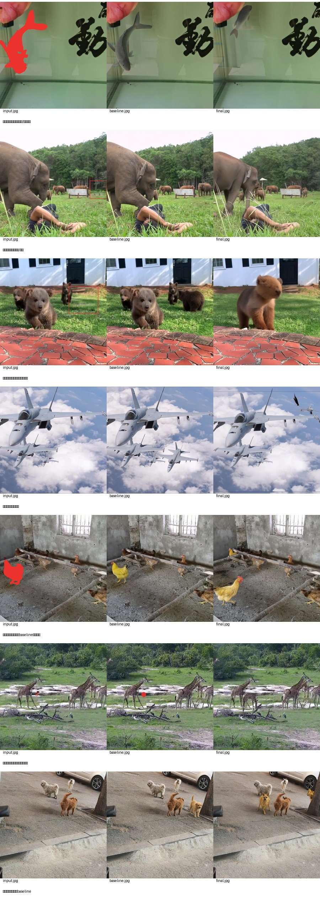
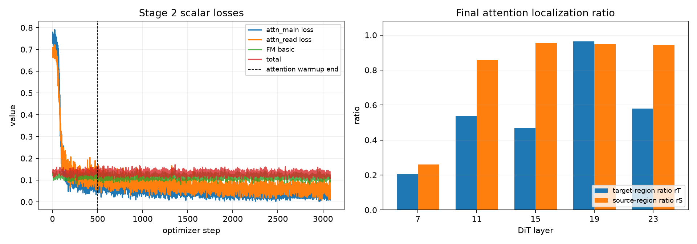
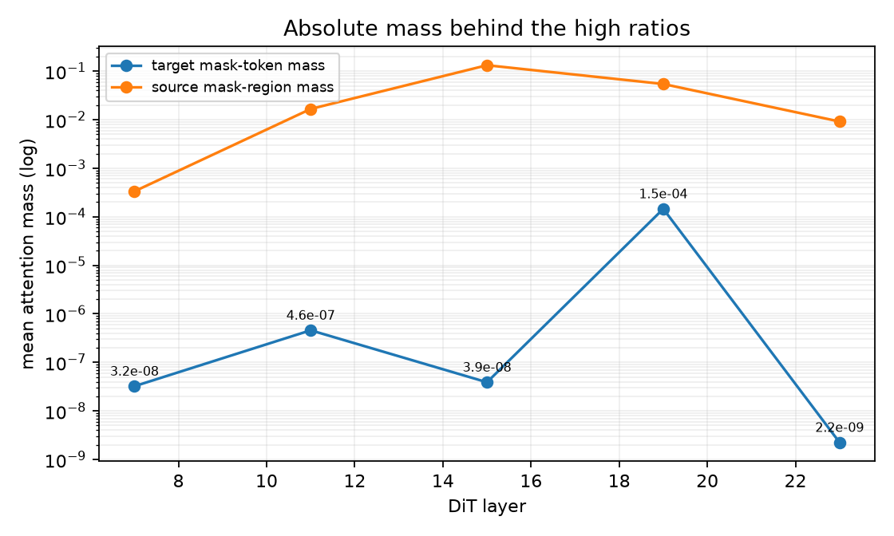

# SAMTokEdit 在 add 编辑上失败的原因分析（2026-10-05）

## 结论先行

当前 add 失败的主因不是单一的实现 bug，而是 **“新增操作”与当前 mask-token 条件、训练目标和数据分布之间的不匹配**：模型能看到并聚焦一个区域，却没有学会“在空区域新增一个独立实例，同时保留已有实例”。它因此经常采取三种替代行为：

1. 不新增，保持原图不变；
2. 把目标区域内已有实例重绘/换色，完成了属性变化但没有增加实例数量；
3. 在别的地方新增，或生成一个过大的/错位的对象。

区域 loss 确实让区域误差下降，attention loss 的全局定位指标也下降，但当前 attention 目标存在明显退化：高的区域比例主要由少数后层承担，而且 mask-token 的绝对 attention mass 已经非常小。因此，不能把 `attn_r_target≈0.96` 解读为“生成时强而正确地使用了 mask”。

优先级最高的改进是：**先做 add 专项消融，随后修正 attention loss 的退化形式；再提高 add/小区域样本曝光，并保留或强化新增语义和相对位置约束。**

## 1. 评测证据：add 是系统性失败，不是偶然坏例子

评测目录：

- 指标：[EVALUATION_REPORT.md](/mnt/bn/strategy-mllm-train/intern/users/tanyue/experiments/SAMTokEdit/qwen21_stage2_benchmark_noref_aligned_20261004/EVALUATION_REPORT.md)
- 每条 case 的 judge 证据：[CASE_RECORDS.jsonl](/mnt/bn/strategy-mllm-train/intern/users/tanyue/experiments/SAMTokEdit/qwen21_stage2_benchmark_noref_aligned_20261004/CASE_RECORDS.jsonl)
- 输入/生成可视化：`/mnt/bn/strategy-mllm-train/intern/users/tanyue/experiments/SAMTokEdit/qwen21_stage2_benchmark_noref_aligned_20261004/case_review_package/assets/cases/`
- 本文诊断图：repo 中的 `assets/add_failure_analysis_20261005/`，以下正文直接嵌入。

add 共 260 个 case，每个 case 有四种 setting；其中 255 个来自 CompBench，结论主要反映多实例、关系和位置约束较多的 CompBench add。

### 1.1 最终权重相对于 Qwen-Image-2.1 baseline

下表为 `SAMTok final - qwen21`，E/P/Q 分别是 edit、preservation、quality，strict 是严格成功率差值。

| setting | ΔE | ΔP | ΔQ | Δstrict |
|---|---:|---:|---:|---:|
| box | -0.523 | -0.381 | -0.177 | -0.327 |
| mask | -0.392 | -0.373 | -0.238 | -0.250 |
| point | -0.227 | -0.446 | -0.173 | -0.231 |
| text | -0.869 | -1.008 | -0.550 | -0.385 |

对应的绝对分数：

| setting | baseline E/P/Q | SAMTok final E/P/Q | baseline strict | SAMTok strict |
|---|---|---|---:|---:|
| box | 3.792/3.931/3.423 | 3.269/3.550/3.246 | 0.873 | 0.546 |
| mask | 3.704/3.950/3.469 | 3.312/3.577/3.231 | 0.862 | 0.612 |
| point | 3.423/3.950/3.438 | 3.196/3.504/3.265 | 0.762 | 0.531 |
| text | 3.496/3.892/3.685 | 2.627/2.885/3.135 | 0.735 | 0.350 |

step-12000 的 add 也没有解决问题；它的 edit 分数略高于 final，但 preservation/quality 更差，说明继续训练改变了失败形态，尚未建立稳定的新增能力。

### 1.2 失败类型是“操作理解失败”，不是单纯画质差

我独立查看了输入、baseline 和 final 的图像，典型失败模式如下：

- `cb_train-00000-of-00007_0072`（大象，box）：baseline 在右侧空区域新增大象；final 没有在指定区域新增，且重绘了前景大象和人物区域。
- `cb_train-00000-of-00007_0211`（熊，box）：baseline 新增了正确朝向的熊；final 保留/重绘已有熊，目标区域没有新增实例。
- `cb_train-00000-of-00007_0395`（飞机，text）：baseline 在目标位置增加飞机；final 的新增物体出现在错误位置且形态很小，属于错位新增。
- `cb_train-00001-of-00007_0209`（金鱼，text）：baseline 正确增加第四条鱼；final 原有鱼基本保留，目标区域没有新增。
- `cb_train-00000-of-00007_0240`（鸡，mask）：这是方法相对成功的例子，final 确实在目标附近增加了鸡；baseline 更像是把已有鸡重绘成目标颜色。说明方法不是完全不会 add，而是成功率和位置/实例保持不稳定。
- `cb_train-00006-of-00007_0282`（两只狗，text）：final 能生成两个新增实例，baseline 只在错误位置增加一个，说明多区域 mask 条件在少数情况下能帮助新增。

图中每行依次是输入、baseline、final；红色区域是 benchmark 的输入标注可视化。



### 1.3 小区域尤其差

按 benchmark 输入区域面积分组，计算 final 相对 baseline 的差值：

| mask 面积 | case-setting 数 | ΔE | ΔP | ΔQ | Δstrict |
|---|---:|---:|---:|---:|---:|
| <2% | 360 | -0.544 | -0.739 | -0.306 | -0.375 |
| 2–5% | 364 | -0.514 | -0.522 | -0.266 | -0.247 |
| 5–10% | 228 | -0.548 | -0.355 | -0.285 | -0.294 |
| ≥10% | 88 | -0.170 | -0.420 | -0.273 | -0.205 |

正式训练 add UMT 的 200 条随机区域抽样中，区域面积均值约 6.8%、中位数约 3.5%；约 36% 小于 2%，约 6% 在 latent grid 上少于 16 个 coverage token。也就是说，当前训练分布本身就有大量小新增区域，而 benchmark add 对这类区域非常敏感。

## 2. 数据和 prompt：信息被压缩，且 add 曝光不足

### 2.1 noref 会损失 add 的关系信息

训练采用的 noref 模板是：

```text
Add NEW_CONTENT in this region <mask>.
```

它保留了新增物体和大部分属性，但会把 `on the right of the bear`、`behind the birdbath`、`perched on the lamp` 等锚点关系压缩成 `in this region`。如果 mask 是精确放置区域，这个压缩是可接受的；如果 mask 只是较宽的候选区域，模型就失去了前后、左右、遮挡等信息。

当前正式 stage2 add noref 行中，我统计到 35 条明显残留的介词错误（例如 `Add a surfboard leaning against in this region`），比例不高，不能解释全部失败，但说明规则转换仍应清理。更重要的是，即使语法正确，关系信息的系统性压缩仍然影响多实例 add。

评测脚本中的 noref 编译代码见：

[`code/samtok_stage2_benchmark_noref_aligned.py:171`](/mnt/bn/strategy-mllm-train/intern/users/tanyue/experiments/SAMTokEdit/qwen21_stage2_benchmark_noref_aligned_20261004/code/samtok_stage2_benchmark_noref_aligned.py#L171)，训练数据统计见 [`docs/04_SAMTokEdit_Qwen21_训练数据盘点.md:127`](archive/v1/04_SAMTokEdit_Qwen21_训练数据盘点.md)。

### 2.2 add 没有获得与难度匹配的采样权重

最终数据中 add 为 18,928 条 plain、18,798 条 ref/noref；数量并不少。但 stage2 的类型池权重是 add/remove/replace=14、attribute=20、action/text=10，add 的曝光低于 attribute。按正式 3,081 update schedule 重放，add 总曝光 66,286/394,368，约 16.8%；attribute 为 94,445，remove 为 75,151。

因此，“add 数据量很多”不等于“模型对 add 看得足够多”。当前配比优先照顾 attribute，而 add 恰好是最需要专门学习操作模式的一类。

### 2.3 训练集和 benchmark 的 add 分布不同

训练 add UMT 来源为：derived 12,484、scaleedit 12,254、crispedit 7,050、refedit 5,808（ref+noref 合计）。评测 add 主要是 CompBench 多实例场景，要求新增实例数量、相对位置、朝向和已有实例保持同时成立。训练/评测的场景和语言约束并不完全同分布，这是重要的泛化瓶颈。

## 3. 当前区域 loss 对 add 的实际作用

区域 loss 的实现位于：

- 区域权重：[`regions/supervision.py:53-75`](../src/samtok_edit21/regions/supervision.py#L53)
- FM 与区域 loss 合并：[`training/objectives.py:306-323`](../src/samtok_edit21/training/objectives.py#L306)

它做的是预测误差的区域/背景重加权，不是“是否新增了一个实例”的目标函数。对 add 而言，这有两个后果：

1. 空区域中的新增物体通常只占很小的 latent 面积，区域误差即使被放大，也没有显式要求实例数量从 0 变成 1；模型可以把区域重绘成背景、旧实例或模糊形状，仍然获得有限的 FM 改善。
2. `n_min=16` 会对很小的 inside region 做分母下限。训练抽样中约 6% 的 add 区域少于 16 个 latent coverage token，正是新增小物体最容易失败的样本。

正式训练最后一步的全体 eligible 样本指标为：

```text
loss_fm_basic       0.10055
loss_fm             0.11063
region_inside_mse   0.18095
region_outside_mse  0.10377
region_weight       0.5
```

区域误差高于背景误差，说明模型仍然最难学的是区域内容；但这些数值没有 add/edit_type 维度，不能证明 add 区域单独变好。当前日志也没有记录 add 的 region_inside_mse。

## 4. attention loss：全局指标变好，但 attention 可能被“投机”满足

attention 实现见 [`training/attention.py:102-117`](../src/samtok_edit21/training/attention.py#L102)。当前配置为：

```text
attention_weight       = 0.1
attention_read_weight  = 0.5
layers                 = [7, 11, 15, 19, 23]
warmup                 = 500 optimizer updates
```

### 4.1 它确实降低了全体 attention loss

训练开始时（step 1）全体 eligible 样本约为：

```text
attn_main=0.7473, attn_read=0.6869, r_target=0.1443
```

最终约为：

```text
attn_main=0.00856, attn_read=0.01360, r_target=0.9623, r_source=0.9473
```

所以从“按代码定义的比例损失”看，attention 监督是优化成功的；但这是全体 ref/noref eligible 样本的聚合，不是 add 专项，也不是推理时 attention 图。

### 4.2 目前的 attention 目标存在两个退化点

**第一，跨层 log-sum-exp 只要求总和正确，不要求每层正确。**

代码先做：

```python
total = torch.logsumexp(stats.float(), dim=0)
rt = (total[:, 0] - total[:, 1]).exp()
```

最终逐层比例为：

| DiT layer | target-region ratio | source-region ratio |
|---:|---:|---:|
| 7 | 0.207 | 0.259 |
| 11 | 0.537 | 0.857 |
| 15 | 0.470 | 0.955 |
| 19 | 0.965 | 0.947 |
| 23 | 0.581 | 0.943 |

聚合后的 `r_target=0.962` 主要被 layer 19 拉高，早期层 7/11/15 仍然很低。对于 add，早期层没有形成稳定的“写入这个区域”的定位，后层单独满足比例并不能保证生成过程中逐层保持区域控制。

**第二，高比例伴随绝对 mask-token mass 几乎归零。**

最终 target mask-token mass：

```text
layer 7  = 3.2e-08
layer 11 = 4.6e-07
layer 15 = 3.9e-08
layer 19 = 1.45e-04
layer 23 = 2.2e-09
```

也就是说，模型可能通过“几乎不看 mask token，但剩下的极小 attention 质量集中在目标区域”来取得高比例。当前 loss 只约束区域内/区域外的比值，没有给 mask token 一个最低绝对质量，也没有惩罚忽略 mask。这个现象是当前 attention 设计最值得优先修正的地方。

下图展示训练 loss 曲线、逐层比例以及绝对 attention mass 的数量级。





### 4.3 attention 对总 loss 的实际贡献很小

最后一步 `loss_fm_basic≈0.10055`，`loss_fm≈0.11063`，attention 额外贡献约为 `1e-3` 量级；配置的 `attention_weight=0.1` 并不意味着 attention 占总 loss 的 10%。因此，即使 attention 比例指标下降，它也不足以显著改变 add 的生成行为。与此同时，现有日志没有按 edit_type 记录 attention，无法声称 add 的 attention 比 baseline 或无 attention 版本更好。

## 5. 为什么 remove 相对有效而 add 失败

这两类任务对 mask token 的要求本质不同：

| 任务 | 源图 mask 内 | 模型要做的事 | 当前条件的自然优势 |
|---|---|---|---|
| remove | 已有对象 | 删除并补背景 | mask token 与源图中的真实对象有视觉对应，区域内外约束直接有效 |
| add | 通常是空背景/放置区域 | 创建新实例、决定姿态/尺度/遮挡、保留旧实例 | mask token 只有“位置”而没有待删除的源对象，必须依赖语言和生成先验 |

这解释了当前结果：remove 的严格成功率相对 baseline 有明显提升，而 add 里最常见的替代动作是“重绘原有实例”或“什么也不做”。当前模型不是没有局部控制，而是缺少“空区域新增实例”的专门操作先验。

## 6. 推荐改进方案

### P0：先做四个小规模消融，避免盲目重训

固定 32–64 个 add case、相同 source/mask/prompt/seed，至少比较：

1. 当前 final：region=.5，attention=.1；
2. region=.5，attention=0；
3. region=0，attention=0；
4. region=.5，attention 使用修正后的 per-layer + absolute-mass 版本。

同时记录 add 的 `edit/preservation/quality/strict`，并把训练日志按 `edit_type` 分组。这样可以直接判断：当前 add 下降到底来自区域 loss、attention loss，还是来自基础数据/分布问题。

### P1：修正 attention 目标

建议先做最小修改：

```python
# 不再先跨层 logsumexp；逐层计算 ratio，再平均/加权
r_target_l = (stats[:, :, 0] - stats[:, :, 1]).exp()
r_source_l = (stats[:, :, 2] - stats[:, :, 3]).exp()
loss_main = (1 - r_target_l).square().mean()
loss_read = (1 - r_source_l).square().mean()
```

然后加入绝对质量约束，目标可以用冻结 base/stage1 模型的同一输入统计做相对校准：

```python
loss_mass = F.relu(log_mass_floor - log_target_mass).square().mean()
loss = loss_main + 0.5 * loss_read + lambda_mass * loss_mass
```

第一轮建议只对 add 关闭或显著降低 `read` 项：源图中没有新增对象，强制 mask token 从源图背景读取，可能加重“把已有内容当成编辑对象”的倾向。最终需要按 add/remove/replace 分类型验证，而不是全局只看 `attn_r_target`。

### P1：提高 add 和小区域的训练曝光

- 将 add 的类型权重从 14 提升到 24–28，或建立 add 专项 batch；
- 对小于 2% 区域的 add 增加采样；
- 对少于 16 latent tokens 的样本单独统计和评测；
- 保留 mask 准确性，不重新推断数据集 mask，只调整训练采样和 loss 的数值稳定策略；
- 清理 35 条残留介词的 noref 行，并审查所有带 `left/right/behind/on/next to` 的 add noref 是否需要保留 anchor。

### P1：让 add 语义显式可学习

使用统一、短而明确的 add 模板进行新一轮小实验，例如：

```text
Add a new <CONTENT> inside the marked region <mask>.
Preserve all existing objects outside the marked region.
```

如果 benchmark 关系词重要，则在 mask 已准确标注放置区域的前提下保留简短 anchor：

```text
Add a new <CONTENT> in the marked region <mask>, <RELATION>.
```

关键是训练和评测完全使用同一模板；不要只改推理 prompt。

### P2：增加 add 专项目标

在不改变官方 FM 目标的前提下，可增加低权重的 add-only 辅助项：

- 区域内目标 latent 误差使用更稳定的面积归一化；
- 区域外保持误差单独监控，避免新增时全图重绘；
- 对 source/target 区域 latent 差异建立“区域确实发生变化”的 soft margin，而不是只要求区域 attention；
- 对多实例 case 记录新增计数/位置的离线指标，不能只看 FM loss。

### P2：做真正的推理 attention 可视化

当前 DiffSynth 推理默认启用 KV cache；源码中的 `attention_probe` 明确拒绝 cached attention。因此现有 `supervision_metrics.jsonl` 是**训练前向的 attention 统计**，不是生图过程的 attention map。

要得到可信的推理可解释性结果，应单独做一个临时诊断 runner：

1. 关闭 KV cache，只跑一个 add case 的前 1–3 个 denoising steps；
2. 在 layer 7/11/15/19/23 捕获 target image queries 对 mask-token keys 的 attention；
3. 将 attention 聚合成 target H×W 热图，与输入 mask、SAMTok decode mask、生成新增物体位置叠加；
4. 对比 stage1-only、当前 final、修正 attention 版本。

这一步不能用当前高 `attn_r_target` 代替，因为当前比例指标已经显示出“比例高、绝对质量很低、层间不均匀”的情况。

## 7. 最终判断

- **已确认：** add 相对 baseline 的下降是全面且可重复的，主要失败模式是“不新增/错位新增/重绘已有实例”；小区域最差。
- **已确认：** region loss 在数值上工作，但没有显式解决新增实例问题；add 小区域会受到 `n_min=16` 和 FM 平均目标的影响。
- **已确认：** attention loss 的聚合指标明显下降，但当前实现允许后层独占满足比例，并且绝对 mask-token mass 退化，不能据此认定生图阶段定位变好。
- **高概率主因：** mask token 在 add 中只提供背景区域位置，而模型训练仍主要学到“对一个已有编辑对象做局部修改”；缺乏 add-specific operation prior，加上 CompBench 多实例分布差异，导致新增操作退化为 replace/attribute/no-op。
- **当前没有证据支持：** 单纯把 attention weight 从 0.1 调到更大就能修好 add。应先修正 attention 目标并做小规模消融，否则可能只是让模型更强地关注一个错误/过宽的区域。

