# SAMTokEdit（Qwen-Image-2.1）v1 分析与 v2 计划

本文针对正式模型 `qwen21_full_4n_formal_003_resume_006`（Stage 1 TE LoRA + Stage 2 DiT LoRA，3081 + 3081 updates）和评测 `qwen21_stage2_benchmark_noref_aligned_20261004`（656 case × 4 setting）做独立复核。方法上不直接采信 judge 分数或已有文档的结论，而是：

1. 逐张查看约 45 个 case 的四种 setting（分层随机抽样 + 已有文档提到的 case）；
2. 用客观指标重新度量“where 信号”质量（codec/SAM2/pass-1 解码 IoU）与“区域外漂移”（像素级）；
3. 在 GPU 上做了 7 组可解释性 / 因果实验：TE 表征线性探针、推理期 DiT 注意力探针、mask-token 反事实交换、注意力 knockout、TE/Stage1/Stage2 逐级消融（ladder）、训练数据对齐度审计、checkpoint 权重漂移；
4. 用同一个官方 judge（Qwen3.8-27B，pair_v2，temperature=0）对消融产物打分，保证可比。

所有脚本和中间结果位于 `/tmp/sa/`（见第 7 节）；本文图片在 `docs/assets/failure_analysis_20261005/`。

---

## 0. 结论摘要

1. **E 的提升几乎全部来自 remove。** 按类型拆开，final 只在 remove 上全面超过 baseline（四个 setting 的 strict 从 0.07–0.46 提升到 0.51–0.74）；add、replace、mixed 在 **全部四个 setting** 上的 E、P、strict 都低于 baseline（例如 mask-replace strict 0.66 → 0.35，mask-mixed 0.44 → 0.15）。总分接近 baseline 是 remove 的大幅提升与其他类型的下降相互抵消的结果。
2. **remove 的提升是真实的实例级几何绑定，不只是 baseline 弱。** 同一句 `Remove the object in this region <M>.`，只把 token 换成同类另一实例的 mask，final 18/18 跟随 token 删除对应实例（Stage-1-only 为 10/18）。但 baseline 的 remove 弱有一部分来自 two-image locator 协议：point setting 下 baseline 区域内像素变化只有 0.026（基本不改），stock 模型在 text-only 下也经常不删。
3. **“where 信号”在 add 和细小部件上先天不可靠。** SAMTok codec 对 add 的“空白放置区域”无法表示：输入 mask → encode → decode 的 IoU 仅 0.38（remove 0.88），75% 的 add 区域 < 0.5；面积 < 0.5% 的部件 IoU 只有 0.63–0.68，常被解码成整个物体；point/box → SAM2 取最高分候选在 add 上落到大片背景（point IoU 0.19）、在部件上落到整物体；text-only 的 pass-1 对 add 的 IoU 只有 0.13。
4. **TE 不是瓶颈：位置信息已经进入 DiT 的输入。** 在 TE 输出的 mask-token 位置上，线性回归即可预测区域中心（R² ≈ 0.89/0.86），对照（span 前一个 token）只有 0.07/0.17；甚至只用两个 code 的 one-hot（不看图）就有 R²(x)=0.88——SAMTok 第一层码本身就近似一个粗位置码。
5. **attention loss（A）以退化方式被优化，而且监督的是模型并不依赖的通路。** 训练前 100 个 update 内（λ_A 仍 ≤ 0.02），L7/L15/L23 的 target→mask 注意力质量下降 2–4 nats，聚合比例 0.25 → 0.77；最终聚合比例 0.94 几乎完全由 L19 决定。推理期探针显示：Stage 2 后 4 个监督层（7/11/15/23）对 mask token 的注意力降到均匀水平的 1e-5 量级（L23 为 3e-6），L20–31 全部降到 < 0.02×（原 DiT 为 0.15–1×），只有 L0、L3 和 L19 附近保留与原模型同量级的注意力。**knockout 实验中把 target 对 4 个 mask token 的注意力在所有层、所有去噪步完全屏蔽，remove 的跟随率仍为 100%**——“where”通过 span 之后的 token 间接传递，A loss 监督的那条通路并不承担定位。
6. **add/replace/mixed 的退化与 P 下降主要来自 Stage 1，而不是换 TE 或 mask token。** 同 120 个 case、同一 plain prompt、同一 judge：stock strict 0.63 / P 3.74；**raw SAMTok TE + 原 DiT 为 0.52 / 3.66**（add/replace/mixed 与 stock 持平，只在 remove 上更弱）；**Stage-1 TE + 原 DiT 掉到 0.27 / 2.92**（add E 3.65 → 2.62）。像素漂移率同样是 6% → 6% → 34%。remove 的分解：pass-1 token 让 Stage-1 TE + 原 DiT 的 remove E 从 1.48 升到 3.62（定位来自 token），Stage 2 主要把 remove 的 P/strict 从 2.92/0.55 提到 3.62/0.78（mask setting）。在 DiT 实际读取的空间（DiT `txt_in` 投影之后）比较同一批 plain prompt 的条件：stock TE 与 raw SAMTok TE 的逐 token 余弦为 0.965，raw 与 Stage-1 TE 只有 0.786（stock 与 Stage-1 为 0.741）。换 TE 几乎不改变 DiT 看到的条件，Stage 1 则改变很大。最可能的机制是：Stage 1 用冻结 DiT 的 FM loss 在“目标图整体重渲染”的数据上训练 TE，而 TE 侧没有 anchor 约束，TE 因此学会了编码“重画整张图”。
7. **训练数据是“重渲染”和“mask 不决定位置”的直接来源。** 按区域外像素变化审计：ScaleEdit 70%、CrispEdit 45% 的样本有 >20% 的区域外像素明显变化（ScaleEdit 30% 超过 50%），CrispEdit 只有 55% 的 source/target 尺寸一致；只有 SAMTok Derived（MIRAGE 回写）是干净的（1%）。add 样本里 mask 经常不在真正新增物体的位置（ScaleEdit add 有 64% 的样本区域内变化不到区域外的 2 倍）。
8. **评测协议本身有影响结论的问题。** noref 编译器把 `change the color of the shell to red` 编成 `Change this region <M> to red`，丢掉了 `the color/material/texture of` 和部件名，违反数据协议。在 32 个 MIRAGE case 上只修正编译器（模型、token 不变），final 的 E 2.59 → 3.56、P 1.97 → 2.44、strict 0.16 → 0.31——当前 MIRAGE 上的大部分 E 差距来自这个 bug。此外 MIRAGE 99/100 是双区域，而训练里 composite 只占约 1%；评测只用单 seed，step-12000 与 final 相差 81 个 update，但 LoRA 有效权重变化了 12.6%，text-only 的漂移率从 59% 变到 39%。
9. **两个免训练修正已经验证有效。** 在 120-case 子集的 mask setting 上，只修正评测编译器 + 对非 add 类型做推理期 latent 融合，replace strict 0.36 → 0.72、mixed 0.20 → 0.40、remove 0.78 → 0.82，三类都超过 stock（0.68 / 0.33 / 0.55）；add 不适合硬融合（会裁掉放在区域外的新物体，strict 0.70 → 0.47）。
10. **改进优先级**（第 6 节详述）：P0 清洗/重合成训练对 + 把 pass-2 的 TE 从 Stage-1 FM 中解耦（或加 anchor）+ 修正评测编译器与 point 选择；P1 用“结构性几何绑定”（解码 mask → clause 级 attention bias / region-RoPE / 区域嵌入）替代 A loss，非 add 类型推理期 latent 融合，add 改用坐标/框表示；P2 EMA/学习率退火、多 seed 与更强 baseline。

---

## 1. 评测结果再审视

### 1.1 按编辑类型拆分（judge 分数，n 为 case 数）

| 类型 | setting | baseline E / P / strict | final E / P / strict | Δstrict |
|---|---|---|---|---:|
| add (260) | text | 3.50 / 3.89 / 0.73 | 2.63 / 2.88 / 0.35 | −0.38 |
| add | mask | 3.70 / 3.95 / 0.86 | 3.31 / 3.58 / 0.61 | −0.25 |
| add | box | 3.79 / 3.93 / 0.87 | 3.27 / 3.55 / 0.55 | −0.33 |
| add | point | 3.42 / 3.95 / 0.76 | 3.20 / 3.50 / 0.53 | −0.23 |
| remove (268) | text | 1.87 / 3.79 / 0.40 | 3.51 / 2.95 / 0.51 | +0.11 |
| remove | mask | 1.97 / 3.96 / 0.46 | 3.53 / 3.70 / 0.74 | +0.29 |
| remove | box | 1.58 / 3.90 / 0.37 | 3.56 / 3.73 / 0.74 | +0.37 |
| remove | point | 0.32 / 3.92 / 0.07 | 3.49 / 3.73 / 0.74 | +0.67 |
| replace (94) | text | 3.77 / 3.56 / 0.73 | 3.28 / 2.89 / 0.44 | −0.29 |
| replace | mask | 3.72 / 3.40 / 0.66 | 2.91 / 2.52 / 0.35 | −0.31 |
| replace | box | 3.55 / 3.24 / 0.52 | 2.96 / 2.59 / 0.36 | −0.16 |
| replace | point | 2.82 / 3.16 / 0.36 | 2.77 / 2.62 / 0.35 | −0.01 |
| mixed (34) | text | 3.56 / 3.15 / 0.56 | 3.18 / 2.53 / 0.35 | −0.21 |
| mixed | mask | 3.62 / 3.15 / 0.44 | 2.50 / 2.00 / 0.15 | −0.29 |
| mixed | box | 3.41 / 3.21 / 0.44 | 2.65 / 2.15 / 0.18 | −0.26 |
| mixed | point | 2.82 / 3.06 / 0.26 | 2.24 / 1.88 / 0.12 | −0.14 |

remove 以外的类型在所有 setting 上都下降。benchmark 中 remove 有 268 个 case，其中 CompBench remove 255 个，它们几乎决定了“E 提升”的结论。

### 1.2 客观像素指标：区域外漂移

对 656 × 4 × 3 张图计算 `|output − source|`（5px 平滑），统计远离编辑区域（输入 mask 外扩 6% 对角线以外）中变化 > 0.08 的像素比例。“漂移率”定义为该比例 > 20% 的 case 占比：

| 方法 | text | mask | box | point |
|---|---:|---:|---:|---:|
| baseline | 7.3% | 0.6% | 0.9% | 2.4% |
| step-12000 | 59.3% | 21.5% | 21.3% | 23.0% |
| final | 38.9% | 12.7% | 12.5% | 13.4% |

按类型：remove 的显式 setting 是唯一比 baseline 更“干净”的组合（区域外平均变化 0.014 vs 0.020，区域内 0.148 vs 0.080，即“删得更多、改得更少”）。add/replace/mixed 的区域外漂移是 baseline 的 2–10 倍。

### 1.3 baseline 的 remove 弱点有多少来自协议

- **stock 模型本身确实不擅长指代性删除**：ladder 实验中 stock 在 text-only 下对 0245/0326/0362 等常见 case 完全不改（见第 3.7 节图）。
- **two-image locator 协议进一步放大了这个弱点**：point setting 下 baseline 在 remove 区域内的平均变化只有 0.026（text 0.085、mask 0.080），即大多数输出与原图几乎相同；judge E=0.32。case 0233 中 baseline 在 mask/box/point 下删掉的是大橙鱼而不是被标注的银鱼。
- 因此 “remove +0.67 strict（point）” 中有相当部分是 baseline 的协议问题。更公平的对照见第 6.5 节。

### 1.4 评测稳定性

- step-12000 与 final（12324 microsteps）只差 81 个 optimizer update，但 text-only 的漂移率 59% → 39%、P 2.50 → 2.89。同期 DiT LoRA 有效权重 `‖ΔW‖/‖W‖` = 12.6%（500 updates 为 35%，1000 updates 为 52%）。在 constant LR 1e-4、无 EMA 的设置下，“final”是一个仍在大幅移动的快照，单个 checkpoint、单 seed 的评测方差很大。
- judge 本身是确定性的（temperature 0、seed 0），复评同一图像结果一致（第 3.7 节 rejudge），方差主要来自生成与 checkpoint。

---

## 2. 逐 case 观察

### 2.1 做得好的：显式区域的 remove、整物体级 remove/replace

- **0233 remove 最左鱼**：四种 setting 都删对；baseline 在 mask/box/point 下删掉的是另一条橙鱼。
- **0326 remove 最右人物、0287 remove 最左鹅、0362 remove 第二只鸭（显式区域）**：final 干净删除，baseline 显式输入下基本不改。
- **0586 mixed（删右猫 + 中猫换狗）**：final 四种 setting 都正确且背景稳定；baseline 在 box 下把狗放到了右猫位置。
- **0472 replace 右侧白马 → 棕马**：显式区域下 final 与 baseline 都好。

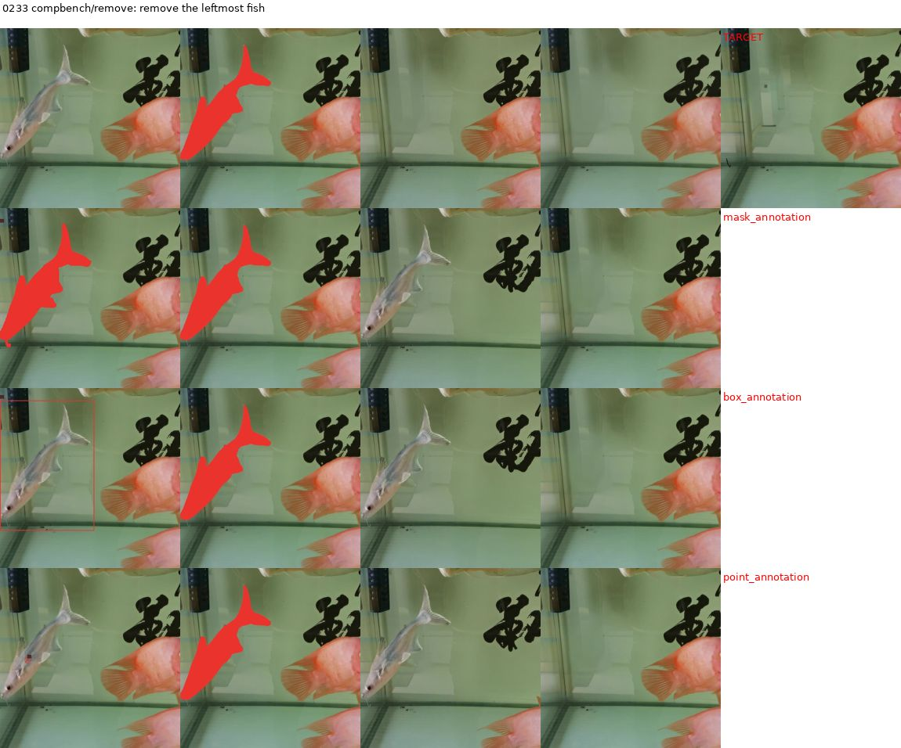
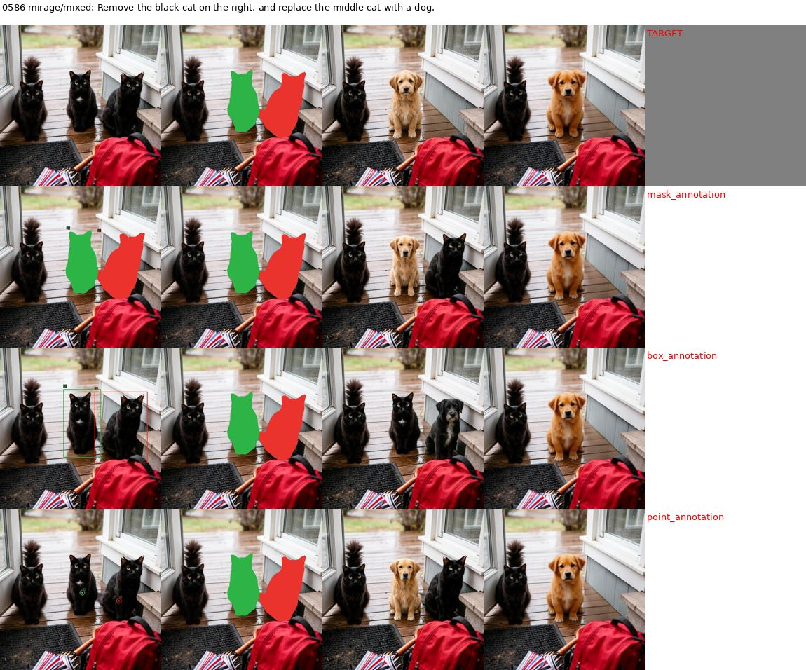

> 每张案例图的列为：输入（显式 setting 叠加 locator）、SAMTok token decode（实际送入 DiT 的区域）、baseline、final、target；行为 text/mask/box/point。

### 2.2 做得不好的：七类失败模式

| 编号 | 失败模式 | 典型 case | 现象 |
|---|---|---|---|
| F1 | add 区域无法表示 | 0000, 0101, 0012 | add 的放置 mask 被 codec 解码成玻璃边、墙、地平线等背景条带；point → 整片水/天空/地面 |
| F2 | add 位置跟随文本、不跟随 token | 0137, 0054, 0082 | mask/box/point 三种区域完全不同，final 却把物体放在同一个由文本推断的位置；0137 解码区域正确（右侧），物体仍放在左侧 |
| F3 | add 物体“幽灵化”或过小 | 0024, 0038, 0097, 0166 | 半透明、模糊、尺寸远小于区域；0166 把区域内已有的小树变成黑色“鸟” |
| F4 | 全局重渲染 | 0012, 0574, 0362(text), 0242(text) | 取景、物体姿态、光照整体变化；0574 只改鸭眼/鸭嘴，却重画整张图 |
| F5 | 部件 → 整物体、同类扩散 | 0643, 0574(point), 0564, 0581 | 鸥嘴的 mask 被解码成整只鸥，final 把三只海鸥都染蓝；鸟翅 → 整只鸟被删 |
| F6 | 多区域属性串扰 | 0610, 0557, 0588 | “区域 1 改白、区域 2 变光亮”，final 把两人都改白、第二个属性丢失 |
| F7 | 语言理解退化 / pass-1 不处理否定 | 0548(text), 0555, 0038 | “all people except the athlete” 把运动员也抹掉；pass-1 把 “remove all but X” 的 X 也分割进来；“similar to the others” 不再被遵守 |

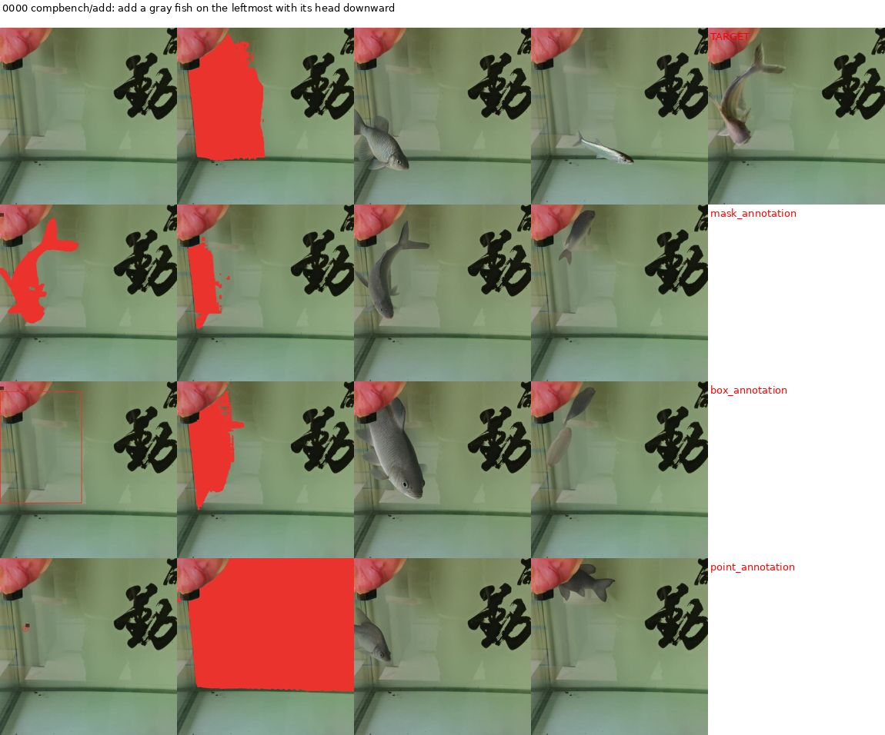
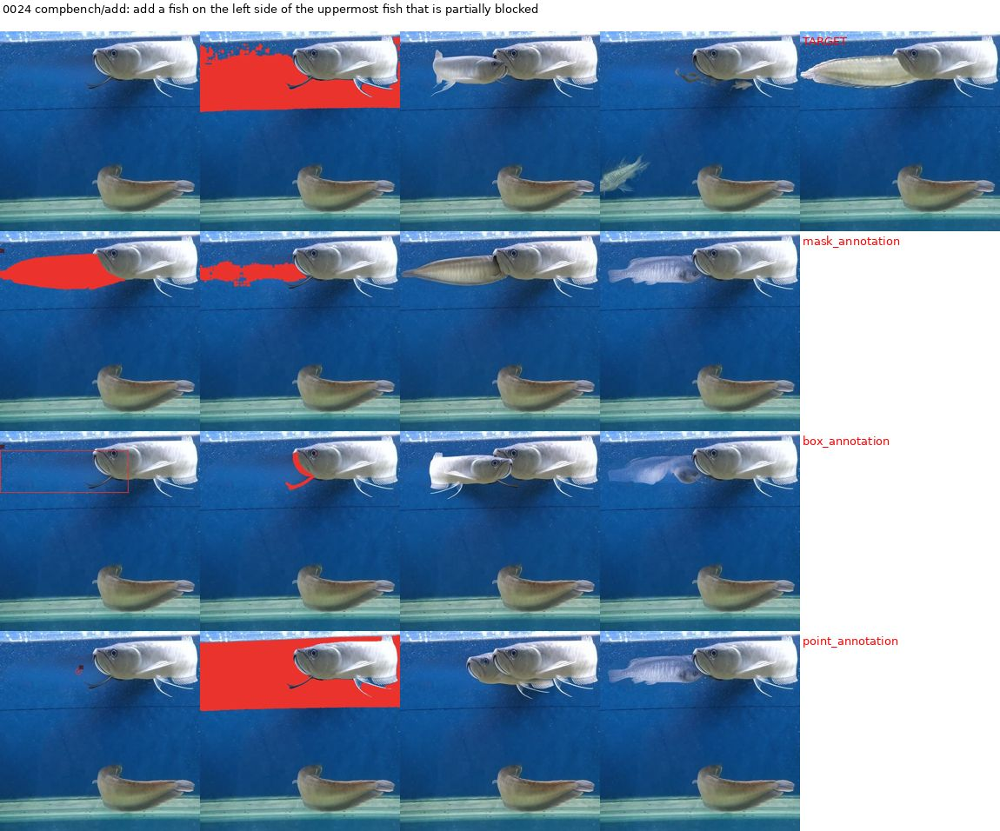
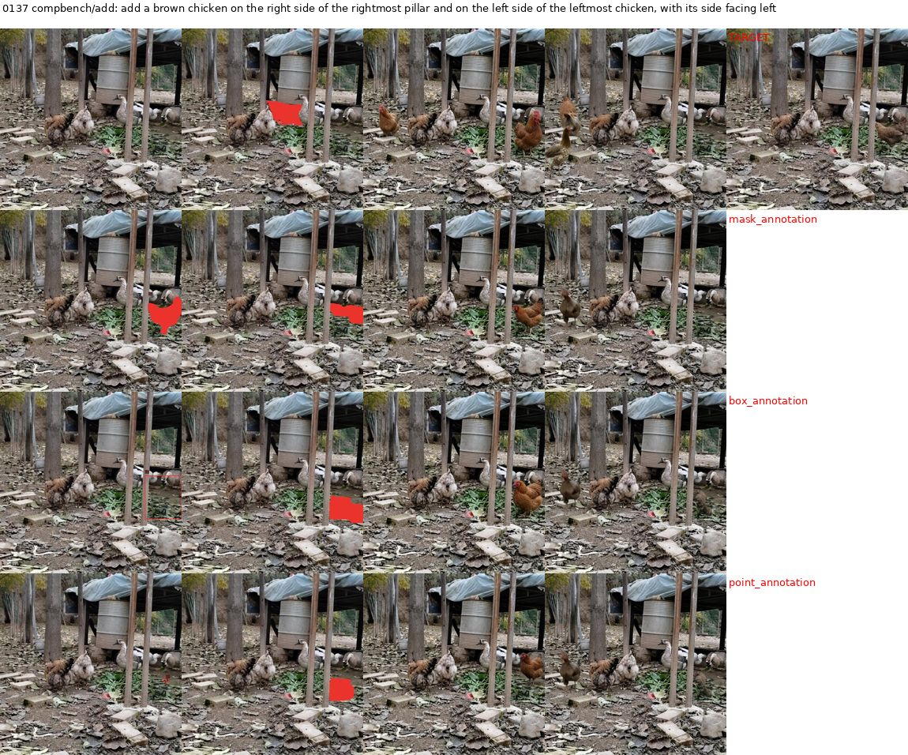
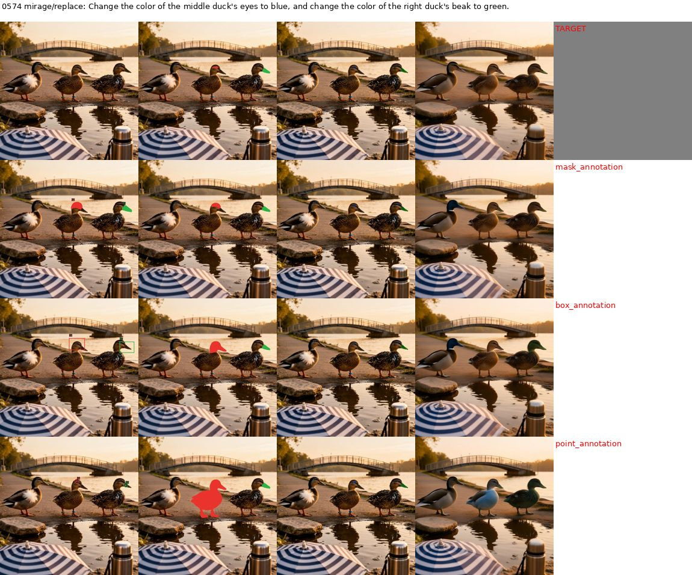
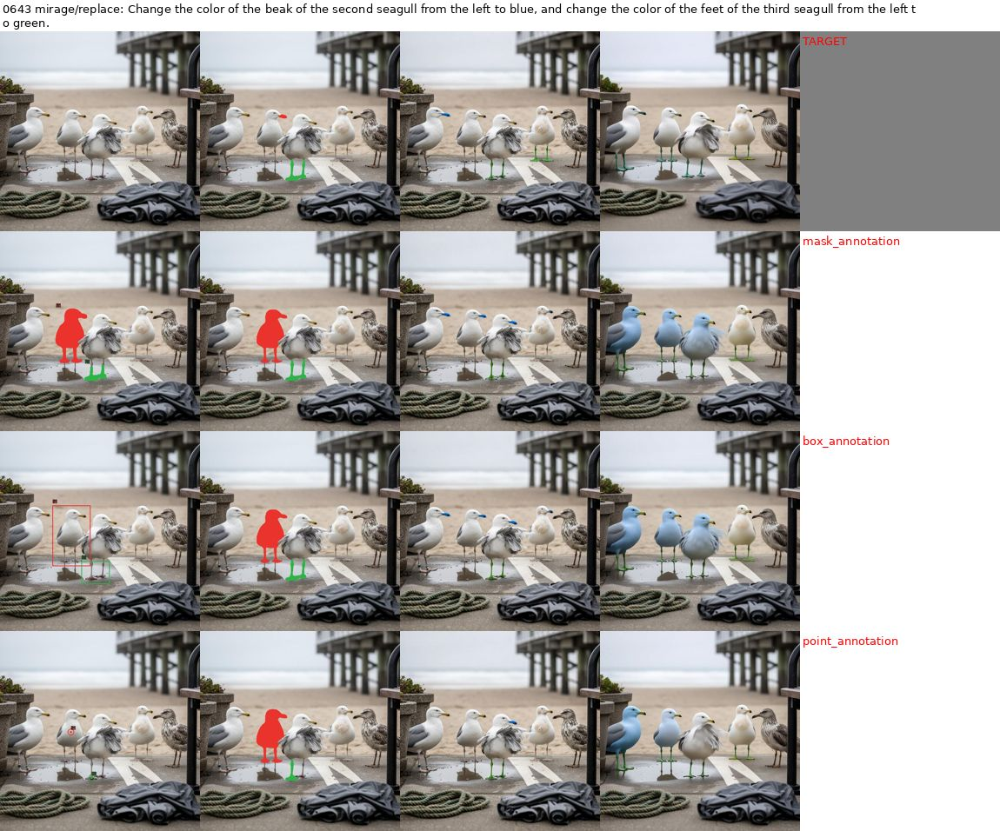
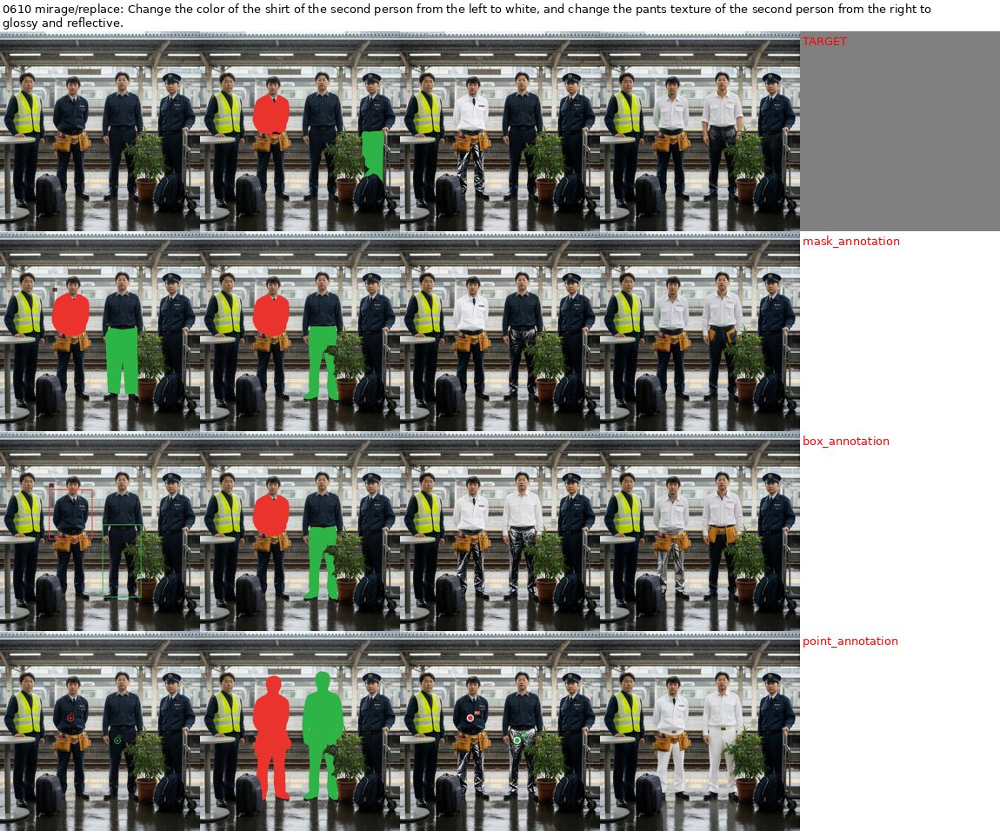

---

## 3. 推理链路的卡点定位

链路：区域（mask/box/point 或 pass-1 生成）→ SAMTok 两码 → TE 编码（pass-2）→ DiT 消费 → 生成。以下逐段定位。

### 3.1 “where”信号质量（实际送入 DiT 的 token 解码后与 benchmark 区域的 IoU）

| 类型 | codec 往返（encode→decode） | text（pass-1） | mask | box（SAM2→codec） | point（SAM2→codec） |
|---|---:|---:|---:|---:|---:|
| add | 0.38（75% < 0.5） | **0.13** | 0.38 | 0.29 | **0.19** |
| remove | 0.88 | 0.72 | 0.88 | 0.86 | 0.85 |
| replace | 0.78 | 0.66 | 0.82 | 0.76 | 0.56 |
| mixed | 0.85 | 0.50 | 0.87 | 0.83 | 0.63 |

非 add 区域按面积的 codec 往返 IoU：< 0.2% → 0.63；0.2–0.5% → 0.68；0.5–1% → 0.75；1–3% → 0.86；3–10% → 0.91。

结论：
- SAMTok 是“分割 tokenizer”，两码对应的是图像中可分割的 segment。add 的放置区域在源图上没有对应 segment，只能被解码为最接近的背景结构；这不是训练能修好的，是表示能力的边界。
- 小部件在两码表示中精度不足，常被量化成父物体（0643 鸥嘴 → 整只鸥）。
- point → SAM2 取 multimask 最高分候选，系统性偏向整物体（部件编辑）或大片背景（add）。
- pass-1 对 add 几乎失效（IoU 0.13），其 NTP 训练目标本身来自错位的 add mask（第 5.2 节）。

### 3.2 where 质量与最终效果的关系

把每个 case 的解码 IoU 分箱，比较 judge 分数：

- **add**：final 的 strict 在 IoU < 0.3、0.3–0.6、≥ 0.6 三档分别为 0.61 / 0.61 / 0.61（mask setting），与区域是否解码正确无关，而且每一档都低于 baseline（0.83–0.88）。即使给对了区域，DiT 也没有利用它。
- **replace/mixed**：IoU ≥ 0.6 的 82 个 replace case 上，final E 2.98 / P 2.60，baseline 3.71 / 3.41。失败发生在执行阶段，而不是定位阶段。
- **remove**：IoU ≥ 0.6 时 final 明显优于 baseline（point +0.70 strict）。

### 3.3 TE 表征探针：位置信息有没有进入 DiT 的输入？

对 795 个 benchmark 区域，构造 `Remove the object in this region <M>.`，取 PromptEmbedder 输出（即 DiT 的 `encoder_hidden_states`）中各位置的 4096 维向量，用按图分组的 5 折岭回归预测解码区域的中心 (cx, cy)：

| 特征位置 | raw SAMTok TE R²(x, y) | Stage-1 TE R²(x, y) |
|---|---|---|
| span 前的 `region`（因果上看不到码，对照） | 0.07, 0.17 | 0.07, 0.17 |
| code1 | **0.89, 0.86** | 0.90, 0.88 |
| code2 | 0.83, 0.79 | 0.84, 0.81 |
| mt_end | 0.78, 0.73 | 0.90, 0.81 |
| span 后的 `.` | 0.65, 0.58 | **0.92, 0.85** |
| 仅两个 code 的 one-hot（不看图） | 0.88, 0.68 | — |

- 位置信息在 TE 输出中是**线性可读**的，TE 不是瓶颈。
- 第一层码近似一个绝对粗位置码（codec 编码时输入了 box）。
- Stage 1 把位置信息“传播”到了 span 之后的 token（`.` 的 R² 0.65 → 0.92），这与第 3.6 节 knockout 的结论一致：DiT 主要从 span 之后的 token 读取位置。
- 但 Stage 1 也大幅改变了 DiT 看到的条件。在 TE 原始输出空间（final norm 之前）比较没有意义：少数大幅值通道主导余弦，连 stock TE 与 raw SAMTok TE 的余弦也只有 0.50。换到 DiT `txt_in` 投影之后的空间（40 个 plain prompt，文本位置）：stock ↔ raw SAMTok 为 0.965，raw ↔ Stage-1 为 0.786，stock ↔ Stage-1 为 0.741；差异集中在指令内容 token 上（末尾 6 个模板 token 三者都在 0.96 以上）。

### 3.4 推理期 DiT 注意力探针

在真实推理路径（KV cache decode）上 hook 全部 32 层，统计 target 图像 token 对 mask token（code1、code2、mt_end）的注意力质量（除以均匀分布水平）、区域内富集度（区域内注意力占比 / 区域面积），以及 target → 同位置 source token 的“拷贝”注意力。24 个 case（add / remove / replace+mixed 各 8 个），mask setting，去噪第 14/40 步：

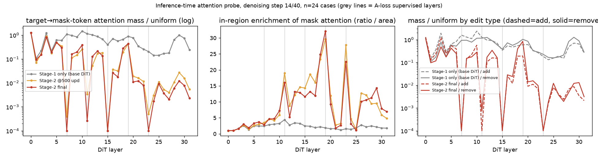

| 层 | 0 | 3 | 7* | 11* | 15* | 19* | 23* | 27 | 31 |
|---|---|---|---|---|---|---|---|---|---|
| mass/uniform：Stage-1-only（原 DiT） | 1.26 | 1.22 | 1.08 | 1.13 | 0.40 | 0.88 | 0.20 | 0.18 | 0.24 |
| mass/uniform：final | 1.26 | 0.81 | **0.00** | **0.00** | **0.00** | 0.44 | **0.00** | 0.00 | 0.00 |
| 区域内富集：Stage-1-only | 0.97 | 2.53 | 2.41 | 4.40 | 2.47 | 1.85 | 1.58 | 2.18 | 1.78 |
| 区域内富集：final | 1.02 | 3.05 | 2.83 | 16.1 | 11.6 | **32.2** | 22.5 | 10.6 | 6.95 |

（* 为 A loss 监督层）

- Stage 2 之后，大多数层几乎不再读 mask token；只有 L19 同时保有可观质量（0.44×）和高富集（32×）。按类型，L19 的质量为 remove 0.84×、replace/mixed 0.28×、add 0.19×，与“remove 有效、add 无效”一致。
- Stage-1-only 的原 DiT 在 L3–L11 已有 2–4× 的区域富集，Stage 2 反而把这些层压到了 ~0。
- Stage 2 学到了按区域门控 source 读取：remove 时 L23 的区域外/区域内 source 注意力比从 2.9 升到 5.2（区域外更多拷贝原图、区域内更少），这是 remove 能“删干净又不乱动”的机制。add 的门控更弱（L23 1.16 → 2.2）。

### 3.5 Counterfactual：只换 mask token，编辑会不会跟着走？

固定 prompt，只把 token 换成同一张图中另一个同类实例 / 放置区域的 mask（R0 ↔ R1），测量两种 token 下编辑是否落在 token 指向的区域（跟随 = 两次都满足“token 区域变化 > 另一区域变化”）：

| 测试集（prompt） | raw TE + 原 DiT | Stage-1 TE + 原 DiT | final |
|---|---|---|---|
| remove，18 个 CompBench 双实例（`Remove the object in this region <M>.`） | 0.00 | 0.56（选择性 +0.42） | **1.00（+0.81）** |
| add，22 个 CompBench 同类双放置区（`Add a zebra in this region <M>.`） | 0.18 | 0.32（+0.18） | 0.64（+0.39） |
| 部件颜色，24 个 MIRAGE 双区域（`Change the color of this region <M> to blue.`） | — | 0.29（+0.17） | 0.58（+0.31） |

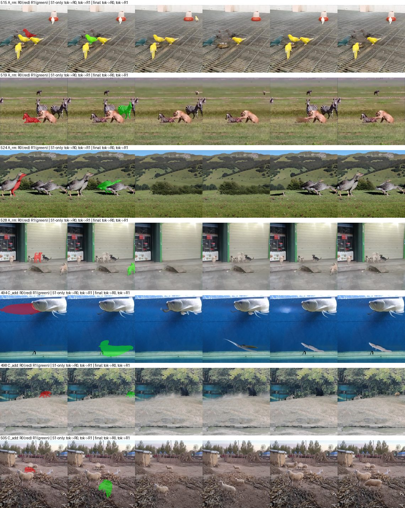

- 第 9.17 节记录的“大部分 case 编辑不随 token 迁移”在当前模型的 remove 上已不成立：final 能把 token 当实例级几何指针使用。
- Stage-1-only 经常把所有同类实例都删掉（0524 的鹅、0519 的斑马），raw TE + 原 DiT 则几乎不删，说明两阶段训练都在起作用。
- add 和部件属性只有约 60% 的跟随率，且常伴随同类扩散（0557、0588）或部件 → 整物体（0574）。

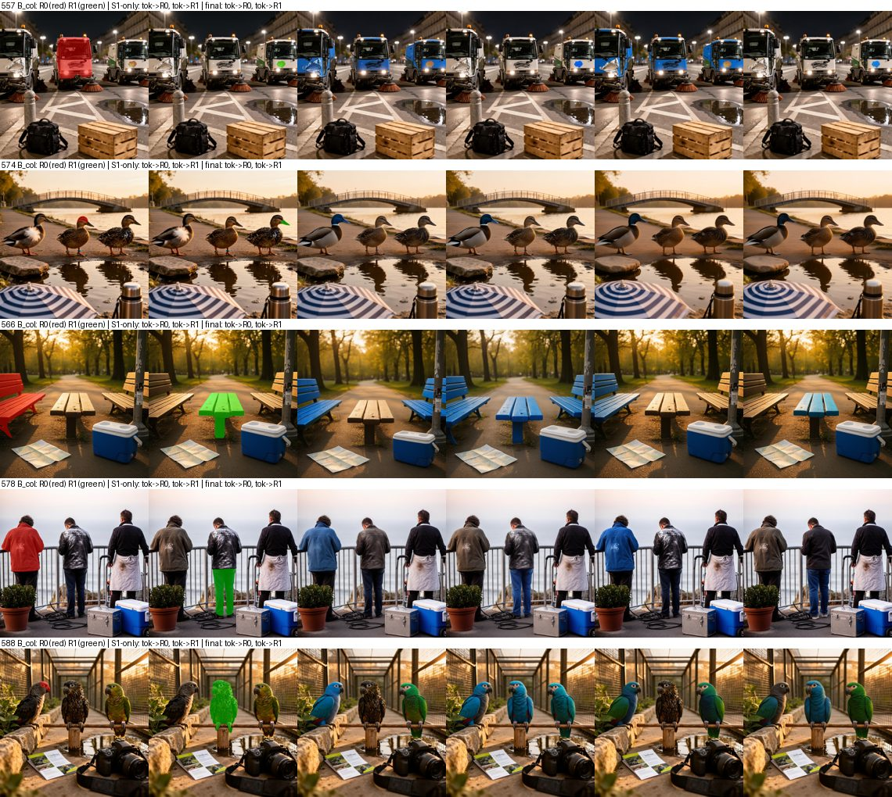

### 3.6 Attention knockout：模型实际靠哪条通路定位？

在 final 模型上，对 remove 反事实集合在**所有层、所有 40 个去噪步**（包括第一步的完整前向）屏蔽 target query 对指定 key 的注意力：

| 屏蔽的 key | 跟随率 | 选择性 | token 区域变化 / 另一区域变化 / 远处变化 |
|---|---|---|---|
| 不屏蔽 | 1.00 | +0.81 | 0.164 / 0.021 / 0.014 |
| 4 个 mask token | **1.00** | +0.77 | 0.158 / 0.025 / 0.015 |
| mask span 及之后的全部文本 token（对照） | 0.00 | 0.00 | 0.116 / 0.116 / 0.059 |

- **target 对 mask token 的直接注意力不是必要的**：在所有层、所有去噪步完全屏蔽后，18 个 case 仍然全部删对，选择性几乎不变。
- 第三行是构造上的对照：屏蔽 span 及之后的 token 后，R0/R1 两种 prompt 对 target 来说完全相同，输出也完全相同；此时模型仍会“删东西”，但两处同时变化、远处变化升到 0.059。
- 结合第 3.3 节（Stage-1 TE 把位置传播到 span 之后的 `.` 等 token，R² 0.65 → 0.92），可以确定：**定位信息的主要通路是 mask token → span 之后的模板 token（`.`、`<|im_end|>`、`assistant` 等）→ target 图像 token**。A loss 监督的是 target → mask token 这条通路，它既不是必要条件，也被训练压到了接近 0。
- raw SAMTok TE + 原 DiT 在同样的反事实集上：remove 跟随率 0.00（几乎不删，token 区域变化 0.037）、add 0.18。说明两阶段训练都在建立这条间接通路：Stage 1 让 TE 把位置写进后续 token，Stage 2 让 DiT 学会读取。

### 3.7 逐级消融（ladder）：漂移和能力分别来自哪一级？

120 个分层随机 case（add 40 / remove 40 / replace 25 / mixed 15），同一 seed、同一推理参数。表中名词的含义：

- **原 DiT**：没有加载任何 LoRA 的 Qwen-Image-2.1 DiT；**final DiT**：正式 Stage 2 的 DiT LoRA（step-12324）。
- **raw SAMTok TE**：直接用 Qwen3-VL-8B-SAMTok，不加载 Stage 1 LoRA；**Stage-1 TE**：加载正式 Stage 1 LoRA。
- **plain**：与 stock baseline 的 text-only 完全相同的输入——单张源图 + benchmark 原指令（`with_location_reference`），由 DiffSynth `PromptEmbedder` 套 Qwen-Image-2.1 官方编辑模板（system `Comprehend and analyze the provided prompt.`、`<image1>` 前缀、止于 assistant 行），不含 mask token、不跑 pass-1。这也是数据协议中 plain `edit` 行的格式。已核对：SAMTok tokenizer 对该模板的切分与 stock processor 完全一致（同样丢弃 14 个 system token、同一图像 processor），因此 stock 与 L1 之间唯一的差别是 TE 权重。
- **text + pass-1 token / mask**：方法自身的格式，分别是原评测的 ref 内联 span（`remove the leftmost fish <M>`）和 noref 模板（`Remove the object in this region <M>.`）。
- 没有测试“raw SAMTok TE + final DiT”：final DiT 是在 Stage-1 TE 的缓存条件上训练的，这个组合在训练时从未出现（官方推理的身份校验也会拒绝）。第 6 节 P0-2 建议的是“raw TE + 在 raw TE 缓存上重新训练的 Stage 2”，需要重训。

| 配置 | 区域外漂移率 | judge E / P / Q / strict |
|---|---:|---|
| stock Qwen-Image-2.1，plain text | 6% | 3.11 / 3.74 / 3.75 / 0.63 |
| L1：raw SAMTok TE + 原 DiT，plain | **6%** | 2.69 / 3.66 / 3.73 / 0.52 |
| L2：Stage-1 TE + 原 DiT，plain | **34%** | 2.46 / **2.92** / 3.36 / **0.27** |
| L3：Stage-1 TE + final DiT，plain | 36% | 2.82 / 2.79 / 3.31 / 0.35 |
| Stage-1-only，text + pass-1 token | 28% | 3.34 / 2.84 / 3.32 / 0.38 |
| final，text + pass-1 token（原评测） | 33% | 3.20 / 3.03 / 3.38 / 0.45 |
| Stage-1-only，mask（noref 原模板） | 20% | 3.23 / 2.82 / 3.23 / 0.44 |
| final，mask（noref 原模板，原评测） | 15% | 3.34 / 3.23 / 3.36 / 0.59 |

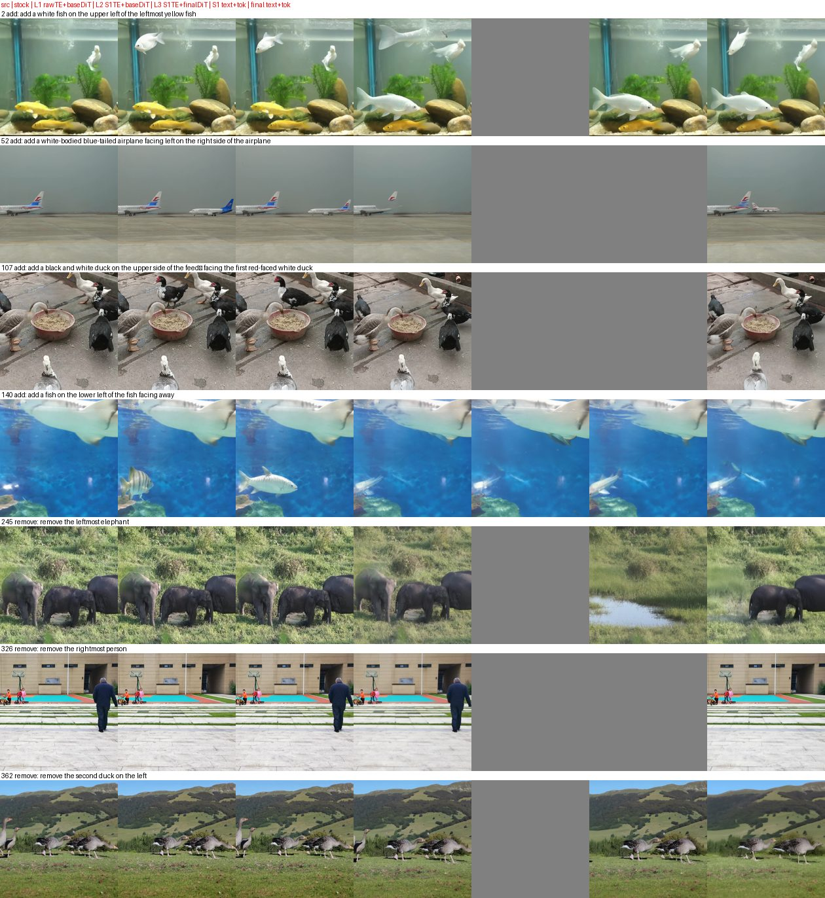

按类型（E / P / strict）：

| 配置 | add (40) | remove (40) | replace (25) | mixed (15) |
|---|---|---|---|---|
| stock，text | 3.60 / 3.90 / 0.80 | 2.00 / 3.88 / 0.42 | 3.80 / 3.60 / 0.72 | 3.60 / 3.20 / 0.60 |
| L1 raw TE + 原 DiT | 3.65 / 3.90 / 0.75 | **0.75** / 3.65 / 0.15 | 3.72 / 3.52 / 0.72 | 3.60 / 3.27 / 0.53 |
| L2 Stage-1 TE + 原 DiT | **2.62 / 3.27 / 0.38** | 1.48 / 3.00 / 0.17 | **3.28 / 2.44 / 0.28** | **3.27 / 2.53 / 0.20** |
| final，mask（原评测） | 3.52 / 3.75 / 0.70 | 3.73 / 3.62 / **0.78** | 2.92 / 2.52 / 0.36 | 2.53 / 2.00 / 0.20 |
| stock，two-image mask | 3.92 / 4.00 / 0.95 | 2.33 / 3.95 / 0.55 | 3.72 / 3.40 / 0.68 | 3.40 / 3.20 / 0.33 |

judge 复评检查：对 40 个 final 输出重新打分，单项完全一致率 75–90%，均值差异 E +0.05、P −0.03、strict −0.03。上表中 0.3 以上的差异远大于 judge 噪声。

结论：

- **换 TE 本身几乎无损**：raw SAMTok TE + 原 DiT 在 add/replace/mixed 上与 stock 持平（P 3.66 vs 3.74，Q 3.73 vs 3.75），唯一的缺口是 remove（stock 本身也弱）。
- **Stage 1 是 add/replace/mixed 退化和 P 下降的主要来源**：L1 → L2 的 strict 从 0.52 降到 0.27，P 从 3.66 降到 2.92，add 的 E 从 3.65 降到 2.62。add 的“幽灵化”在 L2 已出现。
- **Stage 2 是 remove 收益的来源**，并部分修复了 Stage 1 的损伤（S1-only mask 0.44 → final mask 0.59），但 add/replace/mixed 仍明显低于 stock。
- **评测 prompt 修正的作用很大**：MIRAGE 32 个 case 上，同一 final 模型、同一 token，只把编译器改为保留属性名词和部件名（`Change the color of the duck's eyes <M> to blue.`），E 2.59 → 3.56、P 1.97 → 2.44、Q 3.22 → 3.62、strict 0.16 → 0.31（stock two-image：3.59 / 3.16 / 3.88 / 0.47）。见下图：0583 原 prompt 把三个人的衬衫都改绿，修正后只改中间一人；0623 原 prompt 把整只狐狸染蓝并重画场景，修正后不再出现。

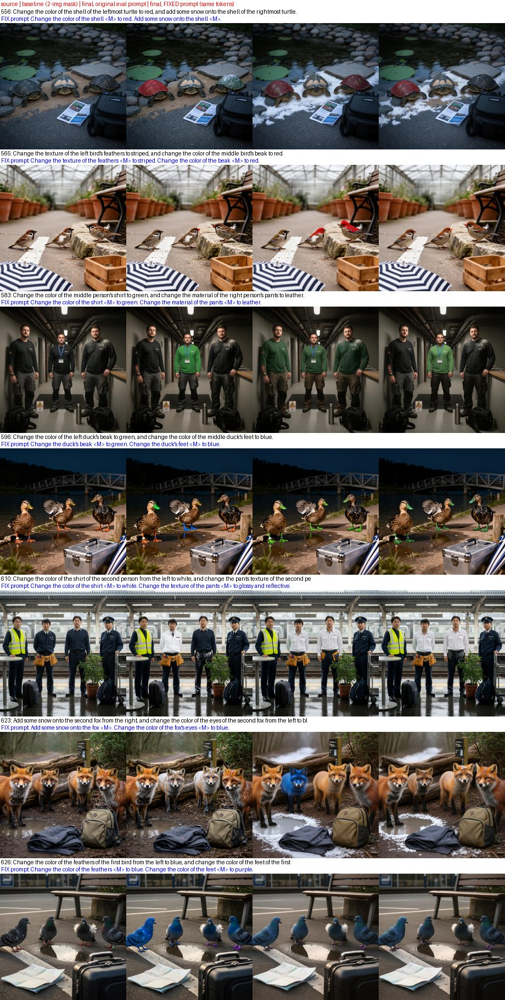

---

## 4. loss 设计是否起作用

### 4.1 attention 监督（A）

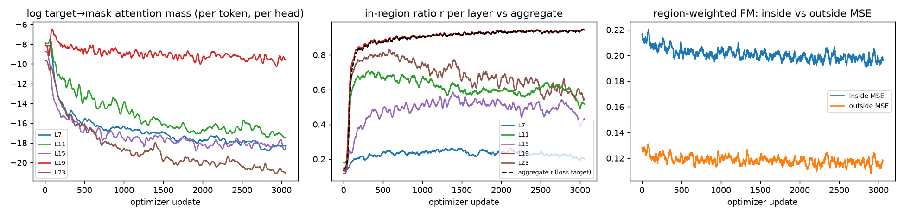

- **退化解在训练极早期就出现**：前 100 个 update（A 系数 ≤ 0.02），聚合比例从 0.25 升到 0.77，L7/L15/L23 的 mask 注意力质量下降 2–4 nats（约 10–80 倍）。最终 L7/L11/L15/L23 的对数质量为 −17 到 −21（约为均匀水平的 1e-4 到 1e-6；推理期实测中位数 1.6e-5、4.3e-5、2.3e-5、2.7e-6），聚合比例与 L19 曲线几乎重合。
- **原因**：`total = logsumexp(stats, dim=0)` 跨层（和跨头、跨位置）先求和再取比例，等价于按质量加权平均。把低比例层的质量压到 0 是最省力的下降方向；比例本身对质量尺度不敏感，loss 中也没有质量下界。
- **推理期验证**：Stage 2 后 6/9 个探针层的 mask 注意力 ≈ 0；原 DiT 早期层已有的 2–4× 区域富集被抹掉。
- **因果验证**：knockout 显示屏蔽这条通路基本不影响定位（第 3.6 节），A loss 监督的不是模型实际依赖的信息通路。
- 结论：当前 A 的主要效果是“让 target 不看 mask token”；remove 的几何绑定更可能来自 FM 本身（remove 样本在 RefEdit/Derived 中对齐良好，见第 5.2 节）以及 span 之后 token 的间接传递。没有 A=0 的同配置对照，这一点还需要第 6 节的消融确认。

### 4.2 区域加权 FM（C）

- 整个 Stage 2 中区域内/外 MSE 同比例下降（0.215 → 0.195、0.127 → 0.115），比值始终约 1.70，没有观察到“区域内被优先学习”。
- C 的形式是把区域内、外的平均误差各取一份再加回全图平均。对 ScaleEdit/CrispEdit 这类区域外整体重渲染的数据，区域外误差主要是不可学习的漂移；C 不仅不能抑制漂移，还把区域外误差同样当作需要拟合的目标。
- 对 add，C 只重新分配逐 token 误差，不包含“新增一个实例”的目标；6% 的 add 区域少于 16 个 latent token，被 `n_min=16` 截断。
- **C 的实际权重分配**：没有截断时分母恒为 1+2λ。区域面积为 a 时，区域内在总 loss 中的占比从 a 变为 (a+λ)/(1+2λ)。λ=0.5、a=8.5%（训练平均面积）时，区域内占比从 8.5% 升到约 29%，区域外仍占约 71%。在重渲染数据上，这 71% 主要在拟合漂移。
- **建议**：
  - Stage 1 中的 C 随 Stage 1 FM 一起去掉，或在 anchor 方案下重新评估。
  - Stage 2 不要指望 C 抑制漂移，它不具备这个作用。没有 C=0 的同配置对照，目前也不能说它有害。
  - 数据清洗 / target 重合成之后，区域外误差变成容易学的“复制原图”。这时提高编辑区域的梯度份额才有意义，对小区域 add 尤其如此。建议简化为“基础 FM + 膨胀区域（含边界带）额外加权”，不再对区域外单独归一化；add 用膨胀后的框作区域，并调低 `n_min`。
  - 是否保留，用同一份 cache、同一 seed 做 C=0 / C=0.5 对照决定，看区域内效果（E、反事实跟随率）和区域外漂移率。

### 4.3 Stage 1 的 FM（经冻结 DiT 训练 TE）

- **有作用**：没有 Stage 1 时原 DiT 完全不响应 mask token（raw TE 反事实跟随率 0.00），Stage 1 后达到 0.56；TE 也学会把位置传播到 span 之后的 token（第 3.3 节）；pass-1 token 让原 DiT 的 remove E 从 1.48 升到 3.62。
- **副作用大**：DiT `txt_in` 空间中，Stage-1 TE 与 raw TE 的条件余弦只有 0.786（stock 与 raw 为 0.965）；Stage-1 TE + 原 DiT 的 judge strict 从 0.52 降到 0.27（P 3.66 → 2.92，add E 3.65 → 2.62），漂移率 6% → 34%；add 的“幽灵化”在 Stage-1 TE + 原 DiT 上就已出现（ladder 图 0002、0140）。
- 原因：FM 的梯度来自区域外大量重渲染的目标图，TE 的 rank-64 全层 LoRA 容量很大，又没有 anchor/蒸馏约束，于是学到了“让 DiT 重画”的条件。8.1 版本曾有的 anchor loss 在后续方案中被去掉。

### 4.4 NTP

- pass-1 对 remove/replace 可用（IoU 0.66–0.72），对 add 失效（0.13），对“all but / except”等否定指代不可靠（0555）。add 的 NTP 目标码本身来自错位的 add mask 且 codec 无法表示放置区域，监督信号先天噪声大。

---

## 5. 数据层面的问题

### 5.1 source/target 区域外漂移

每个数据集随机抽 300 条 noref UMT，用训练 region cache 的 target 覆盖图作为区域，统计区域外像素变化：

| 数据集 | source/target 同尺寸 | 区域外变化 > 20% 的样本 | > 50% | 中位区域外变化比例 |
|---|---:|---:|---:|---:|
| RefEdit | 100% | 27%（attribute 60%、replace 46%；add/remove 0%） | 2% | 0.04 |
| CrispEdit | **55%** | **45%** | 14% | 0.17 |
| ScaleEdit | 79% | **70%** | **30%** | 0.38 |
| SAMTok Derived | 100% | **1%** | 0% | 0.00 |

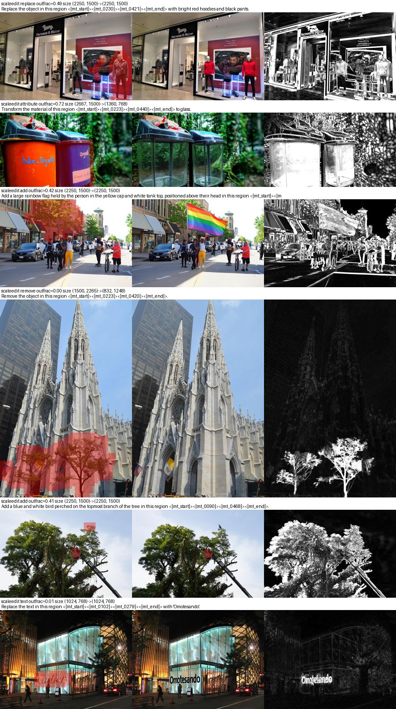
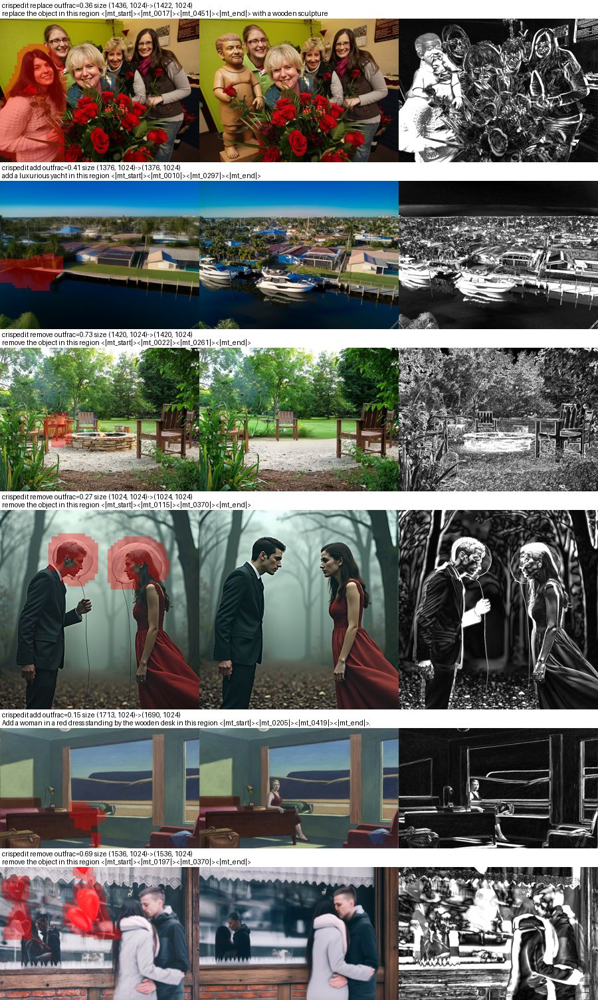

图中第三列是 source/target 差分：ScaleEdit 和 CrispEdit 的大部分样本差分遍布全图（重渲染、尺寸不一致导致错位）。region cache 构建时使用了 `alignment: certified-full-frame`，即假设所有样本全图对齐，这个假设对 CrispEdit/ScaleEdit 不成立。

### 5.2 add mask 与实际新增位置不符

用“区域内变化 / 区域外变化”的对比度衡量 mask 是否定位了改动（< 2 表示基本没有定位）：

| 数据集 | add | remove | replace | attribute | action | composite |
|---|---:|---:|---:|---:|---:|---:|
| RefEdit | 1% | 0% | 24% | 15% | — | — |
| CrispEdit | 32% | 28% | 30% | 24% | — | — |
| ScaleEdit | **64%** | 45% | 38% | 43% | **77%** | 67% |
| Derived | 10% | 0% | 0% | 0% | — | — |

可见的例子：CrispEdit `add a luxurious yacht in this region` 的 mask 在左下水面，target 中游艇出现在中间，且整个场景被重画；`Add a woman in a red dress standing by the wooden desk` 的 mask 落在书桌上，人物出现在窗边。这类样本直接教会模型“token 不决定 add 的位置”。Derived 的 add 很干净，但它是“给已有实例加局部细节”，与 CompBench 的“新增一个独立实例”不是一种任务。

### 5.3 与 benchmark 的分布差异

- MIRAGE 99/100 为双区域，训练中 composite 只有 1,042 行（约 1%）。
- MIRAGE 以部件级属性为主（眼、喙、鞋、挂绳），而训练 mask 多为整物体，codec 对小部件精度不足。
- CompBench add 是“同类多实例场景中新增一个实例”，训练 add 主要是“加局部细节”或错位的生成数据。

### 5.4 prompt 层面

- **评测编译器丢失属性名词**（违反数据协议 §“attribute 无ref写法保留 the color of / the material of”）：`change the material of the right truck to marble` → `Change this region <M> to marble`；`change the color of the beak to blue` → `Change this region <M> to blue`。这会把“改颜色”变成“把这个区域变成蓝色的东西”，与整物体着色、全局重渲染相关。第 3.7 节测试了修正后的 prompt。
- **指令风格 → 漂移的捷径**：final 在 text-only（CompBench 原句风格）下的漂移与 pass-1 区域面积、IoU 都不相关（相关系数 −0.05、−0.04），而同一批 remove case 改用模板 `Remove the object in this region <M>.` 时，区域外变化像素的平均比例从 21% 降到 3%（48% 的 case 在 text-only 下比 mask 模板多出 10 个百分点以上的区域外变化）。混合来源训练时，模型可能把某些数据源的指令风格与其“重渲染”的目标绑定在一起。
- 训练 noref 中残留 35 条 `Add ... leaning against in this region` 一类介词错误（doc 06 已记录）。

---

## 6. 改进方案

按“投入小、收益确定”到“需要新实验”的顺序排列。每项给出做法和验证方式。

### P0-1 数据：去漂移、修 add mask、提高干净数据比重

1. **对齐过滤**：沿用第 5.1 节的度量，对全部 98k 编辑对计算区域外变化比例与区域对比度；丢弃 `outside_frac > 0.1` 或 `contrast < 3` 的局部编辑样本（CrispEdit 先按尺寸一致性过滤）。全量计算在 CPU 上约 1 小时。
2. **重合成而非丢弃**：对“编辑本身成功、只是背景被重画”的样本，用 `target' = blend(source, target, feather(dilate(mask)))` 合成严格保持背景的新 target（Derived 的 MIRAGE 回写就是这个思路）。add/replace 的 mask 应取“新内容在 target 上的分割 ∪ 显著差分连通域”，避免使用锚点物体的 mask。
3. **add mask 复核**：用 diff 一致性检查新增物体是否在 mask 内；对比度不足的 add 样本不生成 UMT/NTP 行，只保留 plain 行。
4. **扩大 Derived 管线**：它天然对齐、实例级、多实例。优先扩充：同图不同实例的成对样本（对第 3.5 节反事实的直接监督）、部件级属性、双区域 composite、“新增独立实例”的 add。
5. 验证：用第 1.2 节的漂移率与第 3.5 节的反事实跟随率作为快速指标，不必每次都跑完整 judge。

### P0-2 pass-2 的 TE 与 Stage 1 解耦，或加 anchor

当前 Stage 1 是区域外漂移的主要来源（第 3.7 节），可选做法：

- **方案 A（推荐先做）**：pass-1 使用只经 NTP 训练的定位 adapter；pass-2 编码使用 raw SAMTok TE（不加 LoRA）或单独训练的条件 adapter。PEFT 支持在 generate 时启用定位 adapter、encode 时关闭。Stage 2 直接在 raw TE 的 cache 上训练 DiT LoRA。第 3.7 节显示 raw TE + 原 DiT 的保持能力与 stock 相同；mask 读取能力需要由 Stage 2 学到（raw TE 下位置信息同样线性可读，R² 0.89）。
  - **DiT 并非没见过 mask token**：Stage 2 的缓存改由 raw TE 编码带 GT mask token / 框的 edit_umt prompt，DiT LoRA 学的就是读 raw TE 的编码。与现流程的区别只在于：现在 Stage 1 先帮了一部分（Stage-1 TE + 原 DiT 的反事实跟随率 0.56），方案 A 要由 Stage 2 从 raw TE（跟随率 0）学起。
  - **起点并不差**：raw SAMTok VLM 训练时包含 5 个 mask understanding 数据集（DAM/GAR 区域描述），`embed_tokens`/`lm_head` 全参训练，本来就把 ⟨M⟩ 当图像区域读。推理期探针（24 例，第 14 步）显示，原 DiT 对 raw TE 编码的 mask token 注意力质量为均匀水平的 1.0–6.0×，区域富集 1.5–2.8×；对 Stage-1 TE 的则为 0.2–1.3× 和 1.6–4.4×。Stage 1 并没有创造“空间指针”，缺的是“按 token 执行编辑”，而这部分在现流程里主要也是 Stage 2 学到的（0.56 → 1.00）。
  - **两个表征空间不是问题**：pass-1 与 pass-2 之间传递的是离散码，码对应的区域由冻结 codec（码 + 源图）决定，与生成它的 TE 无关，pass-1 的 hidden state 从不进入 DiT。DiT 在训练（缓存）和推理时都只看到 raw TE 的编码，编码器一致即可。现流程本来就不是同一个表征空间：同一个码在定位模板和编辑模板中的上下文完全不同。需要保证的是：同一套词表和码本（Stage-1 LoRA 不动 `embed_tokens`/`lm_head`，514 个 mask token 的 embedding 在两遍相同）、同一个 codec，以及 Stage 2 与推理用同一个 pass-2 编码器。框是纯文本坐标，不存在这个问题。
  - **待验证与兜底**：只靠 Stage 2 能否学会读 raw TE 编码的 mask token，需要对照实验确认（同一份干净子集，两组 Stage 2 只差缓存用哪个 TE，比较反事实跟随率、plain 漂移率和 judge）。学不会时的兜底是 A'：只为 pass-2 训练一份 514 个 mask token 的专用输入 embedding（pass-1 仍用原 embedding），经冻结 DiT 用 FM 训练。这样不含 mask token 的 prompt 编码与 raw TE 完全相同，只有 span 及之后的 token 受影响。
- **方案 B**：保留 Stage 1 FM，但只在通过 P0-1 过滤的对齐数据上训练，并对非 mask 位置加 hidden-state anchor（`‖h_stage1 − h_raw‖²`，或 8.1 版本在 `txt_norm` 空间的 MSE），限制普通文本表征的漂移。
- 验证：ladder 中 L2（Stage-1 TE + 原 DiT）的漂移率应回到 10% 以内，同时反事实跟随率不下降。

### P0-3 修正评测协议

1. **noref 编译器**保留属性名词和部件名：`Change the color of the duck's eyes <M> to blue.`（部件名不泄露实例身份，实例由 token 决定）。修正后的结果见第 3.7 节 FIX 行。
2. **point/box → SAM2 的候选选择**：部件编辑选面积最小的一致候选，或用 instruction 中的部件名做选择；add 不应走 point/box → SAM2 → codec（见 P1-3）。
3. **baseline 协议**：增加一个“单图 + 在图上画轮廓/半透明 mask”的 baseline，以及“stock + 给定 mask 的推理期 latent 融合”的强基线，避免把 two-image 协议的 no-op 计为方法收益。
4. **至少 2–3 个 seed**，按 case 做配对 bootstrap；同时评测多个相邻 checkpoint 或 EMA 权重。

### P1-1 用结构性几何绑定替代 A loss

位置在 TE 输出中线性可读（R² ≈ 0.9），DiT 当前只能经由 span 之后的模板 token 间接学会使用它（第 3.6 节），而且学得好不好取决于数据是否干净（remove 好、add/部件差）。与其用一个容易被投机满足、又监督错通路的比例 loss，不如把**解码后的区域**显式交给 DiT：

- **clause 级区域注意力偏置（训练 + 推理一致）**：codec 解码每个 span 得到区域 `m_k`（latent 网格）。对 target query `q` 和第 k 个编辑单元的全部 token（mask span 及该 clause 的属性/内容词，如 `to blue`、`a red scarf`），在 logits 上加 `β·log(ε + m_k(q))`。这同时给出“where”和“属性归属”：区域 1 外的 target token 看不到 `to white`，就不会把白色涂到区域 2（F6），也不会把颜色扩散到同类实例（F5）。注意 span 之后的共享模板 token（`.`、`<|im_end|>` 等）会携带所有 clause 的信息，因此偏置应作用在 clause token 上，并在训练中同样启用，让 DiT 学会依赖这条结构化通路，而不是只在推理时加。
- **region-RoPE**：把 mask token 的 (h, w) RoPE 索引设为区域中心，或把 span 复制成若干个分布在区域内、带图像网格 RoPE 的“区域 token”。不改输入通道，只改位置编码，给 DiT 一个几何锚点。
- **区域嵌入**：给 source/target latent 中落在区域 k 内的 token 加一个与第 k 个 span 共享的可学习向量（GLIGEN 的轻量版），让“token k ↔ 区域 k”的匹配变成点积可直接学到的关系。改动最大，但最稳定。
- 如果保留 attention loss：按层、按头计算比例（不跨层 logsumexp），并加质量下界（`relu(log m_floor − log mass)`，`m_floor` 取原 DiT 同层统计）；或改为把 target 位置上的注意力分布与区域分布做 KL。但 knockout 表明它监督的不是模型依赖的通路，优先级应低于以上结构性方案。

**消融计划（每臂只改一个因素）**

推荐顺序与理由：

1. **区域注意力偏置**：不加参数，训推可以完全一致，同时处理“where”和“属性归属”（F5/F6）。训练侧可复用缓存中的 `region_supervision`（span 位置 + coverage）和 `AttentionSupervision.bind_layout`。
2. **区域嵌入**：预期效果最强，但要加参数并改 target 输入，与“不改结构”的定位冲突最大。
3. **region-RoPE**：最轻，但 RoPE 的距离衰减很弱，中心点也表达不了细长、非凸区域，预期最弱。
4. **修正版 attention loss**：只作参照，可选。

| 轮次 | 臂 | 具体改动 | 新参数 | 目的 |
|---|---|---|---|---|
| 0 | 推理期偏置，不训练（现 final 模型） | 对 target query × 指定 key 加 `β·log(ε + (1−ε)·m_k(q))`；扫 β ∈ {1, 2}、ε ∈ {0.05, 0}、作用 key ∈ {仅 span, span + 本 clause 的 token} | 无 | 验证实现、挑默认超参、看多区域串扰能否在不训练时下降 |
| 1 | B0 基线 × 2 seed | 干净子集 + raw TE 缓存（方案 A）+ A=0；区域加权按第 4.2 节定一个值并固定 | — | 测 seed 噪声；顺带完成方案 A 对照（再加一臂 Stage-1 TE 缓存） |
| 2 | B0 + 区域偏置（训练 + 推理） | 第 0 轮选出的设置；可再分 span-only / clause 两臂 | 无 | 主候选 |
| 3a | B0 + 区域嵌入 | DiT `img_in` 之后，给 target token 加 `m_k(q)·W·h(mt_end_k)`，W 零初始化 | 一个线性层 | 强替代方案 |
| 3b | B0 + region-RoPE | 把 span token 的 h/w RoPE 索引设为区域中心（`QwenImage21Rope.forward`） | 无 | 最轻量的替代方案 |
| 4 | 最优（或组合）+ latent 融合 + add 框数据 | 全量 656 × 4，2–3 个 seed | — | 最终结论 |

**固定不变的部分**：同一份干净数据子集（Derived + 对齐过滤后的 RefEdit/CrispEdit，包含同图多实例样本），同一个 TE 缓存，A=0，同样的步数、batch、LR、seed。add 若已改为框，区域图用膨胀框；否则 add 单独报告，不参与选型。

**评测与选型**：

- 每臂都跑：
  - 反事实跟随率与选择性（remove / add / 部件颜色三组，建议从 held-out 数据扩到每组约 100 例）；
  - 多区域属性串扰（MIRAGE 双区域，统计非目标实例上的变化）；
  - plain prompt 漂移率；
  - 120 例子集 judge（mask 与 text 两个 setting，分别报告是否加 latent 融合）。
- 选型规则：add/颜色跟随率和串扰的改善要超出 B0 两个 seed 之间的差异，且 remove、plain 编辑、漂移率不退化；效果相当时选改动最小的。
- 调参和选型（第 0 轮的 β/ε，第 2–3 轮的方法选择）需要和最终报告用不同的 case：建议按 source 把 656 个 case 固定划分为约 30% dev / 70% test，只在 dev 上调参和选型，最终数字只在 test 上报告。judge 代码里现有的 `DEV`/`HOLDOUT` 各只有 12 个 case，是 judge 校准用的，不能当作这个划分。

**实现要点**：

- **偏置**：
  - 训练和第一步完整前向用 FlexAttention 的 `score_mod`（按 q 是否属于 target、kv 属于哪个 clause 查表加偏置）；KV cache decode 路径给 SDPA 传加性 float mask。
  - clause 级偏置需要在建缓存时多存一个逐 token 的 clause 编号；现在只存了 span 位置。
  - 推理时区域取自用户 mask/框，或 pass-1 码的 codec 解码。text-only 会放大 pass-1 的定位错误，需要单独评估。
- **区域嵌入**：从 `prompt_embeds` 的 mt_end 位置取向量，经零初始化线性层，乘以区域图后加到 target token 上；source token 是否也加，可作为子变体。
- **算力估计**：正式 Stage 2 开着 A 时约 6 秒/microstep（32 卡跑 3081 update 用了 20.4 小时）。每臂按 8 卡、batch 32、1000 update 估计约 4–7 小时（关掉 A 后应更快）。第 1–3 轮约 6 臂，单节点 1.5–2 天，4 节点并行约半天。

### P1-2 推理期区域保持（无需训练，已验证）

对 remove/replace/attribute，用用户区域做 latent 融合：每个去噪步之后，把 `feather(dilate(mask, 2 个 latent 格))` 之外的 latent 替换为按当前 σ 加噪的 source latent（`(1−σ)·x_src + σ·ε`，与初始噪声同一个 ε；Blended Latent Diffusion 在 flow matching 下的写法）。实现见 `/tmp/sa/exp8/blend.py`，约 20 行，不改模型和训练。

同一 final 模型、同一 120-case 子集、mask setting，同一 judge（E / P / Q / strict）：

| 配置 | 全部 | add (40) | remove (40) | replace (25) | mixed (15) |
|---|---|---|---|---|---|
| stock，two-image mask | 3.28 / 3.76 / 3.77 / 0.68 | 0.95 | 0.55 | 0.68 | 0.33 |
| final，原评测 prompt | 3.34 / 3.23 / 3.36 / 0.59 | 0.70 | 0.78 | 0.36 | 0.20 |
| final，修正 prompt（P0-3） | 3.60 / 3.36 / 3.47 / 0.63 | 0.70 | 0.80 | 0.40 | 0.40 |
| final，修正 prompt + latent 融合 | 3.25 / **3.91** / 3.51 / 0.63 | 0.47 | **0.82** | **0.72** | **0.40** |

（类型列为 strict）

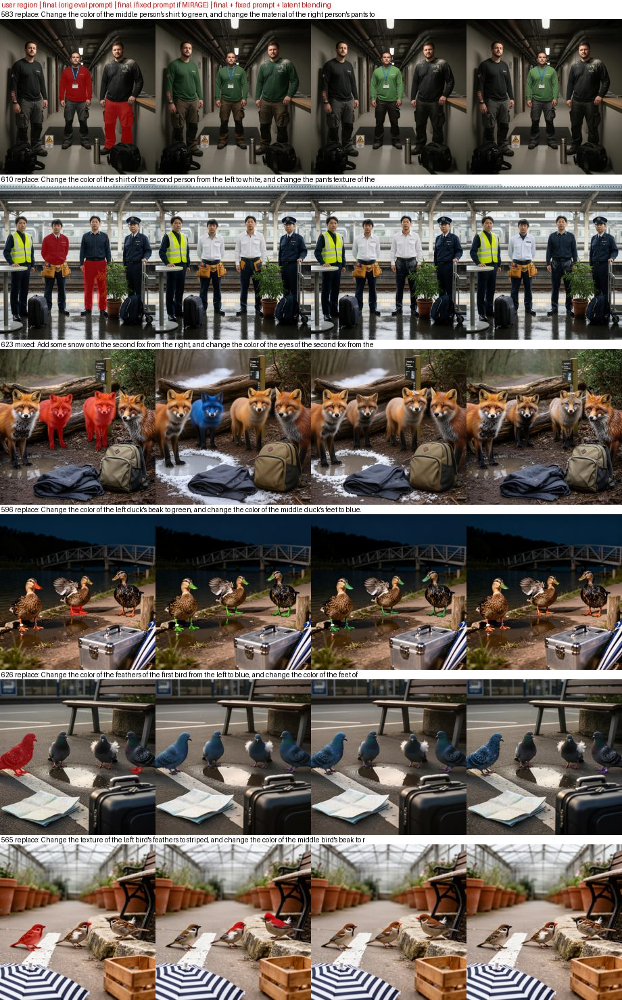

- remove/replace/mixed 在两个免训练修正后 strict 全部超过 stock：replace 0.36 → 0.72、mixed 0.20 → 0.40、remove 0.78 → 0.82；P 接近满分。图中 0610 第三个人的衬衫不再被改白，0626 只有第一只鸽子变蓝，0623 不再重画场景。
- 融合解决的是 P，不解决 E：鸭眼、鸟喙、裤子材质等细粒度属性仍然经常没有改出来。
- **add 不适合硬融合**：E 3.52 → 2.73。final 生成的新物体常有一部分落在用户区域外（第 2.2 节 F2/F3），融合后被裁掉。这也从侧面量化了 add 的“位置不跟随 token”。add 可以只在远离区域的地方融合（更大的膨胀半径），或只融合低频/前若干步。
- 按类型选择（add 不融合，其余融合）时，子集 strict 约为 0.71，高于 stock 的 0.68 和原评测的 0.59。这只适用于用户给出区域的交互 setting；text-only 需要用 pass-1 解码区域，可靠性取决于第 3.1 节的 IoU，未测试。

**训练时要不要也做融合？**

- **只在推理时融合，训推基本一致。** 融合注入区域外的是 `(1−σ_t)·x_src + σ_t·ε`，也就是“区域外 target 等于 source”的训练样本在 t 时刻加噪后的样子。这类对齐样本（Derived、RefEdit 的 add/remove）模型在训练中见过很多。区域内 token 在 target 块内双向注意力中看到的是精确的源图上下文，与 Blended Latent Diffusion / RePaint 对未改动模型的用法相同。
- **不一致只在三处：** 羽化边界带；本应溢出区域的效果（阴影、反射，或者新增物体超出区域）被切掉；当前模型是在重渲染数据上学的区域内生成。实测影响不大：非 add 类型的 Q 从 3.36 升到 3.51。失败的是 add，原因是模型把物体放到了区域外，这是放置问题，不是融合本身的问题。remove 的 E 从 3.80 小降到 3.65，可能是 2 个 latent 格（32px）的膨胀带外还留有阴影或边缘，可以试 3–4 格。
- **重训时让训练与融合完全一致：** 不需要在训练循环里融合，对应做法是**重合成 target**：`x_tgt' = m·x_tgt + (1−m)·x_src`，m 用与推理相同的膨胀和羽化。这可以直接在 Stage 2 缓存上做，缓存里已有 source/target latent 和区域覆盖图。之后训练输入的区域外与推理时注入的完全相同，融合只起兜底作用。Derived 数据本来就是这样构造的（MIRAGE latent 回写 + 像素融合），也正是最干净的一份。
- **只有“编辑确实落在 mask 内”的样本才能重合成。** 按第 5.1 节的抽样审计估算（同宽高比、区域外变化 < 5% 记为干净；区域内外对比度 ≥ 3 但区域外漂移记为可修复；其余丢弃）：

| 数据集 | 干净 | 可重合成修复 | 应丢弃 |
|---|---:|---:|---:|
| RefEdit | 51% | 25% | 24% |
| CrispEdit | 31% | 25% | 44% |
| ScaleEdit | 21% | 12% | 67% |
| Derived | 95% | 4% | 1% |

  按数据量加权约 4.8 万条干净 + 1.5 万条可修复，占 98.6k 的约 64%。应丢弃的样本 mask 没有定位到改动，重合成会把编辑删掉或放错位置。
- **不建议改成“只监督区域内、区域外不算 loss”。** 那样模型在区域外完全没有监督，每次推理都必须融合；text-only 的保持能力就完全取决于 pass-1 区域的质量（add 的 IoU 只有 0.13）。

### P1-3 add 不用 SAMTok 码表示放置区域

**先核实了 SAMTok TE 的 grounding 能力**（`/tmp/sa/exp10/`，held-out CompBench：237 个“remove X”中的指代短语、233 个 add 放置框；IoU 对非框输出记 0）：

| 模型 / 提示 | 指代短语 → bbox：框格式占比 / mIoU / Acc@0.5 | add 放置 → bbox：mIoU / Acc@0.5 |
|---|---|---|
| Qwen3-VL-8B-Instruct（原始），普通 grounding 提示 | 100% / 0.78 / 0.83 | 0.14 / 0.06 |
| Qwen3-VL-8B-SAMTok（raw），普通提示 | **0%（100% 输出 `mask_2d`）** | 0.03 / 0.01 |
| SAMTok raw，显式要求“只输出 bbox JSON” | 79% / 0.40 / 0.47 | 0.09 / 0.04 |
| SAMTok + Stage-1 LoRA，普通提示 | 0%（100% `mask_2d`） | 0.00 |
| SAMTok + Stage-1 LoRA，显式提示 | 52% / 0.24 / 0.24 | 0.08 / 0.02 |
| 你的 pass-1 mask → 外接框 | — / 0.79 / 0.85 | 0.22 / 0.10 |
| GT mask → SAMTok 码 → 外接框（码的上界） | — / 0.93 / 1.00 | **0.45 / 0.39** |

- SAMTok 的 VLM 训练把指代类任务全部换成了 mask 输出，训练集里没有 bbox grounding 数据：默认提示下它完全不再输出框，有时甚至在 `bbox_2d` 键里填 mask token（`{"bbox_2d": "<|mt_start|>…<|mt_end|>"}`）；强制要求时，在两者都输出框的 187 个 case 上 Acc@0.5 为 0.59（原始 Instruct 0.87）。**框格式和框精度都退化了，定位知识本身仍在**（mask 路线外接框 Acc@0.5 0.85）。
- Qwen3-VL 的框坐标是 **0–1000 相对坐标**：在 2:1 的图上按相对坐标解释 mIoU 0.70，按像素坐标解释只有 0.11。
- 把框写进编辑序列（`<|box_start|>[x1, y1, x2, y2]<|box_end|>`，`<|box_start|>/<|box_end|>` 已在词表中，id 151648/151649），raw SAMTok TE 在 `<|box_end|>` 处的 hidden state 线性预测框中心 R² = 0.96 / 0.95（随机框，排除图像内容泄露；框前一个 token 对照 ≈ 0），比 mask 码（0.89 / 0.86）更好读。DiT 能否用好它仍需训练验证。
- 纯文本 add 的放置本身高度不确定：原始 Instruct 零样本 Acc@0.5 只有 0.05，pass-1 为 0.10。

**建议的 add 数据形式**

1. **区域表示按类型区分**：add 用框 ⟨B⟩ = `<|box_start|>[x1, y1, x2, y2]<|box_end|>`（0–1000 相对坐标，与 Qwen3-VL 原生约定一致）；remove/replace/attribute/action/text 继续用 SAMTok ⟨M⟩（codec 往返 0.78–0.88）。composite 中 add 单元用 ⟨B⟩，其余单元用 ⟨M⟩。
2. **用什么框**：新增物体在 target 上的分割（SAM3 ∩ diff）的紧外接框，映射到 source 坐标；只用对齐样本。约定“物体大致填满框”，训练时做 ±5–10% 的平移/缩放抖动。这样框同时控制位置和大小，可以针对“新增物体过小”。多实例 add 每个实例一个框，与多 mask 写法一致。
3. **编辑序列示例**（edit_umt）：ref 版 `Add a green bottle near the cupcakes <|box_start|>[412, 230, 488, 410]<|box_end|>.`；noref 版 `Add a green bottle in this region <|box_start|>[412, 230, 488, 410]<|box_end|>.`。保留 ref/noref 两种，noref 迫使模型依赖框。
4. **框的结构性用法**：框可以精确栅格化，不需要 codec。训练时用（略膨胀的）框做区域加权或 clause 级 attention bias；推理时 latent 融合用膨胀后的框，而不是物体 mask，避免第 P1-2 节中把新增物体裁掉的问题。
5. **数据来源**：首选把对齐良好的 remove 对**反转**（source 与 target 互换，框 = 被删物体 mask 的外接框；Paint-by-Inpaint 的做法）：背景严格对齐、物体真实、框精确，而且多实例场景天然对应 CompBench 的“再加一个相似实例”。需要过滤补全质量差的 remove 样本。其次是对齐过滤后的 CrispEdit/ScaleEdit add。
6. **pass-1**：纯文本 add 建议先不做区域条件，直接走 plain prompt（stock 在纯文本 add 上 strict 0.73–0.80），把框用于交互式 add。若要 pass-1 输出框（例如给用户多个候选框），NTP 目标用 Qwen3-VL 原生格式 `[{"bbox_2d": [...], "label": "..."}]`，并混入 bbox 版指代数据（RefCOCO/GRES 由 mask 转框）恢复框输出能力；评估时看放置是否合理，而不是与某一个 GT 框的 IoU。
7. **推理时各 setting 的换算**：用户 mask → 外接框（mask 本身可作为可选的软先验）；用户框 → 直接使用；用户点 → 对 add 缺少尺寸信息，需要默认框大小或由 pass-1 以该点为条件给出框。

- 不建议的备选：在 target 上分割新增物体、用目标图上的 SAMTok 码训练。推理时码要在 source 图上解码，仍不可靠。
- add 训练数据改为“新增独立实例”为主（P0-1-4），并按区域面积加权采样（小区域 < 2% 的 add 是 benchmark 的主要失败区）。

### P2 训练稳定性与其他

- Stage 2 末期 LoRA 仍在大幅移动（81 个 update 变化 12.6%）：使用 EMA（如 0.999）或 cosine 退火到 0，并在 3–5 个相邻 checkpoint / EMA 上评测。
- 将 Stage 2 的 plain `edit` 行限定为对齐数据，避免普通编辑分支继续学习重渲染。
- 对否定指代（all but / except）补充 NTP 数据，或在 pass-1 输出后加一致性检查。
- add 的幽灵化在 Stage-1 TE + 原 DiT 上就出现，P0-2 之后再判断是否还需要 CFG 或 add 专项目标。

### 建议的实验顺序

1. （已完成验证，可直接并入正式评测）P0-3 修评测编译器 + P1-2 非 add 类型 latent 融合，在全量 656 case 上重评并多 seed。
2. （2–3 天）P0-1 数据过滤/重合成 + P0-2 方案 A，只训 Stage 2，用漂移率、反事实跟随率和 120-case judge 子集快速对比。
3. （1 周）P1-1 clause 级区域注意力偏置（训练 + 推理一致），重点看 mixed/MIRAGE 的属性归属和 add 的跟随率。
4. P1-3 add 坐标表示与数据重构。

---

## 7. 复现与产物

| 实验 | 脚本 | 结果 |
|---|---|---|
| 解码 IoU（656 × 4） | `/tmp/sa/exp1/decode_iou.py` | `/tmp/sa/exp1/decode_iou.jsonl` |
| 像素漂移（656 × 4 × 3） | `/tmp/sa/exp2/locality.py` | `/tmp/sa/exp2/locality.jsonl` |
| 训练数据对齐审计 | `/tmp/sa/exp3/train_drift.py`、`vis_pairs.py` | `/tmp/sa/exp3/train_drift.json` |
| 推理期注意力探针 | `/tmp/sa/exp4/attn_probe.py`、`summ.py` | `/tmp/sa/exp4/{none,step-2000,final}/` |
| 反事实 token 交换 | `/tmp/sa/exp5/gen_cf.py`、`analyze_cf.py` | `/tmp/sa/exp5/cf_*`、`cf_stats.json` |
| attention knockout | `/tmp/sa/exp5/knockout.py` | `/tmp/sa/exp5/ko_mask`、`ko_after` |
| ladder 消融 + judge | `/tmp/sa/exp6/`（`jobs_*.json`、`build_manifest.py`） | `/tmp/sa/exp6/judge_run/` |
| TE 线性探针 | `/tmp/sa/exp7/te_probe.py`、`analyze.py` | `/tmp/sa/exp7/te_{raw,stage1}.{npy,json}` |
| 三种 TE 的条件距离（原始空间 / DiT txt_in 空间） | `/tmp/sa/exp9/te_compare2.py` | `/tmp/sa/exp9/te_embeds.pt` |
| bbox grounding（Instruct / SAMTok / Stage-1）与框坐标探针 | `/tmp/sa/exp10/ground.py`、`ground_explicit.py`、`score.py`、`coord_check.py`、`box_probe.py` | `/tmp/sa/exp10/g_*.jsonl`、`gx_*.jsonl`、`pass1_boxes.jsonl` |
| 推理期 latent 融合 + judge | `/tmp/sa/exp8/blend.py`、`analyze_blend.py` | `/tmp/sa/exp8/blend/`、`/tmp/sa/exp8/judge_run/` |
| 修正后的 MIRAGE prompt | `/tmp/sa/exp6/fixed_prompts.json` | `/tmp/sa/exp6/s1_final/*_FIX_mask_final.png` |

所有生成使用 seed 0、40 步、CFG 1.0、KV cache 开、官方画布尺寸，与原评测一致。`/tmp` 在节点重启后会丢失，需要保留的结果请复制到挂载盘。

---

## 8. v2 分支实施计划

状态：2026-10-06 已确认，执行中。第 8.10 节的决策点全部按建议执行（推送也由我完成）。M0（代码、测试、数据转换、评测编译器）已完成，本地八卡 smoke 全部通过；下一步是四机运行 A（E1 + E2 + E3）；运行 A 已完成 Stage 1（E1），缓存阶段因 user 配额失败；Stage 2 改为即时计算（D10），下一步提交运行 A2。进度见第 8.11 节，实现见 [代码实现说明](01_SAMTokEdit_Qwen21_代码实现说明.md)，实验见 [实验记录](02_SAMTokEdit_Qwen21_实验记录.md)。

### 8.1 分支与范围

- 新分支 `qwen-image-2.1-v2` 基于 `qwen-image-2.1-dev` 的 a93fe56，本地 checkout 在 `/opt/tiger/tanyue/samtok_edit_qwen-image-2.1-v2`。`qwen-image-2.1-dev` 保持不变；v2 的代码与文档只提交到新分支。
- v2 实验产物（数据、正式训练、评测、日志）放在 `/mnt/bn/strategy-mllm-train/user/tanyue/experiments2/SAMTokEdit/qwen21_v2/`（2026-10-06 起）。此前在 `/mnt/bn/strategy-mllm-train/intern/users/tanyue/experiments/SAMTokEdit/qwen21_v2/`，intern 配额满后迁出：数据和评测已逐字节复制，本地 smoke 运行和日志留在原处。
- 本轮做五件事：
  1. add 改用框，并补上对应的训练数据，保证所有编辑类型训推一致；
  2. pass-2 的 TE 与 Stage 1 解耦（方案 A）；
  3. 去掉区域加权 loss 和 attention loss，按优先级消融结构性几何绑定；
  4. 推理加入 latent 融合；
  5. 评测协议与训练对齐。
- 本轮不做：mixed / composite 的训练数据和评测；训练数据清洗或新增来源。沿用 `train_full_9b_rules_003`，只做格式转换和剔除 composite。
- 原则：每个实验只改一个因素；新增功能全部关闭时，输出与旧实现逐位一致，用测试保证。

### 8.2 各编辑类型的训推一致性约定

| 类型 | 区域表示 | pass-1 输出（NTP 目标） | UMT ref | UMT noref | 区域图（绑定、融合） |
|---|---|---|---|---|---|
| add（新增独立物体） | 框 ⟨B⟩ | `{"bbox_2d": [...], "label": 新增内容短语}` | `Add a green bottle near the cupcakes ⟨B⟩` | `Add a green bottle in this region ⟨B⟩` | 框栅格化 |
| remove | ⟨M⟩ | `{"mask_2d": ⟨M⟩, "label": ...}`（不变） | 原指令 + ⟨M⟩ | `Remove the object in this region ⟨M⟩`（训练 noref 中占 98.8%） | ⟨M⟩ 的 codec 解码区域 |
| replace | ⟨M⟩ | 不变 | 不变 | `Replace the object in this region ⟨M⟩ with X`（95%） | 同上 |
| attribute | ⟨M⟩ | 不变 | 不变 | 保留属性名词：`Change the color of this region ⟨M⟩ to X`（37%）、`Turn this region ⟨M⟩ into X`（35%） | 同上 |
| action | ⟨M⟩ | 不变 | 不变 | `Have the object in this region ⟨M⟩ …`（48%） | 同上 |
| text | ⟨M⟩ | 不变 | 不变 | `Replace the text in this region ⟨M⟩ with 'X'`（93%） | 同上 |

- **⟨B⟩ 的写法**：`<|box_start|>[x1, y1, x2, y2]<|box_end|>`。坐标是 0–1000 的相对整数（Qwen3-VL 原生约定）；`<|box_start|>`/`<|box_end|>` 是词表中已有的 token，不新增 token。多实例时多个 ⟨B⟩ 直接相连。
- **pass-1 的定位请求句不变**（`Please identify and segment the region to be edited in this image.`）。模型根据指令自己决定输出 mask_2d 还是 bbox_2d。
- 现有数据中没有 background / global，本轮不涉及。
- **Derived 的 add 需要单独处理**：这 6,242 条约占 add 的三分之一，其中约 40% 是贴纸、标签类，内容是“给指定的已有实例加一个小细节”。它们的 mask 是宿主实例，不是放置区域，和“新物体大致填满框”的约定冲突。按数据协议自身的定义（给已有表面加饰面、图案 → attribute），建议在 v2 中把它们归入 attribute、保留 ⟨M⟩（宿主实例能被 codec 准确表示）。这只调整类型归属，不增删样本（决策点 D3）。

### 8.3 训练数据转换（沿用现有数据）

- **输入**：`train_full_9b_rules_003` 的 stage1/stage2、`provenance.jsonl`、`sources.jsonl`。每个 add 单元都有源图坐标下的实例 RLE，已核对 18,798 条全部可用。
- **输出**：新版本目录（如 `train_v2_box_001/`）和转换报告。

1. 剔除 composite：NTP/ref/noref 各 1,042 条，plain 1,206 条。
2. 转换 add：若 D3 采用推荐方案，涉及 RefEdit 2,904 + CrispEdit 3,525 + ScaleEdit 6,127 = 12,556 条。
   - 沿用现有数据准备代码的 unit / mask 分组，把每个 mask 的 ⟨M⟩ 替换成该 mask RLE 外接框的 ⟨B⟩，插入位置不变。
   - 框坐标向外取整，裁剪到 [0, 1000]，并保证 x1 < x2、y1 < y2。
   - NTP 的 `mt_cot` 改为 bbox_2d 项；plain 行不变。
3. 其他类型的行不变。
4. 校验与报告：各类型、各变体的行数；框面积分布；框与旧 ⟨M⟩ 解码区域的 IoU（仅作诊断）；格式校验全部通过。
5. 已知问题按你的决定保持不变，留到下一阶段：CrispEdit/ScaleEdit 的区域外漂移，以及部分 add mask 错位（ScaleEdit add 约 64%）。它们会影响 P 和 add 的绑定效果，解读结果时需要考虑。

### 8.4 代码改动

| 模块 | 改动 |
|---|---|
| `data/protocol.py` | ⟨B⟩ 的正则、渲染与校验；`parse_cot` / `grouped_units` / `render_units` / `condition_localization` 支持 bbox_2d；`validate_row` 要求 add 的 UMT 用 ⟨B⟩、其他类型用 ⟨M⟩，v2 拒绝 composite |
| `preparation/` | v2 转换器（第 8.3 节），复用现有 unit/mask 分组 |
| `models/pipeline.py` | 定位 adapter 只在 pass-1 `generate` 时启用，pass-2 编码时关闭（PEFT `enable_adapters`）；`localize` 解析 bbox_2d；`edit` 增加 latent 融合选项和推理期区域图（来自用户 mask/框或 token 解码） |
| `regions/` | 框 → latent 网格覆盖图；膨胀和羽化工具 |
| `training/engine.py`、`objectives.py` | Stage 1 改为纯 NTP，不加载 DiT/VAE；Stage 2 去掉 C 和 A；新增 `--binding {none, bias_span, bias_clause, region_embed, region_rope}` 及参数；缓存为所有区域行保存区域图（mask 类用 codec 解码覆盖，add 用框栅格）、span 位置和指令 token 范围 |
| `data/provenance.py` | conditioning identity 中 TE adapter 记为空（raw TE）；定位 adapter 单独记录，推理时分别校验 |
| `third_party/diffsynth` | attention processor 增加可选区域偏置（FlexAttention `score_mod`，以及 KV cache decode 路径的加性 mask）；DiT forward 增加可选区域嵌入和 span 的 RoPE 覆盖 |
| 评测 | 仓库内新增 v2 benchmark runner（类型映射、对齐编译、区域处理、融合开关），以及 judge manifest 与汇总脚本 |
| 测试 | ⟨B⟩ 的解析、渲染、校验；数据转换往返；pass-2 关闭 adapter 后与 raw TE 编码逐位一致；`--binding none` 且关闭融合时与旧实现逐位一致；区域图全为 1 时融合是 no-op |

### 8.5 训练与消融

| 编号 | 内容 | 配置 | 验收 |
|---|---|---|---|
| E1 | Stage 1：定位 adapter（纯 NTP） | 从 raw SAMTok 初始化；NTP 共 96.3k 行（含 add 的 bbox 目标）；LoRA 64/64/0.05、lr 4e-5、cosine；约 2 个 epoch | pass-1：非 add 的 mask IoU 不低于现在（remove 0.72、replace 0.66）；add 的 bbox 格式率 ≥ 95%；解析/绑定成功率 |
| E2 | Stage 2 缓存（raw TE） | 剔除 composite 后约 29.0 万行，附区域图和 token 位置 | 缓存校验；抽样可视化区域图 |
| E3 | B0：DiT LoRA，无 C、无 A、无绑定 | rank 32、lr 1e-4；ref:noref:plain = 1:2:1；类型权重同前（composite 为 0）；缩减日程 R（暂定 1,000 update、batch 128）；2 个 seed | 原生 prompt 漂移率接近 stock；反事实跟随率；dev judge |
| E4 | 第 0 轮：在 B0 上只做推理期偏置，不训练 | 扫 β ∈ {1, 2}、ε ∈ {0.05, 0}、作用 token ∈ {span, 整条指令} | 选默认超参 |
| E5 | B0 + 区域偏置（训练 + 推理） | E4 选出的设置，日程 R | 按第 8.7 节选型规则 |
| E6 | B0 + 区域嵌入 | 零初始化线性层，日程 R | 同上 |
| E7 | B0 + region-RoPE | 日程 R | 同上 |
| E8 | 最优方案（或组合）完整日程 + 推理融合 | 完整日程（约 3,081 update），2–3 个 seed | 在 test 集上得出最终结论 |

- 只有单单元时，作用于“整条指令”的偏置就是区域化 prompt：区域外的 target token 基本看不到这条编辑指令，只能看到模板 token。
- 可选（决策点 D6）：在 E1 中加入少量 bbox 版指代数据（由现有数据中非 add 单元的 mask 转框），恢复框坐标输出的精度。

### 8.6 推理：latent 融合

- 每个去噪步之后，把区域外的 latent 替换为 `(1−σ_t)·x_src + σ_t·ε`。
- 融合区域：
  - 交互 setting 用用户给的区域。mask 膨胀 2 个 latent 格，按 σ=1 羽化；add 的框先外扩 10% 再膨胀。
  - text-only 用 pass-1 的解码区域。
- 每个模型都分别报告融合开和关的结果。add 的融合效果单独看：v1 中它会裁掉放到区域外的物体，改用框之后可能改善。

### 8.7 评测协议 v2

- **case 范围**：单区域 case 共 517 个（CompBench add 233 / remove 237 / replace 22，HumanEdit 24，MIRAGE 1），不含任何双区域和 mixed case。
  - MIRAGE 的属性编辑都是双区域的，因此这样属性类覆盖很少。
  - 可选（决策点 D4）：把 MIRAGE 的 99 个双区域 case 拆成约 199 个单单元原子编辑，另一个区域作为保持检查，需要重跑 stock baseline。
- **类型映射**：每个 case 映射到训练的 edit_type，用与训练数据相同的规则加 LLM 判定，再人工抽检。类型决定区域表示和模板。
- **prompt 编译**：用训练数据所用的同一个 noref 转换器（9B 模型 + 规则回退）处理 benchmark 指令，再按第 8.2 节的约定插入 ⟨M⟩/⟨B⟩。text-only 走 pass-1 → 标签绑定 → ref prompt。也可以只用确定性模板（决策点 D2）。
- **区域输入**：

| setting | 非 add | add |
|---|---|---|
| mask | codec(用户 mask) | 用户 mask 的外接框 |
| box | SAM2(框) → codec（同 v1） | 直接使用用户框 |
| point | SAM2(点) 的最高分候选 → codec；部件类另报“最小候选” | 以点为中心、取训练 add 框中位尺寸的默认框（已知局限，决策点 D5） |
| text | pass-1 mask | pass-1 框 |

- **推理参数**：同 v1（约 1024² 画布、40 步、CFG 1、seed 0、KV cache），另加融合开关。
- **对照**：
  - stock 直接复用现有的 two-image 输出和分数（同一批任务、同一 judge）。
  - v1 final 在 v2 编译器下重评非 add 类型，作为“改前”参照。
- **judge**：同一个 pair_v2 judge 和后处理。按 source 固定划分 30% dev / 70% test：dev 用于调参和选型，test 只用于最终结论。最终比较跑 2–3 个 seed。
- **诊断指标**：反事实跟随率（remove / add / 颜色三组单单元 prompt）；原生 prompt 与区域 prompt 下的漂移率；pass-1 的定位指标。
- **选型规则**：add / 颜色跟随率和 P 的改善要超过 B0 两个 seed 之间的差异，同时 remove、普通编辑和漂移率不退化；效果相当时选改动最小的方案。

### 8.8 里程碑与算力估计

| 里程碑 | 内容 | 估计 |
|---|---|---|
| M0 | 代码、测试、数据转换、评测编译器（每类抽 50 条编译后的 prompt 人工检查） | 1–2 天，不需要训练 |
| M1 | E1 Stage 1 + pass-1 评测 | 数小时（纯 NTP，不过 DiT） |
| M2 | E2 缓存 + E3 B0 × 2 seed + dev 评测 | 缓存数小时（32 卡）；每臂约 4–7 小时（32 卡）。正式运行开着 A 时约 24 秒/update，关掉 A 后应更快 |
| M3 | E4–E7 | 每臂同上，4 节点并行约 1 天 |
| M4 | E8 完整日程 + test 评测 + 文档 | 训练约 15–20 小时（32 卡），评测约半天 |

每臂的 dev 评测约为：155 个 case × 4 setting × 融合开/关 ≈ 1,240 张图（8 卡约 1 小时），加 judge 约 25 分钟，再加约 130 张反事实图。

### 8.9 风险

- **DiT 学读 mask token 可能更慢**：只训 Stage 2 时，raw TE 下 span 之后 token 的位置可读性 R² 为 0.65，Stage-1 TE 为 0.92。兜底方案 A'：只为 pass-2 单独训一份 514 个 mask token 的输入 embedding。
- **现有数据的问题会延续**：
  - 漂移和 add mask 错位仍会影响 P（交互 setting 有融合兜底）和 add 的绑定（框来自错位的 mask）。
  - Derived add 的“小贴纸”偏置如果不按 D3 处理，会延续“新增物体偏小”。
- **纯文本 add 的放置本身有歧义**：见第 6 节 P1-3，原始 Instruct 零样本 Acc@0.5 只有 0.05。pass-1 给出的框以合理性评估为主。
- **point 输入对 add 缺少尺寸信息**：默认框只能给出粗略结果。
- **共享盘配额**：intern 和 user 的 NAS 配额都放不下 2.8 TB 的全量缓存（运行 A 两次失败都因配额），`df` 看不出余量。现在 Stage 2 即时计算条件、不建缓存（D10），每个运行只写几 GB；提交前仍先确认可写（四机指南第 1 节）。

### 8.10 需要你确认的决策点

| 编号 | 问题 | 我的建议 |
|---|---|---|
| D1 | 新分支推送到远程 | 由我负责提交和推送，commit 信息采用英文 `<type>: <subject>` 格式 |
| D2 | 评测 prompt 编译：复用训练用的 9B noref 转换器，还是只用确定性模板 | 复用转换器（与训练分布一致），确定性模板作为回退 |
| D3 | Derived add（宿主实例 + 小细节）的归类 | 归入 attribute、保留 ⟨M⟩ |
| D4 | MIRAGE：只用 1 个单区域 case，还是拆成约 199 个原子编辑 | 拆分（补上属性类覆盖），并重跑 stock |
| D5 | point 输入下 add 的默认框 | 以点为中心、取训练 add 框中位尺寸 |
| D6 | Stage 1 是否加入 bbox 版指代数据 | 加少量（约占 NTP 的 10%） |
| D7 | 缩减日程 R 与可用算力 | R = 1,000 update、batch 128（32 卡）；只有单节点时用 batch 32 |
| D8 | 推理时 mask 类绑定所用的区域：token 解码区域还是用户原始 mask | 绑定用 token 解码区域（与训练一致）；融合用用户原始区域 |
| D9 | text-only 的 add：用 pass-1 框，还是直接走原生 prompt | 两种都评，默认用 pass-1 框 |
| D10（2026-10-07 增补） | 全量缓存 2.8 TB 放不下（user、intern 配额都满）：扩容、清理别处，还是 Stage 2 不建缓存 | 已按你的选择执行：Stage 2 训练时即时计算条件，与读缓存训练逐位一致（实验记录第 9 节）；每个 update 约多 10% 计算，每卡显存约 39 GiB |
| D11（2026-10-07 增补） | 交互 setting（mask/box/point）给 DiT 的文本：沿用 noref 改写（`remove the object in this region ⟨M⟩`），还是原指令 + 区域 token（`remove the fish on the upper rightmost ⟨M⟩`，与 stock 的文字信息对等） | 与 stock 比较时用原指令 + 区域 token + 融合（dev 严格成功 mask 0.69 / stock 0.64，box 0.73 / 0.62，point 0.63 / 0.39）；noref 保留为区域 token 绑定能力的诊断（0.31，融合后 0.50）。见实验记录第 14 节 |

确认后从 M0 开始。每个里程碑结束时，把结果写入 `02_SAMTokEdit_Qwen21_实验记录.md`，并在本节更新状态。

### 8.11 进度

| 日期 | 里程碑 | 状态 |
|---|---|---|
| 2026-10-06 | 计划确认、建立 v2 分支 | 完成 |
| 2026-10-06 | M0：协议（⟨B⟩、rec_ntp）、v1 → v2 数据转换（`qwen21_v2/data/train_v2_box_001`）、Stage 1 纯 NTP、raw-TE 缓存（v3，含绑定 payload）、Stage 2 去 C/A 并加入四种绑定、推理 pass-2 解耦与 latent 融合、评测协议 v2（case/编译/推理/manifest/汇总）、四机编排按阶段运行 | 完成。45 项单元测试；GPU 等价性检查（pass-2 关闭 adapter = raw TE、零初始化 region_embed 与全 1 融合为 no-op、KV cache 下偏置一致、v1 adapter 经 v2 代码与 v1 代码逐位一致）；八卡 smoke：256² 下 B0 全流程与四个绑定臂、1M 像素下 B0 全流程与三个绑定臂（约 21 GiB/卡）；评测管线 smoke（715 case、转换器 709/715 接受、judge 30/30）。详见实验记录第 2–6 节 |
| 2026-10-06 | M0 余项：`eval/protocol_v2_001/review.md` 人工抽检 | 初查完成：remove/replace/attribute 正确；add 约 20% 的 noref 改写删掉了新物体的姿态/外观（CompBench 指令把姿态写在放置短语之后所致；训练数据抽查 30 条无此问题）。已增加 ref 变体（`--prompt-variant ref`）作对照。随后优化了转换器 prompt 的 add 规则（commit `874c9a1`，只影响 add），评测编译已用新 prompt 重跑：715/715 由转换器接受，67 个 add 改写修复（实验记录 6.3）；训练数据暂不重跑 |
| 2026-10-06 | M1：四机运行 A（E1 + E2 + E3 seed 1） | 首次提交在入口处失败：intern 的 NAS 配额已满（我们只占约 40 GB，配额按更大范围计算），创建 run 目录时报 `Disk quota exceeded`。入口已修复：报错并入 stdout，写共享盘前先做写探针（commit `9530dbb`，训练代码不变）。等配额恢复后用同一 run ID 重新提交（实验记录第 7 节）。随后实验根目录改到 `user/tanyue/experiments2/SAMTokEdit/qwen21_v2`，待重新提交 |
| 2026-10-07 | M1/M2：运行 A（重新提交） | Stage 1（E1）完成：1,300 update，2 小时 15 分钟，NTP loss 0.52 → 0.165。缓存写到 52%（1.44 TB）时 user 配额写满，运行失败；部分缓存已删除。Stage 2 改为即时计算（D10），本地验证与读缓存训练逐位一致。下一步：运行 A2 只跑 Stage 2 B0 seed 1（实验记录第 9 节） |
| 2026-10-07 | M1：E1 pass-1 评测 | 通过（实验记录第 10 节）：715 个 case 全部解析、格式正确；非 add 的 mask IoU 与 v1 持平（remove 0.712 / v1 0.716，replace 0.796 / 0.789，attribute 0.620 / 0.621）；add 输出框 100%，Acc@0.5 0.23（v1 0.11）。运行 A2（Stage 2 B0 seed 1）已在四机上训练 |
| 2026-10-07 | M2：运行 A2（E3 B0 seed 1） | 完成：1,000 update，Stage 2 约 4 小时 20 分钟，FM loss 0.129 → 0.107，审计通过（实验记录第 11 节）。B0 seed 2 待提交 |
| 2026-10-07 | M3：E4 推理期偏置扫描（dev 183，mask） | 完成（实验记录第 12 节）：bias_clause β=1、ε=0.05 最好，Δ严格成功 +0.12 [+0.04, +0.20]、ΔP +0.22，Q −0.15；ε=0 明显伤 Q；span 整体不显著。E5 取 bias_clause β=1、ε=0.05，待提交 |
| 2026-10-07 | M3：E6 region_embed、E7 region_rope | 训练完成，审计通过（实验记录第 11 节）。mask setting 下与 B0 相比：E6 ΔP +0.16 [+0.03, +0.30]，严格成功不变；E7 无整体差异。区域敏感性诊断（第 13 节）：文字含物体描述时 DiT 不看区域 token，noref 时作用也很小（B0 +3.6%，E6 加强 2.2 个百分点） |
| 2026-10-07 | M2：与 stock 对比 | 初步（mask，143 case，实验记录第 14 节）：E 与 stock 相当，P 低 1.27、严格成功低 0.28（clause bias 后低 0.15）；区域外像素漂移 Δ外 stock 4.6、B0 10.9，remove 常把同类主体全删。正式对比（全部 setting、融合开/关、同一次 judge）进行中 |
| 2026-10-07 | M2：与 stock 的正式对比（dev 183，同一次 judge） | 完成（实验记录第 14 节）：融合后 P 与 stock 持平；严格成功率 mask 0.50 / stock 0.64，box 0.56 / 0.62，point 0.46 / 0.39，text 0.58 / 0.63。mask setting 改用原指令 + 区域 token 后 0.60，再加融合 0.69（stock 0.64，+0.05 [−0.04, +0.14]）：remove 更好，add 与 Q 落后。交互 setting 的文本待定（D11） |
| 2026-10-07 | M2/M3：原指令补充评测 | box、point 改用原指令 + 融合：严格成功 0.73 / stock 0.62（+0.11 [+0.03, +0.20]），0.63 / 0.39（+0.23）。E6、E7 在 noref + 融合、原指令、原指令 + 融合下都没有超过 B0（E6 在融合用法下 −0.06）。实验记录第 12、14 节 |
| 2026-10-08 | M3：E5（bias_clause，训练 + 推理） | 训练完成，审计通过（作业 `3f56816e6445c1eb`）。dev（mask setting，与 B0 同一次 judge）严格成功：noref 不融合 0.61 / B0 0.28，noref + 融合 0.68 / 0.52，原指令 0.73 / 0.62，原指令 + 融合 0.75 / 0.68，四种都显著；原指令 + 融合比 stock 高 0.11 [+0.03, +0.20]。区域敏感性 +1.7 个百分点。按选型规则应作为新基线，待 B0 seed 2 确认 seed 方差（实验记录第 15 节） |
| 2026-10-08 | M3：E5 全部 setting（dev 183） | 凡带区域的组合 E5 都显著优于 B0（noref 不融合 +0.31 至 +0.33）。原指令 + 融合对 stock：mask +0.11、box +0.18（0.80）、point +0.31，都显著；text +0.03 持平。add 仍低 0.10–0.13，Q 低约 0.3（实验记录第 15 节） |
| 2026-10-08 | M3：E5 学习曲线（dev，mask） | noref 不融合：0.44 / 0.46 / 0.58 / 0.62（250/500/750/1,000 update），与 B0 的差从 +0.16 扩大到 +0.32，绑定能力随训练提高；原指令 + 融合：0.70 / 0.66 / 0.72 / 0.73，250 update 后基本持平。E8 建议用 E5 配方、完整日程并密集存 checkpoint（实验记录第 15、16 节） |
| 2026-10-08 | P0：训练数据诊断（文档 09） | 完成：逐对审计全部 98,574 个编辑对。主四类中 48% 可直接用，10% 贴回可修，35% 改动扩散，8% 空操作或改动过弱；错位的成因在上游数据。给出了过滤和扩充建议 |
| 2026-10-09 | P0：数据清洗小批量验证（文档 09 第 6 节） | 先验证旧规则，再验证改进版（区域外成块改动 + 未配准时的对齐检查）。新批 640 对上，保留数从 469 增加到 509，全量预计保留约 7.0 万对（76%），新增主要来自 RefEdit 的 attribute/replace；自动标准全部满足。随机抽查 24 对合格 20 对，旧规则同批 19 对合格 16 对，都没有达到 90%；剩下的问题主要是上游编辑本身没做对。建议全量前加 MLLM 编辑核验。全量执行待确认 |
| 2026-10-09 | P0：数据路径整理与全量清洗（文档 09 第 6.8 节） | 四个子集各自归到 `datasets/` 下一个文件夹，四个打标分支和 `preparation/sources.py` 的路径已同步。全量清洗 98,574 对，保留 70,956 对（72.0%），主四类 66,684 对；标在目标图上的 6,307 个实例随配准更正了坐标。输出 `datasets/SAMTokEdit_Cleaned_20261009/`，全量校验通过。失效的旧入口软链接和 3 个旧流程目录（约 213 GB）经确认无引用后已删除。未做 MLLM 编辑核验（估计单机约一个工作日，含半天校准）；训练清单尚未重建 |
| 2026-10-10 | P0：MLLM 编辑核验试点（文档 09 第 6.9 节） | 本机 8 卡，Qwen3.8-27B，303 对（人工标注 10 坏 / 93 好，加随机 200 对）。现成 judge：抓到 4/10、误判 8/93，全量约 8.7 小时；短判定第一版：7/10、18/93，误报主要因为把轮廓当残留；短判定第二版：2/10、1/93，标出的随机样本大多是真问题（含新发现的「改到了指令之外的同类物体」），全量约 2.5 小时。速度够，准确率还不够，下一步按类型提问并扩充坏样本标注 |

**实施中的具体取值与偏差。**

- D6：rec_ntp 以 edit_ntp : rec_ntp = 7 : 1 混入每个 update（占 Stage 1 样本的 12.5%，略高于计划的约 10%，以保证每个 rank 的配比整除）；回放池 13,760 行，取自 RefEdit/Derived 单实例非 add 单元（mask 是实例级，框更准确）。
- E1 原定"约 2 个 epoch"（860 update）；2026-10-06 确认改为 1,300 update（约 3 个 epoch，与 v1 Stage 1 的 NTP 采样量相当，使 "定位不低于 v1" 的验收不受训练量影响）。E3 的日程 R 保持 1,000 个 update（全局 batch 128），先看 B0 在 250/500/750/1,000 update 的学习曲线，再决定是否统一加长。学习曲线（2026-10-07，实验记录第 11 节）：原指令 + 融合下严格成功 0.56 / 0.60 / 0.66 / 0.68，750 之后增益不显著；noref 下始终约 0.3。建议暂不单独加长，先解决绑定。
- 类型采样（2026-10-06 确认，按你的要求让 add/remove/replace/attribute 占主导）：Stage 1 用 `natural`（每行约 3 次，四个主类型 95%），Stage 2 用 `main4`（四个主类型按 v1 的 14:14:14:20 分配约 95%，action/text 保持自然占比）；原 v1 权重下 action/text 占 24%。
- D5：point 输入的默认 add 框取训练 add 框的中位宽高 214 × 267（0–1000 单位）。
- 第 8.7 节"部件类另报最小候选"尚未实现：point/box setting 目前取 SAM2 最高分候选。
- stock：复用 `qwen21_656` 的 517 个单区域输出；拆分出的 198 个 MIRAGE case 用 `--stock` 重跑。复现检查显示同一 case 重跑与旧输出不逐位一致（像素平均差 0.27–0.42，kernel 级），需要完全同环境对比时可全部重跑。
- 绑定参数的默认值为 β=1.0、ε=0.05（region_embed 秩 64）；E4 在 B0 上扫描 β ∈ {1, 2}、ε ∈ {0.05, 0} 后再定 E5 的取值。E4 的结果是 bias_clause、β=1.0、ε=0.05（实验记录第 12 节），E5 用这组设置。E5 的结果见实验记录第 15 节：在四种用法下都显著优于 B0。
