# SAMTokEdit（Qwen-Image-2.1）v2 阶段分析（2026-10-08）

本文汇总 v2 到目前为止的全部 dev 结果，回答三个问题：
1. 方法是否有效，比原版 Qwen-Image-2.1 是否更好；
2. 哪些组件有效，哪里做得不好；
3. 下一步改什么。

结论不只看 judge 分数。我逐个看了 case（对照图和放大图），用像素统计校验了 judge，还做了三组诊断实验：
- 换文本编码器（TE）的影响；
- 原版 + 融合；
- 训练数据的对齐程度。

除特别说明，数字都来自 dev 的 183 个 case（实验记录第 11–15 节）。严格成功 = E=4 且 P≥3 且 Q≥3；方括号为配对 bootstrap 95% 区间。

我看过的全部 case 图都插在第 6 节，每张图都附了逐 case 的观察，并标明 judge 判得对不对。原始文件、逐 case 数据和脚本在 `$EVAL/analysis_v2_20261008/`，其中 `$EVAL` = `$V2/eval/protocol_v2_001`。

## 0. 结论

1. **对 benchmark 协议下的原版更好；对加了同样融合的原版，整体持平。**
   - 主用法：E5（训练和推理都加 clause bias）+ 原指令 + 区域 token + latent 融合。
   - 对 benchmark 的原版协议（两图定位，不融合），严格成功率 mask / box / point：E5 为 0.75 / 0.80 / 0.70，原版为 0.64 / 0.62 / 0.39。
   - 融合是推理期后处理，原版也能用。原版加同样的融合后，mask setting 升到 0.69：它的 attribute 失败全是改动扩散到其他实例，融合全部修好。
   - E5 对「原版 + 融合」整体只高 +0.06 [−0.02, +0.14]，不显著。
2. **真正的优势在 remove，短板在 add、attribute 和画质。**
   - 对「原版 + 融合」：remove +0.33 [+0.21, +0.46]；add −0.16、attribute −0.16、Q −0.27，都显著。
   - 原版的 remove 有一半根本没删（81 个里 40 个原样返回），融合也救不回来。
   - 我们的方法能按区域删掉指定实例，这是目前最明确的增益。
3. **短板的具体表现。**
   - add：新增物体偏小，有时放到框外，开融合时被抹掉。
   - attribute：部件级的改色没执行（帽子、海鸥脚的颜色不变）；改材质时换成了别的物体。
   - 画质 Q 低约 0.3：模糊、补丁感、形体畸形。
   - 不融合时仍会改动区域外：像素校验后，E5 原指令的严格成功率从 0.73 降到 0.56。
4. **根因主要在 Stage 2 训练数据。**
   - 约 61% 的 Stage 2 训练行（crispedit、scaleedit）源图和目标图不对齐：整图被重绘，或被重新裁剪、缩放。
   - 诊断实验显示，画质和保持度的损失来自 Stage 2 训练，不是换 TE：在同一批 add case 上，训练让 Q 降 0.48、P 降 0.39。
5. **judge 有系统性偏差。** 它会漏判区域外的过度改动、删除后的残影和填补区域的模糊，偶尔还会凭空判错。所以不融合的设置被明显高估。以后的结论需要像素校验和人工抽查。

## 1. 与原版 Qwen-Image-2.1 的对比

### 1.1 judge 的严格成功率

| setting | stock | E5 · noref 不融合 | E5 · 原指令 + 融合 | E5 原指令 + 融合 − stock |
|---|---:|---:|---:|---|
| mask | 0.64 | 0.61 | 0.75 | +0.11 [+0.03, +0.20] |
| box | 0.62 | 0.61 | 0.80 | +0.18 [+0.10, +0.27] |
| point | 0.39 | 0.62 | 0.70 | +0.31 [+0.20, +0.40] |
| text（只给原指令，E5 由 pass 1 定位，不融合） | 0.63 | — | 0.67 | +0.03 [−0.05, +0.12] |

### 1.2 像素校验

做法：在 judge 的严格成功之外，再要求「远离区域的部分基本没变」。具体口径：
- 在 512 px 下计算；
- 区域外扩长边的 4% 之后，剩下的部分叫远区域外；
- 远区域外中 |Δ|>25（0–255）的像素不超过 5%。

| 方法（mask setting） | judge 严格成功 | 加像素条件后 |
|---|---:|---:|
| stock | 0.64 | 0.62 |
| B0 · noref 不融合 | 0.28 | 0.18 |
| E5 · noref 不融合 | 0.61 | 0.50 |
| E5 · 原指令 不融合 | 0.73 | 0.56 |
| E5 · 原指令 + 融合 | 0.75 | 0.75 |
| E5 · box · 原指令 + 融合 | 0.80 | 0.80 |
| stock · text | 0.63 | 0.54 |
| E5 · text（不融合） | 0.67 | 0.51 |

- 融合后区域外就是原图经 VAE 重建的结果（Δ外约 1.3，stock 约 4.6），所以像素条件不会改变融合版本的分数。
- 不融合的设置被 judge 明显高估：E5 原指令有 49 个 case 区域外超过 5% 的像素被改动，judge 仍判其中 35 个 P≥3、31 个严格成功。stock 只有 5 个 case 出现这种改动。

### 1.3 分类型（mask setting，E5 原指令 + 融合 vs stock）

| 类型（n） | stock | E5 | 只有 stock 成功 | 只有 E5 成功 |
|---|---:|---:|---:|---:|
| add（61） | 0.89 | 0.75 | 12 | 4 |
| remove（81） | 0.44 | 0.72 | 9 | 31 |
| attribute（32） | 0.59 | 0.84 | 3 | 11 |
| replace（8） | 1.00 | 0.88 | 1 | 0 |

- **remove**：stock 的失败几乎都是「没删」，judge 给 E0，我看图确认属实（图 4、5）。E5 的成功大多是真删掉了，但有残影和填补模糊，见第 4 节。
- **attribute**：stock 的 13 个失败全是 P<3。看图是改动扩散到其他实例，例如两个人的鞋都变白、几只麻雀的眼睛都变色（图 10、图 3）。E5 只改目标实例。
- **add**：stock 明显更强，见 4.2 节。

### 1.4 公平性

- **文字信息**：stock 的两图定位协议用原指令加定位图。我们的「原指令」用法文字信息对等；noref 用法比 stock 少了物体名。
- **point / box**：我们用 SAM2 把点或框转成 mask，stock 只看到点或框的标注。point 上的大幅领先，有一部分来自这个预处理。
- **融合**：融合是推理期的后处理，原版也能用。用同一套融合跑了原版（`dev_diag/stock_blend`）：

| 方法（mask setting，同一份 stock 输出协议） | E | P | Q | 严格成功 | add | remove | attribute |
|---|---:|---:|---:|---:|---:|---:|---:|
| stock | 2.92 | 3.81 | 3.76 | 0.64 | 0.89 | 0.44 | 0.59 |
| stock + 融合 | 2.90 | 3.98 | 3.74 | 0.69 | 0.92 | 0.38 | 1.00 |
| E5 · noref + 融合 | 3.19 | 3.86 | 3.38 | 0.68 | 0.67 | 0.63 | 0.78 |
| E5 · 原指令 + 融合 | 3.36 | 3.90 | 3.46 | 0.75 | 0.75 | 0.72 | 0.84 |

- stock + 融合 − stock：严格成功 +0.05 [+0.01, +0.10]。其中 attribute +0.41（扩散到其他实例的改动被融合还原），remove −0.06。
- E5 原指令 + 融合 − stock + 融合：
  - 严格成功 +0.06 [−0.02, +0.14]，E +0.45，P −0.08，Q −0.27 [−0.37, −0.19]；
  - remove +0.33 [+0.21, +0.46]，add −0.16 [−0.26, −0.07]，attribute −0.16 [−0.28, −0.03]。
- E5 noref + 融合 − stock + 融合：−0.02（不显著），remove +0.25，add −0.25，attribute −0.22。
- 结论：两边都用融合时，E5 的整体优势不显著。增益集中在 remove，add、attribute 和画质落后。所以「比原版好」目前只在 remove，以及「不写物体名、只靠区域」这类场景成立。
- 说明：stock + 融合是诊断脚本 `scripts/stock_blend.py` 跑的（未改仓库代码）；融合区域与我们的方法相同（用户 mask；add 用 mask 的外接框扩 10%）。

## 2. judge 的可靠性

judge 是 Qwen3.8-27B pair_v2。我看图发现的偏差如下，对应的图见第 6 节：

| 偏差 | 例子（case） | 影响 |
|---|---|---|
| 漏判区域外的过度改动（P） | 不融合时把同类的其他实例也删掉，judge 仍给 P4：`_0388`（左边的猴子）、`_0319`（左边的斑马）、`_0373`（两只斑马都删了）、`_0288`（其他鸭子） | 不融合的设置被高估（1.2 节） |
| 漏判删除残影（E） | `_0373` 融合后被删斑马留下半透明的条纹和腿，judge 给 E4 | remove 的 E 偏高 |
| 漏判填补模糊（Q） | `_0388`、`_0319` 填补区域明显糊，judge 给 Q4 | Q 偏高 |
| 凭空判错 | `_0072` E5 确实加了大象，judge 却说「原图该区域已有大象」，给 E1 | 偶发，两个方向都有 |
| 对小物体宽松 | `_0345`、`_0155` 加了很小的鸟和鱼，judge 给 E4 | add 的 E 对物体大小不敏感 |

- 人工抽查：随机抽 8 个 E5（原指令 + 融合）的严格成功 case 放大看，8 个都属实，其中 2 个填补区域偏糊（图 12）。
- 结论：融合版本的 P 不依赖 judge，可以信；不融合版本的 P 必须加像素校验；remove 的 E 和 Q 需要人工抽查。

## 3. 组件：哪些有效

| 组件 | 证据 | 结论 |
|---|---|---|
| Stage 1 定位 LoRA（纯 NTP） | E1：解析和格式 100%，add Acc@0.5 0.23（v1 0.11），非 add mask IoU 与 v1 持平。text setting 下 E5 与 stock 持平（像素校验后 0.51 vs 0.54）。用标注区域比用 pass 1 区域高约 0.06（0.73 vs 0.67） | 有效；add 的定位仍弱 |
| Stage 2 DiT LoRA（B0） | 学会了按区域编辑，remove 能力远超原版（原指令 + 融合下 E 2.96 vs 1.86）。但区域外漂移，几乎不用区域 token（敏感性约 0），Q 下降 0.48（诊断实验） | 必要，但目前的训练数据带来副作用 |
| clause bias 绑定（E5） | 带区域的组合全部显著优于 B0：noref 不融合 +0.31–0.33，像素校验后 0.50 vs 0.18；区域敏感性 +1.7 个百分点；学习曲线到 1,000 update 仍在升。看图：「同类全删」大幅减少（图 13） | **有效**，目前最好 |
| 只在推理时加 clause bias（E4） | noref +0.13，但 Q −0.18；E5 比它再高 0.20，而且没有 Q 损失 | 部分有效，已被 E5 覆盖 |
| region_embed（E6）、region_rope（E7） | 各种用法下都没有超过 B0；E6 在融合用法下还略差 | 无效 |
| latent 融合 | P 逐像素保证（Δ外 1.3）；E5 原指令像素校验后 0.56 → 0.75。原版加同样的融合也提升 +0.05（attribute +0.41） | 在当前漂移水平下必不可少，但不是我们独有的增益；有副作用（4.3 节） |
| 原指令文本（vs noref） | B0 +0.29；E5 +0.12（不融合）/ +0.07（融合） | 有效；noref 保留作绑定诊断 |
| 换 TE（SAMTok TE 替代原 TE） | 诊断实验（add，纯指令，未训练的 DiT）：Q +0.05、P −0.10，都不显著；E −0.28 [−0.56, −0.05] | 画质几乎无损，add 的指令跟随略降 |
| 训练长度 | B0 原指令 + 融合在 750 update 后持平；E5 noref 到 1,000 update 仍在升 | 绑定还没饱和 |

## 4. 不足与根因

### 4.1 Stage 2 训练数据大量不对齐（主要根因）

按来源统计源图和目标图的差异：

| 来源 | 主四类行数 | 明显改动的像素比例（512 px，\|Δ\|>25） | 改动超过 15% 的行占比 | 看图 |
|---|---:|---:|---:|---|
| SAMTok Derived | 83,803（无 add） | 2.5–8.8% | 2–18% | 对齐 |
| refedit | 23,388 | 4.4–18% | 4–69% | 对齐（attribute、replace 的物体较大） |
| crispedit | 110,735 | 21–25% | 52–67% | 整图重绘（人物、树枝在非编辑区域都变了） |
| scaleedit | 57,719 | 27–34% | 65–82% | 重新裁剪或缩放（物体位置和大小都变了） |

- crispedit 和 scaleedit 合计约 16.8 万行，占主四类的 61%。见图 8、9。
- add 的框：refedit 的改动几乎全在框内（中位数 1.00）；crispedit 是 0.42；scaleedit 只有 0.08，90% 的行框内改动不到一半。
- 对应的现象：
  - 不融合时区域外漂移（Δ外约 9，stock 4.6）；
  - 模型几乎不读区域 token（目标图到处都在变，区域无法预测改动在哪）；
  - 画质下降：诊断实验中训练让 Q −0.48、P −0.39（add 子集，纯指令）；
  - 「重新构图」：不融合时剩下的物体被移位或放大（图 13 第 2 行、图 2 第 1 行）。

### 4.2 add

- **物体偏小**：两边都 E=4 的 42 个 case 里，E5 改动的框内面积比 stock 小的有 30 个，平均 0.19 vs 0.27 个框。judge 对物体大小不敏感，所以这个问题在分数上被低估了。
- **放到框外**：不融合时，物体常加在参照物旁边、框外面（`_0148`、`_0352`，图 6、7），开融合就被抹掉。4 个 add case 不融合时 E≥3、融合后 E≤1。
- **指令跟随**：换 TE 后 add 的 E 下降 0.28，训练没有补回来。
- **pass 1 的框弱**：add Acc@0.5 只有 0.23，text setting 下 add 0.59 vs stock 0.72。

### 4.3 remove

- **涂色代替删除**：老虎被涂成白色剪影、穿红衣服的人变成黑色剪影（图 11）。E5 原指令 + 融合的 16 个 remove 失败里有 6 个是这种。
- **融合带来的残影和色块**：被删物体的位置留下半透明残影（`_0373`，图 5）或颜色不一致的色块（`_0048`，图 10）。E5 的 remove 失败数：不融合 10 个，融合后 16 个。
- **阴影和倒影留在区域外**：删掉斑马后水中倒影还在（`_0373`）。融合按 mask 还原区域外，阴影和倒影必然保留，物理上不一致。
- **填补模糊**：多数成功的删除，填补区域比周围糊。

### 4.4 画质（Q）

E5 原指令 + 融合 Q 3.46，stock 3.76。按 judge 的扣分理由归类（Q≤3 时）：

| 扣分理由 | E5 原指令 + 融合 | stock |
|---|---:|---:|
| 补丁感 / 接缝 | 47 | 21 |
| 模糊 | 46 | 17 |
| 形体畸形 | 26 | 11 |
| 色调 / 光照不一致 | 23 | 18 |

不融合时分布类似，所以主要是模型生成的内容本身质量差，与诊断实验结论一致：训练后 Q 下降。

### 4.5 其他

- **部件级属性**：
  - 只给区域 token（noref）时，会把整只麻雀染色，而不只是改喙或眼睛。
  - 给了原指令并加融合后，小部件的改色仍常常没执行：`mirage_015#r1` 帽子、`mirage_087#r2` 海鸥的脚都没变色，原版都改对了。
  - 改材质时会换成别的物体：`mirage_036#r2` 救护车变成橙色面包车。
  - 所以对「原版 + 融合」，attribute 低 0.16。见图 14。
- **不融合时的过度改动**：E5 已大幅减少「同类全删」，但仍有更细的过度改动，例如重新构图、改动相邻实例。

## 5. 下一步

按优先级排列。每一项都写了判定标准，并要求同时报 judge 分数、像素校验和人工抽查。

### P0：清洗 Stage 2 训练数据，并用 E5 配方重训（E9）

1. **对齐打分**：全量计算每行的对齐分数，即区域外扩之后的明显改动比例。已有 add 框的脚本，非 add 需要用 codec 解码 mask。
2. **分三类处理**：
   - 对齐的行：保留。
   - 只是重新裁剪或缩放的行：做相似变换配准，再把区域外贴回源图。
   - 整图重绘的行：
     - 区域外扩之后贴回源图（与推理时的融合一致）；
     - 或者直接丢弃，或者降权。
3. **E9**：E5 配方、同一日程和 seed，只换数据。在 dev 上评四种用法并做像素校验。另跑一次本文的诊断实验（未训练 vs 训练后的 Q）。
4. **判定**：
   - 不融合时像素校验后的严格成功率明显提高（E5 为 0.56 / 0.50）；
   - Q 回到接近未训练的水平（3.69）；
   - 区域敏感性继续提高。

### P1：add

1. **数据**：剔除 add 中框内改动比例低的行。检查「小贴纸」类样本（Derived 的 add 在 D3 中已改归 attribute），提高大物体 add 的比例。
2. **训练**：
   - 对 add 在框内加大 FM loss 的权重；
   - 或者为 add 的 box token 单独设更强的 β。
3. **推理**：只在后段加融合（前 k 步不融合），或者把 add 的融合框放大，避免抹掉略微出框的物体。这需要配合 1 和 2，否则只是掩盖错位。
4. **pass 1 的 add 框**：补充放置准确的定位数据。

### P1b：attribute（部件级）

1. 先在数据清洗后的 E9 上复查。错位样本会削弱「区域内必须改到位」的信号。
2. 统计训练集中 attribute 区域面积的分布，看小部件改色的样本够不够。不够就补充对齐的小区域属性样本（Derived 的属性数据是对齐的）。
3. 小区域在 FM loss 中的权重天然很低（区域面积中位数 2.9%），试按区域面积归一化区域内的 loss 权重。

### P2：remove

1. **审数据**：查 remove 的目标图里有没有「被涂色而不是删除」的样本，有就剔除。
2. **阴影和倒影**：训练 mask 和推理时的融合区域都应包含物体的阴影和倒影，例如按方向扩张，或者另外分割出阴影。
3. **融合残影**：评测融合在最后 k 步停止（k=0/3/5），以及减小羽化，看残影和色块能否减少。

### P3：画质

数据清洗之后再测一次诊断实验。如果训练后的 Q 仍明显低于未训练，可以考虑：
- 混入恒等或重建类样本，保住原模型的画质；
- 降低学习率或 LoRA 的秩；
- 训练时用 EMA。

### P4：评测协议

1. 不融合的设置一律报像素校验后的严格成功率；主表以融合版本为准。
2. 每个方法人工抽查 30 个 remove 和 add case，记录残影、填补模糊、物体偏小和过度改动。
3. 把原版 + 融合作为常设基线，补齐 box / point / text；另补原版 + SAM2 mask 定位图（对应 point / box）。

### P5：之后

- E8（完整日程）在 E9 之后决定：用 E5 配方加清洗后的数据，每 250 update 存 checkpoint。
- seed 方差：用 B0 seed 2 或 E5 seed 2 估计。

## 6. 抽查记录：全部看过的 case

我在分析中看过的图都在下面，共 15 张，涉及 34 个 dev case 和 10 个训练样本。

- **怎么挑的**：大多按问题挑选（例如「只有 stock 成功」），目的是找失败模式，所以不代表整体比例；整体比例见第 1–4 节的统计。只有图 12 是从成功 case 里随机抽的。
- **图上标签**：每张图上方是 judge 的 E/P/Q，「OK」表示严格成功。
- **列名**：
  - 「原指令」= 原指令加区域 token；
  - 「noref」= noref 文本加区域 token；
  - 「+ 融合」= latent 融合；没写融合的都不融合。
- **粉色描边或高亮**是我画上去的区域标注，不是图里的内容。

在这 34 个 case 的各列输出里，我发现 judge 判错 17 处：
- 漏判区域外的过度改动 8 处（7 处判成 P4，1 处判成 P3）；
- 漏判删除残影 2 处；
- 漏判填补模糊 2 处；
- 把有效的 add 判成失败 2 处（同一个 case 的两列）；
- 对太小的物体或几乎没改的结果给 E4，共 3 处。

### 6.1 做对比页时核对的 case（图 1–3）

**图 1**　`cb_train-00002-of-00007_0204`「remove the rabbit on the uppermost」

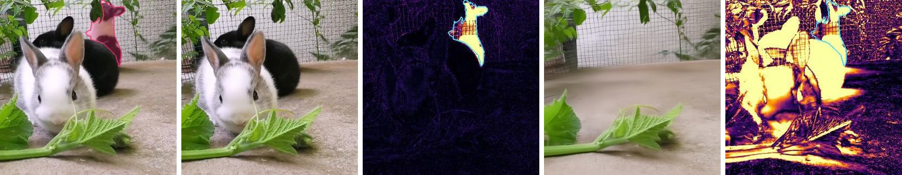

列：原图（粉色高亮为区域）、stock、stock 的差异热图、B0（noref）、B0 的差异热图（|输出 − 原图|，黑 → 黄）。
- stock 只删了区域里那只兔子，差异集中在区域内。
- B0 把三只兔子全删了，差异热图整片发亮。
- 当时我把高亮误当成区域里有个粉色物体，图 15 已放大确认：区域里是一只黑白兔子。

**图 2**　对比页 v1 的 4 个 case

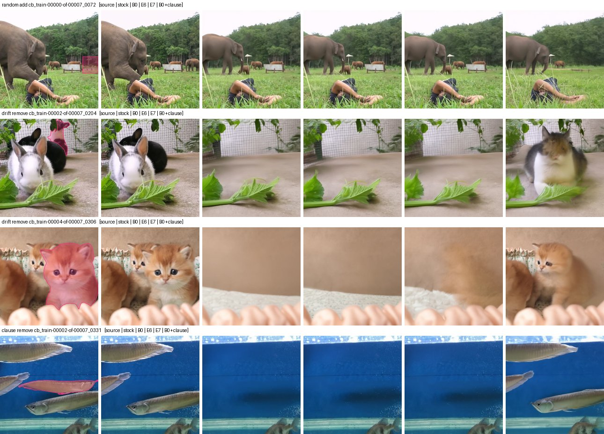

列：原图、stock、B0、E6、E7、B0 + 推理期 clause bias（都是 noref）。

| 行 | case | 指令 | 我看到的 |
|---|---|---|---|
| 1 | `cb_train-00000-of-00007_0072`（add） | add a large elephant facing left on the rightmost distant area | stock 在远处的框内加了大象（缩略图上很小，放大见图 7）。B0、E6、E7、clause bias 没在框里加，而是把前景的大象重画成更小、更远的一头，整幅画面重新构图 |
| 2 | `cb_train-00002-of-00007_0204`（remove） | remove the rabbit on the uppermost | stock 只删目标；B0、E6、E7 三只兔子全删；clause bias 把兔子画成一只怪异的「猫」，属于拼接伪影 |
| 3 | `cb_train-00004-of-00007_0306`（remove） | remove the rightmost cat | stock 没删；B0、E6 把所有小猫都删了，只剩背景；E7 只剩一团模糊的橙色残影；clause bias 留下一只小猫，但其他小猫也被改了 |
| 4 | `cb_train-00002-of-00007_0331`（remove） | remove the fish on the upper rightmost | stock 只删目标；B0、E6、E7 把所有鱼都删了；clause bias 只删目标 |

**图 3**　对比页 v2 的同一批 case（加了融合和原指令两组）

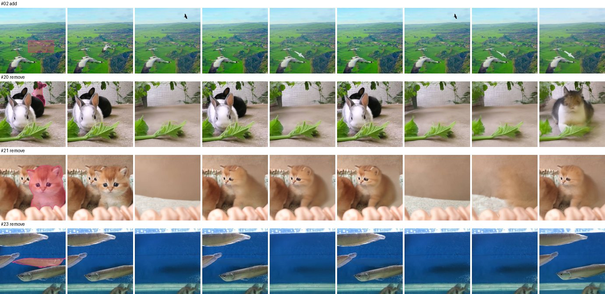

列：原图、stock、B0、B0 + 融合、B0 原指令、B0 原指令 + 融合、E6、E7、B0 + clause bias。

| 行 | case | 我看到的 |
|---|---|---|
| 1 | `cb_train-00000-of-00007_0352`（add，指令见图 6 第 5 行） | stock 在框内加了鸟。B0、E6 加的是一只黑鸟，但在天空、框外。B0 原指令、E7、clause bias 在框附近加了白鸟。B0 + 融合、B0 原指令 + 融合都没加出来：放到框外的鸟被融合抹掉了 |
| 2 | `_0204` | B0、B0 原指令、E6、E7 都删光了；两个融合版本只删目标；clause bias 是拼接出的怪异动物 |
| 3 | `_0306` | B0、E6 删光所有小猫，E7 只剩模糊残影；融合版本还原了其他小猫。目标处是否删干净，缩略图上看不清（judge：B0 原指令 + 融合 E3、Q2） |
| 4 | `_0331` | B0、B0 原指令、E6、E7 删光所有鱼；两个融合版本和 clause bias 只删目标 |

### 6.2 remove：只有 E5 成功（图 4、5）

**图 4**　从「stock 失败、E5 原指令 + 融合成功」的 31 个 remove case 中随机抽 5 个

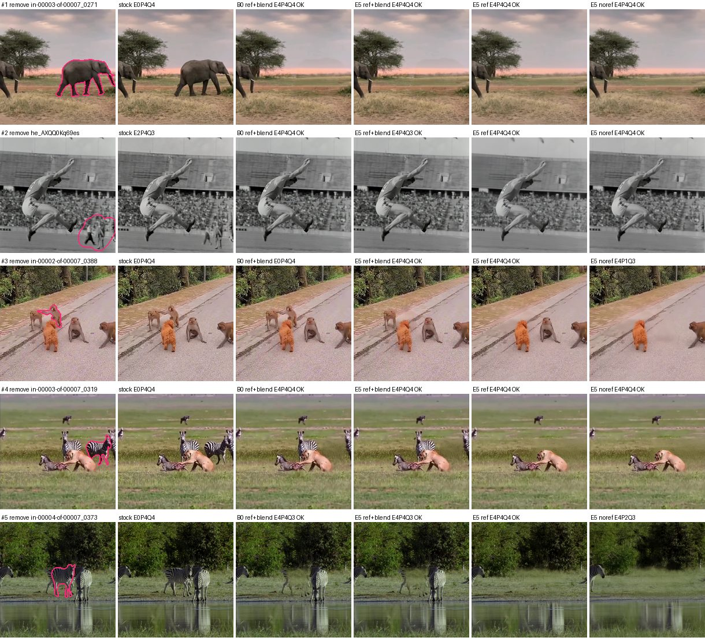

列：原图（粉框为区域）、stock、B0 原指令 + 融合、E5 原指令 + 融合、E5 原指令、E5 noref。

| 行 | case | 指令 | 我看到的 | judge 判得对吗 |
|---|---|---|---|---|
| 1 | `cb_train-00003-of-00007_0271` | remove the rightmost elephant | stock 原样没删；我们各用法都删干净了 | 对 |
| 2 | `he_AXQQ0Kq69es` | Remove all people on the field except the jumping athlete in the picture | stock 只删了一个人；E5 两个都删了 | 对 |
| 3 | `cb_train-00002-of-00007_0388` | remove the second monkey on the left | stock、B0 原指令 + 融合都没删。E5 原指令 + 融合删了，但填补处是一块模糊的平涂。E5 原指令连左边的猴子也删了。E5 noref 也删多了 | E5 原指令 + 融合 Q4 偏宽；E5 原指令 P4 漏判；E5 noref P1 对 |
| 4 | `cb_train-00003-of-00007_0319` | remove the second zebra from the rightmost | stock 没删。融合版本删了，填补的草地略糊。E5 原指令、noref 把左边的斑马也删了 | E5 原指令 + 融合 Q4 偏宽；E5 原指令、noref 的 P4 都漏判 |
| 5 | `cb_train-00004-of-00007_0373` | remove the second zebra in front on the right | stock 没删。两个融合版本在原位留下半透明的条纹和腿。E5 原指令、noref 两只斑马都删了，水中倒影还在 | 两个融合版本 E4 都漏判残影；E5 原指令 P4 漏判；E5 noref P2 对 |

**图 5**　图 4 中第 3、5、4 行的区域放大（原分辨率裁剪），列同图 4

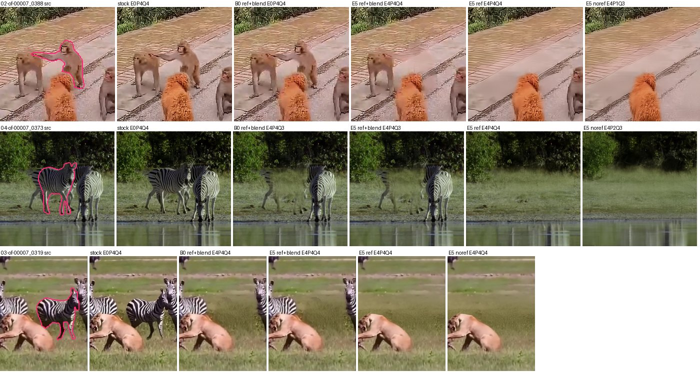

- `_0388`：E5 原指令 + 融合的填补是一块模糊的平涂；E5 原指令、noref 中左边的猴子不见了。
- `_0373`：两个融合版本都能清楚看到被删斑马的残影。
- `_0319`：不融合的两个版本中，左边的斑马都消失了。

### 6.3 add：只有 stock 成功（图 6、7）

**图 6**　从「stock 成功、E5 原指令 + 融合失败」的 12 个 add case 中随机抽 5 个，列同图 4

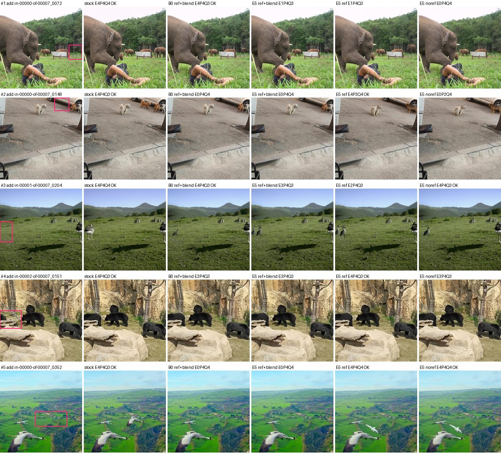

| 行 | case | 指令 | 我看到的 | judge 判得对吗 |
|---|---|---|---|---|
| 1 | `cb_train-00000-of-00007_0072` | add a large elephant facing left on the rightmost distant area | stock 在框内加了一头大象。B0 原指令 + 融合、E5 原指令 + 融合、E5 原指令都加了，但比 stock 小。E5 noref 没加 | E5 原指令 + 融合、E5 原指令的 E1 判错：judge 说「原图该区域已有大象」，实际没有（图 7） |
| 2 | `cb_train-00000-of-00007_0148` | add a dog similar to the second dog on the left side of it | stock 在框内加了狗。两个融合版本什么都没加。E5 原指令把狗加在了框右侧、已有的狗旁边，出了框；E5 noref 类似 | 对 |
| 3 | `cb_train-00001-of-00007_0204` | add a bird on the leftmost that looks similar to the other birds | stock 加了鸟；E5 原指令 + 融合加了一只较小的鸟；E5 原指令把鸟加在中间偏左，不在框内 | 对 |
| 4 | `cb_train-00002-of-00007_0151` | add a black bear on the upper middle, opposite the second bear | stock 加了完整的熊；我们加的熊不完整 | 对（E3） |
| 5 | `cb_train-00000-of-00007_0352` | add a bird on the right side of the second bird from the bottom that is similar to it | stock 在框内加了鸟。两个融合版本都没加出来。E5 原指令、noref 加了白鸟，但在框的右下方，出了框 | 对 |

**图 7**　图 6 第 1、2、5 行的框区域放大，列同图 4

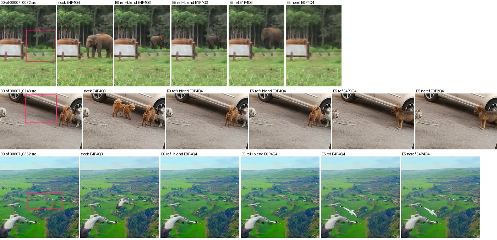

- `_0072`：原图框内只有树和栏杆，没有大象，所以 judge 给 E5 的 E1 是判错。
- `_0148`、`_0352`：E5 不融合时物体加在框外，融合后就被抹掉了。

### 6.4 训练数据的对齐（图 8、9）

**图 8**　Stage 2 的 add 训练样本，随机抽取：scaleedit 3 个、crispedit 2 个、refedit 1 个

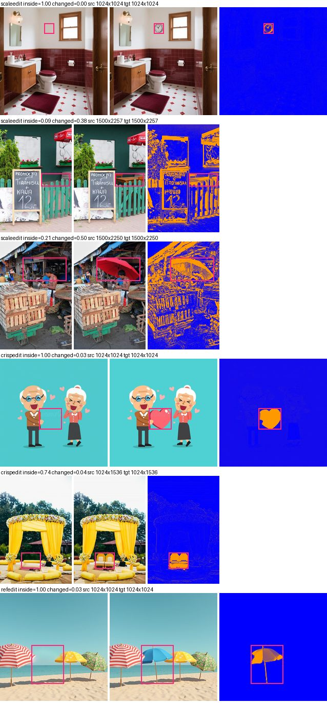

列：原图（粉框为 add 框）、目标图、差异图（|目标 − 原图|，蓝 → 橙）。每行上方给出来源、框内改动比例（inside）和全图改动比例（changed）。

| 行 | 来源 | 指令 | 我看到的 |
|---|---|---|---|
| 1 | scaleedit | Add a small, round, silver-framed clock on the wall to the left of the window | 对齐，改动只在框内 |
| 2 | scaleedit | Add a small wooden table with two chairs in this region | 差异图里全图的边缘都发亮：目标图和原图错位 |
| 3 | scaleedit | Add a large red umbrella in this region | 伞加在框内，但全图边缘同样发亮，也是错位 |
| 4 | crispedit | Add a large red heart in this region | 对齐 |
| 5 | crispedit | Add cushioned chairs in this region | 对齐（inside 0.74） |
| 6 | refedit | Add a solid blue umbrella as the second one from the left | 对齐 |

**图 9**　全图改动超过 20% 的 remove 训练样本：crispedit 2 个、scaleedit 2 个，在非编辑区域按原分辨率裁剪 256×256

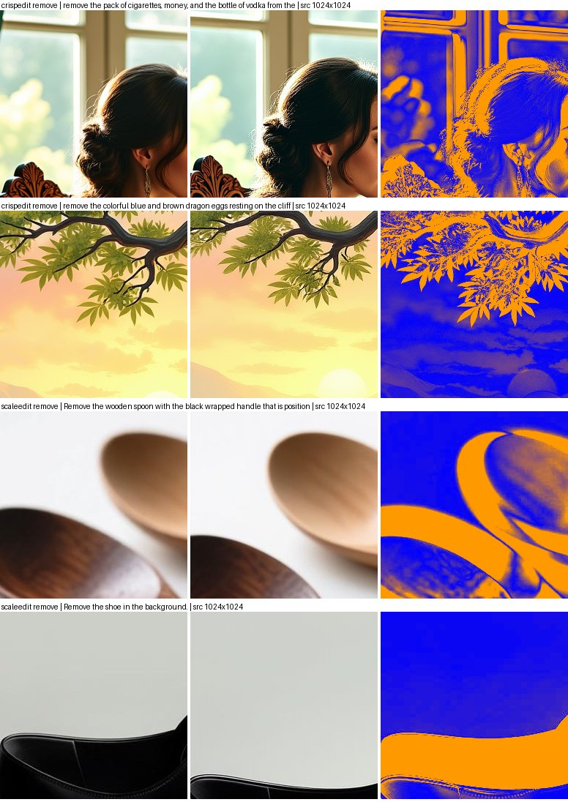

列：原图、目标图、差异。
- crispedit 两例：非编辑区域被重绘，女人的头发和头部姿态、树枝和叶子的形状都变了。
- scaleedit 两例：勺子和鞋的位置、大小都变了，是重新裁剪或缩放过。

### 6.5 attribute 与低画质（图 10）

**图 10**　第 1–3 行：随机抽的「只有 E5 成功」的 attribute case；第 4–5 行：随机抽的 E5 原指令 + 融合 Q<3 的 case。列同图 4

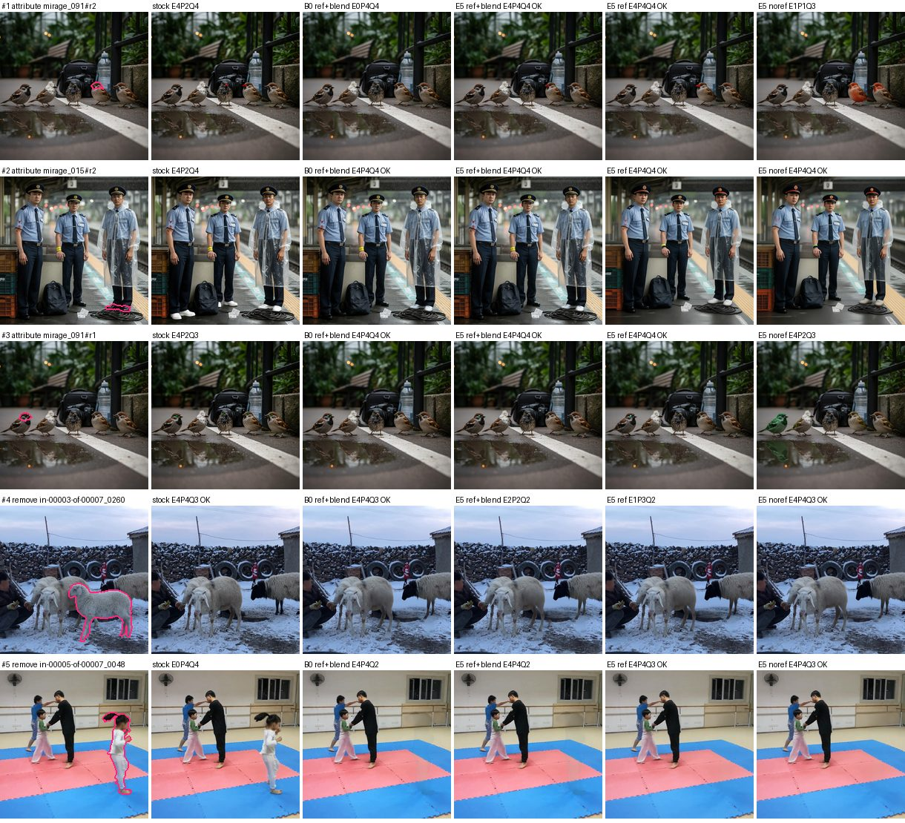

| 行 | case | 指令 | 我看到的 | judge 判得对吗 |
|---|---|---|---|---|
| 1 | `mirage_091#r2` | Change the color of the beak of the fourth sparrow from the left to red. | stock 改了喙，但另外还有改动（judge 评语指出了这一点）。E5 原指令 + 融合：喙在缩略图里太小，看不清。E5 noref 把整只鸟染成了红色 | 缩略图上无法核对 |
| 2 | `mirage_015#r2` | Change the color of the right person's shoes to white. | stock 把左边那个人的鞋也改白了；E5 原指令 + 融合只改了右边的人 | 对 |
| 3 | `mirage_091#r1` | Change the color of the eyes of the first sparrow from the left to green. | stock 改了好几只麻雀的眼睛；E5 原指令 + 融合只改了目标；E5 noref 把整只鸟染成了绿色 | 对 |
| 4 | `cb_train-00003-of-00007_0260` | remove the second sheep on the right | stock 删了。E5 原指令 + 融合删掉了躯干，腿还在。E5 noref 删干净了 | 对 |
| 5 | `cb_train-00005-of-00007_0048` | remove the person on the rightmost | stock 没删。两个融合版本删了，但地垫上留下一块颜色不一致的色块。不融合的版本删得干净 | 对（Q2） |

### 6.6 融合后 P 仍低、E4 但改动很小、两边都失败（图 11）

**图 11**　第 1–2 行：E5 原指令 + 融合 P≤2 的 case（8 个中取 2 个）；第 3–4 行：E5 判 E4 但区域内几乎没改动的 case；第 5 行：两边都失败的 remove。列同图 4

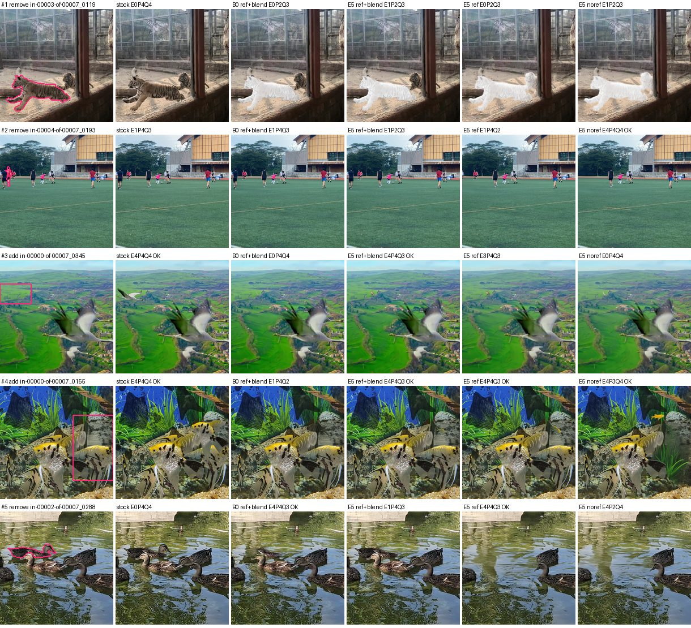

| 行 | case | 指令 | 我看到的 | judge 判得对吗 |
|---|---|---|---|---|
| 1 | `cb_train-00003-of-00007_0119` | remove the leftmost tiger | stock 没删；我们所有用法都把老虎涂成了白色剪影 | 对。P2 是把剪影算作区域内的意外改动 |
| 2 | `cb_train-00004-of-00007_0193` | remove the red-clothed person on the leftmost | stock 和两个融合版本都把人变成了黑色剪影；E5 noref 删了 | 对 |
| 3 | `cb_train-00000-of-00007_0345` | add a bird on the upper left of the topmost bird in the flock | stock 加了一只白鸟；E5 原指令 + 融合加的鸟非常小 | E4 偏宽（物体太小） |
| 4 | `cb_train-00000-of-00007_0155` | add a fish on the upper left of the rightmost fish with similar color to other fishes | stock 加了一条大的神仙鱼；E5 加的是一条很小的黄鱼 | E4 偏宽（物体太小） |
| 5 | `cb_train-00002-of-00007_0288` | remove the duck on the uppermost | stock 没删。E5 原指令 + 融合只删了鸭头，身体还在。E5 原指令删了目标，但其他鸭子也删了。E5 noref 也删多了 | E5 原指令 P4 漏判 |

### 6.7 E5 成功样本的人工核对（图 12）

**图 12**　从 E5 原指令 + 融合的 138 个严格成功中随机抽 8 个：remove 4 个、add 3 个、attribute 1 个

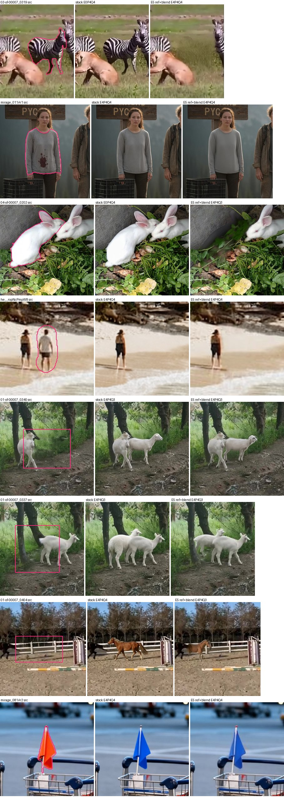

列：原图（粉框为区域）、stock、E5 原指令 + 融合。

| 行 | case | 指令 | 我看到的 | 结论 |
|---|---|---|---|---|
| 1 | `cb_train-00003-of-00007_0319` | remove the second zebra from the rightmost | 删了，草地填补略糊；stock 没删 | 属实（略糊） |
| 2 | `mirage_011#r1` | Remove the blood on the left person's shirt. | 两边都去掉了血迹 | 属实 |
| 3 | `cb_train-00004-of-00007_0202` | remove the leftmost rabbit | 删了，但填补处是一块偏暗、发糊的区域；stock 没删 | 属实（明显发糊） |
| 4 | `he__ropNcPmpW8` | Remove the person on the right of the two people walking together on the beach. | 两边都删干净了 | 属实 |
| 5 | `cb_train-00001-of-00007_0340` | add a white sheep on the right side of the leftmost sheep … | 两边都加了羊 | 属实 |
| 6 | `cb_train-00001-of-00007_0337` | add a white sheep on the left side of the leftmost sheep … | 两边都加了羊 | 属实 |
| 7 | `cb_train-00001-of-00007_0404` | add a brown horse on the right side of the first black horse on the left | 两边都加了马，E5 的马比 stock 小 | 属实 |
| 8 | `mirage_081#r2` | Change the color of the small flag on the fourth luggage cart from the left to blue. | 两边都改成了蓝色 | 属实 |

### 6.8 区域绑定：B0 与 E5（图 13）

**图 13**　对比页中三个「同类全删」的 case

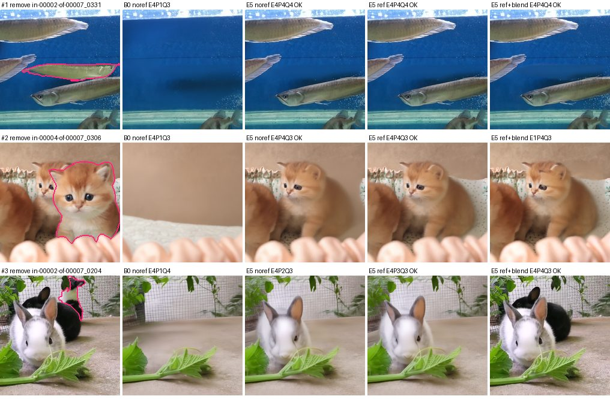

列：原图、B0 noref、E5 noref、E5 原指令、E5 原指令 + 融合。

| 行 | case | 指令 | 我看到的 | judge 判得对吗 |
|---|---|---|---|---|
| 1 | `_0331` | remove the fish on the upper rightmost | B0 删光所有鱼；E5 三种用法都只删目标 | 对 |
| 2 | `_0306` | remove the rightmost cat | B0 删光。E5 noref、原指令删了目标，但剩下的小猫被移位、放大，画面重新构图。E5 原指令 + 融合没删掉 | E5 noref、原指令的 P4 漏判了重新构图；融合版本的 E1 对 |
| 3 | `_0204` | remove the rabbit on the uppermost | B0 删光。E5 noref 删了目标和黑兔，白兔的样子也被改了。E5 原指令同样删掉了黑兔。E5 原指令 + 融合只删目标 | noref 的 P2 对；原指令的 P3 偏宽 |

### 6.9 E5 的 attribute 失败（图 14）

**图 14**　E5 原指令 + 融合 attribute 失败的 case，按 case ID 排序取前 4 个，区域放大

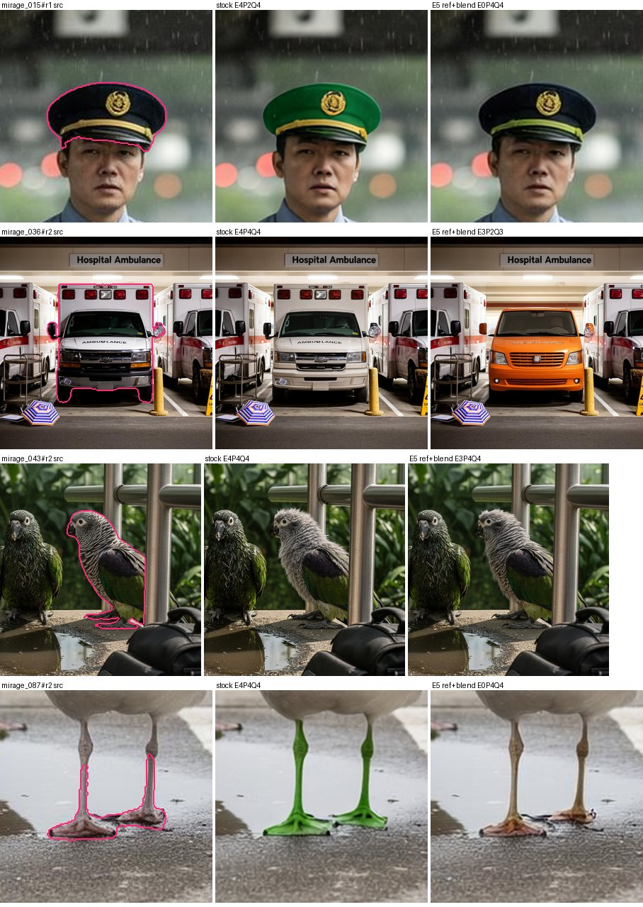

列：原图、stock、E5 原指令 + 融合。

| 行 | case | 指令 | 我看到的 | judge 判得对吗 |
|---|---|---|---|---|
| 1 | `mirage_015#r1` | Change the color of the middle person's hat to green. | stock 改成了绿帽；E5 的帽子没变色，只有帽带的颜色变了 | 对（E5 E0） |
| 2 | `mirage_036#r2` | Change the material of the middle car to plastic. | stock 几乎没变；E5 把救护车换成了一辆橙色面包车 | stock 的 E4 偏宽；E5 的 E3、P2 基本对 |
| 3 | `mirage_043#r2` | Make the right bird's feathers fluffy. | stock 的羽毛明显蓬松了；E5 只是略微蓬松 | 对（E5 E3） |
| 4 | `mirage_087#r2` | Change the color of the feet of the third seagull from the left to green. | stock 改成了绿脚；E5 没变色 | 对（E5 E0） |

### 6.10 `_0204` 放大复核（图 15）

**图 15**

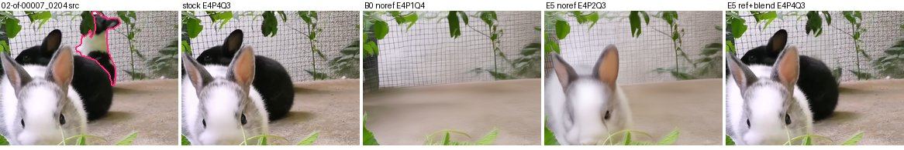

列：原图（只描区域边）、stock、B0 noref、E5 noref、E5 原指令 + 融合。
- 区域里是最上面那只黑白兔子，stock 和 E5 原指令 + 融合都只删了它。
- B0 noref 删光了三只兔子。
- E5 noref 删了它和黑兔，白兔的样子也被改了。
