# SAMTokEdit（Qwen-Image-2.1）v2 训练数据诊断与改进（2026-10-08）

本文回答：现有 Stage 2 训练数据（四来源：RefEdit、CrispEdit、ScaleEdit、SAMTok Derived）是怎么造出来的，有什么问题，应该怎么过滤和扩充。

做法：
1. 读四个打标 repo（`sam3-crispedit-labeling`、`sam3-refedit-labeling`、`sam3-samtok-derived-edit-labeling`、`sam3-scaleedit-labeling`）的文档和代码，弄清每个来源的构造流程和已有的质量门；
2. 对全部 98,574 个源编辑对做逐对审计（尺寸、区域、像素改动），不看抽样；
3. 对可疑样本做几何配准，判断「错位」能不能修；
4. 对可疑样本做「区域外贴回原图」，看修复后的样子；
5. 看图核对每一类问题的实际表现。

审计脚本和产物在本地 `/tmp/sa/data_audit/`（未入库）：`audit_sources.py`（逐对审计）、`register_test.py`（配准）、`pasteback.py`（贴回）、`train_sheet.py`（对照图）。逐对结果 `audit.jsonl`，配准结果 `register.jsonl`，对照图 `sheets/`。

## 0. 结论

1. **Stage 2 的训练数据只有约一半是干净的对齐数据。** 92,303 个主四类编辑对里，48% 可以直接用，10% 贴回原图后可修，35% 需要重新推区域或丢弃（改动扩散到区域外），8% 是空操作或改动过弱。
2. **四个来源的质量差异极大，不能同等对待。**
   - Derived：remove 99%、replace 93%、attribute 92% 直接可用；但它的 add 有 78% 是改动过弱的小贴纸。
   - RefEdit：add 97%、remove 95% 直接可用；attribute 只有 16%、replace 11%。
   - CrispEdit：33–44% 直接可用。
   - ScaleEdit：最差，add 只有 10% 直接可用。
3. **错位的成因在上游数据，不在打标流程。** ScaleEdit 的目标图整体被重新渲染或缩放（同尺寸样本的中位位移约 15 px@512、缩放 1.07×）；CrispEdit 的部分目标图整图重绘；RefEdit 的 color/material/replace 目标图在 mask 外也被重画。四个流程都没有「源图和目标图是否对齐」「改动是否落在区域内」的检查，ScaleEdit 的质量判定提示还明确要求忽略像素级差异。
4. **错位分两类，处理方式不同。**
   - 几何错位（整体平移/缩放）：配准可修，占多数。ScaleEdit 同尺寸样本 76% 可修、CrispEdit 尺寸不同样本 78% 可修。
   - 整图重绘（区域外被重新生成）：配准无效。CrispEdit 同尺寸样本只有 25% 可修，RefEdit 的 attribute/replace 0% 可修。这类只能「区域外贴回原图」或丢弃。
5. **「区域外贴回原图」是通用的兜底修复，但不能无条件用。** 它让区域外严格等于原图（与推理时的融合一致），代价是：如果区域没覆盖住真实的改动，贴回会把改动改回去，反而与指令矛盾（例见图 1 第 1 行：四个孩子都换成红衣服，mask 只盖住一个，贴回后只剩一个红衣服）。
6. **还有三类与错位无关的数据问题**：Derived 的 add 是「小贴纸」（78% 改动弱，5,371/6,269 条指令含 small/tiny，1,925 条就是 sticker），与评测的「新增一个同类实例」不是一种任务；Derived 的 attribute 有 444 条区域内改动低于 10%（4 条为 0），是空操作；remove 的平涂式删除（区域被填成均匀色块）在 Derived 中被接受。
7. **改进优先级**：先按「对齐 + 定位 + 改动实感」三项过滤（保留 48%），再把只涉及物体整体替换/删除的样本贴回原图（多留 10%），然后补对齐的 add 数据；不要指望把错位数据全部修好，因为整图重绘的部分修不回来。
8. **清洗已全量执行**（第 6 节；规则见 6.7，全量见 6.8）：98,574 对保留 70,956 对（72.0%），主四类保留 66,684 对（72.2%），输出在 `datasets/SAMTokEdit_Cleaned_20261009/`。小批量随机抽查的合格率是 83%，没有达到 90% 的标准；剩下的问题主要是上游编辑本身没做对，像素规则查不出，建议训练前加一道 MLLM 编辑核验。
9. **四个子集的数据路径已整理**（6.8.1）：每个子集归到 `datasets/` 下的一个文件夹，打标分支和本仓库里的路径已同步。

## 1. 逐对审计：全部 98,574 个编辑对

对每个源编辑对（`sources.jsonl`，也就是 v2 `stage2.jsonl` 的来源），在 512 px 下计算：

- `far_out`：区域外扩长边 4% 之后，剩下的部分中 |Δ|>25 的像素占比；
- `in_share`：全部明显改动的像素中，落在区域（含 4% 外扩）内的比例；
- `fill`：区域自身被明显改动的像素占比（改动是否真的发生了）；
- `contrast`：区域内平均 |Δ| 与区域外平均 |Δ| 的比值。

### 1.1 按来源 × 类型

| dataset | type | n | 源/目标同尺寸 | far_out 中位 | 对齐 (far_out≤5%) | 定位 (in_share≥50%) | 有改动 (fill≥10%) | 三项全过 |
|---|---|---:|---:|---:|---:|---:|---:|---:|
| refedit | add | 2909 | 100% | 0.000 | 98% | 98% | 99% | 96% |
| refedit | remove | 1163 | 100% | 0.000 | 99% | 96% | 96% | 94% |
| refedit | replace | 1270 | 100% | 0.121 | 11% | 34% | 99% | 8% |
| refedit | attribute | 2462 | 100% | 0.115 | 17% | 32% | 99% | 12% |
| crispedit | add | 3563 | 78% | 0.086 | 44% | 48% | 99% | 38% |
| crispedit | remove | 13273 | 75% | 0.115 | 38% | 50% | 99% | 34% |
| crispedit | replace | 8913 | 27% | 0.118 | 39% | 55% | 98% | 36% |
| crispedit | attribute | 11447 | 26% | 0.131 | 38% | 54% | 95% | 32% |
| crispedit | action | 488 | 0% | 0.236 | 1% | 5% | 98% | 0% |
| scaleedit | add | 6023 | 94% | 0.331 | 10% | 10% | 100% | 9% |
| scaleedit | remove | 5694 | 58% | 0.222 | 33% | 30% | 99% | 26% |
| scaleedit | replace | 2951 | 61% | 0.256 | 26% | 32% | 100% | 23% |
| scaleedit | attribute | 4689 | 65% | 0.255 | 26% | 38% | 99% | 24% |
| scaleedit | action | 2406 | 100% | 0.338 | 7% | 8% | 99% | 4% |
| scaleedit | text | 2053 | 99% | 0.002 | 95% | 76% | 97% | 75% |
| derived | add | 6265 | 100% | 0.000 | 95% | 82% | 22% | 16% |
| derived | remove | 7988 | 100% | 0.000 | 100% | 100% | 99% | 99% |
| derived | replace | 5016 | 100% | 0.000 | 95% | 99% | 98% | 93% |
| derived | attribute | 8677 | 100% | 0.000 | 100% | 100% | 92% | 92% |

- Derived 的 `add` 在 Derived 的流程里是「给宿主实例加局部细节」，v2 转换时已改归 attribute，这里按原始类型列出。
- 全部 98,574 对都能打开，没有损坏文件。

### 1.2 每对适合的处理方式

| dataset | type | n | A 直接用 | B 贴回原图 | C 重推区域/丢弃 | D 空操作或改动过弱 |
|---|---|---:|---:|---:|---:|---:|
| crispedit | add | 3563 | 44% | 10% | 46% | 1% |
| crispedit | remove | 13273 | 37% | 16% | 45% | 1% |
| crispedit | replace | 8913 | 38% | 19% | 41% | 2% |
| crispedit | attribute | 11447 | 33% | 21% | 41% | 5% |
| refedit | add | 2909 | 97% | 1% | 1% | 1% |
| refedit | remove | 1163 | 95% | 0% | 1% | 4% |
| refedit | replace | 1270 | 11% | 27% | 62% | 1% |
| refedit | attribute | 2462 | 16% | 20% | 62% | 1% |
| scaleedit | add | 6023 | 10% | 1% | 89% | 0% |
| scaleedit | remove | 5694 | 32% | 3% | 64% | 1% |
| scaleedit | replace | 2951 | 26% | 9% | 65% | 0% |
| scaleedit | attribute | 4689 | 26% | 13% | 61% | 1% |
| derived | add | 6265 | 18% | 1% | 3% | 78% |
| derived | remove | 7988 | 99% | 0% | 0% | 1% |
| derived | replace | 5016 | 93% | 5% | 1% | 2% |
| derived | attribute | 8677 | 92% | 0% | 0% | 8% |

判定口径（按顺序）：
- D：`fill < 10%`，即指令要求的改动基本没发生；
- A：`far_out ≤ 5%`；
- B：`in_share ≥ 50%`，改动集中在区域附近，只是整体位置或尺度有偏差；
- C：其余，改动散布全图。

主四类合计（92,303 对）：A 48%、B 10%、C 35%、D 8%。

### 1.3 区域标在哪一侧

- 56,475 对标在源图，12,703 对标在目标图（add 类，即目标图中新物体的位置），1,391 对两侧都有，27,946 对没有记录（Derived，它用自己的 mask 字段）。
- 标在目标图的区域需要映射回源图坐标（`map_target_mask_to_source`），这个映射是「直接 resize 到源图尺寸」，只有两图视角相同时才正确。

## 2. 错位能不能修

先说明成因：四个流程都**没有**像素对齐检查或「改动是否落在区域内」检查。ScaleEdit 的质量判定提示词明确要求忽略像素级差异；CrispEdit 只对 add 检查宽高比、且不丢样本；RefEdit 没有任何几何检查。所以这些错位不是打标流程引入的，而是上游数据集自带、且被流程放过的。

对可疑样本跑 SIFT + RANSAC 仿射（特征点用的区域是 mask 外扩 6% 以外的部分，只统计背景运动），把目标图对齐到源图坐标后重算 `far_out`。每组抽 150 个：

| 分组 | 可配准 | far_out 中位（前） | far_out 中位（后） | 修复成功（far_out≤5% 且区域被覆盖 ≥95%） | 缩放中位 | 位移中位 |
|---|---:|---:|---:|---:|---:|---:|
| ScaleEdit 同尺寸、错位 | 99% | 0.354 | 0.022 | 76% | 1.075 | 42.4 px |
| ScaleEdit 不同尺寸 | 100% | 0.020 | 0.008 | 90% | 1.000 | 0.1 px |
| CrispEdit 不同尺寸 | 98% | 0.165 | 0.015 | 78% | 0.996 | 0.1 px |
| CrispEdit 同尺寸、错位 | 93% | 0.232 | 0.146 | 25% | 1.000 | 5.9 px |
| RefEdit 的 attribute/replace、错位 | 100% | 0.133 | 0.149 | 0% | 1.000 | 2.2 px |

- **几何错位可修**：ScaleEdit 同尺寸样本主要是整体缩放加平移（1.075×、42 px），配准后区域外改动从 35% 降到 2%；不同尺寸样本本身已是等比例缩放（缩放中位 1.000、位移 0.1 px），在训练时直接拉伸到源图尺寸就已经对齐。CrispEdit 尺寸不同的样本同理。
- **整图重绘不可修**：CrispEdit 同尺寸样本配准后只降到 0.146，RefEdit 的 attribute/replace 甚至略微升高，说明这些目标图在区域外确实被重新生成，不是视角变化。
- 训练时的做法是把目标图直接拉伸到源图尺寸。对等比例缩放的样本这是正确的；对同尺寸但错位的样本，这等于把「错位」当成监督信号。

尺寸差异与错位的关系（主四类，全部 92,303 对）：

| 来源 | 尺寸不同的比例 | 同尺寸样本的对齐率 | 尺寸不同样本的对齐率 | 尺寸不同的样本中等比缩放的比例 |
|---|---:|---:|---:|---:|
| CrispEdit | 52% | 50% | 29% | 39% |
| ScaleEdit | 29% | 7% | 63% | 70% |
| RefEdit | 0% | 58% | — | — |
| Derived | 0% | 98% | — | — |

- 两个来源的规律相反：CrispEdit 是「尺寸差几个像素 = 整图重绘」（对齐率反而更低），ScaleEdit 是「尺寸不同 = 等比缩放」（拉伸后就对齐了，对齐率 63%），而 ScaleEdit 的同尺寸样本才是真正错位的那批（对齐率只有 7%）。
- 所以不能只按尺寸是否相同来过滤，必须逐对算区域外的改动。

## 3. 贴回原图的效果

做法：把目标图里区域（外扩 2%）以外的部分换成源图，区域内保留目标图，边界高斯过渡。区域外的 `far_out` 因此为 0。

| 抽查 case | 来源/类型 | far_out 前 → 后 | 改动落在区域内 | 区域内保留的目标内容占画面 |
|---|---|---:|---:|---:|
| `crispedit-a6f011eb` | attribute：四个孩子换成红衣服 | 0.181 → 0.000 | 0.42 | 10.4% |
| `crispedit-df250a2d` | remove：移走一块蛋糕 | 0.414 → 0.000 | 0.27 | 11.5% |
| `crispedit-838826f9` | remove：移走饼干 | 0.351 → 0.000 | 0.76 | 48.0% |
| `crispedit-5de88ee0` | attribute：换桌子材质 | 0.322 → 0.000 | 0.16 | 1.3% |
| `refedit-41b12e98` | attribute：喷泉上的鸟 | 0.193 → 0.000 | 0.05 | 0.8% |
| `refedit-59722623` | replace：画框里的画 | 0.104 → 0.000 | 0.29 | 6.4% |
| `refedit-02dd0dbf` | replace：三明治 | 0.150 → 0.000 | 0.41 | 19.8% |
| `scaleedit-9677a853` | replace：小房子换成玻璃房 | 0.209 → 0.000 | 0.13 | 1.7% |
| `scaleedit-de20536c` | remove：红礼物盒旁的人 | 0.373 → 0.000 | 0.08 | 2.9% |
| `scaleedit-ce74ccfc` | replace：道服颜色 | 0.236 → 0.000 | 0.39 | 7.8% |

**图 1**　贴回原图的效果（列：原图+区域、目标图、贴回后的图、贴回图与原图的差异）

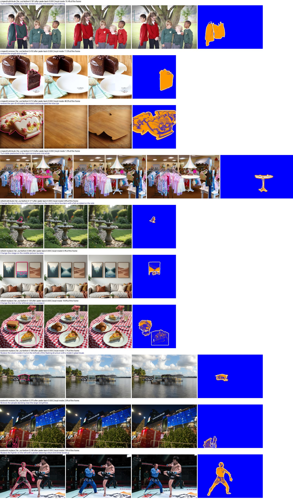

- 第 1 行（`crispedit-a6f011eb`，四个孩子换红衣服）：区域只盖住一个孩子，贴回后只有他穿红衣服，另外三个仍是绿衣服，与指令矛盾。这类应该丢弃或重新推区域。
- 第 3 行（`crispedit-838826f9`，48% 的画面保留目标内容）：区域本身接近半张图，贴回等于保留了大部分重绘内容，收益有限。
- 其余各行贴回后区域外与原图一致，区域内保留目标编辑，是可以接受的训练对。

## 4. 与错位无关的数据问题

### 4.1 add 的任务不对口（主要影响 add 能力）

| 来源 | add 对数 | 指令含「再一个同类实例」 | 指令含「在物体上加细节」 | 说明 |
|---|---:|---:|---:|---|
| refedit | 2909 | 3% | 39% | 多为在物体上加小物件 |
| crispedit | 3563 | 1% | 23% | 44% 的样本目标图错位，另有 46% 改动扩散 |
| scaleedit | 6023 | 2% | 52% | 89% 改动扩散 |
| derived | 6269 | 1% | 59% | 78% 区域内改动不足 10% |

- 评测集（CompBench）的 add 是「同类多实例场景里新增一个实例」，训练数据里这种只占 1–3%。
- Derived 的 add 是刻意的「小贴纸」模式：5,371/6,269 条指令含 small/tiny，1,925 条就是 sticker 字样；改动连通域的中位面积是全图的 0.33%，是宿主 mask 的 0.09 倍。下游模型「加出来的物体太小」与之对应。
- 80 个 add case 的失败清单（`docs/06`）与这里一致：放置位置错、物体过小、外观不合。

### 4.2 空操作与改动过弱

- Derived 的 attribute 有 444 条（5.1%）区域内改动低于 10%，其中 4 条为 0（源图和目标图逐像素相同）。生成侧的审计把「改动过弱」只当警告，不是否决。
- Derived 的 add 有 78% 改动过弱（区域内明显改动 <10%），即「贴纸」类样本。
- 小部件属性（喙、眼睛、鞋）区域的面积中位数只有 2.9%，本来就容易被这类阈值放过。

### 4.3 remove 的平涂式删除

- Derived 的 remove 在 250 个「mask 占图 ≥15%」的抽样里，17 个区域内灰度标准差 <10、33 个 <15；18 个的纹理能量低于源图的 0.35 倍。即整个区域被填成一块均匀色。
- 生成侧的自动门只能拦住「填充很暗」或「区域内改动超过 50%」的情形，浅色平涂能通过。
- 下游 remove 失败里的「涂成白色/黑色剪影」与这批样本对应。

### 4.4 指令与区域语义不一致

- 有的样本，指令要求的编辑和区域指向的对象不同。例如 RefEdit 的 `refedit:11175`：指令是「把小孩摘苹果的水果摊换成摘橘子的水果摊」，实际做的是「把小孩手里的苹果换成橘子」，区域是那只苹果（占图 0.2%）。流程只按「规划器自己重述的编辑」判质量，从不拿指令原文比对。
- 这类样本会教模型「区域 token 与文字不同步也没关系」，与评测里「只给区域时改错实例」的现象一致。

### 4.5 区域质量

- 区域的面积分布：Derived 中位 4.4%、CrispEdit add 中位 3.5%、ScaleEdit add 中位 1.7%（最小到 0.6%），评测集 dev 的 add 框中位 7.2%。训练区域普遍偏小。
- 没有区域面积上限（RefEdit 最大到 0.91），大面积区域会让「区域内全部重绘」成为可行解。
- 区域外的改动没有被用作监督信号；训练时也没有任何「区域外必须保持」的约束（推理时的融合才补上这一点）。

## 5. 改进建议

### 5.1 过滤（立刻可做，不需要重新生成）

对全部 98,574 对按 1.2 节的四类打标，生成一份筛选清单（逐对给出 `far_out / in_share / fill / contrast` 和处置建议）。建议的保留策略：

| 类别 | 处置 | 预计保留 |
|---|---|---:|
| A 对齐 | 直接用 | 44,230 (48%) |
| B 错位但局部 | 贴回原图后使用 | 8,849 (10%) |
| C 改动扩散 | 先尝试配准；配准后仍 >5% 的丢弃，或只保留「物体整体替换/删除」的子集并贴回 | 部分 |
| D 空操作/过弱 | 丢弃 | −6,980 |

**过滤后的规模**（保守 = 只用 A 类；建议 = A + B + 按第 2 节实测可配准比例救回的 C 类）：

| 来源 | 类型 | 原始 | 保守保留 | 建议保留 |
|---|---|---:|---:|---:|
| RefEdit | add | 2,909 | 2,815 (97%) | 2,831 (97%) |
| RefEdit | remove | 1,163 | 1,100 (95%) | 1,103 (95%) |
| RefEdit | replace | 1,270 | 137 (11%) | 477 (38%) |
| RefEdit | attribute | 2,462 | 406 (16%) | 900 (37%) |
| CrispEdit | add | 3,563 | 1,551 (44%) | 2,546 (71%) |
| CrispEdit | remove | 13,273 | 4,965 (37%) | 9,551 (72%) |
| CrispEdit | replace | 8,913 | 3,381 (38%) | 7,676 (86%) |
| CrispEdit | attribute | 11,447 | 3,814 (33%) | 9,523 (83%) |
| ScaleEdit | add | 6,023 | 617 (10%) | 4,751 (79%) |
| ScaleEdit | remove | 5,694 | 1,829 (32%) | 4,879 (86%) |
| ScaleEdit | replace | 2,951 | 753 (26%) | 2,526 (86%) |
| ScaleEdit | attribute | 4,689 | 1,201 (26%) | 4,043 (86%) |
| Derived | add | 6,265 | 1,108 (18%) | 1,167 (19%) |
| Derived | remove | 7,988 | 7,908 (99%) | 7,936 (99%) |
| Derived | replace | 5,016 | 4,670 (93%) | 4,905 (98%) |
| Derived | attribute | 8,677 | 7,975 (92%) | 7,975 (92%) |
| **合计** | | **92,303** | **44,230 (48%)** | **72,789 (79%)** |

建议方案下的类型规模：remove 23,468、attribute 22,442、replace 15,584、add 11,295。比现在的抽样配比更均衡（现在 attribute 30.8%、add 21.5%），但 add 仍然偏少，需要按 5.2 节扩充。

分来源的具体建议：
- **保留 RefEdit 的 add、remove**（97%、95% 干净），丢弃它的 attribute、replace（只有 11–16% 干净）。
- **CrispEdit**：保留 A 类；B 类贴回；同尺寸且配准失败的丢弃（这部分整图重绘）。
- **ScaleEdit**：先配准再判断，同尺寸样本可救回约四分之三；`text` 类（2,053 对，95% 干净）本来就是文本编辑，可单独保留。它的 `action` 类（2,406 对）几乎全错位，建议整类丢弃。
- **Derived**：remove、replace、attribute 保留（92–99% 干净），但要把 attribute 中改动 <10% 的 444 条剔除；add 只保留改动足够的（约 1,352 条改动 ≥10%）。
- **区域面积**：上限设为全图的 55–60%；超过的样本贴回后会保留过多重绘内容。
- **add 的特殊处理**：add 的区域标在目标图上，做配准或贴回时，区域必须跟随同一变换映射到源图坐标；映射用直接 resize 在视角变化时是错的（ScaleEdit / CrispEdit 的 add 属于这种情况）。
- **指令/区域一致性**：对 `fill` 高但 `in_share` 低的样本（区域被改但改动主要在区域外）人工抽看，或加一条自动检查：用一次 MLLM 调用判断「区域内的改动是否就是指令要求的那件事」。

### 5.2 扩充（需要生成或加工）

1. **add 任务对齐**：从现有「同类多实例」图片里构造 add 样本——用 SAM3 分割一个实例，把它从图中移除生成源图，再放回作为目标图；指令写成「在 X 的右边加一个同类的 Y」。这样能直接对齐评测的 add 形式，且天然像素对齐、区域明确。评测集的人类/CompBench 图片可用，训练集内的多实例图也可用。
2. **小部件属性**：评测的部件级任务（MIRAGE：喙、眼睛、鞋、帽檐）在训练数据里只有属性类的一小部分，且多为整物体。建议用 SAM3 分割部件（或按区域裁切），构造「只改这个部件」的成对样本，并把区域内 loss 按面积归一化。
3. **remove 的阴影和倒影**：现有 mask 只盖物体本身，阴影和倒影留在区域外，导致上游「删了但不一致」。构造时把物体连同其阴影/倒影一起标注。
4. **参考图数据的形态**：现有四来源都是「图 + 指令」，评测也是。若后续要加参考图输入（RefEdit 的原始设定），需要另建数据，这里不展开。

### 5.3 训练端的配套改动

1. **区域外重建约束**：训练时对区域外做「贴回原图」式的约束（与推理融合一致），或者直接把区域外替换为源图 latent，这样模型不会把区域外重绘当成目标。
2. **区域内 loss 加权**：按区域面积归一化，让小部件属性的监督不被大面积区域淹没。
3. **类型配比**：现在 attribute 占 30.8%、add 21.5%。过滤后 add 的干净数据会大幅减少（见 1.2 节），可能需要在扩充后再平衡。
4. **验收口径**：把本文的三项指标（`far_out`、`in_share`、`fill`）纳入数据入库的自动检查，避免下一轮再出现同类问题。
5. **分来源的配比**：四个来源的质量和任务形态不同（Derived 的 add 与评测不同任务），建议按「干净样本数」而不是按「原始行数」配比，并在日志里记录每个来源的实际占比。

## 6. 建议方案的小批量验证（2026-10-09）

按 5.1 节的建议方案，在本地对分层抽样的小批量执行（不改动现有数据，产物在 `/tmp/sa/data_fix/`，未入库）。确认后已全量执行，见 6.8 节。

### 6.1 处理流程

每一对按顺序判断：
1. **D 丢弃**：区域内被明显改动的像素 < 10%（空操作或改动过弱）。
2. **A 原样保留**：远区域外的明显改动 ≤ 2%。
3. 其余先**配准**：在区域外取 SIFT 特征，RANSAC 估计仿射，把目标图对齐到源图；只有当区域外改动下降超过 2 个百分点、且区域被对齐后的目标图完整覆盖（≥98%）时才采用配准结果。add 的区域标在目标图上，会随同一变换一起映射。
4. 配准后，若区域外改动 ≤ 5% 或改动有一半以上落在区域附近，就把**源图贴回区域外**（区域外扩短边的 2%，边缘做高斯过渡）；否则判为 **C 丢弃**（改动散布全图）。
5. 贴回后过一道**检查**，任一项不过就丢弃：
   - 区域外改动 ≤ 2%；
   - 区域内仍有 ≥ 10% 的像素被明显改动（编辑没被贴回抹掉）；
   - 贴回边界外侧一圈里，被明显改动的像素 ≤ 30%（编辑没有越出区域被截断）；
   - 这一圈的平均差异 ≤ 25（不会出现明显接缝）；
   - 贴回区域 ≤ 全图 60%。

### 6.2 过关标准

- 自动：每个保留下来的样本，区域外改动 ≤ 2%，区域内改动 ≥ 10%。
- 人工：随机抽查处理过的样本，≥ 90% 可以直接作训练对（编辑完整、无接缝或残影、区域外与原图一致）；抽查被丢弃的样本，确认丢弃得有道理。

### 6.3 校准过程

- **第 1 轮**（每组 40 对，共 640 对）：保留 67.5%；25 个保留样本的区域外改动在 2–5% 之间，不满足自动标准。原因是「已大致对齐」的样本不做处理就直接保留。
- **第 2 轮**（同一批）：改为只有区域外 ≤ 2% 的样本才原样保留，其余都走配准贴回。自动标准全部满足，保留 65.8%。
- **看被丢弃样本的贴回结果**（图 6）：接缝阈值 15 太严，误丢了贴回后很自然的样本（座椅改红皮、删学习舱里的人、小木屋换玻璃房，差异值 15–19）；真正有问题的样本（喷泉超出区域被截断、连体裤只剩裤子）截断比例都 > 0.30、差异值都 > 25。于是把接缝阈值改为 25，截断阈值保持 0.30。

**图 6**　第 2 轮被检查丢掉的样本的贴回结果，用于校准阈值（列：原图+区域、原始目标图、贴回结果、贴回结果与原图的差异）

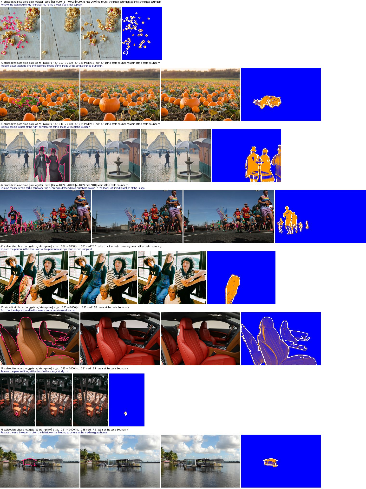

### 6.4 最终验证（换一批新样本：另一个随机种子，每组 40 对，共 640 对）

| 来源 | 类型 | 原样保留 | 直接贴回 | 配准后贴回 | 检查不过 | 改动扩散 | 改动过弱 | 保留 |
|---|---|---:|---:|---:|---:|---:|---:|---:|
| crispedit | add | 19 | 4 | 7 | 1 | 9 | 0 | 30/40 |
| crispedit | attribute | 12 | 1 | 10 | 8 | 7 | 2 | 23/40 |
| crispedit | remove | 14 | 3 | 9 | 4 | 10 | 0 | 26/40 |
| crispedit | replace | 15 | 1 | 11 | 7 | 5 | 1 | 27/40 |
| derived | add | 3 | 2 | 0 | 0 | 2 | 33 | 5/40 |
| derived | attribute | 37 | 0 | 0 | 0 | 0 | 3 | 37/40 |
| derived | remove | 40 | 0 | 0 | 0 | 0 | 0 | 40/40 |
| derived | replace | 33 | 2 | 1 | 0 | 1 | 3 | 36/40 |
| refedit | add | 40 | 0 | 0 | 0 | 0 | 0 | 40/40 |
| refedit | attribute | 1 | 12 | 0 | 0 | 25 | 2 | 13/40 |
| refedit | remove | 35 | 0 | 0 | 1 | 1 | 3 | 35/40 |
| refedit | replace | 2 | 12 | 0 | 1 | 25 | 0 | 14/40 |
| scaleedit | add | 5 | 1 | 26 | 1 | 7 | 0 | 32/40 |
| scaleedit | attribute | 11 | 0 | 24 | 2 | 3 | 0 | 35/40 |
| scaleedit | remove | 9 | 1 | 25 | 2 | 3 | 0 | 35/40 |
| scaleedit | replace | 10 | 0 | 12 | 9 | 9 | 0 | 22/40 |

**对照过关标准。**
- 自动：保留的 450 对全部满足（区域外改动最大 1.9%，区域内改动最小 0.112）。
- 人工（图 4、图 5）：
  - 处理过的样本随机抽 12 个，11 个合格（92%），达到 90% 的标准。
  - 不合格的 1 个（#10「删掉棕榈树」）：上游的目标图里树并没有删掉，只是被重画了一遍，像素有改动，所以自动指标放过了；这不是处理造成的。
  - 原样保留的抽 4 个，全部合格。
  - 被丢弃的抽 6 个，5 个丢得对。1 个（「帐篷换成黄色」）属于整图轻微重画但编辑本身是局部的，贴回本可以用，是「改动扩散」规则的误伤。
- 说明：12 个样本的置信区间很宽（11/12 的 95% 区间约为 65–99%）。如需更有把握，可在全量前再抽 30–50 个做人工复核。

**图 4**　最终验证：随机抽取的 12 个处理过的样本（列：原图+区域、原始目标图、处理后的目标图、处理后与原图的差异）

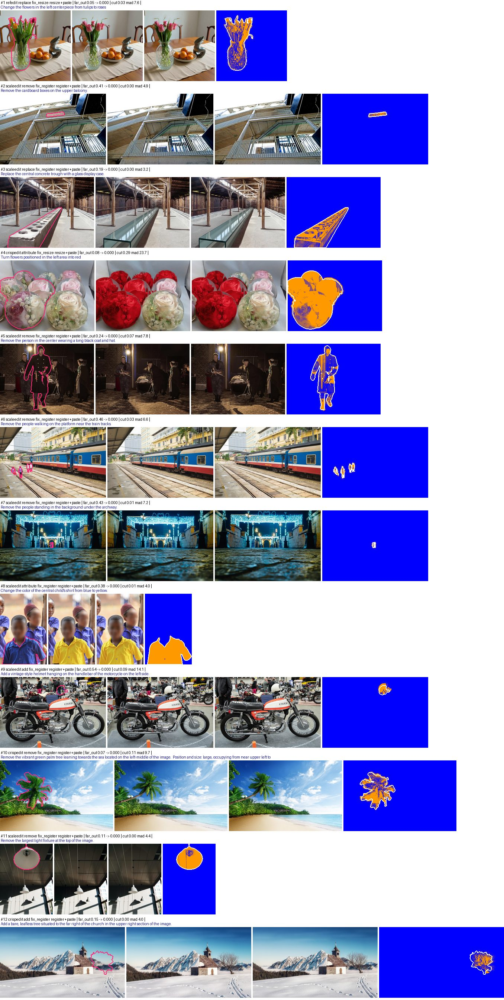

**图 5**　最终验证：原样保留 4 个（第 1–4 行）、因改动扩散丢弃 3 个（第 5–7 行）、因检查不过丢弃 3 个（第 8–10 行，第三列为贴回结果）

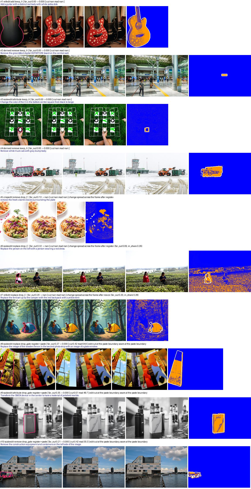

### 6.5 全量预估

按各组真实行数加权，主四类 92,303 对预计保留 **65,908 对（71%）**：

| 来源 | 预计保留 |
|---|---:|
| RefEdit | 5,171 / 7,804（66%） |
| CrispEdit | 23,898 / 37,196（64%） |
| ScaleEdit | 15,527 / 19,357（80%） |
| Derived | 21,312 / 27,946（76%） |

按类型：remove 22,615、attribute 19,511、replace 12,598、add 11,183。比 5.1 节的理论估计（79%）低，因为贴回后的检查会再丢掉一部分（约 5–6%）。

### 6.6 已知局限与可选改进

1. **「改了但没做对」查不出来**：像素指标只能判断「区域里有没有变」，判断不了「变的是不是指令要的」（如 #10 树被重画而不是删掉）。可以给 remove 加一道 MLLM 检查（「区域里还有没有这个物体」），只对 remove 跑，成本可控。6.7 节在新的一批上复查后发现，这是剩余问题的主体，不只出现在 remove，建议对所有类型做（6.7.7）。
2. **「改动扩散」会误伤**：整图被轻微重画的样本，重画噪声让「改动落在区域内的比例」偏低，即使编辑本身是局部的也会被丢。可改为：只统计区域外**成块的大改动**（去掉细边缘噪声后的连通区域），没有成块改动就照常贴回。预计能多救回一部分 RefEdit 的 attribute/replace（目前只保留约 35%）。已在 6.7 节实现并验证。
3. **Derived 的 add**：按标准只保留约 12%（大部分是改动过弱的小贴纸），这是预期结果。
4. 第 2 项已完成（6.7 节）；第 1 项建议在全量执行前做。

### 6.7 改进版规则：区域外成块改动 + 对齐检查（2026-10-09）

按 6.6 第 2 项改进「改动扩散」的判定，并在新的一批样本上重新验证。

- 脚本：`/tmp/sa/data_fix/clean_batch2.py`（改进版流程）、`blobcheck.py`（两个新检查）、`calib/`（校准与复核图）、`vis_v2/`（可视化）。
- 备份：脚本、逐对审计结果和各批次的逐对决定都已备份到 `experiments2/SAMTokEdit/qwen21_v2/data/clean_trial_20261009/`（不含处理后的图片）。

#### 6.7.1 旧规则的两类错误

看 6.4 节最终验证的可视化时发现两类错误：

- **误留**：指令是「加一个抱住男人手臂的小孩」，但区域标在另一个孩子身上，小孩实际加在区域外。旧规则看到区域外改动只有 10%、且大多在区域附近，就放行贴回，结果把真正的编辑抹掉了。
- **误丢**：有些样本整图被轻微重画，编辑本身却是局部的（如「把第二个鱼缸里的小丑鱼换成神仙鱼」）。重画噪声让「改动落在区域附近的比例」偏低，于是被判为改动扩散丢掉了。

#### 6.7.2 新规则

用下面两条替换 6.1 节的第 4 步（原规则：区域外改动 ≤5%，或改动一半以上在区域附近）。

1. **区域外成块改动**（对所有样本，包括原样保留的）：
   - 在离区域 6% 长边以外的像素上，逐通道拟合仿射颜色映射，把目标图的整体色调对齐到源图，从而去掉整体调色和光照变化；
   - 取 |Δ| > 30 的像素，在 512 px 下用半径 3 px 的圆盘做开运算，去掉重画产生的细边缘和纹理噪声；
   - 如果离区域 6% 长边以外最大的连通块超过全图的 1%，就丢弃。这种情况说明编辑或重新生成的内容落在区域外，贴回会把它抹掉或截断。
2. **对齐检查**（只对没有用上配准的样本）：
   - 在离区域 6% 以外取有纹理的 32×32 小块（256 px 下），在目标图 ±8 px 范围内用归一化互相关找最佳位移；
   - 只统计峰值 ≥ 0.7 的块。如果位移 ≤ 1 px 的块不到 40%（且这类块至少有 5 个），就丢弃。这种情况说明目标图有缩放或位移、配准又失败了，贴回会把编辑放错位置。
3. 其余样本照常贴回，再过 6.1 节第 5 步的检查。

第 2 条是在验证中补上的。成块改动检查对几何错位不敏感：错位只产生细边缘差异，被开运算去掉了。新批里有一对「在城堡中央塔楼的旗杆上加一面旗」，目标图是整体放大重构的，配准也失败了，却被第 1 条放行；贴回后旗子悬在城堡上方的空中（图 9 第 3 行）。

配准过的样本不做第 2 条，原因有两点：
- 配准已经把几何对齐了；
- 衣服、柜子内部这类纹理被重画后，互相关峰值不可靠，会误判。两对配准过的合格样本只得了 0.25 和 0.29。

#### 6.7.3 阈值校准

用上一轮可视化里人工看过的 15 个样本，校准第 1 条（最大连通块占全图的比例）：

| 设置（差异阈值 / 开运算半径） | 应保留的 12 个（最大值） | 应丢弃的 2 个（最小值） |
|---|---:|---:|
| 30 / 3（采用） | 0.56% | 4.33% |
| 40 / 3 | 0.51% | 3.29% |
| 50 / 3 | 0.48% | 1.59% |

- 应丢弃的两个：
  - 加的小孩落在区域外（4.33%）；
  - 「把前面的红枕头改成深绿」：目标图整体重构了，椅子放大约 1.2 倍，左侧的圣诞树和画框消失，贴回会把枕头放错位置（19.75%）。这一对上一轮我当成「轻微重画」的误伤，放大看后确认应该丢。
- 「把左边的报纸变成泛黄的旧纸」：目标图整张泛黄，颜色映射把这个变化吸收了，第 1 条得分 0%。但贴回后的检查会拦下它：区域边界外一圈的改动比例为 0.72，平均差异为 36。
- 对齐检查：两批中没走配准、贴回后保留的样本共 176 对，只有 3 对低于 0.4：
  - 城堡加旗：0.00；
  - 「在猪鼻子下加一个红苹果」：0.00，目标图整张重画成了油画风格；
  - 「把右侧的女人换成粉色自行车」：0.19。原目标图是裁切出来的、比源图窄几个像素，直接拉伸到源图尺寸反而错位。贴回后背景很虚，看着还行。

  看过的合格样本最低为 0.48。

还试过两个量，都没有采用：
- 贴回区域外侧紧挨着的成块改动；
- 从贴回边界向外连通的改动能延伸多远。

它们本来想查出「加的物体的支撑部分在区域外、被贴回切掉」，例如伞杆、广告牌下补出来的楼。但这两类坏样本的得分落在合格样本中间（伞杆在 512 px 下太细，几乎看不到），分不开。

#### 6.7.4 验证结果

- **同一批样本**（seed 1，即 6.4 节的 640 对）：保留数从 450 增加到 501。
- **新的一批**（seed 2，640 对，与之前的批次只重叠 12 对）：保留数从 469 增加到 509。其中救回 52 对，新丢 12 对。

新批逐组结果：

| 来源 | 类型 | 原样保留 | 直接贴回 | 配准后贴回 | 检查不过 | 成块改动 | 错位 | 改动过弱 | 保留（新规则） | 保留（旧规则） |
|---|---|---:|---:|---:|---:|---:|---:|---:|---:|---:|
| refedit | add | 40 | 0 | 0 | 0 | 0 | 0 | 0 | 40/40 | 40/40 |
| refedit | remove | 38 | 0 | 0 | 0 | 0 | 0 | 2 | 38/40 | 38/40 |
| refedit | replace | 0 | 34 | 0 | 5 | 1 | 0 | 0 | 34/40 | 17/40 |
| refedit | attribute | 0 | 37 | 0 | 3 | 0 | 0 | 0 | 37/40 | 14/40 |
| crispedit | add | 15 | 2 | 15 | 0 | 7 | 1 | 0 | 32/40 | 31/40 |
| crispedit | remove | 11 | 6 | 10 | 2 | 10 | 0 | 1 | 27/40 | 27/40 |
| crispedit | replace | 14 | 1 | 10 | 7 | 7 | 1 | 0 | 25/40 | 27/40 |
| crispedit | attribute | 9 | 3 | 16 | 6 | 4 | 1 | 1 | 28/40 | 28/40 |
| scaleedit | add | 1 | 0 | 29 | 2 | 5 | 2 | 1 | 30/40 | 27/40 |
| scaleedit | remove | 10 | 2 | 23 | 2 | 2 | 1 | 0 | 35/40 | 33/40 |
| scaleedit | replace | 10 | 0 | 18 | 4 | 8 | 0 | 0 | 28/40 | 31/40 |
| scaleedit | attribute | 7 | 1 | 22 | 5 | 4 | 0 | 1 | 30/40 | 30/40 |
| derived | add | 8 | 4 | 0 | 0 | 0 | 0 | 28 | 12/40 | 11/40 |
| derived | remove | 38 | 0 | 0 | 0 | 2 | 0 | 0 | 38/40 | 40/40 |
| derived | replace | 35 | 1 | 0 | 2 | 0 | 0 | 2 | 36/40 | 36/40 |
| derived | attribute | 39 | 0 | 0 | 0 | 0 | 0 | 1 | 39/40 | 39/40 |

- **自动标准**：保留的 509 对全部满足，区域外改动最大 1.95%，区域内改动最小 0.105。
- **变化集中在 RefEdit**：replace 从 17 增加到 34，attribute 从 14 增加到 37。这两类目标图整图轻微重画，但编辑本身是局部的，旧规则几乎全丢了。

**图 7**　新规则在新批上的决定分布（左），以及按各组真实行数加权的全量预估与旧规则的对比（右）

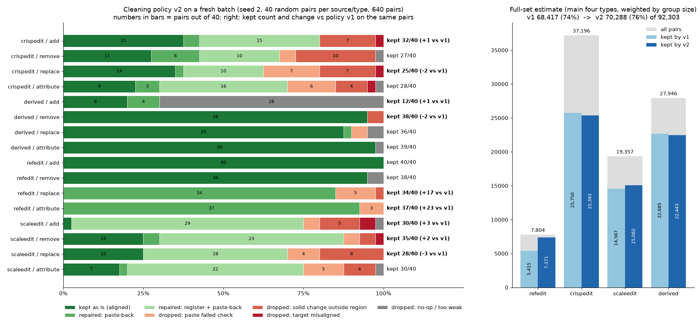

#### 6.7.5 人工抽查

| 抽查对象 | 数量 | 结果 | 不合格或误判的原因 |
|---|---:|---|---|
| 新规则新丢的（旧规则会保留），两批合计 | 18 | 丢得对 9、边界情况 2、误伤 7 | 边界情况：加的物体的影子或倒影落在区域外。误伤：目标图把同类的其他实例也改了，或别处有零星杂改，贴回后本来可用 |
| 新规则救回的，两批合计 | 31 | 合格 27（87%） | 伞杆被贴回切掉 1；上游只改了一部分 2；帽子变了形状，还带进了别处的秋千绳 1 |
| 新批中随机抽的处理后样本 | 24 | 合格 20（83%） | 上游编辑没做对 3（盆景变成向日葵长在树干上、黑猫没变灰、花环戴到了男人身上）；广告牌下面补出来的支撑楼被切掉 1 |
| 其中旧规则也会保留的 | 19 | 合格 16（84%） | 同上，除盆景外的 3 个 |
| seed 1 中所有贴回过的 add | 42 | 合格 37 | 贴回切掉了支撑 2（伞杆、广告牌）；勉强 1（现已被对齐检查丢掉）；上游生成的伞面本身悬空 1；看不清 1 |

- **新丢的样本**：其中丢得对的 9 对是旧规则的「误留」，例如：
  - 「删掉行人」时区域只盖住人，没盖住她手里的伞，贴回后伞悬在空中（2 对）；
  - 木箱放在了区域外，贴回后被抹掉；
  - 吊车的吊臂伸出区域，被截断；
  - 加的小孩落在区域外。

  误伤的 7 对是像素规则分不开的情况。例如「把最左边那人手里的鼓换成红锣」，目标图把中间那人的镲也换成了红锣，贴回后正好只剩指令要的那一个；而「删掉中间的行人」时，区域只盖住左边一个人，贴回后中间的人又回来了。这两种在像素上都表现为「区域外有一块同类改动」。
- **随机抽查**：合格率 83%，没有达到 90% 的标准。但旧规则在同一批上也只有 84%，所以问题不是新规则带来的。6.4 节旧规则抽 12 个、11 个合格，样本太小，结果偏乐观。
- **不合格的主体是上游编辑本身没做对**：没改、改得太弱、改错了对象、只改了一部分。这些样本的区域里确实有改动，所以像素指标查不出来。

**图 8**　新规则新丢的样本（列：原图 + 区域、目标图、区域外的成块改动（红）、贴回会得到的图，即旧规则的输出）。第 1–5 行丢得对：删人后伞悬空 ×2、木箱被抹掉、吊臂被截断、蛋糕顶层留在光秃的柱子上。第 6–8 行是误伤，其中第 8 行由对齐检查丢掉。

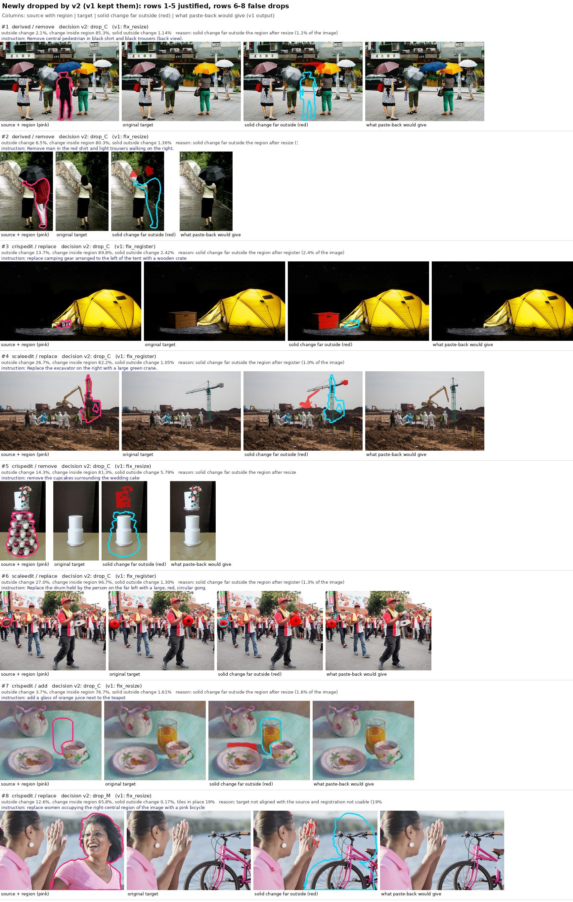

**图 9**　对齐检查丢掉的样本（列：原图 + 区域、目标图、贴回会得到的图）：第 2 行鞋带的残影错位，第 3 行旗子悬在空中，第 4 行珍珠周围有错位的暗边

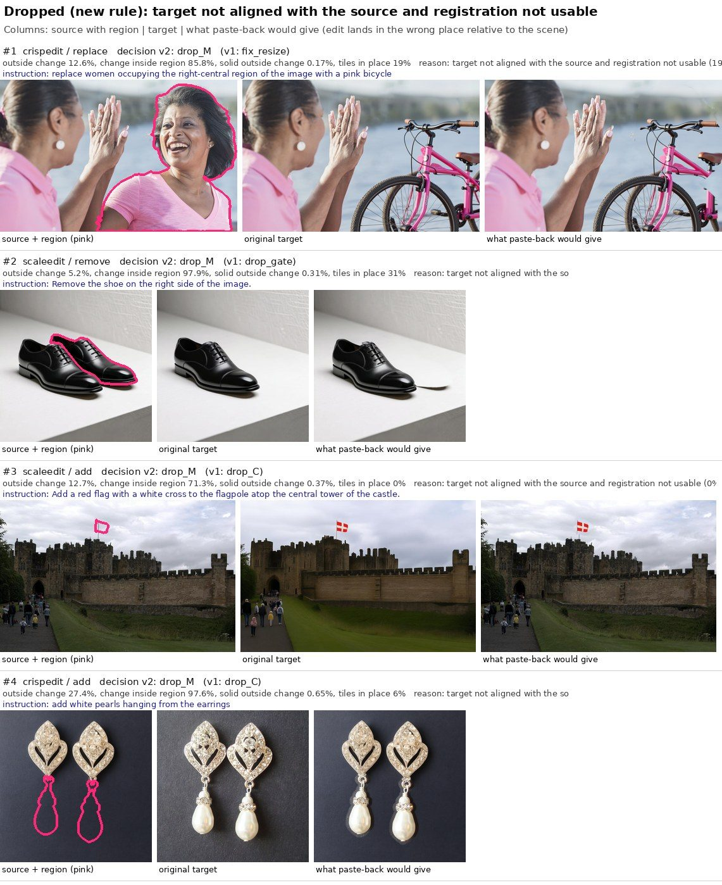

**图 10**　新规则救回的样本（列：原图 + 区域、目标图、区域外的成块改动、处理后的目标图）

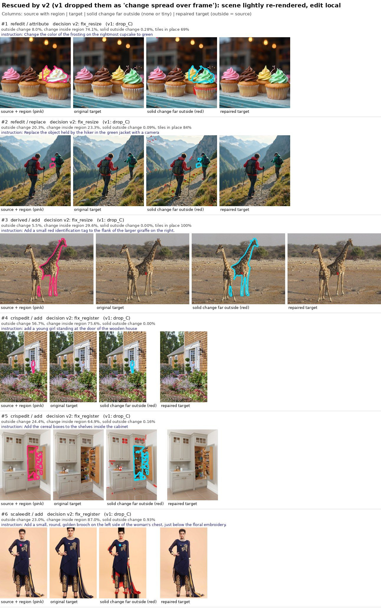

**图 11**　新批随机抽查中不合格的 4 对（列：原图 + 区域、目标图、处理后的目标图）。前 3 行是上游编辑没做对，第 4 行广告牌的支撑被贴回切掉

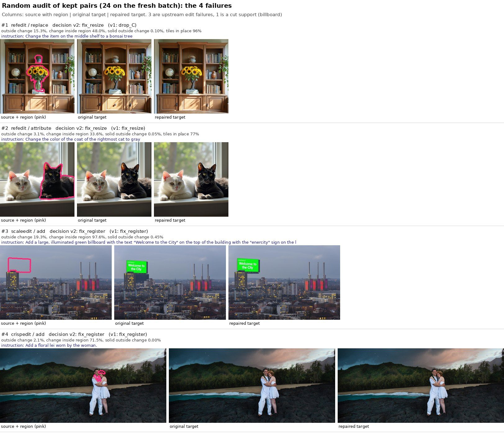

#### 6.7.6 全量预估

按各组的真实行数加权，主四类共 92,303 对：

| 估计所用的批次 | 旧规则 | 新规则 |
|---|---:|---:|
| seed 2（新批） | 68,417（74.1%） | 70,288（76.1%） |
| seed 1 | 65,908（71.4%） | 69,032（74.8%） |

- 两个 seed 的估计相差 1–2.5k，这是每组只抽 40 对带来的抽样误差。
- 分来源（seed 2，旧规则 → 新规则）：

  | 来源 | 旧规则 | 新规则 |
  |---|---:|---:|
  | RefEdit | 5,415 | 7,371 |
  | CrispEdit | 25,750 | 25,393 |
  | ScaleEdit | 14,567 | 15,082 |
  | Derived | 22,685 | 22,443 |

- 分类型（seed 2，新规则）：remove 22,635，attribute 22,267，replace 13,230，add 12,156。

#### 6.7.7 结论与建议

1. **新规则比旧规则好。**
   - 多保留约 2–3k 对，主要是 RefEdit 带空间/序数指代的 attribute 和 replace，和评测的指代形式接近；
   - 同时去掉了一批「贴回会抹掉、截断或放错编辑」的样本。

   建议全量执行时用新规则。
2. **两版在新批随机抽查上都只有 83–84% 合格，没有达到 90%。** 剩下的问题主要是上游编辑本身没做对，像素规则查不出来。建议全量前加一道 MLLM 编辑核验：
   - 输入：区域附近的原图裁切、处理后目标图的裁切，以及指令；
   - 输出四档：做到 / 只做了一部分 / 改错了对象 / 没做；add 另外问「新物体是否完整，有没有悬空或被截断」；
   - 对全部保留样本（约 7 万对）跑一次，只保留「做到」的。
3. **贴回对 add 有一个查不出的副作用。** 目标图上的 add 区域只盖住物体的一部分时（伞面没盖伞杆、广告牌没盖下面补出来的楼），贴回会把其余部分切掉。seed 1 的 42 对贴回过的 add 中有 2 对。
   - 上面的 MLLM 核验可以顺带查出这类样本；
   - 根本解决要在打标时让 add 的区域盖住整个物体，包括支撑部分和影子。
4. **全量执行仍待你确认**，同时请决定是否先加 MLLM 核验。（全量已于同日执行，未加 MLLM 核验，见 6.8。）

### 6.8 数据路径整理与全量清洗（2026-10-09）

按要求先整理四个子集的数据路径，再用改进版规则对全部 98,574 对做清洗。MLLM 编辑核验没有做。

#### 6.8.1 数据路径整理

四个子集各自归到 `datasets/` 下的一个文件夹（以下路径相对 `/mnt/bn/strategy-mllm-train/user/tanyue/`）：

| 子集 | 新位置 | 内容 |
|---|---|---|
| RefEdit | `datasets/RefEdit_Labeling/` | `source/RefEdit`（上游数据）、`stages/`（质量预筛、两轮 mask）、`final/RefEdit-mask-prefiltered-qwen38-self-contained`（最终数据集） |
| CrispEdit | `datasets/CrispEdit_Labeling/` | 原 `CrispEdit-labeling/` 整棵树，内部结构不变；最终数据集是 `final_dataset_39k/` |
| ScaleEdit | `datasets/ScaleEdit_Labeling/` | `source/ScaleEdit-filtered-source`、`runs/`（原 `experiments/ScaleEdit/`）、`final/scaleedit_25k`（最终数据集） |
| Derived | `datasets/SAMTok_Derived_Edit_Labeling/` | `combined/`（最终数据集，位置没变）、`runs/`（原 `experiments/SAMTok_Derived_Edit_Labeling/`） |

- **做法**：全部是同一文件系统内的目录改名，没有复制数据。移动前后核对了各最终数据集的行数（7,804 / 38,971 / 25,664 / 27,957）。
- **软链接**：移动的目录树里有 211 个使用绝对路径的软链接（CrispEdit 23 个、Derived 运行目录 188 个），都已改为指向新位置。
- **代码同步**：
  - 四个打标分支（仓库 `sam3-crispedit`）里的路径已更新并推送；
  - 本仓库的 `preparation/sources.py` 已指向新位置；
  - `qwen-image-2.1-dev` 分支按约定没有改，它的 `sources.py` 仍是旧路径。
- **不受影响的部分**：v2 训练清单引用的是 `experiments/SAMTokEdit/qwen21_full4_20260928/data/assets/` 里的拷贝和 Derived 的 `combined/`，两者都没有动。
- **记录**：每个子集目录下的 `README.md` 列出了目录结构和新旧路径对照；逐条移动记录在 `experiments2/SAMTokEdit/qwen21_v2/data/reorg_20261009/`。
- **留给你处理的**：
  - 23 个已失效的旧入口软链接（`datasets/CrispEdit-2M*` 10 个、`experiments/CrispEdit/` 下 13 个）和空目录 `experiments/RefEdit`，删除操作被权限策略拦下，没有执行；
  - 3 个不在最终版本产出链上的旧流程目录没有动：`datasets/ScaleEdit-CrispEdit-mask-train`（208 GB）、`datasets/ScaleEdit-CrispEdit-mask-referential-filter`、`datasets/ScaleEdit-filtered-balanced-final-task-100k-vllm-labeled`。

#### 6.8.2 全量脚本

代码在 `scripts/data_cleaning/`：

| 文件 | 作用 |
|---|---|
| `clean_pairs.py` | 逐对判定、修复并写出数据集（`run`），生成清单和汇总（`finalize`） |
| `checks.py` | 区域外成块改动检查、对齐检查 |
| `verify_cleaned.py` | 对输出做全量校验 |
| `reprocess.py` | 规则变更后重跑一部分样本并更新判定 |

判定规则与 6.7 节相同，另有三处改动：

1. **「原样保留」的判断改为现场计算**区域外改动，不再读早先的审计文件。审计文件对源图、目标图尺寸不同的样本算法略有出入；现场计算的值与最终保留的图是自洽的。
2. **按实例更正坐标**（见 6.8.3）。
3. **新增一条规则**：如果配准会把标在目标图上的实例推出画面 10% 以上，就不采用配准结果。这是全量抽查时发现的：一对「加 RESTROOM 牌子」的样本，配准后牌子上半截被图片上缘截掉了。全量中有 231 对属于这种情况，加规则后 229 对改判为丢弃。

回归测试（6.7 节人工验证过的 seed 2 那 640 对）：
- 判定 638 对一致；不一致的 2 对来自上面第 1 处改动，由贴回变为原样保留。
- 两边都做了修复的 232 对里，223 对输出逐像素相同；其余 9 对是尺寸不同的 CrispEdit add，平均差异小于 0.006 个灰度级，来自区域映射方式的改变。

#### 6.8.3 坐标更正

约定：
- 每一对的目标图与源图同尺寸。尺寸不同但不需要贴回的 7,421 对，目标图缩放到源图尺寸后保存。
- 所有 mask 和框都在源图像素坐标系。每个实例和实例的并集都带 COCO RLE mask，以及 0–1000 的外接框（向外取整，与 `samtok_edit21.data.protocol.pixel_box` 相同）。

需要更正的是**标在目标图上的实例**（主要是 add 的新物体）：
- 在 `sources.jsonl` 里，这些实例是按直接缩放映射到源图坐标的。目标图有位移或缩放时，这个位置是错的。
- 目标图配准后，这些实例按同一个仿射变换移动到正确位置；标在源图上的实例不动。
- 小批量试验把一对样本的所有实例一起移动；全量改为逐实例处理，对同时带两类实例的样本才是对的（会走配准的这类样本在 ScaleEdit 里有 166 对）。

全量中有 6,307 个实例（5,466 对）被更正，其中 ScaleEdit add 4,234 对、CrispEdit add 1,080 对。

验证：
- 框的算法与仓库实现逐一比对：2,000 个随机 mask 和回归批的全部 653 个实例，结果相同。
- 回归批里被移动的 60 个实例：位置偏移的中位数是长边的 1.2%，最大 5.4%；更正后 mask 内被改动的像素占比从 0.63 升到 0.83。
- 目检见图 12、图 13。

**图 12**　坐标更正前后对比：红色是按直接缩放得到的旧位置，绿色是更正后的位置。上排和下排左一是偏移最大的 4 个；下排后两个偏移极小，两条轮廓基本重合

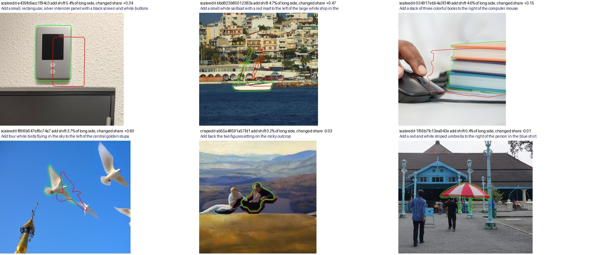

**图 13**　全量结果中随机抽的 8 对「区域被移动」样本（列：原图 + 旧区域、原目标图、清洗后的目标图、清洗后的目标图 + 更正后的区域（绿）和框（黄））

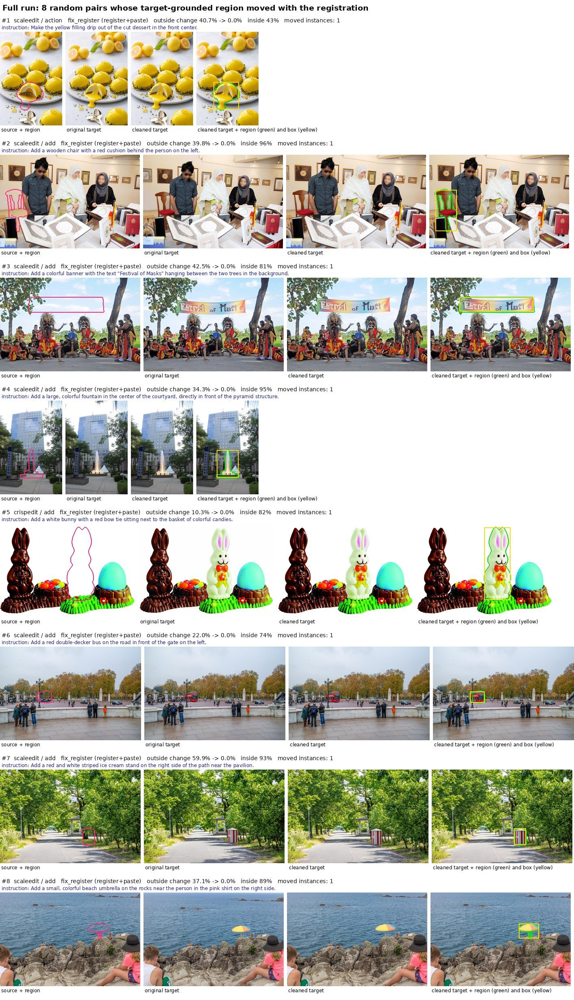

#### 6.8.4 结果

- **运行**：98,574 对，80 个进程，19.2 分钟（每秒约 86 对），没有报错；加规则后重跑 14,096 对用了 3.3 分钟。清洗只用 CPU。
- **保留 70,956 对（72.0%）**；主四类保留 66,684 / 92,359（72.2%）。
  - 按类型：remove 21,558，attribute 20,952，replace 12,860，add 11,314。
  - 按来源：RefEdit 7,108（91%），CrispEdit 22,619（61%），ScaleEdit 15,283（79%），Derived 21,674（78%）。
- **比小批量估计低约 3 个百分点**（6.7.6 节估计 74.8–76.1%）。原因是抽样误差：在两批试验样本上，全量判定与试验一致（保留 502 对 501、509 对 509）；偏差主要在 CrispEdit，例如 remove 实际保留 58%，两批样本各 40 对得到的是 65% 和 68%。
- `action`、`text` 和无单一类型的样本用同一套规则处理，保留 4,272 对，但规则只在主四类上做过人工验证。

| 来源 | 类型 | 总数 | 原样保留 | 贴回 | 配准后贴回 | 检查不过 | 成块改动 | 错位 | 改动过弱 | 保留 |
|---|---|---:|---:|---:|---:|---:|---:|---:|---:|---:|
| refedit | add | 2,909 | 2,784 | 38 | 0 | 10 | 39 | 0 | 38 | 2,822（97%） |
| refedit | remove | 1,163 | 1,097 | 7 | 0 | 2 | 5 | 0 | 52 | 1,104（95%） |
| refedit | replace | 1,270 | 25 | 1,050 | 0 | 150 | 34 | 4 | 7 | 1,075（85%） |
| refedit | attribute | 2,462 | 74 | 2,033 | 0 | 258 | 60 | 3 | 34 | 2,107（86%） |
| crispedit | add | 3,563 | 1,277 | 128 | 1,080 | 191 | 777 | 73 | 37 | 2,485（70%） |
| crispedit | remove | 13,276 | 3,766 | 694 | 3,195 | 1,252 | 3,725 | 448 | 196 | 7,655（58%） |
| crispedit | replace | 8,916 | 2,707 | 281 | 2,386 | 1,671 | 1,493 | 176 | 202 | 5,374（60%） |
| crispedit | attribute | 11,485 | 3,206 | 420 | 3,479 | 2,024 | 1,517 | 247 | 592 | 7,105（62%） |
| crispedit | action | 488 | 1 | 0 | 186 | 212 | 74 | 7 | 8 | 187（38%） |
| scaleedit | add | 6,023 | 558 | 23 | 4,244 | 206 | 885 | 102 | 5 | 4,825（80%） |
| scaleedit | remove | 5,695 | 1,680 | 73 | 3,190 | 239 | 415 | 59 | 39 | 4,943（87%） |
| scaleedit | replace | 2,951 | 619 | 35 | 1,100 | 555 | 585 | 43 | 14 | 1,754（59%） |
| scaleedit | attribute | 4,689 | 1,087 | 81 | 2,593 | 278 | 524 | 101 | 25 | 3,761（80%） |
| scaleedit | action | 2,407 | 85 | 41 | 1,028 | 634 | 529 | 64 | 26 | 1,154（48%） |
| scaleedit | text | 2,053 | 1,760 | 151 | 39 | 30 | 13 | 4 | 56 | 1,950（95%） |
| scaleedit | 无单一类型 | 1,267 | 306 | 31 | 644 | 74 | 158 | 42 | 12 | 981（77%） |
| derived | add | 6,269 | 923 | 207 | 52 | 171 | 0 | 0 | 4,916 | 1,182（19%） |
| derived | remove | 7,990 | 7,838 | 18 | 0 | 23 | 64 | 0 | 47 | 7,856（98%） |
| derived | replace | 5,016 | 4,382 | 217 | 58 | 195 | 77 | 2 | 85 | 4,657（93%） |
| derived | attribute | 8,682 | 7,979 | 0 | 0 | 0 | 0 | 0 | 703 | 7,979（92%） |

**图 14**　全量清洗的判定分布（全部 98,574 对，按来源 × 类型）

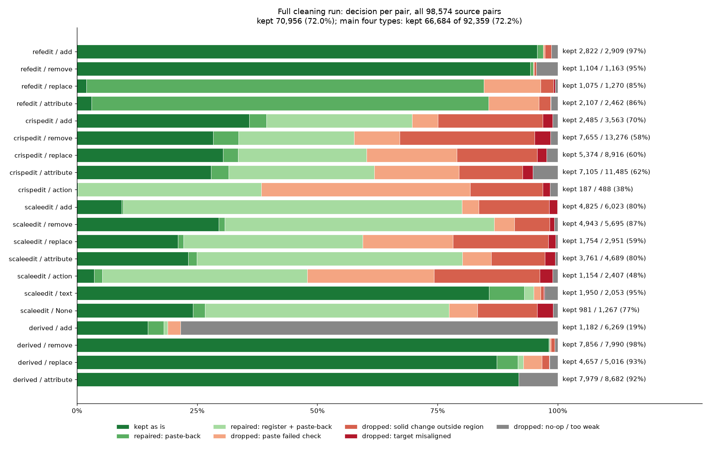

#### 6.8.5 输出与校验

输出目录：`datasets/SAMTokEdit_Cleaned_20261009/`。

| 文件 | 内容 |
|---|---|
| `manifest.jsonl` | 保留的 70,956 对，每行一对：图片路径、尺寸、判定、每个实例的 mask 和框、并集、指标、溯源 |
| `decisions.jsonl` | 全部 98,574 对的判定，含丢弃原因和指标 |
| `images/` | 源图和目标图，共 141,912 个文件 |
| `summary.json`、`verification.json` | 分组计数与规则阈值、校验结果 |
| `README.md`、`scripts/`、`logs/` | 字段说明、运行时的代码和日志 |

- **图片**：没改动的图是指向原文件的硬链接，不占额外空间（全部源图，以及 34,733 个目标图）；处理过的 36,223 个目标图存为 PNG，约 102 GB，这是实际新增的存储。
- **溯源**：清单里记录的各子集最终数据集位置已是整理后的新路径，涉及的 2,897 个分片文件全部存在。
- **全量校验**（`verify_cleaned.py`）：
  - 70,956 对逐一检查了文件存在、两图同尺寸、硬链接或 PNG、每个实例的 mask 和框、并集、保留标准，有问题的对数为 0；
  - 随机 3,000 对从写出的文件重新计算指标，与记录完全一致；
  - 保留样本的区域外改动最大 2.00%，区域内改动最小 0.100，都在标准之内。

#### 6.8.6 后续

1. **重建训练清单**（Stage 1、Stage 2）还没有做，需要先定三件事：
   - Stage 2：删去被丢弃的对，图片改指清洗后的数据，add 的框换成更正后的。非 add 但区域被移动的样本在主四类里只有 29 对，它们的 mask token 要用 codec 重新编码，或者直接不用。
   - Stage 1：add 的框来自目标图，被丢弃的 add 对应的定位样本也应删去；其他类型的定位只依赖源图，可以保留。
   - `action`、`text` 是否纳入。
2. **MLLM 编辑核验**仍建议在训练前做（6.7.7 节第 2 条）。小批量抽查里约 15% 的保留样本属于上游编辑没做到位，全量结果里这部分还在。

## 7. 附录：四个来源的构造流程要点

### 7.1 RefEdit（`sam3-refedit-labeling`）

- 来源 `bpathir1/RefEdit`，18,249 行。质量预筛（Qwen3.8-27B）PASS 7,836 → grounding（Qwen3.5-35B）→ SAM3 分割 → 收 7,804 行，全部 1024×1024。
- add 的区域来自 MLLM 在**目标图**上定位的新物体，再映射回源图坐标；remove/color/material 标在源图。
- 有 prefilter + mask QC，但**没有像素对齐检查**，也没有 mask 面积上限。
- 已知问题：color/material/replace 的目标图在 mask 外被重新生成（我实测：mask 外改动占全部改动的 60–73%）。
- 指令里 68% 含明确的空间或序数指代（「第三张桌子上的笔记本电脑」），这与评测的指代风格接近，可继续使用。

### 7.2 ScaleEdit（`sam3-scaleedit-labeling`）

- 来源 `InternVL-U/ScaleEdit-12M` 与过滤清单，本地 299,633 行。质量预筛 → 场景难度筛（只剩 25,664）→ grounding → SAM3 → 25,085 行。
- **流程不缩放、不裁剪、不改编码**，源图/目标图原样透传；错位来自上游数据。
- 质量提示词明确要求「不要苛求像素级对齐」「忽略重采样、光照和小幅生成漂移」，因此错位从未被拦下。
- 尺寸不同的样本（22%）几乎都是等比缩放（87%），同尺寸样本才是几何错位的主要来源。
- add 的区域在目标图上，映射回源图时用直接 resize，视角不同时必然错位。

### 7.3 CrispEdit（`sam3-crispedit-labeling`）

- 来源 `WeiChow/CrispEdit-2M`（EditMGT 论文配套数据），本地 2,081 个分片、约 529,020 行、1.1 TB；分片按类型命名（add / color / remove / replace / motion change 各 445，另有旧的 background、style）。
- 流程：质量预筛（Qwen3.8-27B，529,020 → 通过 460,518）→ 场景难度筛（只看源图，460,518 → 38,971，只剩 8.5%）→ grounding（同一模型两遍：先描述编辑，再逐单元给 0–1000 的框）→ SAM3 分割（38,971 → OK 37,728、MASK_REVIEW 910、GROUND_FAIL 333）→ 合并导出 39k。
- 区域：remove/replace/color/motion 标在**源图**，add 标在**目标图**再 resize 回源图坐标；导出 mask 一律在源图坐标系，与源图同尺寸。
- 质量门：预筛 6 个维度全过才留（驳回最多的维度是 edit_completion 8,642、target_integrity 3,367、content_preservation 2,958）；场景筛要求指令里有明确的指代短语。
- **没有像素对齐检查，也没有「改动是否落在区域内」检查**。唯一的几何检查是 add 的宽高比差（阈值 0.02），并且最坏结果只是打一个 review 标记，不丢样本。预筛的提示词还明确写着「不要苛求像素级对齐」「忽略重采样、纹理、光照和小幅生成漂移」，`PAIR_MISALIGNED` 这个原因码在 52.9 万行里只出现过 8 次。
- 错位成因：**52.4% 的样本源图和目标图尺寸差几个像素**（例如 1366×1024→1359×1024、1537×1024→1536×1024），宽高比差中位 0.7%，这是生成器按自己的 VAE 网格输出造成的；按分片和批次聚集，`motion change` 类 100% 如此。我实测：尺寸相同的样本区域外改动中位 0.052、对齐率 50%；尺寸不同的样本中位 0.168、对齐率 29%。尺寸不同的样本里只有 39% 是严格等比缩放，其余带非等比形变（所以配准后能救回一部分，见 2 节）。
- 其他已知问题：容器内容被漏标（`remove_01000:197`、`remove_00893:85`）；局部 add 被扩展成宿主整体（`add_00005:57`，勺子 → 覆盖整个罐子的 216,256 像素）；193 行「一遍描述没看到实际改动」仍进入导出；`MASK_REVIEW` / `GROUND_FAIL` 默认随数据集发布（占 3.2%），训练侧需要自己过滤。

### 7.4 SAMTok Derived（`sam3-samtok-derived-edit-labeling`）

- 来源 `mix_gres8k_ver4k_train.parquet`（SAMTok GRES-8k + VER-4k），7,671 张图、10,633 个区域。mask 直接复用，不做重新分割。
- 四类分别生成：remove 用 Qwen-Image-2.1 在裁切块上重绘后再写回，replace 生成新物体，attribute 只在原 mask 内粘贴（区域外逐像素等于源图），add 是在宿主上加一个小物件。
- 审计为「模型通过」，全部 27,957 行都标注 `model_pass_not_human_verified`；冻结集人工复核 65/96 通过，27B 审计漏掉了 31 个失败中的 23 个。
- 已知问题：平涂式删除、小贴纸 add、弱属性改动（444 条 <10%）、残片和阴影残留。
