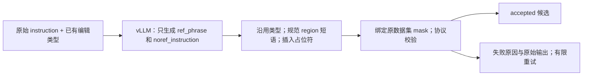

# noref 两字段转换实现与 4B / 8B 对照实验

现已选择 Qwen3.5-9B 做全量转换；失败分类见[9B 样本审计](SAMTokEdit_Qwen21_9B未通过样本审计.md)。最新 prompt 优化及 4B / 8B / Qwen3.5-9B 复测见[模型复测记录](SAMTokEdit_Qwen21_noref提示词优化与模型复测.md)。本页历史实验数字保留原口径。

更新：2026-09-29。当前 prompt/校验已修订；第 4 节保留旧版模型对比结果，不能当作新版准确率。最新失败分析与验证见[修复记录](SAMTokEdit_Qwen21_noref失败分析与修复.md)。四机完整 ARNOLD 入口仍在[四机运行指南第 7.3 节](SAMTokEdit_Qwen21_四机训练运行指南.md#73-完整-arnold-入口)。

## 1. 总体说明

模型只完成语义任务：从原始 instruction 提取 `ref_phrase`，并写出 `noref_instruction`。模型输出严格只有这两个字段，不再输出 edit_type、add anchor、mask ID、审核结论，也不生成 `{mask_i}`。每条正常记录只需要一次 vLLM 生成；程序检查不通过才带错误原因重试，最多三次。没有同一个模型的重复抽取/自审调用。

noref 的中间文本统一使用 `this region`，add 使用 `in this region`。程序按已有类型改成训练协议要求的 region 短语并插入占位符。这样，类型、mask 索引与格式控制由程序处理，模型只负责保留编辑语义、消去旧定位描述。



只使用数据集原 mask；单操作引用已有 aggregate，复合操作按已有描述绑定实例 ID。不重新计算 mask 或检查其几何准确性。后续真实 codec 编码仍是独立数据物化步骤，本脚本不导出诊断 mask code。

## 2. 详细实现

### 2.1 输入与模型输出

[annotate_full.py:83](../samtok_edit21/annotate_full.py#L83)：输入原指令及已有的协议类型；只有类型尚未映射时才传原生粗类别。源记录仍完整保留 dataset、native_type、instances 与 ID；这些字段不需要模型重复生成。重试请求额外携带上一条错误原因与 previous_output，使模型可以针对实际答案纠错。

```json
{
  "instruction": "Add a basket filled with grapes beside the chair.",
  "edit_type": "add"
}
```

模型只返回：

```json
{
  "ref_phrase": ["basket filled with grapes beside the chair"],
  "noref_instruction": "Add a basket filled with grapes in this region."
}
```

现在所有模型输出的 `ref_phrase` 都统一为列表，包括只有一个指代的样本；程序仍兼容历史字符串。复合指令仍是两个字段：

```json
{
  "ref_phrase": ["cat", "dog"],
  "noref_instruction": "Remove this region and recolor this region blue."
}
```

模型使用 JSON schema 约束输出，禁止额外字段。原始两字段结果写入 `model_output`；下游所需信息由程序写入 `annotation.units`，两者并存便于追溯。

### 2.2 类型沿用与粗类别细化

[annotate_full.py:91](../samtok_edit21/annotate_full.py#L91)：RefEdit、CrispEdit、ScaleEdit、Derived 中已有明确映射的类型直接沿用，模型没有重新分类权限。原生类别到协议类型的基础映射沿用 [prepare.py:TYPE_MAP](../samtok_edit21/prepare.py#L32)。

```python
mapped = source.get('provisional_type')
if mapped in REGION_PHRASES:
    return mapped, 'dataset_mapping'
```

98,574 条中有 1,267 条 ScaleEdit 的 reasoning/count/composite 等粗类别没有直接的原子类型映射。它们保留原生类别，并由操作词/已有 reference 的有限规则细化，记录 `type_resolution=coarse_label_operator_rule`。这不是对全量 noref 的正则改写；reference 边界和 noref 语义依然由模型生成。不能明确细化或不能绑定 mask 的记录进入失败队列。

数据原生类型也不等于绝对正确的语义标签。例如本批 RefEdit 的 `Change the globe on the wooden shelf to a clock` 原生类别是 `material_change`，程序按用户要求沿用 attribute；原指令本身描述的是对象替换。该冲突会在审阅表中注明，不让小模型静默改标签。

### 2.3 程序生成协议字段

[annotate_full.py:179](../samtok_edit21/annotate_full.py#L179)：检查 reference 是原文唯一连续片段，按原文顺序对应 region；将中间文本规范成下表的训练短语，再插入 `{mask_i}`。

| 训练类型 | 程序生成的片段 |
|---|---|
| add | `in this region {mask_i}` |
| remove / replace / action | `the object in this region {mask_i}` |
| attribute / background | `this region {mask_i}` |
| text | `the text in this region {mask_i}` |
| global | `this image {mask_i}` |

上面的 add 例子最终得到：

```json
{
  "units": [{
    "edit_type": "add",
    "ref_phrase": "basket filled with grapes beside the chair",
    "type_resolution": "dataset_mapping",
    "mask_ids": ["union"]
  }],
  "noref_instruction": "Add a basket filled with grapes in this region {mask_0}."
}
```

不需要 `anchor_phrase`：现有 [prepare.py:reviewed_noref](../samtok_edit21/prepare.py#L142) 已支持完整显式 noref，ref/NTP 路径只需要 reference 与 mask codes。这里复用该路径，不再让规则根据 anchor 从头生成 noref。

本轮还修复了 [prepare.py:canonical_reference](../samtok_edit21/prepare.py#L70) 中引号截断的问题：已完整加引号的文字如 `'5'6"'` 保留整体，避免英寸/撇号使 OLD 文本被截短。Unicode 连字符差异仅在唯一匹配时回填原文拼写，不猜测或改写指代。

### 2.4 原 mask 绑定、检查与失败记录

[annotate_full.py:146](../samtok_edit21/annotate_full.py#L146)：一个语义单元直接引用已有 `union`；多个单元按 reference 与已有 instance/observation 描述的词项重合绑定 ID，覆盖每个实例一次。词项匹配只是保守的文本关联，不能当作语义证明；存在歧义就保留失败，绝不生成新 mask。

[annotate_full.py:275](../samtok_edit21/annotate_full.py#L275)：复用原 `convert_record` 验证 NTP/ref/noref 结构、引用顺序和占位符。[annotate_full.py:322](../samtok_edit21/annotate_full.py#L322) 现在只有确定性检查：新词异常、add 丢失新增内容、text 的 OLD/NEW 混淆、属性操作词被吞入引用等。输出明确记录 `semantic_quality_verified=false`；没有用模型的自评充当准确率。

[annotate_full.py:409](../samtok_edit21/annotate_full.py#L409)：每卡一个 TP=1 副本，BF16、temperature=0、max_tokens=512、max_model_len=8192、batch_size=64。Qwen3-8B 使用 `enable_thinking=False`，与 4B 的直接输出方式一致。续跑身份包括输入、模型、prompt、schema、转换实现以及 prepare/protocol 的 SHA256；本轮新增推理依赖版本与 engine_options，防止跨环境续写。

### 2.5 四机行为

[annotation_cluster.py](../samtok_edit21/annotation_cluster.py#L1) 继续采用 4 节点 × 8 个独立副本，按全局行号模 32 分片，沿用 ARNOLD 拓扑、失败传播和完整汇总；当前正式转换不初始化 W&B。

现在区分“任务处理完”和“每条转换通过”：所有行都有 accepted/failed 结果且汇总校验成功，就完成任务并写 SUCCESS；个别转换失败保存在 `failed.jsonl`，不将正常处理完的任务误报成基础设施故障。`CANDIDATES_COMPLETE.json` 仍只在零转换失败时生成。基础设施错误、缺分片、错误归属等仍会令作业失败。SUCCESS 中的 `candidates_complete`、accepted_count、failed_count 必须一起看，不能用 SUCCESS 推断训练数据已全部就绪。

## 3. 当前完整 prompt

共享规则如下，直接摘自当前代码的 `PROMPT` 常量：

```text
Convert the input image-edit instruction into a version located by a mask.
Return ONLY JSON: {"ref_phrase": ["original phrase"], "noref_instruction": ...}.

ref_phrase is a LIST, one item per edited referent. Copy each complete original
object/PART description EXACTLY, including old location/identity qualifiers,
without leading a/an/the. Exclude the action, property operators and replacement.
For addition, copy NEW content plus placement. For text replacement, copy OLD
quoted text including quotes, or its carrier when no OLD text is supplied.
For text insertion, reference the carrier/placement, NEVER the NEW text.
A whole-image edit uses ["this image"]. Do not shorten or paraphrase references.

noref_instruction: replace old edited objects and their locating descriptions
with "this region". Keep original wording otherwise: actions, new values/content,
counts, comparisons and keep-unchanged clauses. Do not add property names or expand
verbs. For addition keep ALL new content, including clothing/appearance/pose;
replace only placement with "in this
region" (append it if placement is absent). For text replacement remove OLD text
and its carrier/location but preserve NEW text and every additional constraint.
Do not keep a from-OLD clause, repeat NEW as OLD, or write text-on-this-region.
For text insertion use Add NEW to this region, preserving the exact NEW text.
Do not generate mask tokens or classify the edit. Independent edited referents
need separate list items and one "this region" each in original order. A joint
operation uses one reference. Comparisons and action participants are not separate
edits: retain the unchanged comparison object/action destination in noref.
The placeholder denotes the WHOLE selected reference, including its part name.
Never write "seat of this region" when ref_phrase already selects the seat.
If correction is provided, revise previous_output to address it; do not repeat it.
```

每次只附本类一个格式示例，模型沿用输入类型、不输出 edit_type。没有匹配示例的 reasoning/count 等粗类别不强加 composite 示例。只有原生 `compositional_editing` 使用复合示例。示例字典如下：

```python
{
    'attribute': ('Make the rough wooden bowl smooth.', ['rough wooden bowl'], 'Make this region smooth.'),
    'remove': ('Remove the broken clock on the wall.', ['broken clock on the wall'], 'Remove this region.'),
    'replace': ('Replace the house with a tiled roof on the left with a glass tower.', ['house with a tiled roof on the left'], 'Replace this region with a glass tower.'),
    'action': ('A person jumps off the ledge.', ['person'], 'This region jumps off the ledge.'),
    'add': ('Add a woman in a green coat and white boots beside the bus.', ['woman in a green coat and white boots beside the bus'], 'Add a woman in a green coat and white boots in this region.'),
    'text': ("Replace the text 'Exit' with 'Open' on the sign.", ["'Exit'"], "Replace this region with 'Open'."),
    'composite': ('Remove the chair and make the old desk smooth.', ['chair', 'old desk'], 'Remove this region and make this region smooth.'),
}
```

输出仍只有 `ref_phrase` 与 `noref_instruction`。示例不包含需要让模型生搬的 `color of` 属性模板，也不包含旧版 grapes/OLD 内容。
## 4. 历史对照实验与质量记录（旧 prompt）

同一批 155 条，四数据集、31 个原生类别各 5 条。该批数据已用于开发诊断，**不是独立留出集**。我逐条阅读了两组输出，并将结论保存为 review-4b.jsonl / review-8b.jsonl；这是文本审阅判断，未经独立人工金标验证。没有重新判断原 mask 的准确性。

两个模型分别是 Qwen3-4B-Instruct-2507 和 Qwen3-8B（关闭 thinking），并非同一个发行版仅改变参数量。当时使用相同的旧 prompt（按 4B tokenizer 计 397 tokens）、同一 H100 GPU、BF16、TP=1、batch=64、temperature=0、最多三次尝试；依次运行，未相互争抢 GPU。

| 指标与分母 | Qwen3-4B-Instruct-2507 | Qwen3-8B |
|---|---:|---:|
| 程序检查通过 / 全部输入 | 145/155（93.5%） | 143/155（92.3%） |
| 转换失败，完整保留记录 | 10 | 12 |
| 主要编辑意图保留 / accepted | 139/145（95.9%） | 136/143（95.1%） |
| ref+noref 严格通过 / accepted | 115/145（79.3%） | 114/143（79.7%） |
| ref+noref 严格通过 / 全部输入（失败也计不通过） | 115/155（74.2%） | 114/155（73.5%） |
| 155 条转换耗时，含重试与程序检查，不含模型初始化 | 6.13 秒 | 8.00 秒 |
| 输入处理吞吐 | 25.3 条/秒 | 19.4 条/秒 |
| LLM 初始化 | 33.92 秒 | 36.46 秒 |
| 含重试的生成请求 / 输出 tokens | 180 / 5480 | 180 / 5512 |

“主要编辑意图保留”检查操作、新内容、数量、目标对象/部件是否明显改变或丢失；它容忍部分定位文字残留和边界不完整。“严格通过”还要求完整的 reference 与 noref：包括 add 的 placement、旧定位描述充分消去、多操作逐一关联等。因此不能把约 95% 的主要意图保留率写成完整 noref 准确率。严格口径的计数是保守的文本审阅结果，歧义例子也记入问题清单。

**这批数据支持继续默认使用 4B：转换吞吐约为 8B 的 1.30 倍，而 8B 没有明确的整体质量收益。** 主体语义大体可用，但严格引用边界仍有改进空间；这些结果不能证明全量数据已逐条验收。

模型初始化计时为 LLM 构建与预热，不包括 Python import、模型文件 SHA256 和共享盘复制。速度是这台机器上的小批量实测，不把它直接线性外推成四机全量耗时。

按数据集的严格通过数（分母包括转换失败）：

| 数据集 | 4B | 8B |
|---|---:|---:|
| CrispEdit | 22/25 | 17/25 |
| SAMTok Derived | 18/20 | 17/20 |
| RefEdit | 19/25 | 22/25 |
| ScaleEdit | 56/85 | 58/85 |

### 4.1 已修复与仍存在的实例

| 实例 | 本轮结果 |
|---|---|
| `Add a white crew sock to the ankle ...` | 4B 最初删掉了 sock，确定性检查触发重试；最终保留 `Add a white crew sock in this region {mask_0}.`。 |
| `Separate the stacked white cups ...` | 粗类别细化为 action，生成 object-region 短语，不再误作 attribute。 |
| `Insert the text 'HALLOWEEN' in green between 'DREAD' and 'CENTRAL'.` | 两模型都曾把 NEW 当 OLD 或丢掉 NEW；现在进入失败队列，不作为合格候选输出。 |
| `Replace the coffee in the mug with a floral pattern with tea` | 两模型仍把旧杯子的 floral pattern 留成新增内容；这是已接受候选中的真实语义错误。 |
| `Remove ornate cast-iron legs/base of the middle table ...` | 4B reference 仍选到 table 而不是 legs/base；8B 此例较好。 |
| `Open the window on the third floor ...` | 两模型都可能在 noref 留下原窗口的位置；主要操作没丢，严格 noref 不通过。 |
| add 指令中的原 placement | 偶尔只提取新物体、或只提取旧 placement；noref 可以正确，但 reference 不完整，严格口径计错。 |

复合样本的真实最终输出例子：

```text
原文：Remove the person on the scooter on the left, and change the color of the skateboard in the foreground to red.
unit 0：remove；ref=person on the scooter on the left；mask_ids=[unit_0_0, unit_1_1]
unit 1：attribute；ref=skateboard in the foreground；mask_ids=[unit_2_2]
noref：Remove the object in this region {mask_0} and change the color of this region {mask_1} to red.
```

`unit_1_1` 不代表 observation 的 edit_id=1。本例 person 与 scooter 属于同一个观察到的移除操作。已修正绑定实现：instance ID 一律当作不透明标识，辅助 observation 只按明确的 source_ref/target_ref 描述相等关联，不能从 ID 数字猜 edit_id。修正后重放两模型全部原始输出：accepted 内容、mask 绑定和失败数量均无变化，证据见 binding-revalidation.json。

### 4.2 工程验证

本地八卡使用完整 155 条对照集，8 个分片均完成；汇总 145 accepted / 10 failed，无缺失、无重复。移除 W&B 后，以无 `wandb` 包、无 key 的新环境重跑仍是 145/10；145 条的模型输出、标注、检查结果与历史运行逐条相同，10 条失败 ID 相同，且没有 W&B 输出。SUCCESS 中 processed_complete=true、candidates_complete=false、semantic_ready=false、training_ready=false，符合“处理完但仍有失败项”的预期。物理四机尚未在本轮运行。

16 项新后处理检查、5 项合并/损坏/缺失检查、原有 17 项 protocol 测试通过。八卡执行后修正了上述 opaque-ID 关联，再对两模型原始结果做完整后处理重验；没有为这一处文本关联修正重新启动八卡生成。

最终对照输出和审阅路径：

```text
/tmp/samtok21-noref-simple-20260929/
  fresh_sources.jsonl               # 155 条固定对照输入
  measured4b/                       # 最终 4B 输出、身份与计时
  measured8b/                       # 最终 8B 输出、身份与计时
  review-4b.jsonl                   # 每条结论、原因、原文、最终 annotation
  review-8b.jsonl
  review-summary.json
  binding-revalidation.json         # opaque-ID 修正后的完整重验
  local8-final/                     # 八卡分片、汇总、SUCCESS、W&B offline
  local8-no-wandb-final/            # 无 W&B 依赖/凭据的当前八卡运行
  unit-tests.log
  protocol-tests.log
```

输入 SHA256：`987ee6ce4cc9a5b5ee28a2a0f4ec12fc5a8806e44bf1663357d2e3a9191e240e`。两模型的输入、prompt、schema、生成实现、协议依赖与分片配置身份一致，仅模型不同。逐条 raw model_output 和程序 annotation 同时保留，能够区分模型输出问题与后处理问题。


## 5. 使用方式

全量输入继续使用共享盘准备好的 `data/semantic_sources.jsonl`（98,574 条）。四机完整入口和 ARNOLD 环境沿用[运行指南](SAMTokEdit_Qwen21_四机训练运行指南.md#73-完整-arnold-入口)。入口会 git clone 远程分支，因此本地未提交/未推送的修改不会自动进入远程作业。

选择模型只改这一个变量，其余入口不变；两个模型对照必须使用不同 run ID：

```bash
# 4B
export SAMTOK_ANNOTATION_MODEL=/mnt/bn/strategy-mllm-train/common/models/Qwen3-4B-Instruct-2507
export SAMTOK_ANNOTATION_RUN_ID=qwen21_noref_4b_simple_001
# 或 8B（独立作业）
export SAMTOK_ANNOTATION_MODEL=/mnt/bn/strategy-mllm-train/common/models/Qwen3-8B
export SAMTOK_ANNOTATION_RUN_ID=qwen21_noref_8b_simple_001
```

旧版多字段标注与本版身份不同，不能直接使用旧结果 resume；须新开输出目录。本文中的本地测试不代表物理四机运行。当前正式转换不使用 W&B。
