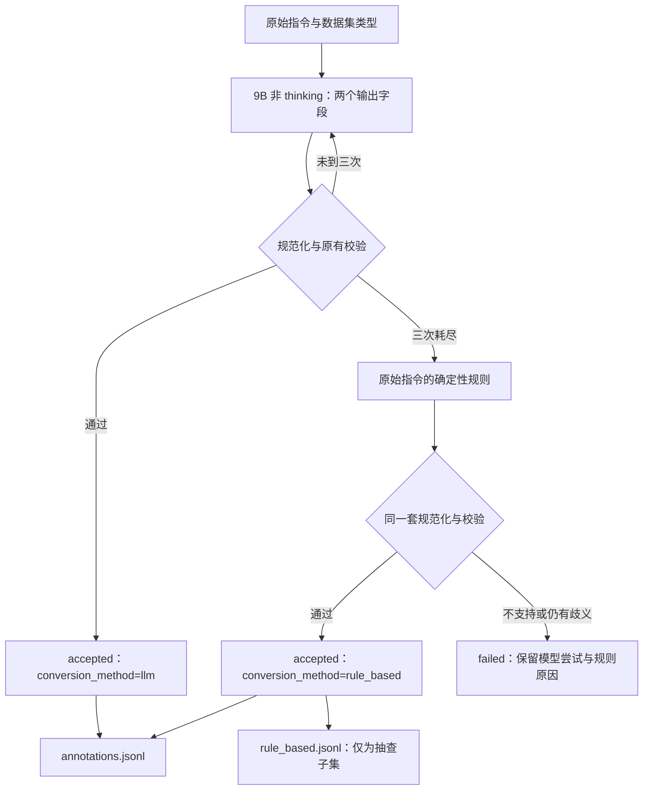

# noref 当前采用版本、规则回退与四机复跑

更新：2026-09-29。完整可复制的 ARNOLD 入口在[四机指南 §7.3](SAMTokEdit_Qwen21_四机训练运行指南.md#73-完整-arnold-入口)，对应仓库脚本 [bootstrap_arnold_annotation_4node.sh](../scripts/train/bootstrap_arnold_annotation_4node.sh#L1)。本轮没有启动远端作业；代码从已推送的 `qwen-image-2.1-dev` 分支 clone，每机八卡、四机共 32 个独立文本转换副本，不使用 W&B。

## 1. 总体说明

采用 **Qwen3.5-9B + vLLM 0.17.1、关闭 thinking、精简共享规则 + 每条按类型附一个示例**。选择依据见[prompt 对照](SAMTokEdit_Qwen21_noref三例Prompt与Thinking对照.md)：原 312 条与独立 60 条中，此方案的程序通过数分别为 273、58，固定 122 条助手文本审阅通过 108 条。统一三个示例与开启 thinking 均未显示更好结果。以上是有限样本实验，没有独立人工金标，不是全量准确率。

模型仍只输出 `ref_phrase` 与 `noref_instruction`，不输出 edit_type、anchor、mask ID。先尝试模型转换，程序检查失败时带反馈重试，默认最多三次；仍失败则从**原始 instruction**做规则转换。规则结果继续经过原有类型解析、原文指代检查、NEW 内容检查与已有 mask 绑定。两种来源的通过结果使用同一训练协议；规则仍无法可靠处理的样本明确记录为失败。



数据集提供的 mask 沿用原值，不生成新 mask，也不核查其几何。单操作的 `mask_ids=["union"]` 是引用数据集已有 aggregate；同一个操作作用于并列对象时，可以用一个完整联合指代引用该 aggregate。多个独立操作仍需按现有实例描述确定对应关系；文本与 mask ID 绑定不明确时保留失败。

## 2. 详细实现

### 2.1 保留采用版本，移除实验分支

[共享 prompt](../samtok_edit21/annotate_full.py#L20)与[按类型示例](../samtok_edit21/annotate_full.py#L41)保持上一轮选定版本。[生成路径](../samtok_edit21/annotate_full.py#L511)固定 `enable_thinking=False`、512-token 输出预算；BF16、temperature=0、prefix caching、TP=1、batch=64。生产 CLI 已删除 thinking 参数和相应解析路径，删除仅测试该路径的测试文件；旧 4B/8B vLLM 0.10.2 兼容分支和旧依赖锁也已移除。环境只使用 [9B 专用锁](../requirements-annotation-qwen35-lock.txt)。

未采用的本地 prompt 变体、代码快照、thinking 试跑输出按明确路径清单清理；保留采用版本的输出、基线指标与历史实验结论。清理清单为 `/tmp/samtok21-rule-fallback-20260929/cleanup_manifest.json`，本次记录 96 个文件或目录。模型权重和可用环境保留，未删除训练数据或正式实验输出。

### 2.2 原文规则和边界

新增 [rule_fallback.py](../samtok_edit21/rule_fallback.py#L1)，版本 `source-grammar-v1`。[_atomic](../samtok_edit21/rule_fallback.py#L57)处理明确的 add/remove/replace、属性变化、比较尺寸、部分动作与带引号文字替换句式；[candidates](../samtok_edit21/rule_fallback.py#L171)识别由操作动词分隔的复合子句。引用必须来自原始指令，不从失败模型答案猜测。

| 情况 | 规则行为 |
|---|---|
| 一个操作作用于并列对象 | 保留完整联合名词短语，使用已有 aggregate |
| add 的服饰、数量、新内容 | 保留在 noref；只用 region 替换明确的放置位置 |
| `to make a total of ...`、`while ...` 等约束 | 留在 noref，不随目标定位一起删除 |
| 尺寸比较中的不变对象 | 留在 noref，不额外变成编辑 region |
| 两个不同位置分别 add | 当前规则不猜测拆分，保留失败 |
| add 在位置之后还有 `with ...` 等新增外观 | 当前规则保守拒绝，防止删除 NEW 内容 |
| 多操作的 mask ID 无法唯一对应 | 保留失败，附绑定错误 |
| 原生 add 标签与指令操作矛盾 | 不擅自修改类型，保留失败 |

两处校验误拒也已修正：[add 内容词检查](../samtok_edit21/annotate_full.py#L367)把 `introduce` 计为操作词；[inline 检查](../samtok_edit21/protocol.py#L382)允许 `Model A`、`labeled A` 这类名称结尾，仍禁止 mask 紧跟普通冠词。没有把整体校验改成宽松通过。

### 2.3 回退调用与来源记录

[fallback_result](../samtok_edit21/annotate_full.py#L402)中的关键路径：

```python
for name, output in rule_candidates(source):
    annotation = normalize_annotation(source, output)
    validate_annotation(source, annotation)
    review = verify_semantic_review(source, annotation, {'valid': True})
```

任一步校验异常就保留失败原因；上述片段省略了异常处理和结果封装。模型三次耗尽后，[worker 调用回退](../samtok_edit21/annotate_full.py#L567)。通过记录包含：

```json
{
  "conversion_method": "rule_based",
  "rule_output": {
    "ref_phrase": ["one more cup to the stack of cups"],
    "noref_instruction": "Add one more cup in this region to make a total of five cups."
  },
  "fallback": {
    "version": "source-grammar-v1",
    "rule": "add_content_and_placement",
    "trigger": "model_retries_exhausted"
  },
  "human_reviewed": false
}
```

这是关键字段摘录。完整记录另含 `id`、三次失败 `attempts`、`annotation`、`review` 和 `source_sha256`；不伪装为 `model_output`。`review.semantic_quality_verified=false` 明确表示确定性检查不等于语义金标。

[merge](../samtok_edit21/annotation_cluster.py#L67)校验 ID 覆盖、输入 hash、分片身份、校验结果和转换来源；规则版本必须与 worker identity 一致。新增 `llm_accepted_count`、`rule_based_accepted_count`、按数据集/规则统计和 `rule_based_sha256`。身份包含规则源码 hash，旧版本输出不能混入续跑。

### 2.4 最终本地结果中的真实例子

**新增杯子及总数量约束：**

```text
输入：Add one more cup to the stack of cups to make a total of five cups.
ref：one more cup to the stack of cups
noref：Add one more cup in this region {mask_0} to make a total of five cups.
type：add；mask_ids：["union"]
```

**只改变小卡片，保留大卡片作为比较参照：**

```text
输入：Make the smaller card on the right the same dimensions as the larger card on the left.
ref：smaller card on the right
noref：Make the object in this region {mask_0} the same dimensions as the larger card on the left.
type：action；mask_ids：["union"]
```

**共同删除两个对象：**

```text
输入：remove the whole lemon and the sliced lemon from the plate
ref：whole lemon and the sliced lemon from the plate
noref：remove the object in this region {mask_0}
type：remove；mask_ids：["union"]
```

`{mask_0}` 是后续物化前的占位符，真实 SAMTok 编码仍需独立执行。

## 3. 本地验证

最终代码使用本地 GPU 1–4，各一个正式 worker、四个分片，调用生产 merge。输入包含既有 312 条测试样本、60 条 ID 独立留出样本，以及从全量新抽取的 64 条（每数据集 16 条、seed=20260929、排除前 372 个 ID），总计 **436 个唯一 ID**。新样本也用于发现并收紧规则边界，因此本轮结果属于开发验证，不是独立准确率评测。

| 数据集 | 模型通过 | 规则通过 | 仍失败 | 总数 |
|---|---:|---:|---:|---:|
| RefEdit | 70 | 1 | 0 | 71 |
| CrispEdit | 82 | 4 | 1 | 87 |
| ScaleEdit | 187 | 19 | 13 | 219 |
| Derived | 59 | 0 | 0 | 59 |
| 合计 | **398** | **24** | **14** | **436** |

4/4 worker 正常退出，所有 ID 完整覆盖，`accepted=422`，程序通过率 96.79%。24 条规则通过均有三次模型失败记录；规则子集与合并结果精确一致。助手逐条文本检查这 24 条，未发现明显新增内容或约束丢失；仍有 `The subjects go ...` → `This region go ...` 的主谓一致瑕疵，现有规范化保留原动词形式。没有独立人工语义金标，也没有据此宣称模型通过的 398 条全部语义正确。

模型加载、生成至合并共 **58.31 秒**，本地复用已安装环境及编译缓存，非四机全量速度估计；不包含安装依赖、从共享盘拷贝权重或冷启动 JIT。新版物理四机仍需用户启动后检查。

另有 41 项规则/协议检查通过，覆盖内容保留、服饰与位置区分、比较对象、类型冲突、原 mask 不变、复合绑定与歧义拒绝。五项故障注入均被 merge 正确拒绝：未知转换来源、错误规则版本、错误 source hash、缺行、重复 accepted。

仍失败的 14 条不是同一个问题。例如：

- `Add a brown smudge to the top-center leaf and a black speckled spot to the bottom-center leaf of the plant.`：不同位置新增不同内容，当前规则不做可能混淆的合并。
- `Remove the man in the green coat, and change the color of the car on the right to red.`：规则已形成两个子句，但现有实例描述绑定无法唯一确定，保留 `Ambiguous existing-mask binding`。
- `Draw a face in the bottom-right '?' box with a neutral mouth matching all other faces in the image.`：新增表情要求在位置之后，简单截断会丢失 `neutral mouth`，因此拒绝。
- `Make the person near the left side of the image appear to be walking briskly.`：输入的 add 类型与动作内容不一致，不由回退规则强改类型。

证据均在临时目录 `/tmp/samtok21-rule-fallback-20260929/`：

```text
mixed436.jsonl / fresh64.jsonl        # 固定本地输入
local4_final/                        # worker 日志、四分片、正式 merge 输出
  local_validation.json              # 数量、身份、58.31 秒总耗时
  annotations.jsonl / rule_based.jsonl / failed.jsonl
final_audit.json                     # ID、来源、规则子集与五项拒绝检查
full_input_verification.json         # 全量两份清单校验
cleanup_manifest.json               # 未采用文件的清理范围
test_fallback.py / check_final.py     # 临时验证代码
```

## 4. 四机输入、入口与输出

再次运行生产 `verify_prepared_data`：全量 **98,574 条**，RefEdit 7,804、CrispEdit 37,728、ScaleEdit 25,085、Derived 27,957。数量、两份清单 SHA256、逐行 ID/数据集/指令/映射类型关联均通过。本次未重新逐张解码图片，也未重算 mask。

```text
全量根目录：
/mnt/bn/strategy-mllm-train/user/tanyue/experiments/SAMTokEdit/qwen21_full4_20260928/data/

semantic_sources.jsonl  # 文本转换输入
sources.jsonl           # 同 ID 图像/原 mask 元数据，使用真实文件路径或原 RLE
assets/                 # 前三个数据集已物化图片和 mask；Derived 引用原 combined 文件
```

文本输入 hash 为 `c755276713b280d49709acab8d500d2f27b19cbbba08629bcc2e04333e4059d6`，图像清单 hash 为 `d345ee4c7827a0141e68b93dd282409810a7f2a261e0f89fdf60b096492d6615`。

将[四机指南 §7.3 完整入口](SAMTokEdit_Qwen21_四机训练运行指南.md#73-完整-arnold-入口)复制到 ARNOLD，四节点使用相同的新 ID：

```bash
export SAMTOK_ANNOTATION_RUN_ID="qwen21_noref9b_rules_4n_full_002"
export SAMTOK_ANNOTATION_BATCH_SIZE=64
export SAMTOK_ANNOTATION_ATTEMPTS=3
export SAMTOK_ANNOTATION_RESUME_FROM=""
```

以上只是关键参数，完整入口还包含 clone、ARNOLD 拓扑校验、环境安装与失败传播，需使用链接中的整段脚本。若平台环境预设了旧 run ID、旧模型或 resume 值，应清空或更新；脚本中的默认值不会覆盖已存在的环境变量。可用 `SAMTOK_EDIT_COMMIT` 固定已推送的完整 SHA，留空则 clone 分支最新提交。

最终目录固定为：

```text
/mnt/bn/strategy-mllm-train/user/tanyue/experiments/SAMTokEdit/qwen21_full4_20260928/data/semantic_runs/qwen21_noref9b_rules_4n_full_002/
```

`annotations.jsonl` 包含两种方式通过的全部候选；`rule_based.jsonl` 只是其子集，**不能再次拼接**。`failed.jsonl` 保留未解决记录。`SUCCESS.json` 表示所有输入已处理且结果完整，查看其中模型/规则通过数与失败数；只有失败为零才发布 `CANDIDATES_COMPLETE.json`。这些仍是语义转换候选，`semantic_ready` 和 `training_ready` 均为 false，后续需处理剩余失败与语义抽查、执行真实 SAMTok 编码并组装训练 metadata。


2026-09-29 首次 9B 规则回退四机启动使用 `qwen21_noref9b_rules_4n_full_001`，node 1 因 CUDA 802 与八卡 Fabric 持续 `In Progress` 在预检失败，未开始转换。详情及新的 `002` 入口见[四机指南 §7.6](SAMTokEdit_Qwen21_四机训练运行指南.md#76-9b-规则回退版本首次-arnold-预检失败与重跑2026-09-29)。
