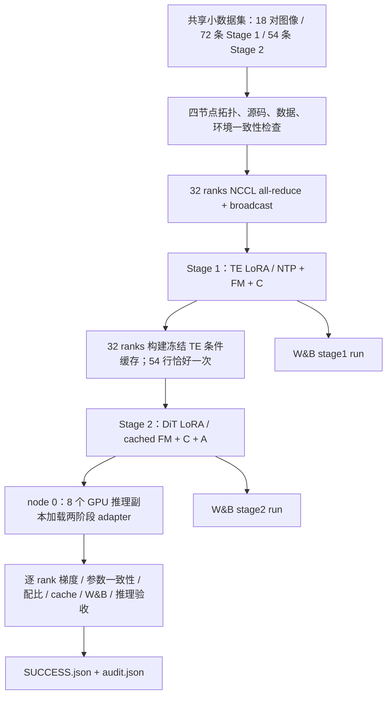

# SAMTokEdit Qwen-Image-2.1 四机训练运行指南

本入口用于 **4 机 × 8 GPU**，保持当前两阶段的计算定义、LoRA 更新范围与每个 rank 的任务配比。四台机器各执行一次相同入口，ARNOLD 提供本机编号，脚本自动完成 Stage 1 → conditioning cache → Stage 2 → node 0 八卡并行推理 → 验收。此处的短训练用于验证执行链路；正式训练需要单独确定训练长度、分辨率与 A 系数。

## 1. 总体实现



DDP 的每个 rank 仍然处理一条样本；不引入 FSDP/ZeRO 或跨机模型切分。`torch.distributed.run` 提供 rank/world-size 环境，训练内部仍由 DiffSynth runner + Accelerate 管理反向、累积、优化器与保存。

## 2. 对官方和现有项目具体增加了什么

### 2.1 ARNOLD 入口与四机编排

方法需求：32 ranks 必须共享同一个 rendezvous 地址和端口，每阶段成功后才能进入下一阶段；所有训练节点必须运行同一个已推送的 Git commit。

实现：[bootstrap_arnold_4node.sh](../scripts/train/bootstrap_arnold_4node.sh#L1) 是不依赖预先 clone 的完整 bootstrap 入口。ARNOLD 作业启动时需将下面第 4 节的完整脚本作为 worker 启动命令提交；四个 worker 同时执行同一脚本。它们分别从 GitHub 克隆 `qwen-image-2.1-dev` 到本机 `/tmp`，在本机创建 Python 环境；共享实验目录只保存调试数据、日志和训练产物。入口要求 ARNOLD 注入 `ARNOLD_WORKER_HOSTS`、`ARNOLD_WORKER_NUM=4`、`ARNOLD_WORKER_GPU=8`、`ARNOLD_ID=0..3`，并向每个 worker 注入 `WANDB_API_KEY` secret。

[topology](../samtok_edit21/cluster.py#L40) 从 `ARNOLD_WORKER_HOSTS` 第一项读取 `host:port` 或 `[IPv6]:port`，用 `ARNOLD_ID` 作为 node rank。四节点通过共享目录交换 Git commit、拓扑、参数、源代码 hash、数据 hash 和依赖版本，全部一致后才启动 NCCL 检查。

```python
# 对应 cluster.py 中的核心逻辑；完整错误处理见链接
host = env.get("MASTER_ADDR") or host or env.get("ARNOLD_WORKER_0_HOST")
port = env.get("MASTER_PORT") or port
# torch.distributed.run --nnodes 4 --nproc_per_node 8
#   --node_rank NODE_RANK --master_addr HOST --master_port PORT
```

[Pipeline](../samtok_edit21/cluster.py#L83) 用全新 run 目录防止读到旧阶段标记；每个节点记录独立日志，任意节点失败会写 `failure.json`，其他节点轮询并终止自己的进程组。阶段及 barrier 默认超时 7200 秒，训练进程组默认超时 1800 秒。节点的 Python 环境放在本机 `/tmp`，编译缓存也放在本机；模型、数据、adapter、日志放在共享盘。

### 2.2 两阶段训练与 W&B

方法需求：保持原本 TE/DiT 更新范围、3:2:2:1 和 1:2:1 配比，同时记录完整 optimizer update 的全局平均 loss，而不是只拿 rank 0 最后一个 microstep 代表整步。

现有的 DiffSynth [optimizer-step 回调](../DiffSynth-Studio/diffsynth/diffusion/runner.py#L166) 更新回调额外传入本次实际 learning rate；[on_optimizer_step](../samtok_edit21/train.py#L194) 汇总所有 rank、所有累积 microstep 的标量，记录每个指标的参与样本数、各任务计数和 rank 样本数。原 `supervision_metrics.jsonl` 继续保留，新增所有训练都记录的 `training_metrics.jsonl`。缓存 Dataset 只在内存中附带 `_sample_kind` 用于日志；forward 在验证和 FM 前移除此字段，不改变持久化 cache schema 或模型输入。

[TrainingTracker](../samtok_edit21/tracking.py#L12) 在加载大模型前仅 global rank 0 初始化 W&B，初始化/记录/结束的错误会广播到其他 rank，避免只有主进程失败却继续训练。两阶段分别创建一个 run，cache 阶段不创建 run。凭据只来自环境，不写入参数 JSON。默认普通训练 CLI 保持 W&B disabled；本四机入口显式启用 online。

```python
records = gather_object(self.pending_metrics)
self.pending_metrics = []
# 每个数值指标按实际出现次数求均值，并同时记录 counts。
# 如 NTP 不参与 attn_main 的分母。
self.tracker.log(entry, learning_rate)
```

W&B 的 `train/weighted_total` 对应进入 backward 前的样本 loss，已经包含 NTP/FM 分支权重。`train/lr` 是本次 optimizer 实际使用的 LR。A/C 指标只对适用样本取均值；`count/*`、`branch/*` 可以检查分母与混合配比。保留的 `optimizer_steps.jsonl` 中 `loss_last_microstep` 仍是 rank 0 最后一个 microstep，两者含义不同。

### 2.3 所有 rank 的训练验收

方法需求：排除某个 rank 无梯度、冻结参数被更新、跨节点未同步的情况。

[after_backward_audit](../samtok_edit21/train.py#L268) 将原有每次 backward 的有限性/非零/冻结梯度检查逐 rank 落盘。[verify_rank_parameters](../samtok_edit21/train.py#L304) 在两阶段结束时，对所有可训练参数计算 SHA256，跨所有 rank 比较，只有完全一致才保存最终 adapter。它只增加读操作和验收，不修改参数或训练随机数。

### 2.4 环境与依赖

[setup_cluster_env.sh](../scripts/train/setup_cluster_env.sh#L2) 从 `requirements.txt` 与 `requirements-cluster.txt` 一起安装并执行 `uv pip check`。沿用旧指南的 `byted-wandb==0.13.98`、`WANDB_DISABLE_SERVICE=true`、`WANDB_START_METHOD=thread`；补齐经过实际安装验证的依赖约束。该客户端仍导入 `pkg_resources`，所以固定 `setuptools==80.9.0`；其鉴权依赖要求 `cryptography<50`，固定为 `49.0.0`。torch/transformers/accelerate/peft 的训练版本保持原先的 2.8.0/5.12.1/1.14.0/0.20.0。

## 3. 已准备好的小批量实验

共享根目录：

```text
/mnt/bn/strategy-mllm-train/user/tanyue/experiments/SAMTokEdit/qwen21_4node_debug_20260928
```

三个数据集各 6 条，共 18 对图像。使用之前已整理的真实数据集 mask 及其 SAMTok 编码，复制成共享盘中的独立 PNG；不重新检查 mask 的语义正确性，不补 target mask。数据类型映射与源 parquet/row index 均保存在 `data/provenance.json`，包含 attribute/remove/replace/add/action/text。每对图像生成 NTP、plain、ref、noref 四行，所以 Stage 1 有 72 行，Stage 2 有 54 行；区域缓存有 36 个局部 UMT 行。正式方法所需的 codec 解码/coverage 构建仍由 prepare-regions 执行。

| 设置 | Stage 1 | Stage 2 |
|---|---:|---:|
| 更新对象 | TE LoRA | DiT LoRA |
| LoRA rank / dropout | 64 / 0.05 | 32 / 0 |
| optimizer updates | 2 | 3 |
| 每 rank 梯度累积 | 8 | 4 |
| 四机 global batch | 256 | 128 |
| 每 update 类型计数 | NTP=96, ref=64, noref=64, plain=32 | ref=32, noref=64, plain=32 |
| LR / weight decay | 4e-5 / 0.05 | 1e-4 / 0.01 |
| LR schedule | cosine，默认 warmup ratio=0.04 | constant，默认 warmup ratio=0.025 |
| C 系数 | 0.5 | 0.5 |
| A 系数 | 0 | 0.1；1 update warmup |
| 保存频率（每 rank microsteps） | 8 | 4 |

`max_pixels=65536`，训练 resize 保留原有 32 倍数规则与长宽比；不把所有训练图强制改成正方形。推理检查显式设置 256×256、4 个 denoising steps。A 的有效系数按 update 为 0、0.1、0.1，保证短测试同时覆盖 warmup 和非零 A。**0.1 只是通路测试系数，没有替代正式训练前的梯度校准。**

四机比本地八卡每次更新多处理四倍样本。这是保持每 rank 配比与累积次数的结果；短调试使用有放回调度，18 个源样本会被重复使用。54 行 cache 在 32 ranks 上分成 22×2 + 10×1，验证不整除时没有补齐重复样本。

## 4. 完整 ARNOLD 入口

在 ARNOLD 配置 **4 workers × 8 GPUs**，将共享盘挂载到四个 worker 的相同路径。ARNOLD 向每个 worker 注入 `ARNOLD_WORKER_HOSTS`、`ARNOLD_WORKER_NUM=4`、`ARNOLD_WORKER_GPU=8` 和本节点唯一的 `ARNOLD_ID=0..3`。把 `WANDB_API_KEY` 配成作业 secret，ARNOLD 应在四台 worker 的环境中提供它。也可将脚本用户设置区的 `FILL_IN_WANDB_API_KEY` 替换为实际值。

把下面完整脚本提交为 ARNOLD worker 的启动命令，并让四个 worker 同时执行。这里需要的是 bootstrap 本身：它先从 GitHub 克隆远程分支，再进入克隆目录安装环境和启动训练；不需要先在共享实验目录放置项目源码。脚本源文件也保存在仓库的 [bootstrap_arnold_4node.sh](../scripts/train/bootstrap_arnold_4node.sh#L1)。

```bash
#!/usr/bin/env bash
# Pre-clone ARNOLD entrypoint: run the same script on all four workers.
set -Eeuo pipefail

# ----- User settings -----
export SAMTOK_EXPERIMENT="${SAMTOK_EXPERIMENT:-/mnt/bn/strategy-mllm-train/user/tanyue/experiments/SAMTokEdit/qwen21_4node_debug_20260928}"
# Set this explicitly and identically on all workers; edit for EVERY new attempt.
export SAMTOK_RUN_ID="qwen21_4n_debug_002"
# Prefer injecting WANDB_API_KEY as an ARNOLD secret on every worker.
# For a one-off run, replace the placeholder with your key before submitting.
export WANDB_API_KEY="${WANDB_API_KEY:-FILL_IN_WANDB_API_KEY}"
export WANDB_ENTITY="${WANDB_ENTITY:-2200012743-peking-university}"
export WANDB_PROJECT="${WANDB_PROJECT:-samtok-edit}"
export SAMTOK_EDIT_REPO_URL="https://github.com/Tangent0308/samtok_edit.git"
export SAMTOK_EDIT_BRANCH="qwen-image-2.1-dev"

# ----- ARNOLD checks -----
: "${ARNOLD_WORKER_HOSTS:?ARNOLD must inject the four-worker host list}"
: "${ARNOLD_WORKER_NUM:?ARNOLD must inject ARNOLD_WORKER_NUM=4}"
: "${ARNOLD_WORKER_GPU:?ARNOLD must inject ARNOLD_WORKER_GPU=8}"
: "${ARNOLD_ID:?ARNOLD must inject ARNOLD_ID for this worker (0..3)}"
[[ "$ARNOLD_WORKER_NUM" == 4 && "$ARNOLD_WORKER_GPU" == 8 ]] || { echo 'Expected 4 workers x 8 GPUs' >&2; exit 2; }
[[ "$ARNOLD_ID" =~ ^[0-3]$ ]] || { echo 'ARNOLD_ID must be 0, 1, 2, or 3' >&2; exit 2; }
[[ "$SAMTOK_RUN_ID" =~ ^[a-zA-Z0-9_-]+$ ]] || { echo 'Invalid SAMTOK_RUN_ID' >&2; exit 2; }
[[ -n "$WANDB_API_KEY" && "$WANDB_API_KEY" != FILL_IN_WANDB_API_KEY ]] || { echo 'Set WANDB_API_KEY as an ARNOLD secret or replace the placeholder' >&2; exit 2; }

# ARNOLD_WORKER_HOSTS carries the common rendezvous port; generic PORT varies by worker.
unset PORT MASTER_ADDR MASTER_PORT NODE_RANK NNODES GPUS_PER_NODE
export NODE_RANK="$ARNOLD_ID"
export ARNOLD_WORKER_NUM=4 ARNOLD_WORKER_GPU=8

RUN="$SAMTOK_EXPERIMENT/runs/$SAMTOK_RUN_ID"
BOOTSTRAP="$RUN/bootstrap"
NODE="$ARNOLD_ID"
REPO="/tmp/samtok-edit-${SAMTOK_RUN_ID}-node${NODE}"
if [[ -e "$RUN/nodes/$NODE" || -e "$RUN/SUCCESS.json" ]]; then
  echo "Run already used: $RUN. Set a NEW common SAMTOK_RUN_ID; old logs are preserved." >&2
  exit 2
fi
mkdir -p "$BOOTSTRAP"
# Atomic per-node claim: reject scheduler retries BEFORE cloning/installing or appending logs.
if ! mkdir "$BOOTSTRAP/node${NODE}.claimed"; then
  echo "Worker $NODE already started this run. Use a NEW common SAMTOK_RUN_ID." >&2
  exit 2
fi
exec > >(tee -a "$BOOTSTRAP/node${NODE}.log") 2>&1
BOOTSTRAP_PHASE=checkout
bootstrap_failed() {
  local result="${1:-$?}"
  trap - ERR TERM INT
  mkdir -p "$RUN/nodes/$NODE"
  local failure_tmp="$RUN/nodes/$NODE/bootstrap-failure.$$.tmp"
  printf '{"error":"bootstrap failed during %s; see bootstrap/node%s.log","exit_code":%d}\n' \
    "$BOOTSTRAP_PHASE" "$NODE" "$result" > "$failure_tmp"
  # Publish complete JSON only if no more specific Python failure exists.
  ln "$failure_tmp" "$RUN/nodes/$NODE/failure.json" 2>/dev/null || true
  unlink "$failure_tmp"
  exit "$result"
}
trap bootstrap_failed ERR
trap 'bootstrap_failed 143' TERM
trap 'bootstrap_failed 130' INT

export WANDB_DISABLE_SERVICE=true WANDB_START_METHOD=thread
export PYTHONUNBUFFERED=1 TOKENIZERS_PARALLELISM=false OMP_NUM_THREADS="${OMP_NUM_THREADS:-4}"
export NCCL_DEBUG="${NCCL_DEBUG:-WARN}"
export SAMTOK_ENV="/tmp/samtok21-${SAMTOK_RUN_ID}-node${NODE}-env"
export SAMTOK_PYTHON="${SAMTOK_PYTHON:-/usr/bin/python3.11}"
export SAMTOK_CUDA_READY_TIMEOUT="${SAMTOK_CUDA_READY_TIMEOUT:-600}"
export SAMTOK_CUDA_READY_INTERVAL="${SAMTOK_CUDA_READY_INTERVAL:-15}"

if [[ -e "$REPO" ]]; then
  echo "Node-local checkout already exists: $REPO (choose a fresh SAMTOK_RUN_ID)" >&2
  false
fi
export GIT_TERMINAL_PROMPT=0
# Clone the exact requested branch into node-local /tmp; never execute an MNT source snapshot.
git clone --branch "$SAMTOK_EDIT_BRANCH" --single-branch "$SAMTOK_EDIT_REPO_URL" "$REPO"
cd "$REPO"
git rev-parse HEAD > "$BOOTSTRAP/node${NODE}.commit.txt"
BOOTSTRAP_PHASE=environment-or-pipeline
bash scripts/train/run_arnold_4node.sh "$@"
```

默认实验路径是 `/mnt/bn/strategy-mllm-train/user/tanyue/experiments/SAMTokEdit/qwen21_4node_debug_20260928`，该目录只提供已经准备好的 `data/`，并接收 `runs/<SAMTOK_RUN_ID>/` 日志和产物。四个 worker 的 `SAMTOK_RUN_ID` 必须一致。此次修复后的入口显式使用 `qwen21_4n_debug_002`；再次重跑时，四个 worker 一起将脚本设置区改为新 ID，例如 `qwen21_4n_debug_003`，以避免复用节点本地 checkout 或旧的 stage 标记。

入口从 `https://github.com/Tangent0308/samtok_edit.git` 克隆 `qwen-image-2.1-dev` 到各节点的本地 `/tmp/samtok-edit-<run-id>-node<rank>`。确认所需 commit 已推送到该分支后再启动。四机 manifest 记录 Git commit，并在训练前比较各节点 commit、源码摘要、参数、数据摘要和依赖版本。入口不读取通用 `PORT`，使用 `ARNOLD_WORKER_HOSTS` 第一项中的共享 rendezvous 端口，并保留平台提供的 NCCL/网卡/IB 设置。

W&B 默认 entity 为 `2200012743-peking-university`、project 为 `samtok-edit`，均可在 ARNOLD 作业环境覆盖。key 不写入命令行参数或训练 manifest；设置文件只记录是否存在 key。默认系统 Python 为 `/usr/bin/python3.11`，可用 `SAMTOK_PYTHON` 覆盖；Python 环境和编译缓存位于 worker 本机 `/tmp`。

## 5. 产物和结束条件

```text
runs/qwen21_4n_debug_002/
  manifest.json                 # 拓扑、参数、源码/数据 hash、依赖版本
  bootstrap/node0..3.log        # 环境安装及阶段启动记录
  bootstrap/node0..3.claimed/   # 原子占用标记，拦截相同节点重复启动
  bootstrap/node0..3-cuda/      # CUDA 探测结果、逐次日志和失败时的 nvidia-smi -q
  nodes/0..3/                   # 拓扑、实际命令、阶段完成或失败标记
  collectives/rank0..31.json    # 每个 rank 的通信检查
  logs/node0..3/                # 每个阶段与 torchrun 每个 rank 的 stdout/stderr
  stage1/, stage2/
    run.json, schedule.json
    gradients-rank0..31.jsonl
    rank_parameters.json        # 每个 rank 的参数摘要和峰值显存
    training_metrics.jsonl, supervision_metrics.jsonl, optimizer_steps.jsonl
    wandb.json, tracking/wandb/
    adapter/adapter.json, adapter/adapter.safetensors
  cache/manifest.json, 0..31/   # 完整检查后才发布 manifest
  inference/                   # node 0 的八卡推理输出和 report
  audit.json                   # 逐项验收；失败时不会伪造通过结果
  SUCCESS.json                 # 所有阶段、推理、验收通过后由 node 0 写入
```

W&B 中会出现 `qwen21_4n_debug_002-stage1` 与 `qwen21_4n_debug_002-stage2` 两个 run，具体 URL 写在对应 `wandb.json`。八卡推理是 8 个独立模型副本，各处理一个测试 case，覆盖三个数据集与 direct/inline/oracle/online，包括 ref/noref；没有把单张图的推理切到八张卡。online 生成不符合协议时允许既有 plain fallback，report 会原样记录原因。

验收不仅检查进程退出码，还检查每 rank 的任务计数、梯度、参数一致性、完整 cache 的身份和 checksum、A/C 参与行数与 warmup、W&B finish 状态、八张 RGBA 推理结果。测试脚本、原始日志、失败尝试和本地结果均保存在本实验目录，可在四机实验后继续检查。物理四机通信和在线 W&B 登录/上传需要由这次 ARNOLD 实跑确认。


## 6. 2026-09-28 启动失败修复与重跑

### 6.1 已确认的故障链

`qwen21_4n_debug_001/bootstrap/node1.log:233` 首先出现 `cudaGetDeviceCount(): Error 802: system not yet initialized`，环境检查在 CUDA 初始化阶段失败。node 0/2/3 已通过环境检查，在 topology barrier 中读到 node 1 的失败标记后退出。用户提供的 ARNOLD 日志显示，平台在脚本 exit code 1 后等待 15 分钟用于调试，再通过 SIGTERM 清理任务；该 SIGTERM 是失败后的清理事件。

同一运行目录中每个节点累计记录了 9 次入口启动。node 1 前两次出现 802，后续启动已通过 CUDA 环境检查，但旧 `nodes/<rank>` 目录仍存在，触发 `FileExistsError`。这些日志未记录调度器重试配置，不能据此判定每次启动由谁发起。该 run 没有进入 NCCL 探测、Stage 1 或 W&B 在线初始化。

### 6.2 对启动代码的修改

- [CUDA 就绪检查](../samtok_edit21/cuda_readiness.py#L48)：每次启动独立 Python 子进程，避免复用 CUDA 初始化失败后的进程状态。只对日志中的 Error 802 / `system not yet initialized` 重试，默认每 15 秒一次、最多等待 600 秒；单次探测最多 60 秒，诊断采集单次最多 15 秒。其他错误（例如可见 GPU 数不对或显存错误）直接失败。
- 检查成功条件是 CUDA runtime 初始化成功，且八张可见 GPU 分别完成小张量分配、求和和同步；只看到 GPU 枚举结果不算通过。每次结果写入 `bootstrap/node<rank>-cuda/attempt-NNN.log` 和 `readiness.json`。首次失败、等待超时分别保存只读 `nvidia-smi -q` 诊断。
- [bootstrap 入口](../scripts/train/bootstrap_arnold_4node.sh#L1) 在 clone 和依赖安装之前检查旧节点目录，并原子创建 `node<rank>.claimed`。同一 ID 的重复 worker 启动立即退出，不覆盖旧日志；每次新实验仍需四节点统一改用新的 ID，不自动删除或复用旧状态。
- [失败记录与传播](../samtok_edit21/cluster.py#L25)：原子发布且保留首次 `failure.json`，shell fallback 不再覆盖 Python 的具体错因；其他节点的报错会包含同伴的错误摘要和记录路径。运行目录已存在时给出明确的新 run ID 提示。

### 6.3 验证及重跑方式

本次修复的调试代码和结果位于实验目录的 `validation/bootstrap_fix_20260928/`。9 项针对性测试通过：802 后新进程恢复、持续 802 超时、探测进程挂起受限、其他 CUDA 错误不重试、保留首次失败、同伴错误摘要、旧目录拒绝、重复占用拒绝，以及 shell fallback 保留/生成错误记录。测试日志为 `tests.log`，测试使用共享实验盘验证了原子占用与失败记录发布。原有四机调度、barrier、同伴失败取消、日志和 W&B 故障传播等 15 项回归检查也通过，见 `regression.log`。本地八张 H100 的真实 CUDA 探测已通过，见 `local8-cuda.log` 和 `local8-cuda/readiness.json`。

重跑时，将第 4 节**新版完整入口**复制到 ARNOLD 作业入口，填写 W&B key；本次统一使用脚本中的 `qwen21_4n_debug_002`。仅拉取新分支不会更新 ARNOLD 控制台中此前粘贴的旧 bootstrap 脚本。建议本轮关闭平台自动重试，便于保留单次结果；已有失败的 `001` 目录作为故障证据保留。

`SAMTOK_CUDA_READY_TIMEOUT` 和 `SAMTOK_CUDA_READY_INTERVAL` 可通过作业环境覆盖。若报错节点的 CUDA 802 持续超过等待上限，仍需平台侧检查或替换该节点；应用层等待不能修复持续的 GPU/驱动服务异常。此次没有重新运行两阶段长链路训练，也没有在物理四机上验证修复结果；以新 run 的日志和最终 `SUCCESS.json` 为准。
