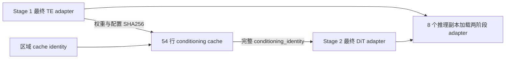

# SAMTokEdit Qwen-Image-2.1 实验记录

2026-09-29 最新 noref 数据转换记录见[9B 规则回退与四机复跑](SAMTokEdit_Qwen21_noref规则回退与四机复跑.md)：最终本地四卡 436 条，398 条模型通过、24 条规则回退通过、14 条仍失败；全量 98,574 条输入关联检查通过。此项是文本数据转换验证，不是两阶段训练结果。

> 下方原有第 1–6 节为历史记录。2026-09-26 的独立审计发现，历史 cache identity/非零梯度检查的充分性曾被高估；其旧环境路径也已失效。后续实现与修复从第 7 节起按日期追加；最新四机运行及独立结果复核见第 13 节。历史内容保留供追溯。

## 实验环境

- GPU：8 × H100 80 GB
- Python 环境：`/opt/tiger/tanyue/samtok_edit_qwen_image_2_1/.venv`
- PyTorch：2.8.0+cu128；Transformers 5.12.1；Accelerate 1.14.0；PEFT 0.20.0
- Qwen3-VL：`/mnt/bn/strategy-mllm-train/user/tanyue/models/SAMTok/Qwen3-VL-8B-SAMTok`
- Qwen-Image-2.1：`/mnt/bn/strategy-mllm-train/user/tanyue/models/pretrained_models/Qwen-Image-2.1`
- 调试源数据：`/mnt/bn/strategy-mllm-train/user/tanyue/datasets/RefEdit-mask-prefiltered-qwen38-self-contained`
- 实验根目录：`/mnt/bn/strategy-mllm-train/user/tanyue/experiments/SAMTokEdit/qwen_image_2_1_dev_smoke`

源 parquet 只读。构造脚本物化 8 个有效样本，生成 Stage 1 8 行（3 NTP、2 UMT-ref、2 UMT-noref、1 plain）和 Stage 2 8 行（2 UMT-ref、4 UMT-noref、2 plain）。

## 1. 数据构造与协议校验

运行：

```bash
PYTHONPATH=.:DiffSynth-Studio python tests/eight_gpu_smoke/prepare_refedit.py \
  --source /mnt/bn/strategy-mllm-train/user/tanyue/datasets/RefEdit-mask-prefiltered-qwen38-self-contained \
  --output /mnt/bn/strategy-mllm-train/user/tanyue/experiments/SAMTokEdit/qwen_image_2_1_dev_smoke/refedit_data \
  --samtok /mnt/bn/strategy-mllm-train/user/tanyue/models/SAMTok/Qwen3-VL-8B-SAMTok \
  --unique-rows 8
PYTHONPATH=.:DiffSynth-Studio python -m samtok_edit21.cli validate \
  --metadata /mnt/bn/strategy-mllm-train/user/tanyue/experiments/SAMTokEdit/qwen_image_2_1_dev_smoke/refedit_data/stage1.jsonl \
  --base-path /mnt/bn/strategy-mllm-train/user/tanyue/experiments/SAMTokEdit/qwen_image_2_1_dev_smoke/refedit_data
```

结果：`{"rows": 8, "decoded_images": 6, "passed": true}`。`refedit_data/build_report.json`、`provenance.json` 和物化图片记录了来源、mask checksum 信息和 smoke-only 标注。

SAMTok codec 启动时打印标准 SAM2 backbone 的 mask encoder missing keys，随后从 `mask_tokenizer_256x2.pth` 严格加载并输出 `Loaded checkpoint successfully`；8 个 mask 均成功编码。这是发布 checkpoint 的两段式加载行为，后续正式数据转换仍需保留启动日志审计。

## 2. 分布式设备与采样探针

Stage 1：

```bash
accelerate launch --main_process_port 45680 --num_processes 8 \
  tests/eight_gpu_smoke/probe_distributed.py \
  --metadata .../refedit_data/stage1.jsonl --stage stage1 --accumulation 8 --steps 1
```

8 个 rank 分别报告 `cuda:0` 至 `cuda:7`，每 rank 8 个局部样本，类型计数为 NTP=3、UMT=4（其中 ref/noref 各 2）、plain=1；全局报告为 NTP=24、UMT-ref=16、UMT-noref=16、plain=8。

Stage 2 使用 port 45681、`--stage stage2 --accumulation 4`。8 个 rank 均得到 4 个样本；全局报告为 UMT-ref=8、UMT-noref=16、plain=8。说明 schedule 在多卡切片后仍保持目标比例。

## 3. 发现的 bug 与修复

### 3.1 可选 XTuner 导入阻塞 codec

最初导入 `samtok.models` 会同时加载 XTuner 感知模型，和当前 Transformers 版本冲突，导致 mask codec 尚未初始化就失败。修复：`samtok/models/__init__.py` 只直接加载 VQ-SAM2，其他类通过 `__getattr__` 懒加载；SAM2/losses 内部改为相对导入。`mmengine` 加入运行环境依赖。

### 3.2 设备错误：8 个进程全部占用 GPU 0

第一次真实 8 卡训练在模型加载后观察到 GPU0 约 74 GB、其余 GPU 约 2 GB，原因是 `device_map={"":"cuda"}` 将字符串 `cuda` 解析为 device 0。该运行在 forward 前中断，没有产生训练 checkpoint。修复：`train.py:run_train` 和 `run_cache` 先构造 `Accelerator`，再把 `args.device` 设置为 `str(accelerator.device)`，每个进程显式加载到自己的 `cuda:<local_rank>`。之后设备探针确认映射正确。

### 3.3 端口占用

端口 29500 和 29601 已有外部监听，导致 launch 在初始化阶段报 `EADDRINUSE`；改用 45680 以上空闲端口。端口失败没有修改代码，也没有产生模型结果。

## 4. 真实 8 卡训练记录

以下命令用于最终 smoke；输出目录应使用新的空目录，避免和历史失败尝试混合：

```bash
accelerate launch --main_process_port 45682 --num_processes 8 --mixed_precision bf16 \
  -m samtok_edit21.train train --stage stage1 \
  --metadata .../refedit_data/stage1.jsonl --base-path .../refedit_data \
  --output .../stage1 --max-pixels 262144 --steps 1 --accumulation 8 \
  --save-steps 64 --num-workers 0 --seed 20260925
```

验收项：8 卡显存近似均衡；`schedule.json` 的全局计数正确；loss 有限；梯度审计中 LoRA 梯度非零且冻结参数梯度为 0；`adapter/adapter.safetensors` 和 `adapter.json` 存在且可重新加载。

Stage 2 cache：

```bash
accelerate launch --main_process_port 45683 --num_processes 8 --mixed_precision bf16 \
  -m samtok_edit21.train cache --metadata .../refedit_data/stage2.jsonl \
  --base-path .../refedit_data --te-adapter .../stage1/adapter \
  --output .../cache --max-pixels 262144 --num-workers 0
```

验收项：8 个 rank 的 cache shard、sidecar 和 `manifest.json` 齐全；manifest row hash、SHA256、TE adapter identity 和 conditioning shape 均通过 `verify_cache`。

Stage 2 training：

```bash
accelerate launch --main_process_port 45684 --num_processes 8 --mixed_precision bf16 \
  -m samtok_edit21.train train --stage stage2 --cache .../cache \
  --output .../stage2 --steps 1 --accumulation 4 --save-steps 32 --num-workers 0
```

验收项与 Stage 1 相同，另检查只加载 DiT、cache 条件不再重复运行 TE/VAE。

本次成功产物：

- Stage 1：`.../stage1_run3/`，`loss.csv` 8 条有限 loss，梯度审计报告 504 个可训练梯度张量、252 个非零张量、冻结梯度 0；adapter 约 698 MB。
- Cache：`.../cache_run1/`，`manifest.json` 含 8 行，`0/` 到 `7/` 每个 rank 各有一个 `.pth` 和 sidecar；`verify_cache` 返回 `True`。
- Stage 2：`.../stage2_run2/`，4 条有限 loss，梯度审计报告 464 个可训练梯度张量、232 个非零张量、冻结梯度 0；`adapter.json` 已包含 cache 的 `conditioning_identity`。

在发现 runner sampler 属性名问题后，最终验收使用了新产物：`stage1_final/`、`cache_final/`、`stage2_final/`。最终 Stage 1/Stage 2 schedule report 分别为全局 3:2:2:1 和 1:2:1，且 runner 已实际读取 `schedule_sampler`；最终 Stage 2 loss 为 0.2754、0.0129、0.0904、0.0940，均有限。

Stage 2 第一次重跑使用端口 45688 时遇到 `EADDRINUSE`，换用 45689 后成功。第一次 Stage 2 adapter 没有 conditioning identity，已在 `train.py:run_train` 修复并以 `stage2_run2` 重跑。

## 5. 推理 smoke

使用训练得到的 Stage 1 adapter 运行 `localize`，检查输出 JSON 能被 `parse_generated_cot` 接受；再使用 Stage 1/Stage 2 adapter 运行 `infer`，检查 PNG 可读、尺寸为目标尺寸且无 NaN。推理产物放在 `.../inference/`，不写入源数据目录。

实际运行：

```bash
python -m samtok_edit21.cli localize --image .../refedit_00_source.png \
  --prompt 'Change the selected object in the image.' \
  --te-adapter .../stage1_final/adapter --output .../inference/localize.json \
  --device cuda:0 --height 256 --width 256 --max-new-tokens 64
```

输出包含一个严格 JSON mask item 和可用的 inline conditioning prompt。使用 `stage2_final/adapter` 运行 inline inference（2 steps、256×256）成功，输出 `.../inference/final.png`，PIL 校验为 `RGBA (256, 256)`。第一次 inference 暴露了 CLI 对嵌套 `te_adapter_identity` 的解析错误；`cli.py` 现已同时支持嵌套 identity 和旧式路径字段。

## 6. 结果结论与限制

数据协议、8 卡 device 绑定、采样比例、Stage 1 NTP/FM 梯度链路、Stage 2 cache 完整性和推理入口都纳入 smoke 验收。smoke 数据只有 8 行，不能评价收敛、lambda 最优值或最终编辑质量；正式训练前仍需使用过滤和人工审核后的完整数据，并在新数据上重新运行协议和 cache 审计。

## 后续实验

后续每次运行追加日期、git commit、命令、输出路径、指标、异常和修复，不覆盖本页历史记录。

## 7. 2026-09-26：独立审计、上游归属确认与修复验收

### 7.1 版本、范围与证据位置

起点：分支 `qwen-image-2.1-dev`，HEAD `1859744d618611f8e203edbb7b0d7be42500a0b7`。本节实现改动尚未 git commit，属于该 HEAD 上的工作区修复；没有提交、覆盖源数据或改写历史实验产物。用户原有 README 的规划链接和未跟踪的区域约束规划文档保留；README 仅额外修正环境/localize 示例。

三批证据均在临时目录，**系统清理 /tmp 后可能消失**；本文保留必要的结果和复现命令，不将临时产物当长期模型发布：

- 修改前独立审计：`/tmp/samtok21-audit-tKUbmC/`，REPORT.md、RUNS.md、audit_gpu/extra/codec_audit/final_checks.json、单/双卡完整日志。
- 上游归属与方案：`/tmp/samtok21-upstream-xq4pvu/`，REPAIR_PLAN.md、官方固定版本文件、GitHub commit JSON、attention 数值对照。
- 本轮实现与复验：`/tmp/samtok21-fixes-dUnbt5/`，test_regressions.py、attention_regression.py、attention_geometry.py、runner_rng_probe.py、integration_checks.py、final_artifact_checks.py，以及下述日志/产物。

本轮独立执行了完整发布模型的小批量单卡/双卡训练与推理；控制流程反例、LR/RNG 探针和 attention 语义对照另用明确标注的小模型。未重跑本页历史 8 卡训练，没有做长训练、收敛分析或正式质量基准。

实际可用环境：Python 3.11.2、torch 2.8.0+cu128、torchvision 0.23.0、transformers 5.12.1、accelerate 1.14.0、peft 0.20.0，H100 80GB，nvidia-smi 报驱动 535.161.08。旧文档 venv 路径已不存在；系统 Python 的 torch 2.14/cu130、transformers 4.48 不能直接承担本项目。本轮先恢复隔离审计环境，随后在 `/tmp/samtok21-fixes-dUnbt5/venv` **从零按修订 requirements 安装**，用该环境通过单测、Stage 2、推理和 codec。安装日志 `install.log` 显示解析 92 packages；完整版本约束已纳入 repo 的 constraints-tested.txt。

### 7.2 修改前真正验证过的正确部分

修改前默认 recipe 可以运行，但不能因此认定没有 bug。审计证据：

| 检查 | 修改前实测 |
|---|---|
| 原有单测 | 23 passed |
| 完整 Stage 1 | 单卡 1 update、8 microsteps；双卡 2 updates、每 rank 16 microsteps |
| 完整 Stage 2 | 单/双卡各 2 updates、每 rank 8 microsteps |
| default adapters | Stage 1：174,587,904 trainable params、504 tensors；Stage 2：85,995,520 params、464 tensors；fp32、有限，LoRA B 均有非零更新 |
| NTP 独立梯度 | raw CE 1.6321014，TE LoRA grad norm 1.48124；冻结梯度 0 |
| FM 独立梯度 | loss 0.2755177，TE LoRA grad norm 0.151525；冻结梯度 0 |
| norm / NTP 对照 | 手动 norm 与 post-norm 输出差 0；HF 原生 labels CE 1.6322559，约 1.5e-4 bf16 数值差；hook 数量回到 0 |
| 官方 FM 对照 | 同 RNG 的自定义/官方 loss 都为 0.1936758161，差 0 |
| 条件/cache | 单卡缓存与重编码、双卡 uneven cache 对齐后 embeddings/source/target 最大差均 0 |
| 模板与几何 | system prefix 实测 14 tokens；256² source 为 16×16 latent，64 pads×4；双图 320×224/224×320 为 14×20/20×14，140 pads×4=560 |
| codec | 单/批编码解码一致，RefEdit:0 codes [17,322]，IoU=0.96685217；SAM2 box 最佳 IoU=0.9785588 |
| 在线推理 | 新 adapter reload 后生成合法 JSON，并输出 2-step 256² RGBA PNG |

旧 bf16 KV/uncached velocity max diff=0.03125、mean=0.0050964，不宣称 bitwise 相同或完整多步质量等价。codec 的 raw logits > 0.5 来自发布实现；改为 >0 在单样本改变 1349 pixels、IoU=0.96409，没有证据应在迁移中擅自改变阈值。

### 7.3 问题归属、规划与实际处理

上游通过 GitHub API 与 ls-remote 核实：旧固定版本 `d2d684ad1f912949eae08453b9411ae40c5ec0ab`；当次核查官方 main 为 `7686e54d41d25c0e8ed5f1318acc23b6bb832654`，2026-09-21，PR #1697。后者父提交就是前者，且只改 DiT。官方 runner 在两版本中相同。

| ID | 复现的问题 / 归属 | 本轮处理及兼容性 |
|---|---|---|
| F1 | 项目 warm-start 实际 rank=2/dropout=.15，却保存默认 rank=32/dropout=0，reload size mismatch | 实际 PEFT 配置导出、显式参数冲突检查、key/shape/finite/recipe 指纹；双阶段非默认 warm-start/reload 复验 |
| F2 | 项目 verifier 只查 checksum/部分 shape，base-A shard 配 base-B manifest 仍通过；非法 sample_type 也通过 | cache-v2 完整内容身份、真实 row index、payload/sidecar/manifest 一致性、唯一完整行覆盖、协议/逐图几何检查；训练/推理前核对实际基座和 adapter |
| F4 | 项目两个 train/cache CLI 各走一套实现，v1 名同格式不同，旧 dict identity 被当路径而 TypeError | CLI 统一委托 train.py；删除旧循环；明确 v1 只读审计，缺完整来源需重建，不伪造迁移证明 |
| F6 | 旧官方 fallback 将 source block 当纯 causal，且绕过 checkpoint | 同步最新官方 #1697 原文件，不替换本地 runner 扩展；state_dict schema 不变 |
| F5 | 项目 converter 去冠词使 the cat/a cat 变同名 cat，完美预测 GT 仍无法回填 | 保留唯一精确 phrase，显式多实例分组；NTP-only 也执行 GT→绑定→ref 的 round-trip |
| F3 | 项目 online/oracle 始终 ref，没实现 proposal 默认 noref | 共享语义绑定器，默认请求 noref，审核 units/保守语法子集，actual variant 与 fallback reason；strict 模式拒绝 unsupported |
| A1 | 官方仍用默认 ConstantLR 的 1/3 初始 LR；项目没有选定明确 recipe | 项目显式 constant=1；可选 warmup/cosine 按实际 optimizer update 推进并记 LR；不改其他官方调用的默认行为 |
| A2 | 项目 seed 只用于 schedule | 同 seed 初始化、DDP 后 seed+rank 全 RNG；固定设备数重复运行验证 |
| A3 | 项目审计允许缺失/全零梯度，旧 accumulation 可掩盖断链 | 每次 backward 的梯度 hook 单独审计；全零/无梯度/非有限/冻结有梯度报错 |
| A4 | 项目 masked inline/direct 可多图，与训练协议冲突 | 公共 edit 与 CLI 单图约束；direct/stock 明确拒绝 mask；plain 多图保留 |
| A5/A6 | 项目环境路径失效、缺直接依赖、示例漏 --prompt | constraints-tested + 补依赖，干净 venv 验证，修正文档与 README |
| A7 | 项目没有 proposal 的 benchmark 白底/恢复尺寸 wrapper | 显式 --benchmark-output，保留 raw RGBA、输出 RGB 参考尺寸，多图需显式参考索引 |

F1/F2/F3/F4/F5 和大部分 A 项是项目实现/契约问题，不是升级官方库就会消失的问题。F6 是旧上游缺陷，最新官方已经修复；A1 是上游仍存在的默认行为，不是 PyTorch scheduler 违反定义。没有加入新的空间 loss、attention bias 或其他规划中的科研扩展。

### 7.4 本轮修复后验收

| 验收 | 实际结果 / 产物 |
|---|---|
| 基础单测 + 临时回归 | **61 passed**，`final_acceptance_pytest.log`；包含原 23 项（1 个旧 cache 测试夹具升级为 v2）和 38 个新增反例/契约用例 |
| 干净依赖环境 | 从 requirements 安装完成；在新 venv 重跑测试与真实模型任务通过 |
| 单卡 Stage 1 | `stage1/`，rank=2/dropout=.15，8 microsteps、1 update，第一步实际 LR=4e-5 |
| 双卡 Stage 1 warm-start | `stage1_warm_ddp/`，不重传 rank/dropout，自动继承 2/.15；每 rank 8 microsteps；新梯度 hook 每次有非零观测；reload localize 成功 |
| Stage 1 正式绑定契约的小样本 | `reviewed_stage1/`：真实 RefEdit:0 source/target/codes，converter 生成 4 种 row，ref/noref 真正不同；8 microsteps、1 update 通过，保存 recipe 指纹 |
| 单/双卡 cache-v2 | `cache_single/`、`cache_ddp/`，同 3 行 FM metadata；双卡 2+1 不整除分片，完整 row index 0/1/2；按行对齐 tensors 逐元素相同 |
| 单/双卡 Stage 2 | `stage2/`、`stage2_ddp/`，各 2 updates、每 rank 8 microsteps，rank=2/dropout=.15，cosine/warmup=1；有限 loss、464 梯度张量、冻结梯度 0 |
| 双卡 Stage 2 warm-start | `stage2_warm_ddp/`，继承非默认配置且核对相同 conditioning identity，1 update、每 rank 4 microsteps，通过 |
| adapter 完整性 | 七套产物（含最终追加的 stage2_final）均 rank=2/dropout=.15、fp32/有限；Stage 1 有 504 tensors/252 非零 LoRA B；Stage 2 有 464/232；`final_artifact_checks.json` |
| 重编码一致性 | 新缓存与实际 adapter 在线重新编码，embeddings/source/target 最大差 0；`integration_checks.json` |
| no-Flex 完整模型 | 强制 FALLBACK，完整 DiT FM loss=0.0525325127，464 gradient tensors，norm=0.0208680491；checkpoint backward 通过 |
| 严格 oracle noref | no-Flex 完整模型 2-step 推理：`Make this region <M> blue.`，actual=noref、无 fallback；`oracle_fallback.png` |
| online + benchmark | `online.raw.png` 为 256×256 RGBA；`online.png` 为源图原尺寸 1024×1024 RGB；白底全透明像素测试也通过 |
| online 语义边界 | 模型生成 label=`leftmost bird blue.`，所以 requested=noref、actual=ref，并记录保守语法不支持原因；**不计为 noref 成功** |
| interactive + codec | `interactive.png`，真实 mask 经 codec 得 [17,322]，生成 inline prompt 并完成 2-step 256² RGBA 推理 |
| RNG / LR 分布式探针 | `rng_ddp_b/c` 两次双卡小模型运行，初始化、每 rank RNG draws、最终参数逐项一致；rank0/1 随机流不同、更新后参数同步；单/双卡实际 LR 都为 [0.005,0.01,0.01,0.005] |

中间最早 `stage1/`、`stage1_warm_ddp/` 产生于追加 recipe fingerprint 校验之前，rank/dropout 已正确但没有该字段；后续 `reviewed_stage1/` 和 Stage 2 产物已含 fingerprint。这些均为修复过程中的 smoke 产物，不作为正式训练起点发布。

官方 patch 的额外数值验证（fp32、2-layer 小 DiT）：

| 项目 | 最大绝对差 |
|---|---:|
| 旧 fallback vs Flex，无 padding / 有 padding | 0.0242956 / 0.0391016 |
| 新 fallback vs Flex，无 padding / 有 padding | 4.768e-7 / 2.384e-7 |
| 新 Flex vs 旧 Flex | 0 |
| 新 fallback cached vs uncached | ≤2.384e-7 |
| fallback checkpoint 开/关 input/parameter gradients | 0 |
| 双图非方形 fallback vs Flex | 2.980e-7 |
| 双图非方形 cached vs uncached | 2.384e-7 |
| prefix 不看变化的 target / 首 text 不看未来 text / target 忽略 padding | 均为 0 |

另验证同 source block 的第一个 token 会受到最后一个 token 变化影响（max delta=0.00666262），排除了旧纯三角可见性。新本地 DiT 与官方下载文件 SHA256 同为 `54639031f91e74d3f418e35572d2d98c6dad9ab8ce2ca54ffdf5146473744e0a`。证据：latest_attention_check.json、attention_geometry.json。

### 7.5 实际命令与重新运行方式

以下均在 repo 根目录执行。重跑时另选空输出目录；不要覆盖本节产物。

```bash
export PYTHONDONTWRITEBYTECODE=1
export PYTHONPATH=$PWD:DiffSynth-Studio
export CHECK=/tmp/samtok21-fixes-dUnbt5
export PY=$CHECK/venv/bin/python
export DATA=/mnt/bn/strategy-mllm-train/user/tanyue/experiments/SAMTokEdit/qwen_image_2_1_dev_smoke/refedit_data
export TORCHINDUCTOR_CACHE_DIR=$CHECK/inductor

$PY -m pytest -p no:cacheprovider -q tests $CHECK/test_regressions.py

CUDA_VISIBLE_DEVICES=0 $PY -m samtok_edit21.cli train --stage stage1 \
  --metadata $DATA/stage1.jsonl --base-path $DATA --output $CHECK/stage1 \
  --max-pixels 65536 --steps 1 --rank 2 --dropout 0.15 --seed 926

CUDA_VISIBLE_DEVICES=0,1 $PY -m torch.distributed.run --standalone --nproc_per_node=2 \
  -m samtok_edit21.train train --stage stage1 --metadata $DATA/stage1.jsonl \
  --base-path $DATA --output $CHECK/stage1_warm_ddp --max-pixels 65536 \
  --steps 1 --init-adapter $CHECK/stage1/adapter --seed 926

CUDA_VISIBLE_DEVICES=2,3 $PY -m torch.distributed.run --standalone --nproc_per_node=2 \
  -m samtok_edit21.cli cache --metadata /tmp/samtok21-audit-tKUbmC/cache_three.jsonl \
  --base-path $DATA --te-adapter $CHECK/stage1/adapter \
  --output $CHECK/cache_ddp --max-pixels 65536

CUDA_VISIBLE_DEVICES=5 $PY -m samtok_edit21.train cache \
  --metadata /tmp/samtok21-audit-tKUbmC/cache_three.jsonl --base-path $DATA \
  --te-adapter $CHECK/stage1/adapter --output $CHECK/cache_single --max-pixels 65536

CUDA_VISIBLE_DEVICES=4 $PY -m samtok_edit21.cli train --stage stage2 \
  --cache $CHECK/cache_ddp --output $CHECK/stage2 --steps 2 \
  --rank 2 --dropout 0.15 --lr-schedule cosine --warmup-steps 1 --seed 926

CUDA_VISIBLE_DEVICES=2,3 $PY -m torch.distributed.run --standalone --nproc_per_node=2 \
  -m samtok_edit21.train train --stage stage2 --cache $CHECK/cache_ddp \
  --output $CHECK/stage2_ddp --steps 2 --rank 2 --dropout 0.15 \
  --lr-schedule cosine --warmup-steps 1 --seed 926

CUDA_VISIBLE_DEVICES=5,6 $PY -m torch.distributed.run --standalone --nproc_per_node=2 \
  -m samtok_edit21.train train --stage stage2 --cache $CHECK/cache_ddp \
  --init-adapter $CHECK/stage2/adapter --output $CHECK/stage2_warm_ddp --steps 1 --seed 926

$PY $CHECK/prepare_reviewed.py
$PY -m samtok_edit21.cli validate --metadata $CHECK/reviewed_stage1.jsonl \
  --base-path $DATA --check-bindings
CUDA_VISIBLE_DEVICES=3 $PY -m samtok_edit21.train train --stage stage1 \
  --metadata $CHECK/reviewed_stage1.jsonl --base-path $DATA --output $CHECK/reviewed_stage1 \
  --max-pixels 65536 --steps 1 --rank 2 --dropout 0.15 --seed 926

CUDA_VISIBLE_DEVICES=0 $PY -m samtok_edit21.cli infer \
  --image $DATA/images/refedit_00_source.png --prompt 'Make the leftmost bird blue.' \
  --te-adapter $CHECK/stage1/adapter --dit-adapter $CHECK/stage2/adapter \
  --height 256 --width 256 --steps 2 --max-new-tokens 128 \
  --benchmark-output --output $CHECK/online.png

CUDA_VISIBLE_DEVICES=1 $PY -m samtok_edit21.cli localize \
  --image $DATA/images/refedit_00_source.png --prompt 'Make the leftmost bird blue.' \
  --te-adapter $CHECK/stage1_warm_ddp/adapter --height 256 --width 256 \
  --max-new-tokens 128 --output $CHECK/localize.json

CUDA_VISIBLE_DEVICES=2 $PY -m samtok_edit21.cli infer --mode interactive \
  --image $DATA/images/refedit_00_source.png --mask /tmp/samtok21-audit-tKUbmC/codec_gt.png \
  --prompt 'Make this region blue.' --te-adapter $CHECK/stage1/adapter \
  --dit-adapter $CHECK/stage2/adapter --height 256 --width 256 --steps 2 \
  --output $CHECK/interactive.png

CUDA_VISIBLE_DEVICES=4 $PY $CHECK/integration_checks.py
CUDA_VISIBLE_DEVICES=6 $PY $CHECK/attention_regression.py
CUDA_VISIBLE_DEVICES=7 $PY $CHECK/attention_geometry.py
CUDA_VISIBLE_DEVICES=6,7 $PY -m torch.distributed.run --standalone --nproc_per_node=2 \
  $CHECK/runner_rng_probe.py $CHECK/rng_ddp_b
# 同命令用新目录 rng_ddp_c 再跑一次；单卡 --nproc_per_node=1 输出 rng_single_gpu。
$PY $CHECK/final_artifact_checks.py
```

若临时脚本已清理，repo 自带 tests 仍可运行；上述新增脚本没有加入 repo，以遵守调试文件放临时目录的要求。正式长跑应先使用审核数据、生成全新 v2 cache，而不是复用本节 smoke 产物。

### 7.6 本轮失败尝试与未覆盖项

- 升级 cache-v2 后，初次 pytest 为 22 pass / 1 fail：旧测试用没有 identity 的 v1 shard 期待通过。该期待正是需要修复的旧行为，故修改测试夹具为真实 v2 envelope；不是放宽验证来迎合旧测试。
- 临时 RNG 探针最初把 Parameter 直接挂在根 module；官方 DiffusionTrainingModule.to 只移动子模块，导致双卡 CPU/GPU mismatch。改为探针显式调用 nn.Module.to 后重跑；项目实际 pipe 是子模块，不受此夹具问题影响。失败日志 rng_ddp_a.log 保留。
- 早期完成任务时出现未显式 destroy_process_group 的 NCCL warning；已在项目 run_train/run_cache 结束调用 accelerator.end_training，后续 Stage 2 warm-start 验证正常。
- 旧 8 行 smoke 的 NTP 第 3 行（0-based row=2）label 为 `white candle in the middle candlestick`，不出现在原指令中；只读扫描报告 0 matches。未改源数据。另建真实 RefEdit:0 的审核样本，noref 为 `Change this region <M> to soft down feathers`，通过 round-trip 和真实训练。
- 新 cache-v2 是有意的兼容性收紧：缺完整历史身份的 v1 cache/Stage 2 adapter 不再静默接受。已有 adapter rank 错误不自动猜测修复；已提供按原配置查证、另存新目录的操作原则。
- noref 已实现受限、可审核的正确路径，不宣称任意自然语言/任意 composite 已能自动解析。若要普遍自动化，需决定 pass-1 结构化协议升级或单独语义解析方案；这属于方法设计变更。
- 有限 loss、非零梯度、PNG 可读不是质量证据。没有检验正式全量数据、完整 40-step 评测、长时间稳定性或收敛，更不能证明 mask token 已形成精确区域控制。

### 7.7 最终复查补充

最终源码复查又收紧了两处实现，并对本轮新增实现做了扩展性修正：

- cache identity 最初包含整份 row_hashes 列表；重复写入每 shard 会产生 O(N²) 元数据。这是本轮实现过程发现的问题，已改为常量大小的 `rows_sha256`；manifest 保留有序 rows，逐行 hash/index 与该摘要联合验证。早期 v2 smoke 格式仍可只读验证，新写入只用紧凑摘要。
- source 几何检查从“所有 image-pad 总数”进一步升级为“每个连续 image-pad block 与对应 source latent 网格一一匹配”，并校验 source 数量，拒绝总数相同但分配到各图错误的情况。
- 自动 noref 不再把带 and/then/while/also 的复合句当单个 replace；remove 不再任意删除整个 from ... 尾部，以免吞掉 carefully 等 how 信息。复杂 where 必须在审核的 ref_phrase 中明确标注。
- compact identity/语义保护两项新增回归先使测试达到 58；最后增加 3 项 latent/embedding 浮点 dtype 拒绝测试，最终 **61 passed**（`final_acceptance_pytest.log`）。

用最后版本重新生成 `cache_final/`：来源为 `reviewed_stage1/adapter` + `reviewed_stage2.jsonl`，双卡 3 行 uneven cache，compact identity 验证通过。再从该缓存完成 `stage2_final/` 单卡 1 update（4 microsteps），rank=2/dropout=.15；这是完整审核绑定数据→最终 cache 契约→DiT 训练的追加验收，不是覆写旧产物。

对应追加命令：

```bash
CUDA_VISIBLE_DEVICES=0,1 $PY -m torch.distributed.run --standalone --nproc_per_node=2 \
  -m samtok_edit21.train cache --metadata $CHECK/reviewed_stage2.jsonl --base-path $DATA \
  --te-adapter $CHECK/reviewed_stage1/adapter --output $CHECK/cache_final --max-pixels 65536
CUDA_VISIBLE_DEVICES=4 $PY -m samtok_edit21.train train --stage stage2 \
  --cache $CHECK/cache_final --output $CHECK/stage2_final --steps 1 --rank 2 --dropout 0.15 --seed 926
```

最终 strict oracle CLI 验收也完成：加载 `reviewed_stage1/adapter` 与 `stage2_final/adapter`，自动核对 compact conditioning identity，读取审核 units，2-step 输出 `oracle_final.png`（RGBA 256×256）。报告 requested=noref、actual=noref、fallback_reason=null，实际指令为 `Change this region <M> to soft down feathers`。命令：

```bash
CUDA_VISIBLE_DEVICES=4 $PY -m samtok_edit21.cli infer --mode oracle \
  --image $DATA/images/refedit_00_source.png \
  --prompt "Change the leftmost bird's feathers to soft down feathers" \
  --cot-file $CHECK/reviewed_cot.txt --units-file $CHECK/reviewed_units.json --strict-noref \
  --te-adapter $CHECK/reviewed_stage1/adapter --dit-adapter $CHECK/stage2_final/adapter \
  --height 256 --width 256 --steps 2 --output $CHECK/oracle_final.png
```

真实 TE/VAE 双图非方形路径在最终逐图校验下再次通过：320×224 / 224×320，source latents 为 [1,64,14,20] / [1,64,20,14]，140 pads，总计 560 latent tokens。证据 `multi_geometry_final.json`。最终产物汇总脚本再次校验七套 adapter、三份缓存及所有推理 PNG，输出 `final_artifact_checks.json` / `final_artifact_checks_v2.log`；源码 `git diff --check` 无错误。

文档交付前还对 README、实现文档、实验记录中的 32 条具体 CLI 命令做了 argparse 解析检查，全部通过（略过仅用于说明入口等价性的 `...` 伪命令）。证据 `check_doc_cli.py / check_doc_cli.log`。最终训练、缓存、推理、产物汇总进程均已确认 exit code=0；当时尚未 git commit，后已在 `1227b48` 提交。

## 8. 2026-09-26：Stage 2 DiT LoRA target 与官方对齐

前述第 4/7 节的 Stage 2 运行均为**历史 232-target 配方**，其 464 个 LoRA 梯度张量/232 个非零 LoRA-B 张量记录保持不变。此次发现默认全 `nn.Linear` 与固定 DiffSynth `7686e54d` 的 `--lora_target_modules ""` 不一致：官方只自动检测重复 `ModuleList` 中符合尺寸条件的模块。对当前 32-block DiT，官方为 224 个 block 内 Linear，旧项目多挂 8 个 block 外 Linear。

处理：新建 Stage 2 adapter 直接调用官方 `DiffusionTrainingModule.auto_detect_lora_target_modules`；加载或 warm-start 既有 adapter 时仍使用其 `adapter.json` 中实际保存的 target 配方。Stage 1、cache-v2 条件、DiT 基座及推理模板未修改。遵守调试代码放临时目录的约束，在 `/tmp/samtok21-fixes-dUnbt5/test_regressions.py` 新增回归用例：检验 224 个目标与官方返回值逐项相同，并以玩具模型验证默认注入及旧全 Linear 配方保存/重载；没有向 repo 新增测试代码。

| 验收项 | 本次结果 |
|---|---|
| 无权重真实 DiT 结构枚举 | 官方 224，项目 224，逐项相同；全部 Linear 为 232，多出 8 个名称逐项核对 |
| 仓库单测 + 临时回归 | **63 passed**（仓库原有 23 项 + 临时回归 40 项）；旧临时 2×2 玩具模型不符合官方尺寸筛选，已仅在临时夹具中显式指定 target 后重跑 |
| 完整发布 DiT 默认 Stage 2 训练 | `cache_final/` 的 3 行审核数据，单卡 H100，默认 rank/alpha=32/32、dropout=0、accumulation=4、LR=1e-4；`--steps 1`，4 microsteps，进程 exit code=0 |
| loss / 梯度审计 | 4 个 loss 为 0.3666898012、0.4675752521、0.2778003812、0.0050666030；每个 backward 均有 448 个 LoRA 梯度张量、224 个非零张量，冻结参数梯度 0；更新实际 LR=1e-4 |
| 最终 adapter | state 有 448 个 tensor，全部 FP32 且有限；解析 tensor key 为**恰好 224 个官方目标模块**，没有额外 8 个；PEFT `adapter.json` 将完整目标压缩为 7 个匹配后缀，这是配方表示形式，不是只挂了 7 层 |
| 新 adapter 重载推理 | `reviewed_stage1/adapter` + 新 Stage 2 adapter，严格 oracle noref、2-step 256² 推理 exit code=0；actual=noref、fallback=null，输出可读 RGBA 256×256 PNG |

真实模型输出位于 `/tmp/samtok21-stage2-official-45yHZt/`：`stage2/{run.json,schedule.json,loss.csv,optimizer_steps.jsonl,adapter/}`、`oracle.png/json`。该目录是临时 smoke 产物，不能充当长训练或 1024² 正式质量验证。最初对产物的临时检查误把 PEFT 配方的 7 个后缀要求为 224 个完整名称，断言失败；改为检查 448 个 state tensor key 对应的 224 个实际模块后通过，训练与加载本身未失败。

本次真实模型命令记录（在 repo 根目录；重跑时把已有输出路径换为全新目录，不覆盖原产物）：

```bash
export PYTHONDONTWRITEBYTECODE=1
export PYTHONPATH=.:DiffSynth-Studio
export PY=/tmp/samtok21-fixes-dUnbt5/venv/bin/python
export DATA=/mnt/bn/strategy-mllm-train/user/tanyue/experiments/SAMTokEdit/qwen_image_2_1_dev_smoke/refedit_data
$PY -m pytest -p no:cacheprovider -q tests /tmp/samtok21-fixes-dUnbt5/test_regressions.py
CUDA_VISIBLE_DEVICES=0 $PY -m samtok_edit21.train train --stage stage2 \
  --cache /tmp/samtok21-fixes-dUnbt5/cache_final \
  --output /tmp/samtok21-stage2-official-45yHZt/stage2 --steps 1
CUDA_VISIBLE_DEVICES=0 $PY -m samtok_edit21.cli infer --mode oracle \
  --image $DATA/images/refedit_00_source.png \
  --prompt "Change the leftmost bird's feathers to soft down feathers" \
  --cot-file /tmp/samtok21-fixes-dUnbt5/reviewed_cot.txt \
  --units-file /tmp/samtok21-fixes-dUnbt5/reviewed_units.json --strict-noref \
  --te-adapter /tmp/samtok21-fixes-dUnbt5/reviewed_stage1/adapter \
  --dit-adapter /tmp/samtok21-stage2-official-45yHZt/stage2/adapter \
  --height 256 --width 256 --steps 2 \
  --output /tmp/samtok21-stage2-official-45yHZt/oracle.png
```

## 9. 2026-09-26：Stage 1/2 学习率调度与 warmup

### 9.1 实现与来源

此前项目虽已有 `constant|cosine` 与显式 `--warmup-steps`，两阶段默认仍为 constant/0 warmup；这是本项目旧配方，不是 DiffSynth 或 SAMTok 的硬性要求。此次只改项目训练入口 `samtok_edit21/train.py`，不改 DiffSynth runner：Stage 1 默认 cosine + `--warmup-ratio 0.04`，Stage 2 默认 constant + `--warmup-ratio 0.025`；Stage 2 可显式选 cosine，使用**同一份 cache 和相同 2.5% warmup**做后续 ablation。`--warmup-ratio` 与 `--warmup-steps` 互斥，后者可覆盖默认比例或设 0；有效 warmup update 数为 `ceil(ratio × optimizer_updates)`，写入 `run.json`。原有 `--init-adapter` 仍只 warm-start 权重，不恢复 optimizer/scheduler。历史运行的默认 LR 轨迹不因代码更新而改变，不能将历史记录解释为新配方结果。

### 9.2 本次测试与短程验收

仓库 23 项 + 先前临时回归 40 项：`63 passed`。另用临时 CPU 玩具模型经真实 DiffSynth runner 测试 100 次 update、每次 2 个 microstep：Stage 1 warmup=4，LR 首次 `1e-5`、第 4 次 `4e-5`、最后一次约 `1.0708e-8`；Stage 2 warmup=3，constant 首次 `3.3333e-5`、第 3 次及最后一次 `1e-4`，cosine 前 3 次与之相同、最后一次约 `2.6222e-8`。三组均只有 100 条 optimizer 日志，没有按 200 个 microstep 错误推进。`nan`、负数、超过 1 的比例以及超过训练总 update 的显式步数被拒绝；`--warmup-steps 0` 可关闭默认 warmup。

真实模型验收在 `/tmp/samtok21-lr-schedule-M3nCRA/`，复用已审核 `cache_final/`，两个 Stage 2 分支使用同一份 cache、rank=2、seed=926、3 updates、accumulation=4，仅 LR schedule 不同；Stage 1 使用审核 `reviewed_stage1.jsonl`、rank=2、1 update、accumulation=8。三次单卡训练 exit code 均为 0，`run.json` / `optimizer_steps.jsonl` / adapter 均生成。Stage 1 的 1 update 有效 warmup=1，实际 LR=`4e-5`；仅证明训练路径，不可能观察 cosine 衰减。Stage 2 的 3 updates 有效 warmup=1，实际 LR 分别为 constant `[1e-4, 1e-4, 1e-4]`、cosine `[1e-4, 1e-4, 5e-5]`。两组 base identity、cache 路径、schedule 文件、前两次 update 记录逐项相同；第三次 update 后 448/448 个 adapter tensor 出现差异，最大绝对差约 `5.016e-5`。三份 adapter tensor 均为有限值，Stage 1 有 504 个 tensor，Stage 2 各 448 个。再以 2 卡 DDP 重跑 Stage 2 cosine、3 updates、每 rank accumulation=4：exit code=0，仅有 3 条 optimizer 记录，实际 LR 同为 `[1e-4, 1e-4, 5e-5]`，adapter 有 448 个有限 tensor，进程组正常销毁。最终 `63 passed`、38 条文档 CLI 命令解析通过、`git diff --check` 通过。以上只是小批量软件验收，不是正式 ablation 或质量结论。

复现命令（repo 根目录；输出目录必须是新的，不要覆盖已生成产物）：

```bash
export PYTHONDONTWRITEBYTECODE=1
export PYTHONPATH=.:DiffSynth-Studio
export PY=/tmp/samtok21-fixes-dUnbt5/venv/bin/python
export CHECK=/tmp/samtok21-fixes-dUnbt5
export DATA=/mnt/bn/strategy-mllm-train/user/tanyue/experiments/SAMTokEdit/qwen_image_2_1_dev_smoke/refedit_data
export OUT=/tmp/samtok21-lr-schedule-M3nCRA
$PY -m pytest -p no:cacheprovider -q tests $CHECK/test_regressions.py
CUDA_VISIBLE_DEVICES=2 $PY -m samtok_edit21.train train --stage stage1 \
  --metadata $CHECK/reviewed_stage1.jsonl --base-path $DATA --max-pixels 65536 \
  --output $OUT/stage1_cosine --steps 1 --rank 2 --seed 926
CUDA_VISIBLE_DEVICES=0 $PY -m samtok_edit21.train train --stage stage2 \
  --cache $CHECK/cache_final --output $OUT/stage2_constant --steps 3 --rank 2 \
  --seed 926 --lr-schedule constant
CUDA_VISIBLE_DEVICES=1 $PY -m samtok_edit21.train train --stage stage2 \
  --cache $CHECK/cache_final --output $OUT/stage2_cosine --steps 3 --rank 2 \
  --seed 926 --lr-schedule cosine
CUDA_VISIBLE_DEVICES=3,4 $PY -m torch.distributed.run --standalone --nproc_per_node=2 \
  -m samtok_edit21.train train --stage stage2 --cache $CHECK/cache_final \
  --output $OUT/stage2_cosine_ddp --steps 3 --rank 2 --seed 926 --lr-schedule cosine
```

### 9.3 后续正式 ablation 提醒（未执行）

在固定基座、Stage 1 adapter、审核 Stage 2 数据和 cache-v2 后，确定一个足够长、可观察 warmup 后曲线的 update 数；复用**同一份 cache**，分别训练 constant 与 cosine，各自使用独立输出目录，但固定 `warmup-ratio=0.025`（若有方案需要也可在 0.02–0.03 内另定同一个比例）、LR、seed、rank/dropout、accumulation、world size、样本 schedule 与其余超参数。先核对两组 `run.json` 的有效 update/warmup 数、`schedule.json`、optimizer LR 轨迹，再用相同验证集、推理参数/随机种子比较结果。不要把本节 3-update smoke 的 loss 或输出当成调度策略优劣结论。

## 10. 2026-09-26：显式训练长度、保存间隔和采样曝光预检

### 10.1 问题、归属与处理

DiffSynth `ModelLogger` 每个 microstep 调用一次 `on_step_end`，保存文件名 `step-N` 的 N 也是 microstep。项目旧默认 `--save-steps=100`：Stage 1 默认 accumulation=8，保存点有一半落在未完成的梯度累积中；Stage 2 默认 accumulation=4，100 可整除 4，但默认间隔仍会产生大量文件。此计数方式来自固定的官方 logger，**100 是项目自设值，不是 Qwen-Image-2.1 官方编辑示例的保存设置**。`make_schedule` 原先在未指定 `--steps` 时取各类池 `ceil(池大小/每 update 抽取数)` 的最大值；对于大小悬殊的正式数据，训练长度可能远超预期，且小池反复循环。

本次项目改动：训练 CLI/Python 入口现在必须显式给出正数 `--steps`，cache 入口不受影响；`--save-steps`/`--save-every` 默认从 100 改为 2000，要求正数且整除当前 `--accumulation`，确保定期 checkpoint 位于完成 update 之后。新增 `--plan-only`：复用来源校验与真实 schedule 生成，打印 `training_plan`，不实例化训练模型、不创建/写入指定的 `--output`；正常训练在模型加载前输出相同计划，并在 `schedule.json` 新增每个样本池及 `edit_type` 的源行数、实际抽取数、平均抽取次数、已见/未见行数与单行最小/最大抽取次数；`run.json` 另记每 rank microstep 数与预计 step 权重文件数。`make_schedule` 的内部自动推导分支仍保留供历史工具调用，但正式训练入口不再使用。cache-v2/adapter 权重格式未改，历史产物无需因该变更重建。

4,000 updates、8 卡、默认 accumulation 下的规划数字：Stage 1 global batch=64，NTP/ref/noref/plain 抽取 96k/64k/64k/32k；Stage 2 global batch=32，ref/noref/plain 为 32k/64k/32k。每池 `draws/source_rows` 是**平均曝光**，不是所有行都走过相同次数；内部按 `edit_type` 加权并循环队列，因此需审阅更细的子类型覆盖。默认 2000 microstep 保存意味着 Stage 1 32k microsteps → 16 个中间文件、Stage 2 16k → 8 个，另各有最终 adapter。基于 rank=2 实际 tensor 数推算默认 Stage 1 rank=64 的 FP32 tensor payload 约 698.35 MB；已实测默认 Stage 2 rank=32 adapter 文件约 335.60 MB。因此 4000 updates 的中间文件量约 11.2 GB / 2.7 GB（不含最终 adapter、文件系统开销），远低于旧 100 microstep 的约 223 GB / 54 GB。这只是容量估算，**本次未执行 4000-update 长训练**；当前不自动清理旧 step 文件，step 权重也不包含 optimizer/scheduler/采样状态，不是完整 resume。

### 10.2 回归与真实模型 smoke

旧仓库 23 项、此前临时回归 40 项、本次临时新增 10 项，共 **73 passed**。新增用例核验两阶段 4000-update 的 microstep/文件数量与各池实际抽取量、缺失 `--steps` 在创建输出目录之前被拒绝、零/负/未对齐的保存间隔被拒绝，以及实际 schedule 的池/子类型报告与逐行计数完全一致；新增测试文件位于 `/tmp/samtok21-fixes-dUnbt5/test_training_plan.py`，未加入 repo。临时检查脚本第一次按文件名的字典序比较 `step-12` 与 `step-4`，仅测试断言失败；改用数值排序后通过，训练及文件内容未受影响。

在 `/tmp/samtok21-training-plan-VdqG2K/` 用已审核的小数据验收：Stage 1 与 Stage 2 的 `--plan-only --steps 3` 均 exit code=0，分别输出 24/12 个每 rank microstep 的计划，池抽取数精确符合 3:2:2:1 和 1:2:1；`no-stage1-output` 与 `no-stage2-output` 均未创建。两卡 Stage 2 `--plan-only --steps 3` 也 exit code=0，报告 world_size=2、global_batch=8，ref/noref/plain 全局抽取 6/12/6；`no-stage2-ddp-output` 未创建。真实单卡 Stage 1 `--steps 2 --save-steps 8` 生成 `step-8`、`step-16` 和最终 adapter；真实单卡 Stage 2 `--steps 3 --save-steps 4` 生成 `step-4`、`step-8`、`step-12` 和最终 adapter，均与 `run.json.planned_step_checkpoints` 一致。两阶段 adapter 分别有 504/448 个有限值 tensor；Stage 2 的 `schedule.json.pool_exposure` 对 ref/noref/plain 的实际抽取数为 3/6/3。再用两卡 DDP 对 Stage 2 做 `--steps 2 --save-steps 4` 验收：进程 exit code=0，每 rank 8 microsteps，只有 `step-4`、`step-8` 两个中间文件；全局 ref/noref/plain 抽取为 4/8/4，最终 448 个 adapter tensor 均有限。短程测试缩短保存间隔只是为了触发定期保存代码，不改变正式默认 2000。

复现命令（repo 根目录；重跑真实训练请替换已存在的输出目录）：

```bash
export PYTHONDONTWRITEBYTECODE=1
export PYTHONPATH=.:DiffSynth-Studio
export PY=/tmp/samtok21-fixes-dUnbt5/venv/bin/python
export CHECK=/tmp/samtok21-fixes-dUnbt5
export DATA=/mnt/bn/strategy-mllm-train/user/tanyue/experiments/SAMTokEdit/qwen_image_2_1_dev_smoke/refedit_data
export OUT=/tmp/samtok21-training-plan-VdqG2K
$PY -m pytest -p no:cacheprovider -q tests $CHECK/test_regressions.py $CHECK/test_training_plan.py
CUDA_VISIBLE_DEVICES=0 $PY -m samtok_edit21.train train --stage stage1 \
  --metadata $CHECK/reviewed_stage1.jsonl --base-path $DATA \
  --output $OUT/no-stage1-output --steps 3 --plan-only
CUDA_VISIBLE_DEVICES=1 $PY -m samtok_edit21.train train --stage stage2 \
  --cache $CHECK/cache_final --output $OUT/no-stage2-output --steps 3 --plan-only
CUDA_VISIBLE_DEVICES=4,5 NCCL_DEBUG=WARN $PY -m torch.distributed.run --standalone \
  --nproc_per_node=2 -m samtok_edit21.train train --stage stage2 \
  --cache $CHECK/cache_final --output $OUT/no-stage2-ddp-output \
  --steps 3 --rank 2 --seed 926 --plan-only
CUDA_VISIBLE_DEVICES=0 $PY -m samtok_edit21.train train --stage stage1 \
  --metadata $CHECK/reviewed_stage1.jsonl --base-path $DATA --max-pixels 65536 \
  --output $OUT/stage1_smoke --steps 2 --rank 2 --seed 926 --save-steps 8
CUDA_VISIBLE_DEVICES=1 $PY -m samtok_edit21.train train --stage stage2 \
  --cache $CHECK/cache_final --output $OUT/stage2_smoke \
  --steps 3 --rank 2 --seed 926 --save-steps 4
CUDA_VISIBLE_DEVICES=2,3 NCCL_DEBUG=WARN $PY -m torch.distributed.run --standalone \
  --nproc_per_node=2 -m samtok_edit21.train train --stage stage2 \
  --cache $CHECK/cache_final --output $OUT/stage2_ddp_smoke \
  --steps 2 --rank 2 --seed 926 --save-steps 4
```

最终仓库及临时回归 `73 passed`、实现文档/README/实验记录中的 47 条具体 CLI 命令解析通过、`git diff --check` 无格式错误。正式训练前仍须先用**真正最终的数据和 GPU 数量**执行 `--plan-only`，审核各池与子类型的平均曝光、未见行数、单行最大抽取次数，再根据验证集和算力确定 `--steps`；4000 只是预算示例，不是默认或经过质量验证的最优训练长度。若需要中断后精确继续，还需另行设计完整训练状态保存，不能把本轮的 step 文件当作 resume checkpoint。

## 11. 2026-09-26：Qwen3-VL-SAMTok 数据合同实现与验收

基于用户提供的 `/opt/tiger/tanyue/SAMTok_data_protocol_chapter.md`，在 `4fa1276` 上修改；此处记录实际结果，当前使用规则见实现文档第 3、8 节。本轮只改项目数据/模型适配层，没有改 DiffSynth 的 DiT、VAE、FM scheduler 或官方编辑模板。调试脚本、数据、模型输出全部位于 `/tmp/samtok-data-contract-zmsuwi`，源数据与基座权重只读。

### 11.1 检查发现与处理

| 检查项 | 检查时的实现 | 实际处理 |
|---|---|---|
| 定位模板 | 已无 system、图后无额外换行，但 assistant 缺少固定空思考块 | `localization_inputs` 统一添加 `<think>\n\n</think>\n\n`；指令 strip；NTP 仅监督 JSON 与 im_end；生成从 JSON 开始 |
| 纯文本推理 | 默认 noref，少量语法自动推断 atomic type | CLI/localize/edit/condition_localization 统一默认 ref；noref 只接受审核单位类型，缺失回退并报告，strict 报错 |
| 行校验与 labels | 允许额外字段；基础检查不保证 label 唯一绑定；保留前导冠词 | 字段白名单、canonical JSON、单图、unit 数/顺序、唯一引用、global/background 单 mask、UMT 挂靠和空格检查；去冠词导致歧义时拒绝 masked 派生，不擅取第一处 |
| 转换 | 仅 units 行，绑定失败可使整条记录中断 | 支持 edit_mt、直接替换名词的 UMT、plain、NTP；空列表只转 plain；绑定和 noref 失败分别报告，保留其他合法派生行；相同 ref/noref 去重 |
| 类型与复杂句式 | 无完整存量转换/审核改写接入 | 原生类型映射与冲突检查；text 引号引用；global 无对象短语补宾语；上游审核 `noref_instruction` 的逐 unit 占位编译。未实现自动无人审核的 MLLM 改写 |
| 交互输入 | 部分省略指代词、文字编辑和非动词输入不支持 | 补齐 text/remove/replace/add/apply/其他动词/非动词的合成指代规则，全图用 this image，多选区按顺序严格对应 |
| QC/来源 | 通用 convert 无完整 manifest；debug GRES 隐式读取 standalone 文件 | 分离 manifest、派生行 hash、源记录、错误报告、编码权重 checksum；GRES 显式输入并核对来源 checksum；可选 raw mask 检查尺寸/面积/背景补集并排序，token-only 明示需上游 QC |

这些是项目对方法/数据合同的适配，不是 DiffSynth 官方训练实现的缺陷。pass-2 embedding 模板未变，FM cache 格式未变；本次 Stage 1 adapter 重训后 hash 改变，已用它重新构建 cache，并基于该 cache 训练 Stage 2。没有将历史 adapter 当成本次定位前缀训练的产物。

### 11.2 CPU 与 processor 检查

临时 `test_contract.py` 覆盖：八类 ref/noref、add 保留新增内容、text 保留新文字、composite/同短语多实例、单元与空间顺序、global 去重/歧义、无效标签的部分保留、四种存量行转换、审核复杂改写、raw mask QC、原生类型映射、codec checksum 拒绝、manifest 双向 hash 关联、非法输入不写输出、交互补指代、纯文本 ref/noref 边界。真实发布 tokenizer/processor 检查无 system、视觉后直接接指令、空思考块的 token 前缀、训练/生成前缀完全一致、span 四个原子 token，以及透明源图和白底图的 pixel_values 相等。

仓库现有测试和训练计划测试一并重跑。历史临时回归中关于“默认 noref、自动猜类型、保留冠词以消歧”的 11 项断言已不适用，本轮由对应合同用例覆盖；其余 cache/identity/LoRA/梯度等 29 项仍通过，不改历史脚本来制造全通过记录。

最终验收：仓库 23 项 + 合同 81 项 + 训练计划 10 项 = **114 passed**；另有上述 **29 passed**，合计 143 项通过。processor 测试产生 3 条 NumPy `__array__(copy=...)` 弃用警告，无测试失败。README/实现文档/实验记录共 51 条具体 CLI 命令解析通过；`git diff --check` 通过。

### 11.3 真实模型小批量训练与推理

环境沿用已验证的 Python 3.11 / torch 2.8.0+cu128 / transformers 5.12.1 / H100。训练样本为已经人工核对的 RefEdit 鸟类样本：Stage 1 四行（NTP/plain/ref/noref），Stage 2 三条 FM 行。仅 smoke 使用 rank=2、max_pixels=65536、2 updates，正式默认 rank/尺寸未修改。

| 验收 | 实测结果 |
|---|---|
| Stage 1 | 16 microsteps / 2 updates，比例 3:2:2:1；504 个 LoRA 参数张量有梯度，冻结参数梯度数 0；最终累积 grad norm=0.0236539841 |
| cache | 使用本次 Stage 1 adapter 重建三条，manifest/checksum/identity 校验通过 |
| Stage 2 | 8 microsteps / 2 updates，224 个官方 DiT LoRA 模块、448 个参数张量；冻结参数梯度数 0；最终累积 grad norm=0.0039336290 |
| NTP 监督 | prefix=103 tokens，labels=29，hidden_start=102，最后监督 token=151645（im_end）；空思考块属于 prefix |
| NTP 数值对照 | 当前切片 CE 与独立同形状重算均为 0.5805937648；FP32 full-label/-100 CE 与对应切片 CE 均为 0.5846220851 |
| 在线条件/cache | 三行的 prompt_embeds、image pad mask、target/source latents 逐 tensor 完全相等，最大差值 0 |
| oracle | ref、审核 noref 均无回退，分别挂靠原短语/this region；各完成 2-step、256×256 RGBA 输出 |
| online | 真实 greedy 生成 fenced JSON 后进入 ref；完成 2-step、256×256 RGBA 输出 |
| interactive | 真实 Qwen3 SAMTok codec decode→encode，`turn into gold` 补 this region 后进入 inline，完成出图 |
| 异常回退 | 注入 No target./空列表/坏 JSON/找不到 label 四类生成文本，真实 processor 路径均回退原始 plain 指令且记录原因；这是故障注入，不是生成质量测量 |

失败尝试保留在 `integration.log`：最初把 BF16 不同 GEMM 形状的 full-logits CE 与 supervised-slice CE 以 1e-6 要求相等，断言失败（0.5890545249 对 0.5805937648）。后续 `integration_retry.log` 使用相同形状投影复核切片 loss，并用 FP32 验证完整 labels 与切片的等价性，结果如表；确认是 BF16 投影形状引起的数值差异，不是 label 偏移。未因此修改生产 NTP loss。

重要限制：真实 online 的生成 label 本次覆盖了整句指令，虽能唯一绑定并运行，但不是理想的对象名词短语。2 updates 只能验证软件路径，不能证明定位语义、编辑效果或收敛质量。纯 tokens 无法验证原始 mask 的面积/语义，token-only 数据仍须上游打标 QC；未运行全量 SAM3 数据标注、全量训练或 benchmark。复杂改写由上游 Qwen3-VL-8B/人工审核供给，本轮测试的是输入编译和拒绝机制，不声称测过自动语义改写模型。

### 11.4 复现命令与产物

```bash
export PY=/tmp/samtok21-fixes-dUnbt5/venv/bin/python
export CHECK=/tmp/samtok21-fixes-dUnbt5
export OUT=/tmp/samtok-data-contract-zmsuwi
export DATA=/mnt/bn/strategy-mllm-train/user/tanyue/experiments/SAMTokEdit/qwen_image_2_1_dev_smoke/refedit_data
export PYTHONDONTWRITEBYTECODE=1
export PYTHONPATH=$PWD:DiffSynth-Studio
$PY -m pytest -p no:cacheprovider -q tests $OUT/test_contract.py $CHECK/test_training_plan.py
$PY -m pytest -p no:cacheprovider -q $CHECK/test_regressions.py \
  -k 'cache or identity or stage2 or zero_branch or each_image or input_guard or benchmark or scheduler'
CUDA_VISIBLE_DEVICES=0 $PY -m samtok_edit21.train train --stage stage1 \
  --metadata $CHECK/reviewed_stage1.jsonl --base-path $DATA --max-pixels 65536 \
  --output $OUT/stage1 --steps 2 --rank 2 --save-steps 8 --seed 926
CUDA_VISIBLE_DEVICES=0 $PY -m samtok_edit21.train cache \
  --metadata $CHECK/reviewed_stage2.jsonl --base-path $DATA --max-pixels 65536 \
  --te-adapter $OUT/stage1/adapter --output $OUT/cache
CUDA_VISIBLE_DEVICES=0 $PY -m samtok_edit21.train train --stage stage2 \
  --cache $OUT/cache --output $OUT/stage2 --steps 2 --rank 2 --save-steps 4 --seed 926
CUDA_VISIBLE_DEVICES=1 $PY -m samtok_edit21.cli localize \
  --image $DATA/images/refedit_00_source.png \
  --prompt 'Change the leftmost bird feathers to soft down feathers' \
  --te-adapter $OUT/stage1/adapter --height 256 --width 256 --output $OUT/localize.json
CUDA_VISIBLE_DEVICES=0 $PY $OUT/integration.py
$PY $CHECK/check_doc_cli.py
```

重跑须替换为新的 OUT，不能覆盖现有训练/cache 输出；integration.py 内的 ROOT 也应对应新目录。关键证据：`acceptance.log`、`regressions.log`、`stage1.log`、`cache.log`、`stage2.log`、两阶段 `optimizer_steps.jsonl`、`integration.json`、`integration_retry.log`、`localize.json`、`oracle_ref.png`、`oracle_noref.png`、`online.png`、`interactive.png`。临时目录不作为长期产物存储保证，测试覆盖、命令与数值保留在本文。

## 12. 2026-09-27：训练注意力监督 A 与区域加权 FM C

### 12.1 范围、环境与数据

在 `qwen-image-2.1-dev` 分支 `c2db140` 基础上实现训练 A/C；方案文件 `/opt/tiger/tanyue/SAMTok_mask_attention_constraints.md` 的 SHA256 为 `970e674d18f03e71e04b47eca207c7ece2eba15e72f72018ffdf670ed15badc8`。未实现推理软 mask B，未更换官方固定版本、基座权重、数据协议或 224-module DiT LoRA 范围。当前源码与命令见实现文档第 10 节。

环境：H100 80GB，PyTorch 2.8.0+cu128、Transformers 5.12.1，Python `/tmp/samtok21-fixes-dUnbt5/venv/bin/python`。全部新增验收脚本、日志、cache、adapter、图片位于仓库外 `/tmp/samtok-region-train-Rzdty0`（下文 OUT），没有把调试产物加到 repo。

使用先前 RefEdit 数据根目录 `/mnt/bn/strategy-mllm-train/user/tanyue/experiments/SAMTokEdit/qwen_image_2_1_dev_smoke/refedit_data`，metadata 为 `/tmp/samtok21-fixes-dUnbt5/reviewed_stage1.jsonl` 和 `reviewed_stage2.jsonl`。这次真实 smoke 是**一组鸟类编辑图对**的 NTP/ref/noref/plain 四种训练行，不是四个独立场景；target 是已审核的 leftmost bird。图像训练上限 65536 pixels（256×256），LoRA rank=2、seed=926，缩短训练验证软件路径。

### 12.2 预处理、身份与数学验收

区域预处理实际加载发布 VQ-SAM2 权重，严格解码 `<|mt_start|><|mt_0017|><|mt_0322|><|mt_end|>`，使用本次图对的全图对齐认证。4 个独立区域记录中 ref/noref 两条 eligible，NTP/plain 两条 task skip。区域身份为 `29a9f711bb00eb4f8a59ed98aec67220d5cdf7fd34a32abdd4a0102558a8da65`。source/target 均为 16×16 latent grid，外扩后 coverage 均值 0.3091871142、最大值 1。

实际 cache 中 plain/ref/noref 的 `prompt_embeds` 长度分别为 89/94/90（hidden=4096）；ref 四-token 位置 `[81,82,83,84]`，noref 为 `[77,78,79,80]`。位置由真实 processor IDs 裁剪取得，未硬编码这些数字。Stage 2 cache 含三条 FM 行、独立监督身份与完整行/hash/checksum 校验。

独立区域 shard 的本次大小：eligible 各 5165 bytes、ineligible 各 2115 bytes；带区域 conditioning shard 为 plain 801249、ref 845251、noref 812483 bytes。相同尺寸/字段布局的先前无区域 cache 为 800929、841889、809121 bytes；每个 UMT shard 增加约 3362 bytes（不同 TE 权重的内容不能据此称为同一 cache）。这只是 K=1、16×16 网格的序列化成本。

新增临时 `test_supervision.py`、`test_contracts.py` 覆盖：

- C 与独立归一化位置权重参考及解析梯度一致；零/全覆盖、soft coverage、极小区域、内外都触发 n_min、恒定误差和 lambda=0；实际位置权重和为 1。
- coverage 与 hat 分离；非方形区域、S/T 不同网格；多组 mask 不去重、位置映射与网格顺序。
- A 对照完整 dense attention：FP32 和 BF16、多头/多组、source/text/target block-causal 可见性；检查未选中 keys 经 LSE 获得梯度。Q/K 相对 L2 容差分别为 `1e-4` 和 `0.015`；loss 容差 `rtol=2e-4, atol=2e-5`。
- 真实 QwenImage21DiT 类的小尺寸两层模型：norm、RoPE、padding、跨层统计、默认输出不变、checkpoint 开/关的参数梯度一致；额外覆盖 non-reentrant CPU saved-tensor offload 路径。此项不等于完整模型 CPU offload 性能验收。
- 跨层先加总 N/D 后求比例，防止误改成逐层 loss 平均；warmup 首窗口、累积窗口固定系数、skipped update、499/500 边界。
- region/cache 身份、row/type/位置/网格/空区域校验；非法 CLI 参数；基础 cache 向后兼容；不合格样本保持原 FM，缺监督数据则报错。

仓库基础测试、上述新测试、先前数据合同和训练计划回归一起执行；最终测试数量与结果见 12.7。测试中的数学对照只验证实现，不证明学习后的编辑效果。

### 12.3 真实训练与 A 梯度校准

Stage 1 C：单卡、2 updates、accumulation=8，共 16 microsteps；每个 update 的 NTP/ref/noref/plain=3/2/2/1。默认 Stage 1 cosine/4% LR warmup；`region_weight=0.5, n_min=16`。504 个 TE LoRA 参数张量收到梯度，冻结参数梯度为 0；第二窗口 504 个张量均有非零梯度。最终裁剪前累积梯度范数 0.0433330052。

单进程日志修复后复跑产物在 `stage1_verified`；两次训练 adapter 权重 SHA256 均为 `2220411aca8e48a15d95da73e8f25d0496872ce08102889776602b8f8026c3da`。conditioning cache 使用 `stage1/adapter`，复跑没有换掉该已记录路径或身份。

| Stage 1 update | FM 子集：基础 FM 均值 | FM 子集：实际 C/FM 均值 | 全部 8 microsteps 的加权 loss 均值 |
|---|---:|---:|---:|
| 1 | 0.2682171293 | 0.2724085458 | 0.1816543809 |
| 2 | 0.2352962092 | 0.2390282735 | 0.1606751354 |

每窗口 FM 指标覆盖 5 行，区域指标覆盖 4 行，NTP 指标覆盖 3 行，plain task skip=1；不可把不同 counts 的均值直接相加。

校准加载同一份 cache、全 224-module rank-2 DiT LoRA，ref/noref 两条合格行 × timestep **索引** 100/500/900，共 6 次测量；不是把 timestep 数值固定为这三个数。各目标使用相同 noise/t/RNG，无 optimizer update。`--target-ratio 0.2` 给出固定系数 **0.03421928752136922**。

| 行 / 索引 | 基础 FM 梯度范数 | C 梯度范数 | 未乘系数 A 梯度范数 | 最终系数 × A/C |
|---|---:|---:|---:|---:|
| ref / 100 | 0.00588131 | 0.00627825 | 0.04428959 | 0.241398 |
| ref / 500 | 0.01373127 | 0.01436531 | 0.04523563 | 0.107755 |
| ref / 900 | 0.00498495 | 0.00511648 | 0.04293319 | 0.287140 |
| noref / 100 | 0.00412411 | 0.00460762 | 0.03025191 | 0.224671 |
| noref / 500 | 0.00985964 | 0.01083895 | 0.02813189 | 0.088814 |
| noref / 900 | 0.00507031 | 0.00510702 | 0.02689544 | 0.180211 |

系数为逐测量建议值的中位数，不保证每行比值都在 0.1–0.3 内。该数值仅为单图/rank-2 smoke 结果，不能直接推广为正式 rank-32、多类型数据的训练系数。

Stage 2 真实执行 C-only、A-only、A+C，以及双卡 A+C；均为 2 updates、每卡 accumulation=4、每卡 8 microsteps、rank=2、224 个 LoRA 模块 / 448 个可训练张量。A+C 单卡用校准系数；A-only 和双卡 smoke 用 0.1，只测执行与分布式路径。为跨过 warmup 边界，smoke 显式设 `attention_warmup_steps=1`；正式默认仍为 500。所有训练的基础参数、模型身份、recipe 写入对应 run/adapter JSON。

| 路径 | 首窗口 A 系数 → 次窗口 | 次窗口基础 FM 均值 | 次窗口 C/FM 均值 | 次窗口总 loss 均值 |
|---|---|---:|---:|---:|
| 单卡 A+C | 0 → 0.0342192875 | 0.1197351078 | 0.1249861210 | 0.1431241278 |
| 双卡 A+C | 0 → 0.1 | 0.1652065690 | 0.1685958132 | 0.2219781233 |

单卡每窗口日志覆盖 4 样本，其中 A 覆盖 3、plain skip=1；双卡正确汇总为 8 样本，A 覆盖 6、plain skip=2。首窗口虽 A 系数为 0，仍有 A 指标。最终梯度审计：单卡 A+C 0.0049497252、双卡主 rank 0.0059811715；448 个 LoRA 梯度张量均有限，冻结参数梯度为 0。checkpoint 重算没有重复计入指标。

### 12.4 真实 DiT 的四分支数值与性能 smoke

`benchmark.py` 在同一模型初始化、cache 行、noise 与 timestep 索引 500 下，分别运行基础 FM/C/A/A+C；不做 optimizer update，逐项 forward+backward，包含 gradient checkpoint 的重算。每种 3 次，表中取后两次平均，排除该模式首步；A 测试系数=0.1。这不是正式长程消融。

四种分支的基础 FM 都是 **0.2717275321**，即读取 A 统计没有改变 DiT 的预测；C 后 FM 为 0.2765913010，A 主项为 0.4896236360、read 为 0.4778242111，A+C 总 loss 为 0.3494448662。Q/K LoRA-B 梯度非零，448 个 LoRA 梯度有限，冻结参数无梯度。

| 分支 | 稳态 forward 秒 | backward + checkpoint 重算秒 | 合计秒 | peak allocated GiB |
|---|---:|---:|---:|---:|
| FM | 0.11845 | 0.20581 | 0.32427 | 13.71195 |
| C | 0.12479 | 0.20585 | 0.33064 | 13.71224 |
| A | 0.13349 | 0.21465 | 0.34814 | 13.71225 |
| A+C | 0.13544 | 0.21346 | 0.34890 | 13.71225 |

限制：H100、256×256、K=1、rank=2、单 microbatch，CUDA synchronize 计时，峰值为 PyTorch allocated 而非整卡 nvidia-smi 占用；不含 optimizer step、数据读取和权重启动哈希。仅两次稳态样本，不能据此推断 1024²、较大 K、rank=32、长程训练吞吐或显存。不同分支首步含编译/冷启动，原始数值保存在 `benchmark.json`。

### 12.5 调试中发现的问题及处理

| 问题 | 归属与原因 | 实际处理 |
|---|---|---|
| 区域 manifest 无法 JSON 序列化 processor size | 本次新增预处理实现：Transformers 返回 SizeDict 对象 | 改为通过官方 `get_processor_min_pixels` 取实际整数几何参数；真实预处理重跑成功 |
| 单卡监督日志出现空 metrics | 本次新增日志实现：单进程 `gather_object` 返回原列表，随后 clear 同时清掉结果 | 改为重新绑定 pending list；添加别名/计数回归；Stage 1 复跑指标正常且 adapter 权重逐文件 hash 相同 |
| 校准多次 autograd.grad 报 donated buffers / retain_graph 错误 | PyTorch compiled backward 的内存复用约束与初版校准策略不兼容，不是 FM/A 公式错误 | 三个目标分别重建前向，同 noise/t/RNG，各反传一次；不改全局 compiler 状态；6 次真实校准通过 |
| 推理验收脚本两处断言失败 | 临时测试脚本假设错误：把 7 个官方 suffix 当成 224 个具体模块；把全有效 `prompt_embeds_mask=None` 当成 Tensor | 按真实挂载模块计数；明确处理 None；不为适配测试改动模型/缓存格式 |
| 非方形全覆盖 mask 的插值值略大于 1 | PyTorch FP32 antialias resize 舍入：123×217 → 32×96 的全 1 mask 最大值实测 1.0000002384；本项目严格范围检查需兼容该数值现象 | 最终 coverage 投影回 [0,1]，保留 soft coverage、不重新阈值化；新增非方形全覆盖回归。原有合法 cache 数值不变 |

A/C 数学与实现未引入推理 bias。测试修复与模型实现修复在上表分开记录，不能将测试脚本误判归为官方模型 bug。

### 12.6 本次命令与产物

```bash
export PY=/tmp/samtok21-fixes-dUnbt5/venv/bin/python
export CHECK=/tmp/samtok21-fixes-dUnbt5
export OUT=/tmp/samtok-region-train-Rzdty0
export DATA=/mnt/bn/strategy-mllm-train/user/tanyue/experiments/SAMTokEdit/qwen_image_2_1_dev_smoke/refedit_data
export PYTHONDONTWRITEBYTECODE=1
export PYTHONPATH=$PWD:DiffSynth-Studio
# CODEC_SHA 取本批数据编码阶段已确认使用的 mask_tokenizer 权重 hash。
CUDA_VISIBLE_DEVICES=7 $PY -m samtok_edit21.cli prepare-regions \
  --metadata "$CHECK/reviewed_stage1.jsonl" --base-path "$DATA" \
  --max-pixels 65536 --assume-aligned --mask-tokenizer-sha256 "$CODEC_SHA" \
  --output "$OUT/regions"
CUDA_VISIBLE_DEVICES=0 $PY -m samtok_edit21.train train --stage stage1 \
  --metadata "$CHECK/reviewed_stage1.jsonl" --base-path "$DATA" \
  --max-pixels 65536 --output "$OUT/stage1" --steps 2 --rank 2 \
  --save-steps 8 --seed 926 --region-cache "$OUT/regions" --region-weight 0.5
CUDA_VISIBLE_DEVICES=0 $PY -m samtok_edit21.train cache \
  --metadata "$CHECK/reviewed_stage2.jsonl" --base-path "$DATA" \
  --max-pixels 65536 --te-adapter "$OUT/stage1/adapter" \
  --region-cache "$OUT/regions" --output "$OUT/cache"
CUDA_VISIBLE_DEVICES=1 $PY -m samtok_edit21.cli calibrate-attention \
  --cache "$OUT/cache" --output "$OUT/calibration.json" \
  --rank 2 --samples 2 --timesteps 100 500 900 --seed 926
CUDA_VISIBLE_DEVICES=0 $PY -m samtok_edit21.train train --stage stage2 \
  --cache "$OUT/cache" --output "$OUT/stage2" --steps 2 --rank 2 \
  --save-steps 4 --seed 926 --region-weight 0.5 \
  --attention-weight 0.03421928752136922 --attention-warmup-steps 1
CUDA_VISIBLE_DEVICES=4,5 OMP_NUM_THREADS=4 $PY -m torch.distributed.run \
  --standalone --nproc_per_node=2 -m samtok_edit21.train train --stage stage2 \
  --cache "$OUT/cache" --output "$OUT/stage2_ddp" --steps 2 --rank 2 \
  --save-steps 4 --seed 926 --region-weight 0.5 \
  --attention-weight 0.1 --attention-warmup-steps 1
CUDA_VISIBLE_DEVICES=7 $PY -m pytest -p no:cacheprovider -q tests \
  "$OUT/test_supervision.py" "$OUT/test_contracts.py" \
  /tmp/samtok-data-contract-zmsuwi/test_contract.py "$CHECK/test_training_plan.py"
CUDA_VISIBLE_DEVICES=3 $PY "$OUT/benchmark.py"
CUDA_VISIBLE_DEVICES=0 $PY "$OUT/integration.py"
```

另执行同一 Stage 2 命令：C-only 输出 `stage2_c`（region=0.5、attention=0）；A-only 输出 `stage2_a`（region=0、attention=0.1、warmup=1）。`stage1_verified` 为日志修复后同配置复跑。`cache_probe/calibration_probe.log` 是使用先前 adapter 的早期接口调试，不是最终 Stage 2 的 conditioning 来源；正式本轮结果以 `cache/calibration.json/stage2` 为准。重跑必须换 OUT，禁止覆盖已有训练目录。

### 12.7 验收结论与未覆盖范围

验收结果：最终组合测试 **142 passed, 3 warnings**（26.63 秒，warnings 为 Transformers/NumPy 既有弃用提示）；另跑历史缓存/identity/LoRA/scheduler 等回归 **29 passed, 11 deselected**。最终组合已包含有效 token 面积/实际位置权重和日志、499/500 warmup 边界及 antialias 数值限幅的回归。两份文档的 **65 条 CLI 示例通过参数语法检查**（校准系数变量在检查时替换成数值，不执行训练命令）。`git diff --check` 通过。没有新增测试脚本进入 repo。

最终证据文件：`acceptance_release.log`、`regressions.log`、`doc_cli.log`、`regions.log`、`stage1_verified.log`、`cache.log`、`calibration.json`、`stage2.log`、`stage2_c.log`、`stage2_a.log`、`stage2_ddp.log`、对应目录的 `supervision_metrics.jsonl/optimizer_steps.jsonl`、`benchmark.json`、`integration_final.log/integration.json`。临时目录不保证长期保留，复现设置及关键数值已记入本文。

重载与推理：`integration_final.log` / `integration.json` 验证 adapter 挂载仍为 224 个模块；三个真实样本的在线 TE/VAE 条件与 cache、区域 coverage 与 span 位置逐张量一致，最大差异为 0。重复同一 span 的真实位置为 `[81,82,83,84]` 和 `[85,86,87,88]`，没有去重。加载新 Stage 1/2 adapter 后，原接口 inline 与 direct 均完成 2 步推理，输出 256×256 RGBA（`inline.png/direct.png`），无 A/B probe 注入。这不是图像质量评估。

本次验收区分软件正确性与方法效果：前者检查公式、梯度、冻结边界、身份、训练/缓存/重载接口；后者需要正式训练后的独立评测。当前未进行长程训练、1024² 大图性能验收、较大 K 的完整模型压测、各编辑原子类型的真实质量对照，也未实现推理 B。

后续质量消融应固定 cache、样本序列、seed、初始化、LR 和长度，对比 baseline/C/A/A+C；A 的系数对各实际 FM 分支分别校准。Stage 1 是否使用 C 的消融必须各自重建 Stage 2 cache。用正确/交换/随机/无 code 检查编辑落点及区域外保持，再评估完整定位链路；本节短程 loss 变化不能当成质量提升结论。

## 13. 2026-09-28：四机 32 卡 debug_002 完整结果复核

### 13.1 总体结论、版本与证据

**本次两阶段训练、cache 交接及 node 0 八卡推理按照 debug 配置完成；独立复核未发现这些已覆盖路径上的模型训练计算错误。发现并修复了 W&B 配置上传及错误判定问题，因此原 `SUCCESS.json` / `audit.json: passed=true` 不能解读为「包括远端日志在内的所有环节均无问题」。**

实验 ID：`qwen21_4n_debug_002`；四个节点运行的提交均为 `7850db3ab7fe6b8f13be968cf6eb77ed91d23000`。两阶段均为 4 nodes × 8 GPUs、world size=32；推理为 node 0 上 8 个独立副本。运行目录：

```text
/mnt/bn/strategy-mllm-train/user/tanyue/experiments/SAMTokEdit/qwen21_4node_debug_20260928/runs/qwen21_4n_debug_002
```

本节以下记为 `$RUN`，其父实验目录中的 `data/` 记为 `$DATA`。本轮新建的检查脚本、测试和 JSON 结果均位于 `/tmp/samtok21-run002-review-ajHLIx/`，没有覆写本次运行的 checkpoint、cache、日志或成功标记。当前新增的 W&B 修复是上述提交之后的工作区改动，**不能把这次远程实验算作修复后的四机验证**。

环境记录来自 `$RUN/manifest.json`：Python 3.11、torch 2.8.0+cu128、transformers 5.12.1、accelerate 1.14.0、peft 0.20.0、byted-wandb 0.13.98。复核使用 `/tmp/samtok21-fixes-dUnbt5/venv/bin/python`。

复核覆盖：四节点阶段标记、32 份通信探针、两阶段所有 rank 的 896 条 backward 记录、5 条 optimizer update、全部 54 条 cache 及 sidecar、两个最终 adapter 与阶段首末 checkpoint、8 张输出 PNG 与推理报告，以及两阶段 W&B 本地二进制 history、summary 和内部日志。扫描 292 个日志路径，包含 W&B 日志符号链接的重复引用；未发现 traceback、CUDA OOM、NCCL 错误或 NaN/Inf 日志，发现的 HTTP ERROR 均归于下述两次 config 上传失败。

### 13.2 数据、调度与运行时序

18 对源数据分别来自 RefEdit/CrispEdit/ScaleEdit，各 6 对。类型计数为 attribute=3、remove=5、replace=3、add=2、action=2、text=3。具体映射以 `$DATA/provenance.json` 为依据：例如 RefEdit 的 `material_change/color_change` → attribute，CrispEdit 的 `motion change` → action，ScaleEdit 的 `gui_interface_text_editing` → text。

使用数据集提供的 mask 及已准备的编码，不重新判断 mask 的语义准确性，不补 target mask。本轮仅检查文件身份、协议、cache 与模型输入的一致性。72 条 Stage 1 metadata 与 54 条 Stage 2 metadata 的 SHA256 都与启动 manifest 一致；`summary.json` 记录的全部 58 个数据文件 checksum 也通过复核。54 条 Stage 2 cache 中 36 条 UMT 行参与区域/attention 监督，18 条 plain 行以 `reason=task` 跳过这些附加监督；NTP 不进入 FM cache。

| 项目 | Stage 1 | Stage 2 |
|---|---:|---:|
| optimizer updates / 每 rank accumulation | 2 / 8 | 3 / 4 |
| 全局每 update 样本数 | 256 | 128 |
| 每 rank 总 microsteps | 16 | 12 |
| 全局总样本使用次数（含重复采样） | 512 | 384 |
| 每 update 分支计数 | NTP=96，ref=64，noref=64，plain=32 | ref=32，noref=64，plain=32 |
| 本次所有 update 分支总计 | NTP=192，ref=128，noref=128，plain=64 | ref=96，noref=192，plain=96 |
| LoRA rank / dropout | 64 / 0.05 | 32 / 0 |
| LR / weight decay | 4e-5 / 0.05 | 1e-4 / 0.01 |
| NTP / FM 分支权重 | 0.05 / 1.0 | 全部 FM，权重 1.0 |
| 区域 C 系数 / n_min | 0.5 / 16 | 0.5 / 16 |
| attention A 系数 | 0 | 0 → 0.1 → 0.1 |

用原 seed=20260928 重新生成 [make_schedule](../samtok_edit21/data.py#L101)，与 `schedule.json` 全部内容一致；再将全局序列按 `[rank::32]` 切片，**逐 microstep** 对比每个 rank 的实际梯度日志 branch，全部一致。证据不止是最终分支计数相同。background/global/composite 未包含在本批数据中，本次不声称覆盖这些类型。

节点 0 的阶段完成时间如下，全部为 UTC（北京时间需 +8 小时）：

| 阶段 | 完成时间 |
|---|---|
| topology / preflight | 10:09:31 / 10:10:02 |
| 32-rank collectives | 10:10:31 |
| Stage 1 | 10:44:08 |
| cache | 10:46:31 |
| Stage 2 | 10:48:54 |
| inference | 10:50:26 |
| audit / SUCCESS | 10:50:44 / 10:50:45 |

Stage 1 阶段包含基座身份哈希、权重读取、DDP 初始化和训练。前期长时间缺少 optimizer 指标并不等同于已经卡在反向传播；现有日志不足以把等待时间精确归因于某个存储或通信操作，也不能拿这个阶段总时长估算稳态训练吞吐。

### 13.3 更新对象、梯度同步与权重落盘

实现入口是 [SamtokTrainingModule](../samtok_edit21/train.py#L121)：Stage 1 挂载 TE language model LoRA，DiT/VAE/visual 保持冻结；Stage 2 只加载 DiT，用固定 cache 训练 DiT LoRA。反传、累积和同步仍走 [DiffSynth runner](../DiffSynth-Studio/diffsynth/diffusion/runner.py#L150)，在完整 accumulation 窗口末尾才同步、裁剪并完成 optimizer update。

| 检查 | Stage 1 | Stage 2 |
|---|---:|---:|
| 最终可训练参数数目 | 174,587,904 | 83,886,080 |
| 保存的 LoRA 张量 / 模块数 | 504 / 252 | 448 / 224 |
| 所有 rank backward 记录 | 512 | 384 |
| 本次 backward 梯度峰值最小值 | 2.36117e-5 | 1.05689e-5 |
| 冻结参数带梯度的次数 | 0 | 0 |
| 同步窗口末端梯度范数 | 0.17497718、0.05470055 | 0.01054154、0.01039113、0.01374243 |
| 第一次保存 → 最终保存发生变化的 A/B 张量 | 252 / 252 | 224 / 224 |
| 各 rank 峰值 allocated 显存 GiB | 34.193–34.251 | 15.274–15.320 |

32 个 rank 在每个同步窗口末端的梯度范数完全一致。所有 backward 均有当前这一次反传的非零梯度峰值，避免只检查先前累积留下的梯度。初始化时部分 LoRA-A 梯度为零符合 LoRA-B 零初始化；最终全部 A/B 张量都已更新。某些未同步 microstep 的累积梯度范数高于 1，并不表示 clipping 失效：当前实现仅在同步窗口末端裁剪。

除了读取运行自带的 [verify_rank_parameters](../samtok_edit21/train.py#L304) 结果，本轮独立从 `adapter.safetensors` 重算包含参数名的 SHA256，与 32 个 rank 的记录逐项相等。最终 step checkpoint 与导出的 adapter 所有 tensor 逐元素相同；首末 checkpoint 全部 LoRA-A/B tensor 均发生变化，全部 fp32 且有限。Stage 2 的当前实测为 224 个模块，不能套用历史其他 recipe 中的 232 模块计数。

Stage 1 的 cosine 设置在这次仅 2 updates 的 smoke 中实际 LR 为 `[4e-5, 4e-5]`：`ceil(2 × 0.04)=1`，唯一 warmup update 已达到基础 LR，第二次 update 处于 cosine 起点；最后 scheduler 下降发生在最后一次更新之后。这符合当前定义，不是 scheduler 没调用。Stage 2 constant 的实际 LR 为 `[1e-4, 1e-4, 1e-4]`，两阶段无 skipped update。

### 13.4 Loss 的分母、A/C 生效与数值复算

[on_optimizer_step](../samtok_edit21/train.py#L194) 按「每个指标实际出现的样本数」聚合，不能把所有列默认看成同一个分母。Stage 1 每 update：NTP 指标 96 条、FM 指标 160 条、区域指标 128 条；Stage 2：FM 指标 128 条、A/C 指标 96 条，plain skip=32。

| 阶段 / update | 基础 FM 均值 | C/FM 均值 | raw NTP 均值 | A 主项 / read 均值 | 实际混合 weighted_total |
|---|---:|---:|---:|---:|---:|
| S1 / 1 | 0.1293657651 | 0.1395376664 | 0.5419670983 | 未启用 | 0.0973729246 |
| S1 / 2 | 0.1418181158 | 0.1508100898 | 0.4774663527 | 未启用 | 0.1032088004 |
| S2 / 1 | 0.1279647483 | 0.1372087261 | — | 0.6793163382 / 0.6024152758 | 0.1372087261 |
| S2 / 2 | 0.1345494780 | 0.1445377344 | — | 0.6799390195 / 0.5888725960 | 0.2176158855 |
| S2 / 3 | 0.1410368418 | 0.1504116481 | — | 0.6772213553 / 0.6011615066 | 0.2237468078 |

Stage 1 的 `loss_total` 只对 FM 子集有定义；**完整混合训练应看 `weighted_total`**。具体计算与 [forward](../samtok_edit21/train.py#L225) 一致：

```python
# 指标均值按各自 counts 计算；下面复算的是全局 accumulation 窗口。
stage1_total = (5 * mean_fm + 3 * 0.05 * mean_ntp) / 8
stage2_total = mean_fm + effective_A * (mean_attn_main + 0.5 * mean_attn_read) * (96 / 128)
# 例：S2 update 2
# 0.1445377344 + 0.1 * (0.6799390195 + 0.5 * 0.5888725960) * 0.75
# = 0.2176158879，日志值 0.2176158855，差约 2.34e-9。
```

五条日志的独立复算误差最大为 **2.35e-9**，符合 FP32 舍入。Stage 2 首 update 的 A 系数为 0，但仍计算 A 统计；本次显式 `attention_warmup_steps=1`，第二个 update 起系数为 0.1，[`completed_updates` 控制系数](../samtok_edit21/train.py#L185) 与记录一致。正式默认 500 不被本实验覆盖。

区域损失在 [region_fm_loss](../samtok_edit21/region_supervision.py#L53) 使用 soft coverage 和 `n_min=16` 下界，并将最终位置权重归一化。每一步 `region_weight_sum` 约等于 1，最大误差小于 7e-9；区域面积不足 16 tokens 的样本占比约 37.5%–43.0%，因此 `region_inside_clamped>0` 是本次小分辨率下的预期行为，不是 mask 被清空。

### 13.5 用本次实际权重追加的独立梯度实验

为排除「总 loss 有梯度但 A 被 detach」的可能，本轮在本地空闲 GPU 7 **只加载本次最终 Stage 2 adapter 和一条 replace/noref cache**，不进行 optimizer update。固定随机种子 20260928，四种模式复用相同 noise/timestep；完整 DiT、rank=32、dropout=0、gradient checkpointing 开启。

| 目标 | loss | LoRA 梯度范数 | Q/K LoRA 梯度峰值 |
|---|---:|---:|---:|
| 基础 FM | 0.1421640068 | 0.1433385891 | 0.0052367211 |
| C/FM | 0.1575473100 | 0.1364403334 | 0.0050263260 |
| 单独 A（未乘 0.1） | 0.9318551421 | 1.9064254019 | 0.0772805139 |
| C/FM + 0.1 A | 0.2507328391 | 0.3118189128 | 0.0127874445 |

四种模式的 `loss_fm_basic` 完全一致；与相同 RNG 下官方 [FlowMatchSFTLoss](../DiffSynth-Studio/diffsynth/diffusion/loss.py#L5) 的差为 **0**，组合目标与 `C + 0.1 A` 的差为 **1.49e-8**。各次梯度有限且非零，冻结参数无梯度。证明本次保存权重可重载，A 本身具有有效的反传路径，读取 A 统计没有改变基础 FM 预测。

该样本上 `0.1 × ||grad(A)|| / ||grad(C)|| = 1.39726`。这不是实现错误，但说明 **debug 系数 0.1 未经正式分支校准**；本次实测不支持将它直接当正式训练推荐值，也不支持从 2/3 次更新判断收敛或方法增益。此处各梯度范数来自单样本独立反传，不与已经 accumulation 缩放、跨 32 ranks 平均的训练日志范数直接比较。

证据：临时目录 `check_actual_losses.py`、`actual_losses.log`、`actual_losses.json`；模型端使用 [flow_loss](../samtok_edit21/training.py#L250)、[attention_loss](../samtok_edit21/attention_supervision.py#L102)。

### 13.6 阶段身份链、cache 几何与推理结果



独立重跑 [verify_cache](../samtok_edit21/provenance.py#L99)：所有 payload/sidecar/manifest 的 hash、row index、内容身份、张量形状、有限性、区域监督与 span 位置检查通过。cache 中的 Stage 1 权重 hash 与配置 hash 均对应本次最终 adapter；Stage 2 adapter 保存的 `conditioning_identity` 与本次 cache 完全一致，两阶段 base model identity 相同；区域身份链也一致。54 行由 32 ranks 不补齐地分片：rank 0–21 各 2 行，rank 22–31 各 1 行，没有重复补样本。

训练 `max_pixels=65536` 不表示所有图都是 256×256。实际 target latent `[1,64,H/16,W/16]` 分布如下：

| latent H×W | 对应输出 canvas W×H | cache 行数 |
|---|---|---:|
| 16×16 | 256×256 | 33 |
| 14×20 | 320×224 | 6 |
| 12×22 | 352×192 | 6 |
| 12×20 | 320×192 | 6 |
| 14×18 | 288×224 | 3 |

32 倍数取整后实际像素数可能略高于 65536，这符合现有尺寸函数定义。所有 36 条 UMT cache 的 span tensor 为 `[1,4]`，即本批 K=1；Qwen3 image-pad 数量 ×4 与 VAE source 网格数量相符。没有重新编码全量 TE/VAE 与 cache 做逐元素对照；本轮针对已保存结果检查身份与内部一致性，不能冒充新的全量重编码实验。

[debug_inference8.py](../scripts/train/debug_inference8.py#L1) 显式固定 256×256、4 inference steps、CFG=1、KV cache 开启。8 张 PNG 均能重新打开，RGBA、RGB 非常数、alpha 最大值为 255，没有全透明输出：

| rank | 数据集 | 模式 / actual variant | fallback |
|---|---|---|---|
| 0 | RefEdit | direct / plain | 无 |
| 1 | CrispEdit | oracle / ref | 无 |
| 2 | ScaleEdit | oracle / noref | 无 |
| 3 | RefEdit | inline / inline | 无 |
| 4 | CrispEdit | online / ref | 无 |
| 5 | ScaleEdit | online / noref | 无 |
| 6 | CrispEdit | oracle / noref | 无 |
| 7 | ScaleEdit | direct / plain | 无 |

例如 rank 5 在线生成 `[101,496]` mask codes，成功绑定 `leftmost orange USB-A port` 并构造 `Replace the object in this region <mask span> with a silver USB-C port.`，actual=noref，没有回退为 ref。

验收边界：`inference/rank*.json` 的 `finite=true` 来自对最终 uint8 图像的检查，不能证明所有扩散中间张量均有限；原脚本也没有保存这些中间张量。本轮只能确认推理执行完成、图像产物有效及提示词绑定符合报告，不作编辑质量或中间全链路有限性的结论。8 个推理副本位于同一节点，不能说成四机协同推理。

### 13.7 W&B 发现的问题、修复和验证范围

两阶段的 `wandb.json` 都显示 online/finished，但 SDK 内部日志分别在 **10:29:01、10:47:44 UTC** 记录 `SetTrackingRunConfig` HTTP 400 / InvalidParameter。示例 key：

```text
plan.pool_exposure.edit_umt:ref.by_edit_type.action.max_draws_per_row
```

这是展开嵌套 `plan` 后超过服务端 64 字符限制的 key。请求被整体拒绝，不能声称只是该字段缺失。byted-wandb 的 `_error_handler` 将异常转为 warning 并返回，所以原 `TrainingTracker._collective` 没有收到异常，`finish()` 后仍写入 `status=finished`，原自动 audit 也只检查了这个状态。这是日志配置和验收实现上的实际缺陷，未发现它改变 optimizer 更新或模型权重。

检查本地 `.wandb` 二进制 history：Stage 1 恰有 step 1、2；Stage 2 恰有 step 1、2、3。**每一步所有 `train/*`、`count/*`、`branch/*` 与 `training_metrics.jsonl` 完全一致**；最终 `wandb-summary.json` 和 LR 也对应末步。指标被正确交给本地 SDK；日志扫描没有发现指标上传 HTTP ERROR，但本轮未读取远端数据库/API，不能据此保证服务器已完整接收。

本轮只修改 [tracking.py](../samtok_edit21/tracking.py#L13)，修复方式：

1. 提前将配置展开；≤64 字符的 key 保留，长 key 使用稳定摘要缩短，避免不同类型计数的同前缀冲突。每阶段将完整路径写入 `tracking/config-key-map.json`；原始 run/schedule 参数完整保留。
2. [finish](../samtok_edit21/tracking.py#L110) 在 SDK 收尾后检查本次 `debug-internal.log`；对已记录的 HTTP 拒绝抛出错误并广播到其他 rank，阻止写出成功 tracking 状态。异常只包含日志位置，不输出请求 body。

```python
# tracking.py:wandb_config，完整实现另检查重复 key。
full = ".".join(path)
key = full if len(full) <= 64 else full[:47] + "_" + hashlib.sha256(full.encode()).hexdigest()[:16]
values[key], paths[key] = value, list(path)

# tracking.py:TrainingTracker.finish
self.run.finish()
check_wandb_upload_errors(Path(self.args.output) / "tracking")
# 检查通过之后才写 status="finished"。
```

临时回归测试用本次两阶段实际配置验证：全部 key ≤64、所有 leaf 值可通过 sidecar 恢复、映射稳定、相同长前缀不冲突；mock SDK 验证初始化/指标/finish 接口；用本次真实错误日志验证可以检测被 SDK 吞掉的失败，以及失败后不发布成功状态。基础测试 + 本次回归 **31 passed（5.61 秒）**，`git diff --check` 通过。这些是离线回归，**没有用新代码发起远端 W&B 上传或重新启动四机**，旧运行的配置上传缺失也没有自动补写。

### 13.8 复核入口与结果文件

以下命令从 repo 根目录执行，检查脚本为本轮临时文件，`/tmp` 被清理后不保证继续存在：

```bash
export PY=/tmp/samtok21-fixes-dUnbt5/venv/bin/python
export REVIEW=/tmp/samtok21-run002-review-ajHLIx
export PYTHONPATH="$PWD:$PWD/DiffSynth-Studio"
export PYTHONDONTWRITEBYTECODE=1
$PY "$REVIEW/audit_results.py"
$PY "$REVIEW/check_wandb_history.py"
# 仅在 GPU 7 空闲时执行：单样本前向/反向检查，不做 optimizer update。
CUDA_VISIBLE_DEVICES=7 $PY "$REVIEW/check_actual_losses.py"
$PY -m pytest -q -p no:cacheprovider tests "$REVIEW/test_tracking_config.py"
```

临时证据：`results.json`（全 rank、权重、cache、loss 复算）、`log_scan.json`（日志类别及阶段时间）、`actual_losses.json`（真实权重独立 A/C 梯度）、`wandb_history.json`（SDK history 对照）、`tests_final.log`。本节保留关键数值与代码索引，长期运行产物仍在 `$RUN`。

本次结论限定于上述小数据、两阶段 2/3 updates、K=1、当前尺寸范围和列出的推理模式。未进行长程恢复训练、1024² 吞吐/显存、多实例 K>1 完整模型训练、全类型质量评测或 A 系数全面校准。后续可继续使用本次产物做方法调试；正式训练前需单独确定训练长度/分辨率/校准系数，并在采用本轮修复的新运行中确认远端 W&B 配置和指标到账。

## 2026-09-29：noref 两字段转换与模型对照

已将纯文本模型输出简化为 ref_phrase + noref_instruction，类型/占位符/mask ID 由程序补齐。完整 prompt、相对代码索引、同批 155 条的 4B/8B 速度与逐条质量审阅、八卡汇总结果见[两字段转换与模型对比](SAMTokEdit_Qwen21_noref两字段转换与模型对比.md)。本轮不进行扩散模型训练；原 mask 不重算、不重做几何质量筛选。


## 2026-09-29：noref 示例污染与协议校验修复

旧 `_002` 全量处理完成（96,270 accepted / 2,304 failed）。确认 color/grapes 示例污染；修复 prompt、带上次输出的重试、reference 介词结尾误判与若干语义校验漏洞。最终本地八卡重跑 2,304 条：1,422 候选、882 失败；30 项协议/回归测试通过。accepted 抽查仍有语义问题，未自动合并训练数据。完整因果证据、代码索引、实际输出及局限见[noref 失败分析与修复](SAMTokEdit_Qwen21_noref失败分析与修复.md)。四机入口改为新 `_003`，不得从旧身份直接 resume。


## 2026-09-29：prompt 定向优化与 Qwen3.5-9B 对照

已将 Qwen3.5-9B 按官方 revision 校验并放入指定 pretrained_models 目录；标注代码兼容 vLLM 0.10.2 / 0.17.1，并启用 9B 纯文本模式。保持两字段输出与原数据协议不变。

同一 vLLM 0.17.1、H100、当前 prompt、312 条输入与 60 条留出样本，4B / 8B / 9B 的固定 122 条文本审阅分别通过 96 / 92 / 104 条；程序与审阅同时通过 94 / 92 / 102 条。输入吞吐分别为 24.04 / 20.92 / 11.85 条/秒（含重试，排除初始化与 9B 首次 JIT）。9B 提升质量但更慢；仍存在被程序误接受的语义错误，未覆盖或合并全量训练数据。完整方法、代码索引、实例、计时局限与复现命令见[本轮复测记录](SAMTokEdit_Qwen21_noref提示词优化与模型复测.md)。


## 2026-09-29：选择 9B 及未通过样本审计

选择 Qwen3.5-9B 作为下一轮四机全量 noref 模型，专用环境锁、默认模型路径、新 run ID 和完整 ARNOLD 入口见[四机指南第 7 节](SAMTokEdit_Qwen21_四机训练运行指南.md#7-全量-noref-转换四机)。对比 372 条中 46 条被程序拒绝；固定 122 条逐条文本审阅中另有 9 条程序接受但语义不合格。所有 46 条最终错误及 18 条文本审阅不通过的两字段原始输出和理由见[9B 未通过样本审计](SAMTokEdit_Qwen21_9B未通过样本审计.md)。已在单机八卡独立环境中验证依赖安装、CUDA 与完整分片合并：四数据集各 16 条，合计 64 条，63 accepted、1 failed；所有 8 个 worker 成功、结果 ID 完整，失败原因为多操作无法唯一绑定已有实例 mask。具体本地输出位于 `/tmp/samtok21-qwen35-compare/local8-run/`。
