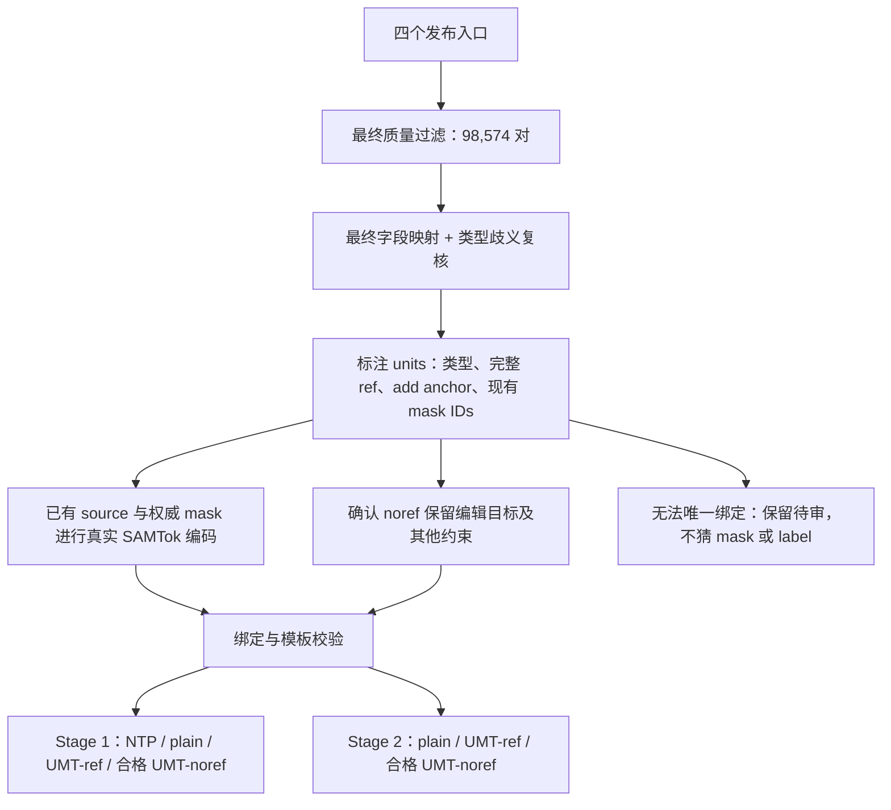

> 历史归档：保留当时的实验与命令；当前启动入口及数据状态以 [四份主文档](../README.md) 为准。旧 run ID 不应直接重用。

# SAMTokEdit Qwen-Image-2.1 全量数据盘点与转换审计

日期：2026-09-28，2026-09-29 补充准备状态。基于实际全量行扫描，不以文件夹中的“39k/25k”或 README 数字代替过滤。源数据只读；不重新审核或计算 mask。后续已经物化图像编辑对与原 mask 来源清单（见第 10 节），但尚未执行 GPU SAMTok mask 编码或生成正式训练 metadata；四机 noref 语义转换入口见[运行指南第 7 节](SAMTokEdit_Qwen21_四机训练运行指南.md#7-全量-noref-语义转换qwen3-4b--vllm)。

## 1. 结论与三个不同的计数口径

**四个数据集共 100,396 条发布记录，按最终审核状态保留 98,574 条、排除 1,822 条。98,574 是质量通过的图像编辑对数量，不是已经完成协议转换的训练行数量。当前不能确认它们可直接、全量、正确地通过 rule-based noref 转换。**

本轮区分：①原始发布行；②最终质量通过的编辑对；③类型、编辑单元、短语、mask 绑定及真实编码均已完成的训练行。不能将②直接乘以 4 当作 Stage 1 可训练行数，更不能将正则返回成功计为③。

主要发现：

- CrispEdit、ScaleEdit 导出目录保留了最终 `MASK_REVIEW/GROUND_FAIL`，必须选择最终 `mask__qc_flag == OK`。
- 新增 combined manifest 的 27,957 条全部是最终 pass，与两条生产流程的最终通过集合及 audit 逐 ID 对齐。`provenance/` 含失败/未生产记录，`by_type/` 又是主 manifest 的重复视图，均不能额外拼接进入训练。
- 正规转换器接收的是经过语义对齐的 `units`，四个原始发布格式都不是这种输入。grounding 的分割短语、原 GRES/VER label、scene filter 的 reference 不能默认当成完整 `ref_phrase`。
- ScaleEdit 1,267 条需要显式判定/拆分类型；RefEdit 789 条 `object_replacement` 来自兜底规则，不应锁死为 replace。
- 全量规则探针复现了“不抛异常却改错语义/丢失约束”的例子，不能把字符串规则成功率当作语义合格率。
- 对全部 31 个“数据集 × 原生类别”分别审阅一个真实指令、显式给定正确单位/短语后，当前转换器均能生成四种结构合法的诊断结果。这证明协议能表达这些指令；不代表已审核全部 98,574 条单位及 mask 绑定。

## 2. 范围、最终过滤与完整性

| 数据集 | 读取入口 | 发布行 | 最终保留 | 排除 |
|---|---|---:|---:|---:|
| RefEdit | `datasets/RefEdit-mask-prefiltered-qwen38-self-contained/data/*.parquet`，105 shards | 7,804 | 7,804 | 0 |
| CrispEdit | `CrispEdit-labeling/final_dataset_39k/shards/**/*.parquet`，1,844 shards | 38,971 | 37,728 | 1,243 |
| ScaleEdit | `scaleedit_25k/shards/*.parquet`，1,073 shards | 25,664 | 25,085 | 579 |
| SAMTok Derived | `datasets/SAMTok_Derived_Edit_Labeling/combined/manifest.jsonl` | 27,957 | 27,957 | 0 |
| 合计 | 前三个共 3,022 shards，加一个主 manifest | **100,396** | **98,574** | **1,822** |

共同路径前缀为 `/mnt/bn/strategy-mllm-train/user/tanyue/`。RefEdit 的 `audit/final_manifest.parquet` 是审计表，不是额外训练数据。模型自动 PASS 不等于人工逐条验证；本轮沿用数据集最终审核结果。

### 2.1 明确使用的过滤条件

```python
# RefEdit：本轮全部同时满足，quality_status 全为 strict_pass。
keep_ref = (row['prefilter_verdict'] == 'PASS'
            and row['grounding_status'] == 'OK'
            and row['qc_flag'] == 'OK')

# CrispEdit：quality/scene PASS 只是前置，最终 mask OK 必不可少。
keep_crisp = (row['quality__prefilter_verdict'] == 'PASS'
              and row['scene__scene_pass'] is True
              and row['mask__qc_flag'] == 'OK')

# ScaleEdit：使用发布的最终字段。
keep_scale = (row['quality__verdict'] == 'PASS' and row['quality__keep'] is True
              and row['scene__verdict'] == 'PASS' and row['scene__keep'] is True
              and row['mask__qc_flag'] == 'OK')

# Derived：主 manifest 最终状态；另与 provenance 最终判定逐 ID 检查。
keep_derived = (row['planning_status'] == 'accepted'
                and row['audit_status'] == 'pass')
```

CrispEdit 排除 1,243 条 = MASK_REVIEW 910 + GROUND_FAIL 333；ScaleEdit 排除 579 条 = MASK_REVIEW 472 + GROUND_FAIL 107。前置 quality/scene 在发布行里全部 PASS，单独检查它们会错误纳入上述 1,822 条。

保留行的 quality/scene 与对应 audit 字段无冲突；前三个数据集保留行的 grounding QC 全部 OK、记录的 mask_sum 全部大于 0。没有重新跑面积阈值、IoU、源/目标并集或语义审核。RefEdit sample_id、CrispEdit/ScaleEdit `(source_shard,row_idx)` 未发现重复；ScaleEdit sample_id 也未发现重复。这是键级检查，不是跨数据集图像内容去重。

### 2.2 新增数据的最终判定追溯

| 原始生产流程 | 最终 pass（进入 combined） | 最终 fail | no_output / no_plan（不进入） |
|---|---:|---:|---:|
| remove | 7,990 | 1,446 | 1,197 |
| add/replace/attribute | 19,967 | 670 | 11,259 |

combined case_id 与 `provenance/*_all_cases.jsonl` 的最终通过集合完全相等；对应 `*_audit.jsonl` 的最终 decision/quality 全部 pass。**remove 使用最终 decision，不使用 pixel veto 前的 model_decision；其他流程使用最终 quality，不用局部 model_quality 代替。** 四个 `by_type/*/manifest.jsonl` 恰好是主 manifest 对应类别的子集，不额外计数。

该新增数据有 13,174 个 source 路径、27,957 个 target 路径，共 41,131 个 manifest 引用的独立图片路径，全部存在；未逐张解码这些图像。RLE counts 全部非空，region_contract.status 全部 original。editing_instruction 与 new_instruction 在本批完全相同。

按 `(source_subset,parquet_row_index)` 去重实际仅 **7,474 个源样本**，按其加 mask_index 是 **10,237 个区域**。VER 14,898 编辑对、GRES 13,059 编辑对；同一源区域可以有不同任务。同源的不同 origin 路径不能当独立样本做 train/val 拆分，应按原始源键分组。num_masks 是原始 source 的 mask 总数，本批最高 20，**不表示当前单区域 case 需要训练 20 个 mask**。

reference_binding.status：bound_mention=12,562、bound_label=6,149、bound_shared_group=8,789、unresolved=457。它绑定的是原始 GRES/VER 问答，457 条 unresolved 不等于新编辑对审核失败；需要为新编辑指令生成可用单位短语，不能伪造或直接复用原 QA label。

## 3. 类型盘点：暂定映射与必须复核的例外

下表依据当前 native mapping / Derived task_type 汇总，是**未完成逐单元语义复核的暂定分布**，不是最终训练池统计。composite/reasoning 拆分、RefEdit 兜底类型修正之后会变化。

| 协议类型（暂定） | RefEdit | CrispEdit | ScaleEdit | Derived | 合计 |
|---|---:|---:|---:|---:|---:|
| add | 2,909 | 3,563 | 6,023 | 6,269 | 18,764 |
| remove | 1,163 | 13,276 | 5,695 | 7,990 | 28,124 |
| replace | 1,270 | 8,916 | 2,951 | 5,016 | 18,153 |
| attribute | 2,462 | 11,485 | 4,689 | 8,682 | 27,318 |
| action | 0 | 488 | 2,407 | 0 | 2,895 |
| text | 0 | 0 | 2,053 | 0 | 2,053 |
| 暂未映射 | 0 | 0 | 1,267 | 0 | 1,267 |

现有原生类别没有直接映射到 background/global；这不是将它们自动并入 attribute。类型采样权重见 [protocol.py:59](../../samtok_edit21/schema/protocol.py#L59)；全量转换完成后应按**每个分支、每个类型的实际合格行数**重做 sampling plan，避免 plain/ref 有数据而同类 noref 被规则耗尽。

### 3.1 每个原生类别的计数与规则探针

“规则结构通过”是将原 debug_reference 的提取结果送入正规 convert_record 后能生成结构合法 noref 的数量。**该函数在 repo 中明确是 debug-only；这里测试的是误用它做全量转换的后果，不表示正式转换器会自动调用它。** 为隔离文本规则，探针暂按一条指令一个 unit、一个诊断 mask 占位；没有做实例绑定或真实编码，未产出训练 JSONL。

| 数据集 | 原生类别 | 最终保留 | 暂定协议类型 | 规则结构通过（非语义合格） |
|---|---|---:|---|---:|
| refedit | `object_replacement` | 1,270 | replace | 1,134 |
| refedit | `material_change` | 799 | attribute | 795 |
| refedit | `color_change` | 1,663 | attribute | 1,543 |
| refedit | `object_removal` | 1,163 | remove | 1,162 |
| refedit | `object_addition` | 2,909 | add | 2,868 |
| crispedit | `add` | 3,563 | add | 3,543 |
| crispedit | `color` | 11,485 | attribute | 10,916 |
| crispedit | `motion change` | 488 | action | 0 |
| crispedit | `remove` | 13,276 | remove | 13,205 |
| crispedit | `replace` | 8,916 | replace | 8,908 |
| scaleedit | `object_removal` | 5,695 | remove | 5,687 |
| scaleedit | `action_editing` | 2,251 | action | 1,195 |
| scaleedit | `object_replacement` | 2,951 | replace | 2,901 |
| scaleedit | `color_change` | 2,517 | attribute | 2,444 |
| scaleedit | `object_addition` | 6,023 | add | 5,988 |
| scaleedit | `object_surface_text_editing` | 726 | text | 0 |
| scaleedit | `gui_interface_text_editing` | 434 | text | 0 |
| scaleedit | `building_surface_text_editing` | 796 | text | 0 |
| scaleedit | `material_change` | 2,172 | attribute | 1,210 |
| scaleedit | `movie_poster_text_editing` | 97 | text | 0 |
| scaleedit | `compositional_editing` | 741 | 待拆分/判定 | 0 |
| scaleedit | `count_change` | 53 | 待拆分/判定 | 0 |
| scaleedit | `perceptual_reasoning` | 29 | 待拆分/判定 | 0 |
| scaleedit | `scientific_reasoning` | 169 | 待拆分/判定 | 0 |
| scaleedit | `size_change` | 156 | action | 1 |
| scaleedit | `symbolic_reasoning` | 262 | 待拆分/判定 | 0 |
| scaleedit | `social_reasoning` | 13 | 待拆分/判定 | 0 |
| derived | `remove` | 7,990 | remove | 7,990 |
| derived | `add` | 6,269 | add | 6,231 |
| derived | `replace` | 5,016 | replace | 5,011 |
| derived | `attribute` | 8,682 | attribute | 8,682 |

### 3.2 类型来源不能混淆

- **CrispEdit** 用 type：add/remove/replace/color/motion change → add/remove/replace/attribute/action。scene_reference 可以是整句话，如 `woman extends her hand for a handshake`，不保证只含对象名，不能直接当 ref_phrase。
- **ScaleEdit** 用 final_task、final_instruction。保留行中 **3,932** 条 edit_task 与 final_task 不同，**9,669** 条 original_instruction 与 final_instruction 不同。sample_id 的目录可能仍叫 building_surface_text_editing，最终类别却已改成 object_surface_text_editing；必须以最终字段为准。
- **ScaleEdit 未映射 1,267 条**：compositional_editing=741、count_change=53、symbolic_reasoning=262、scientific_reasoning=169、perceptual_reasoning=29、social_reasoning=13。count_change 可能 add/remove；reasoning 是任务来源，不能等同 global/composite；按实际操作落到原子类型或 composite。741 条 composite 候选需要单位划分与 mask 关联，不能只改一个标签字符串。
- **RefEdit** 的 final_task 是推断结果，不是不可更改的原生真值。1,270 条 object_replacement 中 **789** 条 reason 为 fallback_local_object_change，481 条为 leading_replacement_verb。反例 `refedit:0`：`Change the leftmost bird's feathers to soft down feathers` 被兜底放进 replace；按协议的纹理变化定义应复核为 attribute。不能把这些推断标签作为硬 native constraint 阻止修正。
- **Derived** 用 task_type，attribute 已是协议名称。当前 [native_edit_type](../../samtok_edit21/annotation/prepare.py#L59) 不读取 task_type，也不直接映射字符串 attribute；adapter 应显式设置单位 edit_type，并将原生标签放在 provenance，不依赖路径名兜底。

CrispEdit 2,344 条、ScaleEdit 1,604 条的 observation 有多个 edit_id。这是**多单位/连带变化的候选信号**，不能直接等同 composite：多个分割实例可能仍是一条操作，也可能是新旧两侧同一对象。复合编辑与单短语多实例必须分别处理。

## 4. 如何落到当前训练协议

### 4.1 原始字段 → 中间标注 → 模型 metadata

| 数据集 | 指令 | 源图 / 目标图 | 权威 mask | 短语处理 |
|---|---|---|---|---|
| RefEdit | final_instruction（本批与 instruction 一致） | source_img / target_img，内嵌 | mask_png；多单位时引用对应 instance_masks | source/target ref 只作提示，重新对齐指令完整片段 |
| CrispEdit | instruction | input_img / output_img 的 image struct | mask__mask_png / mask__instance_masks | scene_reference、observation 是候选，不能把动作谓语含进去 |
| ScaleEdit | final_instruction | source_image / edited_image，内嵌 bytes | mask__mask_png / mask__instance_masks | 匹配最终指令，不能用 original_instruction 的旧片段 |
| Derived | editing_instruction | 相对于 combined 的 source_image / edited_image | **mask_rle**，COCO compressed RLE，size 为 [H,W] | 为新编辑指令取短语，不直接复用 source_answer / refer_object / reference_binding.label |

Derived 的 region_contract.source_size 为 [W,H]，与 RLE size 次序相反。可使用已有 mask 作为编辑允许区域，例如 add 的 mask 覆盖承载新增细节的灯具：沿用用户“mask 准确”的约定，不额外计算新增物体/目标并集 mask。mask_rle → SAMTok codes 是必要的表示编码，不是重新分割或审核 mask。

Derived 的 add 中 refer_object 指已有物体，例如灯具；指令 `Add a small red circular sticker to the dark housing of the light fixture.` 的单位应为新增贴纸及其锚点：

```json
{
  "edit_type": "add",
  "ref_phrase": "small red circular sticker to the dark housing of the light fixture",
  "anchor_phrase": "to the dark housing of the light fixture"
}
```

noref 为 `Add a small red circular sticker in this region ⟨M⟩.`，保留新增内容，不能变成 “Add the object …”。这里接受已有灯具范围作为数据集给定的编辑支持区域，不以旧打标建议要求重新分割贴纸。

原 GRES/VER source_answer / canonical_span 对应原 QA 和原 mask 编码，不能将整段 QA 答案作为新编辑 NTP gold，也不能未经验证把旧 token 当成当前 source+mask_rle 的编码。本轮未做全量 GPU 编码，没有宣布 codes 已准备完成。



### 4.2 中间格式与四种输出

[convert_record](../../samtok_edit21/annotation/prepare.py#L161) 需要中间格式。下述“真实 mask span”是说明占位，不能原样写入训练：

```json
{
  "edit_image": "source.png",
  "image": "target.png",
  "instruction": "Change the material of the left fountain to bronze",
  "units": [{
    "edit_type": "attribute",
    "ref_phrase": "left fountain",
    "anchor_phrase": null,
    "mask_codes": ["<真实 mask span>"]
  }]
}
```

| sample_type / variant | prompt | 其他字段 |
|---|---|---|
| edit_ntp | Change the material of the left fountain to bronze | mt_cot 为标准 JSON mask list，label=left fountain；没有 image |
| edit | 同原指令 | image=目标图，不带 mask tokens |
| edit_umt / ref | Change the material of the left fountain ⟨M⟩ to bronze | image；instr_variant=ref |
| edit_umt / noref | Change the material of this region ⟨M⟩ to bronze | image；instr_variant=noref |

所有行都有 edit_type、edit_image；来源、原生类别、审核字段、unit/mask 绑定和样本键放 sidecar，不混入模型 metadata。chat 模板仍由模型处理层构造，无需重复存入 image1/system/空思考块。真实 ⟨M⟩ 必须是当前 codec 生成的 4-token span，两级 codebook 分别在 [0,255]、[256,511]。

多实例共享完整指代短语时，按同一个 unit 的多个现成实例 mask/code 处理，不能按 mask 数标 composite；多个独立动作则分别建 unit 并按指令顺序绑定，样本类型 composite。单语义目标可以使用现成 union mask；若多个独立单位只有一个不可拆分的总 mask，不能将总 mask 复制给每个单位当正确标注。应补齐**现有实例标注的对应关系**，否则暂缓该行 mask-conditioned 分支，符合条件的 plain 分支可独立保留。

## 5. Rule-based noref 的实测问题

### 5.1 正规渲染器与上游短语规则的分工

[render_units](../../samtok_edit21/schema/protocol.py#L230) 依照已提供单位做字符串替换，不理解整句语义；[phrase_span](../../samtok_edit21/schema/protocol.py#L138) 检查唯一匹配；[validate_row](../../samtok_edit21/schema/protocol.py#L389) 检查字段/token 结构。这些通过不能证明删掉的是正确 referring expression。

[debug_reference](../../samtok_edit21/annotation/prepare.py#L345) 明确仅用于小样本调试。[convert_sample](../../samtok_edit21/annotation/prepare.py#L294) 另有 legacy edit_mt 的 add-anchor 猜测规则，两者的介词集合不完全相同。四个发布数据集并不是已标好单位的 edit_mt 格式，不能把任一 helper 当成全量 adapter。

| 数据集 | 质量通过对数 | 至少一个已有 ref 候选可精确匹配 | debug 规则能生成结构合法 noref |
|---|---:|---:|---:|
| RefEdit | 7,804 | 1,713 | 7,502 |
| CrispEdit | 37,728 | 37,641 | 36,572 |
| ScaleEdit | 25,085 | 11,605 | 19,426 |
| Derived | 27,957 | 10,836 | 27,914 |
| 合计 | 98,574 | 61,795 | 91,414 |

候选含 source/target grounding、CrispEdit scene_reference、Derived 原 QA label 和规划 target/refer_object。**至少一个匹配不等于完整单位绑定成功**，CrispEdit 的高匹配率也可能包含整段谓语。91,414 条结构通过记录中已找到明确反例，不能当成合格量；其余 7,160 条失败/无类型也不能当作质量失败删除。

### 5.2 数据中的具体反例

| 来源 / ID | 实际问题 | 正确处理 |
|---|---|---|
| RefEdit refedit:1 | `Change the material of the left fountain to bronze` → debug ref 吞入 `the material of` → `Change this region ⟨M⟩ to bronze` | ref=left fountain，保留属性操作。RefEdit 524、ScaleEdit 155、Derived 1，共 680 个结构通过样本命中此具体风险模式 |
| RefEdit refedit:548 | `Replace the rightmost bird with striking green plumage with a bird that has striking purple plumage.` → 按第一个 with 切，只替换 rightmost bird，输出仍有两个 with | 旧对象 ref 包含 `with striking green plumage`；不能用首个 with 切句 |
| ScaleEdit 3.4_count_change/count_change_0000.parquet#183 | `Remove the gray and green chairs, leaving only the blue chair in the center.` → debug ref 吞掉 leaving 子句 | ref=gray and green chairs，保留 `, leaving only the blue chair in the center.` |
| ScaleEdit 同 count_change 文件 #76 | 原句 `Remove the green bell pepper located on the right.`，grounding 仅为 green bell pepper，直接替换残留定位修饰 | 先对齐完整 `green bell pepper located on the right` |
| Derived 000003_ver_r1_m0_add | `Add a small red circular sticker to the dark housing of the light fixture.`；debug 未将 to 识别为 anchor，末尾又加 in this region | 用完整 anchor_phrase，保留新增贴纸描述、替换放置锚点 |
| CrispEdit motion change_00092.parquet#125 | 原句 `The woman extends her hand for a handshake, which is completed in the edited image.`；scene_reference 含 extends…，替换后动作消失 | 主体 ref=woman；extends her hand for a handshake 必须保留 |
| ScaleEdit 3.2_material_change/material_change_0006.parquet#23246 | `Change the material of the central shield post and the street lamp to its left to polished chrome.` → 输出 `Change this region ⟨M⟩ to its left to polished chrome.` | to its left 是定位修饰，polished chrome 才是目标属性，需要语义边界 |

这里区分真实错误与风险检索：包含 while/without/keep 不必然错误，例如 `a dog without a collar` 本来就是目标描述，不能仅凭关键词删数据。所有探针命中都保留原句与行键。

### 5.3 每种类型的 noref 验收合同

| 类型 | 必须删除/替换 | 必须保留 / 边界 |
|---|---|---|
| add | 放置锚点 → in this region；无锚点时补区域短语 | 新增物体、数量、颜色、材质、形状全部保留；区分新增物体自身修饰与放置锚点 |
| remove | 完整被删对象/组 → the object in this region | 保留其他对象的保留约束，不把 leaving/while keeping 当对象名删掉 |
| replace | 完整旧对象 ref → the object in this region | 新对象/形态及修饰保留；旧对象描述中的 with/to 不是替换边界 |
| attribute | 对象/部件 ref → this region | 保留 the material/color/texture/... of 和目标属性 |
| action | 受动作影响对象 ref → the object in this region | 动作、姿态、移动目标位置、大小参照等保留，不吞谓语 |
| text | 按合同选旧字符串或载体 → the text in this region | 新字符串、大小写、标点必须保留；from OLD to NEW 常需明确改写 |
| composite | 每个单位按自身原子合同替换 | mask 与动作一一绑定，不交换、不漏动作、不复制总 mask 假装单位标注 |
| background/global | 按当前协议处理前景外区域/整图 | 本批无直接对应原生类别，未伪造样本或声称已实测 |

noref 应遵循当前协议，不是删除所有名词：`Make the red cube the same size as the blue cube` 中 **blue cube 是大小参照，必须保留**；text 在替换旧引号文字后保留载体上下文，可以符合当前合同。若要严格“所有定位仅靠 mask”的额外消融，应另定协议，不能在本次转换时随意删目标语义。

### 5.4 显式改写使用已有 reviewed_noref

ScaleEdit `Change the logo text on the mobile interface from 'Big Spice' to 'Spi Bite'.`，机械替换旧引号文字会使 from 后出现区域对象，句子不正确。可在审阅过的记录里使用：

```json
{"noref_instruction": "Change the text in this region {mask_0} to 'Spi Bite'."}
```

[reviewed_noref](../../samtok_edit21/annotation/prepare.py#L137) 检查每个单位占位恰好一次，并紧跟类型要求的区域短语，然后填入真实 code。编号遵循单位存储顺序，不能随文本排序擅自重编号。它仍只验证结构，不证明语义；应另存原指令 hash、单位、保留目标内容与审阅状态。

## 6. 全部已出现原生类型的真实指令示例

以下覆盖 31 个数据集原生类别。本轮先阅读指令、明确类型和完整 ref/anchor，再调用当前 converter，全部获得 NTP/plain/ref/noref 四种结构合法结果。⟨Mi⟩ **仅是诊断占位**；未验证这些示例的逐实例 mask 分组，未用占位生成训练文件。完整四种文本和单位见临时目录 reviewed_examples.json。

### 6.1 refedit

| 原生类型 / 样本键 | 原指令 | 显式单位生成的 noref |
|---|---|---|
| `object_replacement`<br>refedit:11631 | Change the book held by the friend with the plaid scarf to a magazine | Change the object in this region ⟨M0⟩ to a magazine |
| `material_change`<br>refedit:12081 | Change the material of the violin with the star-shaped sticker to metal | Change the material of this region ⟨M0⟩ to metal |
| `color_change`<br>refedit:10354 | Let the hat of the gnome sitting on a mushroom be green | Let this region ⟨M0⟩ be green |
| `object_removal`<br>refedit:17932 | Remove the red flowers in the small pots | Remove the object in this region ⟨M0⟩ |
| `object_addition`<br>refedit:15597 | Add a basket filled with grapes on the right side | Add a basket filled with grapes in this region ⟨M0⟩ |

### 6.2 crispedit

| 原生类型 / 样本键 | 原指令 | 显式单位生成的 noref |
|---|---|---|
| `add`<br>add_00642.parquet#56 | Add white picket fences on either side of the road. | Add white picket fences in this region ⟨M0⟩. |
| `color`<br>color_00422.parquet#68 | Turn plates positioned in the right-central area into gold | Turn this region ⟨M0⟩ into gold |
| `motion change`<br>motion change_00114.parquet#79 | The woman with the red and blue pigtails smiles and leans forward, placing her hand on the couch. | the object in this region ⟨M0⟩ smiles and leans forward, placing her hand on the couch. |
| `remove`<br>remove_00851.parquet#64 | remove the young boy in the blue shirt and jeans standing on the curb | remove the object in this region ⟨M0⟩ |
| `replace`<br>replace_00009.parquet#48 | replace the group of individuals with robots | replace the object in this region ⟨M0⟩ with robots |

### 6.3 scaleedit

| 原生类型 / 样本键 | 原指令 | 显式单位生成的 noref |
|---|---|---|
| `object_removal`<br>2.2_object_removal/object_removal_0001.parquet#39189 | Remove the black fishing hooks on the left side of the image. | Remove the object in this region ⟨M0⟩. |
| `action_editing`<br>2.4_action_editing/action_editing_0000.parquet#2179 | Make the man in the green uniform salute. | Make the object in this region ⟨M0⟩ salute. |
| `object_replacement`<br>2.3_object_replacement/object_replacement_0005.parquet#17392 | Replace the black SUV and the silver SUV parked on the street with two red sports cars. | Replace the object in this region ⟨M0⟩ with two red sports cars. |
| `color_change`<br>3.1_color_change/color_change_0006.parquet#3999 | Change the color of the dome on the central building to gold. | Change the color of this region ⟨M0⟩ to gold. |
| `object_addition`<br>2.1_object_addition/object_addition_0001.parquet#4041 | Add a large red dome tent to the center of the open area, in front of the sphinx statues. | Add a large red dome tent in this region ⟨M0⟩. |
| `object_surface_text_editing`<br>4.4_building_surface_text_editing/building_surface_text_editing_0006.parquet#3358 | Replace the text 'TWIN CITIES' with 'Film Hubs' on the center backdrop panel. | Replace the text in this region ⟨M0⟩ with 'Film Hubs' on the center backdrop panel. |
| `gui_interface_text_editing`<br>4.2_gui_interface_text_editing/gui_interface_text_editing_0002.parquet#1105 | Change the logo text on the mobile interface from 'Big Spice' to 'Spi Bite'. | Change the text in this region ⟨M0⟩ to 'Spi Bite'. |
| `building_surface_text_editing`<br>4.4_building_surface_text_editing/building_surface_text_editing_0006.parquet#21678 | Replace the text 'Scotland' with 'Fort William' on the blue banner. | Replace the text in this region ⟨M0⟩ with 'Fort William' on the blue banner. |
| `material_change`<br>3.2_material_change/material_change_0003.parquet#20154 | Transform the golden spire of the central temple into a material of polished glass. | Transform this region ⟨M0⟩ into a material of polished glass. |
| `movie_poster_text_editing`<br>4.1_movie_poster_text_editing/movie_poster_text_editing_0001.parquet#12602 | Replace the text 'DEC 9 SUN 8/7c' with 'DEC 16/SUN 8/7' under 'THE FLASH' heading. | Replace the text in this region ⟨M0⟩ with 'DEC 16/SUN 8/7' under 'THE FLASH' heading. |
| `compositional_editing`<br>6.1_compositional_editing/compositional_editing_0000.parquet#5218 | Remove the smaller ship on the right, and change the color of the large ship's hull to blue. | Remove the object in this region ⟨M0⟩, and change the color of this region ⟨M1⟩ to blue. |
| `count_change`<br>3.4_count_change/count_change_0000.parquet#284 | Add one goose to the right side of the group, ensuring it stands on the grass aligned with the existing geese. | Add one goose in this region ⟨M0⟩, ensuring it stands on the grass aligned with the existing geese. |
| `perceptual_reasoning`<br>5.3_social_reasoning/social_reasoning_0000.parquet#392 | Make the stack of bread on the right look heavily baked and charred. | Make this region ⟨M0⟩ look heavily baked and charred. |
| `scientific_reasoning`<br>5.4_scientific_reasoning/scientific_reasoning_0000.parquet#8447 | Add visible sediment or precipitate to the bottom of the beaker on the left. | Add visible sediment or precipitate in this region ⟨M0⟩. |
| `size_change`<br>3.5_size_change/size_change_0000.parquet#1293 | Make the red cube the same size as the blue cube. | Make the object in this region ⟨M0⟩ the same size as the blue cube. |
| `symbolic_reasoning`<br>5.2_symbolic_reasoning/symbolic_reasoning_0000.parquet#2742 | Replace the number 17 in the second-to-last cell with 19. | Replace the text in this region ⟨M0⟩ with 19. |
| `social_reasoning`<br>5.3_social_reasoning/social_reasoning_0000.parquet#815 | Change the green light to a red light on the primary traffic signal. | Change this region ⟨M0⟩ to a red light on the primary traffic signal. |

### 6.4 derived

| 原生类型 / 样本键 | 原指令 | 显式单位生成的 noref |
|---|---|---|
| `remove`<br>009702_ver_r11259_m0_remove | Remove ornate O.P.A. shield/crest held at center of the group. | Remove the object in this region ⟨M0⟩. |
| `add`<br>021330_ver_r8303_m0_add | Add a small red circular sticker to the center of the black metal grate. | Add a small red circular sticker in this region ⟨M0⟩. |
| `replace`<br>031501_gres_r12183_m0_replace | Replace the black cow in the foreground with a white horse standing in the same pose. | Replace the object in this region ⟨M0⟩ with a white horse standing in the same pose. |
| `attribute`<br>025739_gres_r10008_m0_attribute | Change the color of the white leather sofa in the foreground right to dark brown. | Change the color of this region ⟨M0⟩ to dark brown. |

## 7. 全量转换的准入条件与待办

当前不能宣布“91,414 条规则通过都能训练”或“全部 98,574 条都已能产出正确 noref”。正式导出应按下列流程：

1. **固定最终通过清单。** 只读主发布入口，保留失败原因与稳定键，不递归拼接所有 parquet/manifest。row_idx 常为上游 shard 原始行号，未必是当前输出 parquet 第几行，应按 sample_id 或 (source_shard,row_idx) join。
2. **补齐语义单位。** 输入最终指令、原生类型、现有 grounding/scene 候选及现成 mask ID；输出原子类型、完整 ref_phrase、add anchor、mask_ids、需要保留的新内容/动作/约束。RefEdit 兜底和 ScaleEdit 1,267 条先处理类型，其他条也不能跳过短语检查。多单位缺 mask 对应关系时暂缓相应分支。
3. **正规渲染器只消费已审阅单位。** 简单句用 render_units；复杂关系、from/to 文本、非末尾 anchor 用显式 noref_instruction。不要扩大正则直到“覆盖率好看”；若使用模型辅助标注，应有独立原句↔改写语义核验，不能用同次生成的自信描述代替验收。
4. **静态检查可判定的契约。** 短语精确唯一、单位不重叠、ref 去 mask 后等于原指令（global 有明确例外）、mask/code 与单位顺序不变、NTP label round-trip 一致；新文字/数值/颜色/材质/动作/保留约束对照 sidecar。静态检查不能证明所有语言语义，复杂项必须留审阅出口。
5. **最后编码和物化。** 已确定的单位引用权威 mask，进行真实 SAMTok 编码。图像从内嵌 bytes 物化成路径，或提供明确读取 adapter。真实 code 生成之前诊断占位不得进入训练。Stage 1 放 NTP/plain/ref/合格 noref，Stage 2 只放 FM；noref 不合格时保留其他可用分支，不用 ref 文本冒充 noref。
6. **重新统计分支类型池与训练计划。** 质量 QC、单位绑定、noref 审阅有独立状态。固定分支配比能在残缺池上跑通，不证明每种类型都覆盖；重点检查 action/text/composite、多实例以及各分支重复采样次数。

这套接口可适配四个数据集的各种编辑类型；本轮完成盘点、全量文本规则审计和类型代表样本转换验证，没有冒充完成全量语义标注或真实编码。达标编辑对全部保留在索引中，转换受阻不当作质量不合格删除。

## 8. 产物与复现

临时目录：`/tmp/samtok21-full-data-audit-O75P3y/`，系统清理后可能失效。报告保留关键总数、每类计数、真实反例与代码入口；源数据只读。

| 文件 | 用途 |
|---|---|
| inventory.json | 各审核字段分布、发布/保留/排除数与键级去重 |
| accepted_index.jsonl | 98,574 条达标编辑对的源定位；明确 training_ready=false |
| excluded_index.jsonl | 1,822 条最终 QC 排除记录的源定位 |
| type_conversion_counts.csv | 31 类计数与结构探针结果 |
| conversion_probe.jsonl | 每条达标指令的候选、规则输出/失败原因，98,574 行；诊断占位，不用于训练 |
| review_queue.jsonl | 1,267 条 mapper 不支持的 ScaleEdit 行；只是类型优先队列，不是全部 noref 待审量 |
| counterexamples.json | 带源键的风险/反例，风险检索不等于语义错误计数 |
| reviewed_examples.json | 31 个类型代表样本的显式单位和四种诊断输出 |
| extra_checks.json | Derived final/audit 集合、路径存在性、源去重、审核一致性 |
| type_field_checks.json | ScaleEdit 最终字段变化与 RefEdit 推断来源 |

```bash
export REVIEW=/tmp/samtok21-full-data-audit-O75P3y
export PY=/tmp/samtok21-fixes-dUnbt5/venv/bin/python
# 从 repo 根目录执行；源数据只读，结果写 REVIEW。
export PYTHONPATH="$PWD:$PWD/DiffSynth-Studio"
export PYTHONDONTWRITEBYTECODE=1
$PY "$REVIEW/inventory.py"
$PY "$REVIEW/analyze_conversion.py"
$PY "$REVIEW/extra_checks.py"
$PY "$REVIEW/build_indices.py"
$PY "$REVIEW/reviewed_examples.py"
```

源码：[原生映射](../../samtok_edit21/annotation/prepare.py#L59)、[正规单位转换](../../samtok_edit21/annotation/prepare.py#L161)、[显式 noref 改写](../../samtok_edit21/annotation/prepare.py#L137)、[legacy 转换](../../samtok_edit21/annotation/prepare.py#L294)、[debug-only 规则](../../samtok_edit21/annotation/prepare.py#L345)、[渲染](../../samtok_edit21/schema/protocol.py#L230)、[行结构校验](../../samtok_edit21/schema/protocol.py#L389)。

第 1–8 节盘点阶段没有修改转换代码：已证实的风险需要正确的上游语义单位，不能用未经验证的新正则掩盖。后续新增的 vLLM 候选转换及其质量限制见四机指南第 7 节。源数据集提供的 mask 仍按用户约定可信。


## 9. 构造 pipeline 的交叉核对（2026-09-28 补充）

已按用户补充信息克隆 `sam3-crispedit` 除 main 外的四个分支，逐一对照交付文档与实际导出代码。克隆位于 `/opt/tiger/tanyue/sam3-<branch>/`，没有修改上游数据或这些仓库。结论：前述最终保留数量不变，但不能将发布目录完成标记当作每行 mask QC 通过。

| 分支及固定版本 | 读取证据 | 对当前适配器的约束 |
|---|---|---|
| crispedit-labeling `cdbb6208a69eb78b58ac3898d44b6101d12a7857` | [交付文档](https://github.com/Tangent0308/sam3-crispedit/blob/cdbb6208a69eb78b58ac3898d44b6101d12a7857/docs/CRISPEDIT_MASK.md#L42)、[导出连接](https://github.com/Tangent0308/sam3-crispedit/blob/cdbb6208a69eb78b58ac3898d44b6101d12a7857/scripts/build_crispedit_final_dataset.py#L93) | 38,971 是双 PASS 发布行；训练选择最终 mask OK 的 37,728。阶段用 source_shard + row_idx 连接，不能按过滤后的行序连接原始 sidecar。 |
| refedit-labeling `bb2097966bcb6c66593caf34ab84b5dc96b1acd6` | [严格筛选](https://github.com/Tangent0308/sam3-crispedit/blob/bb2097966bcb6c66593caf34ab84b5dc96b1acd6/docs/REFEDIT_MASK.md#L122)、[类型限制](https://github.com/Tangent0308/sam3-crispedit/blob/bb2097966bcb6c66593caf34ab84b5dc96b1acd6/docs/REFEDIT_MASK.md#L489) | 7,804 已经过严格筛选；final_task 是规则粗分类，不是原生真值。允许语义模型修正类型，原图、目标图、指令、mask identity 不随之改变。 |
| scaleedit-labeling `d3d0b42cfc59c26e63d4be3c8ae89435f84f5834` | [最终字段与发布集](https://github.com/Tangent0308/sam3-crispedit/blob/d3d0b42cfc59c26e63d4be3c8ae89435f84f5834/docs/SCALEEDIT_MASK.md#L28)、[实际连接校验](https://github.com/Tangent0308/sam3-crispedit/blob/d3d0b42cfc59c26e63d4be3c8ae89435f84f5834/scripts/build_scaleedit_final_dataset.py#L89) | 用 final_task/final_instruction，双 PASS 的 25,664 中选择最终 mask OK 的 25,085。原始 edit_task/instruction 只作追溯。 |
| samtok-derived-edit-labeling `b059488298b29a0ac59517bc887bbca26c62358e` | [正式交付](https://github.com/Tangent0308/sam3-crispedit/blob/b059488298b29a0ac59517bc887bbca26c62358e/docs/SAMTOK_FINAL_FOUR_TYPE_DATASET.md#L35)、[最终审核与字段](https://github.com/Tangent0308/sam3-crispedit/blob/b059488298b29a0ac59517bc887bbca26c62358e/synthesis_pipeline/materialize_combined_samtok_dataset.py#L119) | 主 manifest 27,957 条；remove 检查最终 decision，其他检查最终 quality。用 editing_instruction、当前 case 的 mask_rle；original_mask_rle/source_answer/canonical_span 不替代执行 mask。 |

一个容易误读的细节：CrispEdit 文档说 add 在 target 做 grounding/分割，这不等于导出 mask 仍在 target 坐标。[实际代码](https://github.com/Tangent0308/sam3-crispedit/blob/cdbb6208a69eb78b58ac3898d44b6101d12a7857/crispedit/mask/pipeline.py#L1192) 将 target mask 映射回 source，随后在 source_shape 上形成已有 union；[逐实例 RLE](https://github.com/Tangent0308/sam3-crispedit/blob/cdbb6208a69eb78b58ac3898d44b6101d12a7857/crispedit/mask/pipeline.py#L1254) 也编码映射后的实例。`grounding_image=target` 是分割来源，不能据此在训练准备时重复映射。

新增 Derived 的 num_masks 是原始多实例总数，每个 case 的 mask_rle 只对应本条选中的 region。它的两组 source 文件按 remove/multitype 命名空间保留真实输入字节；不能用同名文件覆盖，也不能把旧 source_answer 当作当前编辑的监督文本。

本次 pure-text 输入重新直接扫描实际发布文件并执行最终过滤，得到 98,574 行，SHA256 为 `c755276713b280d49709acab8d500d2f27b19cbbba08629bcc2e04333e4059d6`。路径为 `/mnt/bn/strategy-mllm-train/user/tanyue/experiments/SAMTokEdit/qwen21_full4_20260928/data/semantic_sources.jsonl`。其中 `locator.row` 明确表示**该已合并发布文件的物理行号**，用于重新读取同一行；没有用它替代上游原始 sidecar 的 row_idx 连接键。


## 10. 全量来源物化完成与语义转换状态

共享目录：`/mnt/bn/strategy-mllm-train/user/tanyue/experiments/SAMTokEdit/qwen21_full4_20260928/data`。

| 产物 | 当前状态 |
|---|---|
| semantic_sources.jsonl | 98,574 条纯文本标注输入；四个数据集最终通过条件已执行 |
| semantic_inventory.json | 发布数量、最终保留数量、文本输入 hash |
| sources.jsonl | 98,574 条实际来源记录，包含原文、真实图像路径、尺寸、图像 hash、已有 mask/RLE、分组键 |
| assets/ | 前三个 parquet 数据集的源图、目标图和已有 aggregate mask，保留原始图像字节；Derived 保留已有自包含路径 |
| source_shards/ | 3,022 个 parquet 分片 + 1 个 Derived manifest 的来源记录与完成回执 |
| source_inventory.json | 全量图像实际解码完成；来源 manifest hash；training_ready=false |

RefEdit 7,804、CrispEdit 37,728、ScaleEdit 25,085、Derived 27,957，合计 **98,574 对**。保留记录的 source/target 图像均已实际解码读取；没有重新分割、计算 source-target union 或按面积/语义重新筛选 mask。Derived 同一 source 可能被多个 case 使用，因此 197,148 次图像检查不等于 197,148 个唯一图像文件。

全量来源与文本输入已按 source ID **逐条比较** compact_source 内容 hash，98,574 条一一对应，无缺失或重复；31 个原生类型计数与本报告前文一致。

`sources.jsonl` SHA256：`d345ee4c7827a0141e68b93dd282409810a7f2a261e0f89fdf60b096492d6615`。

来源文件准备完成仍不等于训练 metadata 完成。小模型语义候选仍存在失败和误接受，尚未发布 stage1/stage2 的全量可训练标记；当前没有启动全量两阶段训练。当前候选转换代码、四机完整入口、真实正确例子与未通过反例见[四机指南第 7 节](SAMTokEdit_Qwen21_四机训练运行指南.md#7-全量-noref-语义转换qwen3-4b--vllm)。

验收脚本与结果保留在 `/tmp/samtok21-full-build-20260928/check_staged.py`、`staged_check.json`；图像解码日志为 `staging.log`、`staging_resume.log`。其中 Derived 单文件读取改为 8 线程后续跑，复用前三个数据集已完成且 manifest hash 匹配的回执；最终总数与来源逐条一致性已复核。

## 11. 两字段转换更新（2026-09-29）

当前模型只输出 ref_phrase 与 noref_instruction，已有类型、region 短语和 mask 占位符由程序确定，不再让模型生成 edit_type/anchor/mask ID 或做重复自审。完整 prompt、代码索引、4B/8B 同批对照、剩余边界问题见[两字段转换与模型对比](SAMTokEdit_Qwen21_noref两字段转换与模型对比.md)。本文件前面关于多字段标注/模型复核的内容属于历史开发记录，以新文档的当前实现为准。全量来源清单与最终 QC 筛选数量不变。
