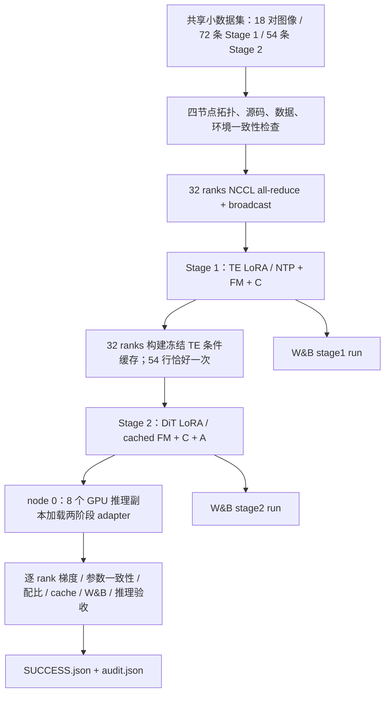

> 历史归档：保留当时的实验与命令；当前启动入口及数据状态以 [四份主文档](../README.md) 为准。旧 run ID 不应直接重用。

# SAMTokEdit Qwen-Image-2.1 四机训练运行指南

全量数据物化、统计和正式入口见[全量训练数据与正式四机入口](SAMTokEdit_Qwen21_全量训练数据与正式四机入口.md)。本文件保留 18 条调试数据的 smoke run 说明。

本入口用于 **4 机 × 8 GPU**，保持当前两阶段的计算定义、LoRA 更新范围与每个 rank 的任务配比。四台机器各执行一次相同入口，ARNOLD 提供本机编号，脚本自动完成 Stage 1 → conditioning cache → Stage 2 → node 0 八卡并行推理 → 验收。此处的短训练用于验证执行链路；正式训练需要单独确定训练长度、分辨率与 A 系数。

第 1–6 节是两阶段短训练验证；第 7 节是新增的四数据集语义转换入口。**当前 9B 转换仍有语义反例，第 7 节用于候选生产与诊断，不表示全量训练数据已验收。**

## 1. 总体实现



DDP 的每个 rank 仍然处理一条样本；不引入 FSDP/ZeRO 或跨机模型切分。`torch.distributed.run` 提供 rank/world-size 环境，训练内部仍由 DiffSynth runner + Accelerate 管理反向、累积、优化器与保存。

## 2. 对官方和现有项目具体增加了什么

### 2.1 ARNOLD 入口与四机编排

方法需求：32 ranks 必须共享同一个 rendezvous 地址和端口，每阶段成功后才能进入下一阶段；所有训练节点必须运行同一个已推送的 Git commit。

实现：[bootstrap_arnold_4node.sh](../../scripts/train/bootstrap_arnold_4node.sh#L1) 是不依赖预先 clone 的完整 bootstrap 入口。ARNOLD 作业启动时需将下面第 4 节的完整脚本作为 worker 启动命令提交；四个 worker 同时执行同一脚本。它们分别从 GitHub 克隆 `qwen-image-2.1-dev` 到本机 `/tmp`，在本机创建 Python 环境；共享实验目录只保存调试数据、日志和训练产物。入口要求 ARNOLD 注入 `ARNOLD_WORKER_HOSTS`、`ARNOLD_WORKER_NUM=4`、`ARNOLD_WORKER_GPU=8`、`ARNOLD_ID=0..3`，并向每个 worker 注入 `WANDB_API_KEY` secret。

[topology](../../samtok_edit21/distributed/cluster.py#L40) 从 `ARNOLD_WORKER_HOSTS` 第一项读取 `host:port` 或 `[IPv6]:port`，用 `ARNOLD_ID` 作为 node rank。四节点通过共享目录交换 Git commit、拓扑、参数、源代码 hash、数据 hash 和依赖版本，全部一致后才启动 NCCL 检查。

```python
# 对应 cluster.py 中的核心逻辑；完整错误处理见链接
host = env.get("MASTER_ADDR") or host or env.get("ARNOLD_WORKER_0_HOST")
port = env.get("MASTER_PORT") or port
# torch.distributed.run --nnodes 4 --nproc_per_node 8
#   --node_rank NODE_RANK --master_addr HOST --master_port PORT
```

[Pipeline](../../samtok_edit21/distributed/cluster.py#L83) 用全新 run 目录防止读到旧阶段标记；每个节点记录独立日志，任意节点失败会写 `failure.json`，其他节点轮询并终止自己的进程组。阶段及 barrier 默认超时 7200 秒，训练进程组默认超时 1800 秒。节点的 Python 环境放在本机 `/tmp`，编译缓存也放在本机；模型、数据、adapter、日志放在共享盘。

### 2.2 两阶段训练与 W&B

方法需求：保持原本 TE/DiT 更新范围、3:2:2:1 和 1:2:1 配比，同时记录完整 optimizer update 的全局平均 loss，而不是只拿 rank 0 最后一个 microstep 代表整步。

现有的 DiffSynth [optimizer-step 回调](../../DiffSynth-Studio/diffsynth/diffusion/runner.py#L166) 更新回调额外传入本次实际 learning rate；[on_optimizer_step](../../samtok_edit21/training_core/train.py#L194) 汇总所有 rank、所有累积 microstep 的标量，记录每个指标的参与样本数、各任务计数和 rank 样本数。原 `supervision_metrics.jsonl` 继续保留，新增所有训练都记录的 `training_metrics.jsonl`。缓存 Dataset 只在内存中附带 `_sample_kind` 用于日志；forward 在验证和 FM 前移除此字段，不改变持久化 cache schema 或模型输入。

[TrainingTracker](../../samtok_edit21/training_core/tracking.py#L51) 在加载大模型前仅 global rank 0 初始化 W&B，同步抛出的初始化/记录/结束异常会广播到其他 rank。两阶段分别创建一个 run，cache 阶段不创建 run。凭据只来自环境，不写入参数 JSON。默认普通训练 CLI 保持 W&B disabled；本四机入口显式启用 online。

2026-09-28 四机实测发现 byted-wandb 会将嵌套 config 展开为长 key；服务端拒绝超过 64 字符的 key，而客户端吞掉异常后仍可正常 `finish()`。现由 [wandb_config](../../samtok_edit21/training_core/tracking.py#L13) 提前展开并将长 key 缩为「前 47 字符 + `_` + 16 位 SHA256」，完整路径映射保存到每阶段的 `tracking/config-key-map.json`。短 key 不变，完整训练参数仍在 `run.json`、采样计划在 `schedule.json`。收尾时 [check_wandb_upload_errors](../../samtok_edit21/training_core/tracking.py#L38) 检查本次 SDK 内部日志中的 HTTP 上传错误，发现错误就通过 collective 报错，不写成功状态。这个检查能发现已记录的服务端拒绝；`finished` 仍不能单独证明远端所有数据完整到账。详细实测及修复验证见[实验记录第 13 节](SAMTokEdit_Qwen21_实验记录.md)。

```python
records = gather_object(self.pending_metrics)
self.pending_metrics = []
# 每个数值指标按实际出现次数求均值，并同时记录 counts。
# 如 NTP 不参与 attn_main 的分母。
self.tracker.log(entry, learning_rate)
```

W&B 的 `train/weighted_total` 对应进入 backward 前的样本 loss，已经包含 NTP/FM 分支权重。`train/lr` 是本次 optimizer 实际使用的 LR。A/C 指标只对适用样本取均值；`count/*`、`branch/*` 可以检查分母与混合配比。保留的 `optimizer_steps.jsonl` 中 `loss_last_microstep` 仍是 rank 0 最后一个 microstep，两者含义不同。

### 2.3 所有 rank 的训练验收

方法需求：排除某个 rank 无梯度、冻结参数被更新、跨节点未同步的情况。

[after_backward_audit](../../samtok_edit21/training_core/train.py#L268) 将原有每次 backward 的有限性/非零/冻结梯度检查逐 rank 落盘。[verify_rank_parameters](../../samtok_edit21/training_core/train.py#L304) 在两阶段结束时，对所有可训练参数计算 SHA256，跨所有 rank 比较，只有完全一致才保存最终 adapter。它只增加读操作和验收，不修改参数或训练随机数。

### 2.4 环境与依赖

[setup_cluster_env.sh](../../scripts/train/setup_cluster_env.sh#L2) 从 `requirements.txt` 与 `requirements-cluster.txt` 一起安装并执行 `uv pip check`。沿用旧指南的 `byted-wandb==0.13.98`、`WANDB_DISABLE_SERVICE=true`、`WANDB_START_METHOD=thread`；补齐经过实际安装验证的依赖约束。该客户端仍导入 `pkg_resources`，所以固定 `setuptools==80.9.0`；其鉴权依赖要求 `cryptography<50`，固定为 `49.0.0`。torch/transformers/accelerate/peft 的训练版本保持原先的 2.8.0/5.12.1/1.14.0/0.20.0。

## 3. 已准备好的小批量实验

共享根目录：

```text
/mnt/bn/strategy-mllm-train/user/tanyue/experiments/SAMTokEdit/qwen21_4node_debug_20260928
```

三个数据集各 6 条，共 18 对图像。使用之前已整理的真实数据集 mask 及其 SAMTok 编码，复制成共享盘中的独立 PNG；不重新检查 mask 的语义正确性，不补 target mask。数据类型映射与源 parquet/row index 均保存在 `data/provenance.json`，包含 attribute/remove/replace/add/action/text。每对图像生成 NTP、plain、ref、noref 四行，所以 Stage 1 有 72 行，Stage 2 有 54 行；区域缓存有 36 个局部 UMT 行。正式方法所需的 codec 解码/coverage 构建仍由 prepare-regions 执行。

| 设置 | Stage 1 | Stage 2 |
|---|---:|---:|
| 更新对象 | TE LoRA | DiT LoRA |
| LoRA rank / dropout | 64 / 0.05 | 32 / 0 |
| optimizer updates | 2 | 3 |
| 每 rank 梯度累积 | 8 | 4 |
| 四机 global batch | 256 | 128 |
| 每 update 类型计数 | NTP=96, ref=64, noref=64, plain=32 | ref=32, noref=64, plain=32 |
| LR / weight decay | 4e-5 / 0.05 | 1e-4 / 0.01 |
| LR schedule | cosine，默认 warmup ratio=0.04 | constant，默认 warmup ratio=0.025 |
| C 系数 | 0.5 | 0.5 |
| A 系数 | 0 | 0.1；1 update warmup |
| 保存频率（每 rank microsteps） | 8 | 4 |

`max_pixels=65536`，训练 resize 保留原有 32 倍数规则与长宽比；不把所有训练图强制改成正方形。推理检查显式设置 256×256、4 个 denoising steps。A 的有效系数按 update 为 0、0.1、0.1，保证短测试同时覆盖 warmup 和非零 A。**0.1 只是通路测试系数，没有替代正式训练前的梯度校准。**

四机比本地八卡每次更新多处理四倍样本。这是保持每 rank 配比与累积次数的结果；短调试使用有放回调度，18 个源样本会被重复使用。54 行 cache 在 32 ranks 上分成 22×2 + 10×1，验证不整除时没有补齐重复样本。

## 4. 完整 ARNOLD 入口

在 ARNOLD 配置 **4 workers × 8 GPUs**，将共享盘挂载到四个 worker 的相同路径。ARNOLD 向每个 worker 注入 `ARNOLD_WORKER_HOSTS`、`ARNOLD_WORKER_NUM=4`、`ARNOLD_WORKER_GPU=8` 和本节点唯一的 `ARNOLD_ID=0..3`。把 `WANDB_API_KEY` 配成作业 secret，ARNOLD 应在四台 worker 的环境中提供它。也可将脚本用户设置区的 `FILL_IN_WANDB_API_KEY` 替换为实际值。

把下面完整脚本提交为 ARNOLD worker 的启动命令，并让四个 worker 同时执行。这里需要的是 bootstrap 本身：它先从 GitHub 克隆远程分支，再进入克隆目录安装环境和启动训练；不需要先在共享实验目录放置项目源码。脚本源文件也保存在仓库的 [bootstrap_arnold_4node.sh](../../scripts/train/bootstrap_arnold_4node.sh#L1)。

```bash
#!/usr/bin/env bash
# Pre-clone ARNOLD entrypoint: run the same script on all four workers.
set -Eeuo pipefail

# ----- User settings -----
export SAMTOK_EXPERIMENT="${SAMTOK_EXPERIMENT:-/mnt/bn/strategy-mllm-train/user/tanyue/experiments/SAMTokEdit/qwen21_4node_debug_20260928}"
# Set this explicitly and identically on all workers; edit for EVERY new attempt.
export SAMTOK_RUN_ID="qwen21_4n_debug_002"
# Prefer injecting WANDB_API_KEY as an ARNOLD secret on every worker.
# For a one-off run, replace the placeholder with your key before submitting.
export WANDB_API_KEY="${WANDB_API_KEY:-FILL_IN_WANDB_API_KEY}"
export WANDB_ENTITY="${WANDB_ENTITY:-2200012743-peking-university}"
export WANDB_PROJECT="${WANDB_PROJECT:-samtok-edit}"
export SAMTOK_EDIT_REPO_URL="https://github.com/Tangent0308/samtok_edit.git"
export SAMTOK_EDIT_BRANCH="qwen-image-2.1-dev"

# ----- ARNOLD checks -----
: "${ARNOLD_WORKER_HOSTS:?ARNOLD must inject the four-worker host list}"
: "${ARNOLD_WORKER_NUM:?ARNOLD must inject ARNOLD_WORKER_NUM=4}"
: "${ARNOLD_WORKER_GPU:?ARNOLD must inject ARNOLD_WORKER_GPU=8}"
: "${ARNOLD_ID:?ARNOLD must inject ARNOLD_ID for this worker (0..3)}"
[[ "$ARNOLD_WORKER_NUM" == 4 && "$ARNOLD_WORKER_GPU" == 8 ]] || { echo 'Expected 4 workers x 8 GPUs' >&2; exit 2; }
[[ "$ARNOLD_ID" =~ ^[0-3]$ ]] || { echo 'ARNOLD_ID must be 0, 1, 2, or 3' >&2; exit 2; }
[[ "$SAMTOK_RUN_ID" =~ ^[a-zA-Z0-9_-]+$ ]] || { echo 'Invalid SAMTOK_RUN_ID' >&2; exit 2; }
[[ -n "$WANDB_API_KEY" && "$WANDB_API_KEY" != FILL_IN_WANDB_API_KEY ]] || { echo 'Set WANDB_API_KEY as an ARNOLD secret or replace the placeholder' >&2; exit 2; }

# ARNOLD_WORKER_HOSTS carries the common rendezvous port; generic PORT varies by worker.
unset PORT MASTER_ADDR MASTER_PORT NODE_RANK NNODES GPUS_PER_NODE
export NODE_RANK="$ARNOLD_ID"
export ARNOLD_WORKER_NUM=4 ARNOLD_WORKER_GPU=8

RUN="$SAMTOK_EXPERIMENT/runs/$SAMTOK_RUN_ID"
BOOTSTRAP="$RUN/bootstrap"
NODE="$ARNOLD_ID"
REPO="/tmp/samtok-edit-${SAMTOK_RUN_ID}-node${NODE}"
if [[ -e "$RUN/nodes/$NODE" || -e "$RUN/SUCCESS.json" ]]; then
  echo "Run already used: $RUN. Set a NEW common SAMTOK_RUN_ID; old logs are preserved." >&2
  exit 2
fi
mkdir -p "$BOOTSTRAP"
# Atomic per-node claim: reject scheduler retries BEFORE cloning/installing or appending logs.
if ! mkdir "$BOOTSTRAP/node${NODE}.claimed"; then
  echo "Worker $NODE already started this run. Use a NEW common SAMTOK_RUN_ID." >&2
  exit 2
fi
exec > >(tee -a "$BOOTSTRAP/node${NODE}.log") 2>&1
BOOTSTRAP_PHASE=checkout
bootstrap_failed() {
  local result="${1:-$?}"
  trap - ERR TERM INT
  mkdir -p "$RUN/nodes/$NODE"
  local failure_tmp="$RUN/nodes/$NODE/bootstrap-failure.$$.tmp"
  printf '{"error":"bootstrap failed during %s; see bootstrap/node%s.log","exit_code":%d}\n' \
    "$BOOTSTRAP_PHASE" "$NODE" "$result" > "$failure_tmp"
  # Publish complete JSON only if no more specific Python failure exists.
  ln "$failure_tmp" "$RUN/nodes/$NODE/failure.json" 2>/dev/null || true
  unlink "$failure_tmp"
  exit "$result"
}
trap bootstrap_failed ERR
trap 'bootstrap_failed 143' TERM
trap 'bootstrap_failed 130' INT

export WANDB_DISABLE_SERVICE=true WANDB_START_METHOD=thread
export PYTHONUNBUFFERED=1 TOKENIZERS_PARALLELISM=false OMP_NUM_THREADS="${OMP_NUM_THREADS:-4}"
export NCCL_DEBUG="${NCCL_DEBUG:-WARN}"
export SAMTOK_ENV="/tmp/samtok21-${SAMTOK_RUN_ID}-node${NODE}-env"
export SAMTOK_PYTHON="${SAMTOK_PYTHON:-/usr/bin/python3.11}"
export SAMTOK_CUDA_READY_TIMEOUT="${SAMTOK_CUDA_READY_TIMEOUT:-600}"
export SAMTOK_CUDA_READY_INTERVAL="${SAMTOK_CUDA_READY_INTERVAL:-15}"

if [[ -e "$REPO" ]]; then
  echo "Node-local checkout already exists: $REPO (choose a fresh SAMTOK_RUN_ID)" >&2
  false
fi
export GIT_TERMINAL_PROMPT=0
# Clone the exact requested branch into node-local /tmp; never execute an MNT source snapshot.
git clone --branch "$SAMTOK_EDIT_BRANCH" --single-branch "$SAMTOK_EDIT_REPO_URL" "$REPO"
cd "$REPO"
git rev-parse HEAD > "$BOOTSTRAP/node${NODE}.commit.txt"
BOOTSTRAP_PHASE=environment-or-pipeline
bash scripts/train/run_arnold_4node.sh "$@"
```

默认实验路径是 `/mnt/bn/strategy-mllm-train/user/tanyue/experiments/SAMTokEdit/qwen21_4node_debug_20260928`，该目录只提供已经准备好的 `data/`，并接收 `runs/<SAMTOK_RUN_ID>/` 日志和产物。四个 worker 的 `SAMTOK_RUN_ID` 必须一致。此次修复后的入口显式使用 `qwen21_4n_debug_002`；再次重跑时，四个 worker 一起将脚本设置区改为新 ID，例如 `qwen21_4n_debug_003`，以避免复用节点本地 checkout 或旧的 stage 标记。

入口从 `https://github.com/Tangent0308/samtok_edit.git` 克隆 `qwen-image-2.1-dev` 到各节点的本地 `/tmp/samtok-edit-<run-id>-node<rank>`。确认所需 commit 已推送到该分支后再启动。四机 manifest 记录 Git commit，并在训练前比较各节点 commit、源码摘要、参数、数据摘要和依赖版本。入口不读取通用 `PORT`，使用 `ARNOLD_WORKER_HOSTS` 第一项中的共享 rendezvous 端口，并保留平台提供的 NCCL/网卡/IB 设置。

W&B 默认 entity 为 `2200012743-peking-university`、project 为 `samtok-edit`，均可在 ARNOLD 作业环境覆盖。key 不写入命令行参数或训练 manifest；设置文件只记录是否存在 key。默认系统 Python 为 `/usr/bin/python3.11`，可用 `SAMTOK_PYTHON` 覆盖；Python 环境和编译缓存位于 worker 本机 `/tmp`。

## 5. 产物和结束条件

```text
runs/qwen21_4n_debug_002/
  manifest.json                 # 拓扑、参数、源码/数据 hash、依赖版本
  bootstrap/node0..3.log        # 环境安装及阶段启动记录
  bootstrap/node0..3.claimed/   # 原子占用标记，拦截相同节点重复启动
  bootstrap/node0..3-cuda/      # CUDA 探测结果、逐次日志和失败时的 nvidia-smi -q
  nodes/0..3/                   # 拓扑、实际命令、阶段完成或失败标记
  collectives/rank0..31.json    # 每个 rank 的通信检查
  logs/node0..3/                # 每个阶段与 torchrun 每个 rank 的 stdout/stderr
  stage1/, stage2/
    run.json, schedule.json
    gradients-rank0..31.jsonl
    rank_parameters.json        # 每个 rank 的参数摘要和峰值显存
    training_metrics.jsonl, supervision_metrics.jsonl, optimizer_steps.jsonl
    wandb.json, tracking/wandb/
    adapter/adapter.json, adapter/adapter.safetensors
  cache/manifest.json, 0..31/   # 完整检查后才发布 manifest
  inference/                   # node 0 的八卡推理输出和 report
  audit.json                   # 逐项验收；失败时不会伪造通过结果
  SUCCESS.json                 # 所有阶段、推理、验收通过后由 node 0 写入
```

W&B 中会出现 `qwen21_4n_debug_002-stage1` 与 `qwen21_4n_debug_002-stage2` 两个 run，具体 URL 写在对应 `wandb.json`。八卡推理是 8 个独立模型副本，各处理一个测试 case，覆盖三个数据集与 direct/inline/oracle/online，包括 ref/noref；没有把单张图的推理切到八张卡。online 生成不符合协议时允许既有 plain fallback，report 会原样记录原因。

验收不仅检查进程退出码，还检查每 rank 的任务计数、梯度、参数一致性、完整 cache 的身份和 checksum、A/C 参与行数与 warmup、W&B finish 状态、八张 RGBA 推理结果。测试脚本、原始日志、失败尝试和本地结果均保存在本实验目录，可在四机实验后继续检查。物理四机通信和在线 W&B 登录/上传需要由这次 ARNOLD 实跑确认。


## 6. 2026-09-28 启动失败修复与重跑

### 6.1 已确认的故障链

`qwen21_4n_debug_001/bootstrap/node1.log:233` 首先出现 `cudaGetDeviceCount(): Error 802: system not yet initialized`，环境检查在 CUDA 初始化阶段失败。node 0/2/3 已通过环境检查，在 topology barrier 中读到 node 1 的失败标记后退出。用户提供的 ARNOLD 日志显示，平台在脚本 exit code 1 后等待 15 分钟用于调试，再通过 SIGTERM 清理任务；该 SIGTERM 是失败后的清理事件。

同一运行目录中每个节点累计记录了 9 次入口启动。node 1 前两次出现 802，后续启动已通过 CUDA 环境检查，但旧 `nodes/<rank>` 目录仍存在，触发 `FileExistsError`。这些日志未记录调度器重试配置，不能据此判定每次启动由谁发起。该 run 没有进入 NCCL 探测、Stage 1 或 W&B 在线初始化。

### 6.2 对启动代码的修改

- [CUDA 就绪检查](../../samtok_edit21/distributed/cuda_readiness.py#L48)：每次启动独立 Python 子进程，避免复用 CUDA 初始化失败后的进程状态。只对日志中的 Error 802 / `system not yet initialized` 重试，默认每 15 秒一次、最多等待 600 秒；单次探测最多 60 秒，诊断采集单次最多 15 秒。其他错误（例如可见 GPU 数不对或显存错误）直接失败。
- 检查成功条件是 CUDA runtime 初始化成功，且八张可见 GPU 分别完成小张量分配、求和和同步；只看到 GPU 枚举结果不算通过。每次结果写入 `bootstrap/node<rank>-cuda/attempt-NNN.log` 和 `readiness.json`。首次失败、等待超时分别保存只读 `nvidia-smi -q` 诊断。
- [bootstrap 入口](../../scripts/train/bootstrap_arnold_4node.sh#L1) 在 clone 和依赖安装之前检查旧节点目录，并原子创建 `node<rank>.claimed`。同一 ID 的重复 worker 启动立即退出，不覆盖旧日志；每次新实验仍需四节点统一改用新的 ID，不自动删除或复用旧状态。
- [失败记录与传播](../../samtok_edit21/distributed/cluster.py#L25)：原子发布且保留首次 `failure.json`，shell fallback 不再覆盖 Python 的具体错因；其他节点的报错会包含同伴的错误摘要和记录路径。运行目录已存在时给出明确的新 run ID 提示。

### 6.3 验证及重跑方式

本次修复的调试代码和结果位于实验目录的 `validation/bootstrap_fix_20260928/`。9 项针对性测试通过：802 后新进程恢复、持续 802 超时、探测进程挂起受限、其他 CUDA 错误不重试、保留首次失败、同伴错误摘要、旧目录拒绝、重复占用拒绝，以及 shell fallback 保留/生成错误记录。测试日志为 `tests.log`，测试使用共享实验盘验证了原子占用与失败记录发布。原有四机调度、barrier、同伴失败取消、日志和 W&B 故障传播等 15 项回归检查也通过，见 `regression.log`。本地八张 H100 的真实 CUDA 探测已通过，见 `local8-cuda.log` 和 `local8-cuda/readiness.json`。

重跑时，将第 4 节**新版完整入口**复制到 ARNOLD 作业入口，填写 W&B key；本次统一使用脚本中的 `qwen21_4n_debug_002`。仅拉取新分支不会更新 ARNOLD 控制台中此前粘贴的旧 bootstrap 脚本。建议本轮关闭平台自动重试，便于保留单次结果；已有失败的 `001` 目录作为故障证据保留。

`SAMTOK_CUDA_READY_TIMEOUT` 和 `SAMTOK_CUDA_READY_INTERVAL` 可通过作业环境覆盖。若报错节点的 CUDA 802 持续超过等待上限，仍需平台侧检查或替换该节点；应用层等待不能修复持续的 GPU/驱动服务异常。此次没有重新运行两阶段长链路训练，也没有在物理四机上验证修复结果；以新 run 的日志和最终 `SUCCESS.json` 为准。

## 7. 全量 noref 语义转换：Qwen3.5-9B + vLLM

本节是正式训练前的数据转换任务，使用 Qwen3.5-9B 的纯文本模式，不加载 Qwen-Image、SAM2 或训练 TE。转换输出是语义标注，仍需与可信原 mask 的真实 SAMTok 编码结合，不能直接当作 stage1/stage2 metadata。

### 7.1 已准备输入与环境

全量输入：

```text
/mnt/bn/strategy-mllm-train/user/tanyue/experiments/SAMTokEdit/qwen21_full4_20260928/data/semantic_sources.jsonl
```

| 数据集 | 最终通过行 |
|---|---:|
| RefEdit | 7,804 |
| CrispEdit | 37,728 |
| ScaleEdit | 25,085 |
| SAMTok Derived | 27,957 |
| 总数 | 98,574 |

四个数据集经[全量数据准备代码](../../samtok_edit21/annotation/full_data.py#L31)按最终质量字段过滤，筛出同一批 98,574 个 ID。全量共享目录是 `$SAMTOK_DATA_EXPERIMENT/data/`，目前组织如下：

```text
data/
  semantic_sources.jsonl   # 126 MiB；供 Qwen3 转换的纯文本输入，无图像字节
  semantic_inventory.json # 发布/保留行数与文本输入 SHA256
  sources.jsonl            # 932 MiB；完整图像编辑对元数据，图像和 mask 路径/原始 RLE
  source_inventory.json   # 发布/保留行数与图像清单 SHA256
  assets/{refedit,crispedit,scaleedit}/.../source.img, target.img, mask.png
                         # 已从前三个 Parquet 数据集解码落盘的真实图像与原 mask
  source_shards/*.jsonl    # 物化过程的中间分片/收据，不作为转换输入
  semantic_runs/<run-id>/  # 本节四机转换的候选输出、失败项、日志与汇总记录
```

`semantic_sources.jsonl` 每行的 `edit_image/image` 是 `annotation-only/...` 文本占位符，模型不读图片。`sources.jsonl` 同 ID 行的 `edit_image/image` 是真实源图/目标图**绝对路径**；前三个数据集路径在上面的 `assets/` 下，`dataset_mask` 指向已有 `mask.png`，`instances` 保存原始 instance RLE。Derived 的源图/目标图保持指向原 combined 数据集里的现成文件，原 mask 以 `instances` 的 RLE 保存，`dataset_mask=null`。因此准备目录包含图片与 mask，JSONL 自身主要是路径和元数据，不把图像像素内嵌在每行；转换运行只使用纯文本清单。

[annotation_cluster.py:23](../../samtok_edit21/annotation/annotation_cluster.py#L23) 在 node 0 启动 GPU 前校验两份 inventory 的 SHA256、最终数量，并逐行核对 ID、数据集、指令和映射类型；校验结果写入 `input_linkage.json`。四个生产分支的字段核对见[全量审计第 9 节](SAMTokEdit_Qwen21_全量数据盘点与转换审计.md#9-构造-pipeline-的交叉核对2026-09-28-补充)。本流程不重新生成或检查 mask。

本轮固定使用 **Qwen3.5-9B、精简共享规则 + 按类型一个示例、关闭 thinking**，模型最多尝试三次，仍失败则执行源指令规则回退。采用版本、回退边界和最新本地实测见[规则回退与四机复跑](SAMTokEdit_Qwen21_noref规则回退与四机复跑.md)；选择依据保留在[精简 prompt 与 thinking 对照](SAMTokEdit_Qwen21_noref三例Prompt与Thinking对照.md)。未采用的 thinking 路径、旧 4B/8B 环境分支及依赖锁已清理。

专用依赖锁 [requirements-annotation-qwen35-lock.txt](../requirements-annotation-qwen35-lock.txt) 固定 Python 3.11 / torch 2.10.0 / transformers 4.57.6 / vLLM 0.17.1。[setup_annotation_env.sh](../../scripts/train/setup_annotation_env.sh#L18) 校验模型并将虚拟环境 bin 放进 PATH，供 FlashInfer JIT 调用 ninja。转换环境与图像训练环境隔离，不初始化 W&B。源码、规则和输出身份已变化：本轮使用新的 run ID，不能续用之前无规则回退的 9B 或旧 4B 输出。

### 7.2 转换与校验

[annotate_full.py](../../samtok_edit21/annotation/annotate_full.py#L1) 使用 vLLM 离线批处理、BF16、temperature=0、prefix caching，每卡一个 TP=1 的 9B 纯文本副本。输入序号 `i` 归属 `i % 32`，节点处理 `ARNOLD_ID*8 + local_gpu` 对应的分片；不需要 32 卡 DDP/NCCL all-reduce。每节点先将模型和文本输入复制到本地 /tmp，再启动八个副本，避免 32 个进程同时从共享盘反复加载模型。

当前流程（2026-09-29 更新）：模型只输出 ref_phrase + noref_instruction，中间 noref 统一使用 this region；程序沿用数据集类型、规范 region 短语、生成占位符并绑定原 mask。正常记录仅一次模型调用，不再输出 edit_type/anchor/mask ID，也不再进行同模型反复自审。具体输入输出与完整 prompt 见[两字段转换实现](SAMTokEdit_Qwen21_noref两字段转换与模型对比.md)，9B 的逐条审计见[未通过样本](SAMTokEdit_Qwen21_9B未通过样本审计.md)。

模型三次尝试仍未通过时，[fallback_result](../../samtok_edit21/annotation/annotate_full.py#L402) 从原始 instruction 生成规则候选，继续执行相同的类型、原文指代、NEW 内容和 mask 绑定检查。规则只处理边界明确的句式，保留数量、比较对象和尾部约束；无法确定的复合操作、多处新增位置等仍写入 failed.jsonl。模型通过和规则通过均进入 annotations.jsonl，用 conversion_method 区分；规则通过另存 rule_based.jsonl 子集便于抽查。规则不会重算 mask，也不会将 unresolved 样本强行标记为通过。

单操作使用数据集已有 aggregate mask 的逻辑 ID `union`（Derived 是其单个选中 region）；这只是引用已有 mask，不重算并集。多个独立操作才按已有 instance_id 绑定到各单元，拒绝漏绑、重复绑定或虚构 ID。完整原始来源/实际图像/mask 编码在后续物化时按 source ID 对齐。

[annotation_cluster.py](../../samtok_edit21/annotation/annotation_cluster.py#L1) 检查所有节点的源码、Git commit、输入 hash、模型内容与依赖版本一致；负责失败传播、子进程清理、标准输出进度、32 片覆盖校验和结果合并。每个分片写入 `progress-XX.json`，主节点每 30 秒打印 accepted、llm_accepted、rule_based_accepted、failed 和 reporting_shards；最终总数写入 `conversion_report.json`。转换任务不初始化 W&B，也不要求 W&B key。

### 7.3 完整 ARNOLD 入口

配置 **4 workers × 8 GPUs**。四节点挂载相同共享路径，由 ARNOLD 注入 ARNOLD_WORKER_HOSTS、ARNOLD_WORKER_NUM=4、ARNOLD_WORKER_GPU=8、ARNOLD_ID=0..3。转换任务不需要 WANDB_API_KEY。

四个 worker 执行同一脚本；每节点从远端 `qwen-image-2.1-dev` clone 代码到 `/tmp`，从共享 `/mnt` 读取已准备好的四数据集纯文本清单和 9B 权重。每节点把 9B 复制到本机 `/tmp` 一次，八张 H100 分别运行 TP=1 文本标注副本。9B 首次 FlashInfer 内核编译可能显著慢于稳态生成；控制器日志要等 `reporting_shards=32` 与合并报告。旧 4B run 和此前无规则回退的 9B run 均不能续用。本轮 `qwen21_noref9b_rules_4n_full_002` 需要四节点一致，`SAMTOK_ANNOTATION_RESUME_FROM` 留空；如显式设置 `SAMTOK_EDIT_COMMIT`，必须是已推送的当前代码完整 SHA。提交到 ARNOLD 的完整入口如下，无 W&B key：

```bash
#!/usr/bin/env bash
# Submit this complete script on all 4 ARNOLD workers (8 GPUs each).
set -Eeuo pipefail

export SAMTOK_DATA_EXPERIMENT="${SAMTOK_DATA_EXPERIMENT:-/mnt/bn/strategy-mllm-train/user/tanyue/experiments/SAMTokEdit/qwen21_full4_20260928}"
export SAMTOK_ANNOTATION_RUN_ID="${SAMTOK_ANNOTATION_RUN_ID:-qwen21_noref9b_rules_4n_full_002}"
export SAMTOK_ANNOTATION_SOURCES="${SAMTOK_ANNOTATION_SOURCES:-$SAMTOK_DATA_EXPERIMENT/data/semantic_sources.jsonl}"
export SAMTOK_ANNOTATION_MODEL="${SAMTOK_ANNOTATION_MODEL:-/mnt/bn/strategy-mllm-train/user/tanyue/models/pretrained_models/Qwen3.5-9B}"
export SAMTOK_ANNOTATION_BATCH_SIZE="${SAMTOK_ANNOTATION_BATCH_SIZE:-64}"
export SAMTOK_ANNOTATION_ATTEMPTS="${SAMTOK_ANNOTATION_ATTEMPTS:-3}"
export SAMTOK_EDIT_REPO_URL="https://github.com/Tangent0308/samtok_edit.git"
export SAMTOK_EDIT_BRANCH="qwen-image-2.1-dev"
# Optional: pin a pushed commit. The revised prompt/protocol needs a fresh run.
# Resume only a run made with identical code, model, input and sharding.
export SAMTOK_EDIT_COMMIT="${SAMTOK_EDIT_COMMIT:-}"
export SAMTOK_ANNOTATION_RESUME_FROM="${SAMTOK_ANNOTATION_RESUME_FROM:-}"

: "${ARNOLD_WORKER_HOSTS:?ARNOLD must inject the common worker host list}"
: "${ARNOLD_WORKER_NUM:?ARNOLD must inject ARNOLD_WORKER_NUM=4}"
: "${ARNOLD_WORKER_GPU:?ARNOLD must inject ARNOLD_WORKER_GPU=8}"
: "${ARNOLD_ID:?ARNOLD must inject ARNOLD_ID=0..3}"
[[ "$ARNOLD_WORKER_NUM" == 4 && "$ARNOLD_WORKER_GPU" == 8 && "$ARNOLD_ID" =~ ^[0-3]$ ]] || {
  echo 'Expected ARNOLD 4 workers x 8 GPUs' >&2; exit 2;
}
[[ "$SAMTOK_ANNOTATION_RUN_ID" =~ ^[a-zA-Z0-9_-]+$ ]] || { echo 'Invalid run ID' >&2; exit 2; }
[[ -f "$SAMTOK_ANNOTATION_SOURCES" ]] || { echo 'Semantic source manifest is missing' >&2; exit 2; }
if [[ -n "$SAMTOK_ANNOTATION_RESUME_FROM" ]]; then
  [[ -d "$SAMTOK_ANNOTATION_RESUME_FROM/shards" ]] || {
    echo 'Resume run has no shards directory' >&2; exit 2;
  }
fi
[[ -f "$SAMTOK_DATA_EXPERIMENT/data/sources.jsonl" && -f "$SAMTOK_DATA_EXPERIMENT/data/source_inventory.json" && -f "$SAMTOK_DATA_EXPERIMENT/data/semantic_inventory.json" ]] || {
  echo 'Prepared image/mask manifest or inventory is missing' >&2; exit 2;
}
export SAMTOK_ANNOTATION_RUN_ROOT="$SAMTOK_DATA_EXPERIMENT/data/semantic_runs/$SAMTOK_ANNOTATION_RUN_ID"
RUN="$SAMTOK_ANNOTATION_RUN_ROOT"
NODE="$ARNOLD_ID"
REPO="/tmp/samtok-noref-code-${SAMTOK_ANNOTATION_RUN_ID}-node${NODE}"
[[ ! -e "$RUN/nodes/$NODE" && ! -e "$RUN/SUCCESS.json" && ! -e "$REPO" ]] || {
  echo 'Run already used. Set a NEW common SAMTOK_ANNOTATION_RUN_ID.' >&2; exit 2;
}
mkdir -p "$RUN/bootstrap"
mkdir "$RUN/bootstrap/node${NODE}.claimed" || { echo 'Worker already claimed this run' >&2; exit 2; }
exec > >(tee -a "$RUN/bootstrap/node${NODE}.log") 2>&1
PHASE=checkout
failed() {
  local result="${1:-$?}"
  trap - ERR TERM INT
  mkdir -p "$RUN/nodes/$NODE"
  local temporary="$RUN/nodes/$NODE/bootstrap-failure.$$.tmp"
  printf '{"error":"annotation bootstrap failed in %s; see bootstrap/node%s.log","exit_code":%d}\n' \
    "$PHASE" "$NODE" "$result" > "$temporary"
  ln "$temporary" "$RUN/nodes/$NODE/failure.json" 2>/dev/null || true
  unlink "$temporary"
  exit "$result"
}
trap failed ERR
trap 'failed 143' TERM
trap 'failed 130' INT
export GIT_TERMINAL_PROMPT=0
git clone --branch "$SAMTOK_EDIT_BRANCH" --single-branch "$SAMTOK_EDIT_REPO_URL" "$REPO"
cd "$REPO"
if [[ -n "$SAMTOK_EDIT_COMMIT" ]]; then
  [[ "$SAMTOK_EDIT_COMMIT" =~ ^[a-fA-F0-9]{40}$ ]] || { echo 'Use a full commit SHA' >&2; false; }
  git checkout --detach "$SAMTOK_EDIT_COMMIT"
fi
git rev-parse HEAD > "$RUN/bootstrap/node${NODE}.commit.txt"
export SAMTOK_ENV="/tmp/samtok-noref-${SAMTOK_ANNOTATION_RUN_ID}-node${NODE}-env"
export SAMTOK_PYTHON="${SAMTOK_PYTHON:-/usr/bin/python3.11}"
PHASE=environment-or-annotation
bash scripts/train/run_arnold_annotation_4node.sh "$@"
```

脚本源文件：[bootstrap_arnold_annotation_4node.sh](../../scripts/train/bootstrap_arnold_annotation_4node.sh#L1)；clone 后调用 [run_arnold_annotation_4node.sh](../../scripts/train/run_arnold_annotation_4node.sh#L1)。`SAMTOK_EDIT_COMMIT` 可填写已推送的完整 commit SHA，固定此次运行代码。每个节点的实际 SHA 写入 bootstrap/nodeN.commit.txt。

### 7.4 结果、失败和续跑

```text
$SAMTOK_DATA_EXPERIMENT/data/semantic_runs/<run-id>/
  bootstrap/                        # clone、环境、CUDA 就绪检查
  manifest.json                     # 输入/模型/源码/版本身份
  input_linkage.json                # 纯文本与图像清单逐 ID 对齐、SHA/行数
  nodes/0..3/                       # 节点阶段与 failure.json
  logs/node0..3/annotation-XX.log    # 32 个 vLLM 分片日志
  shards/identity-XX.json
  shards/annotations-XX.jsonl       # accepted/failed 原始逐条输出
  shards/progress-XX.json
  shards/complete-XX.json
  annotations.jsonl                 # 模型和规则 accepted 合并结果；不是训练 metadata
  rule_based.jsonl                  # 上述结果的规则回退子集；不要再拼接到 annotations
  failed.jsonl                      # 每个未解决样本的源字段与尝试/原因
  conversion_report.json
  CANDIDATES_COMPLETE.json            # 仅零失败且覆盖完整时发布
  SUCCESS.json                      # 所有行处理完成；查看 accepted_count / failed_count
```

失败项不会从总数中消失。所有行都有结果并通过完整性检查后，任务成功结束，失败转换仍写入 failed.jsonl；只有零失败才发布 CANDIDATES_COMPLETE。semantic_ready/training_ready 仍为 false。基础设施异常或分片缺失仍会报错。accepted 只表示程序检查通过，实际语义质量见对照实验。

中断续跑时换新 run ID，并把 SAMTOK_ANNOTATION_RESUME_FROM 设为旧 run 的完整目录；当前 `qwen21_noref9b_rules_4n_full_002` 默认从头处理；只允许从使用相同 9B 权重、prompt、依赖版本和代码的中断 run 续跑。新 run 复制各自分片的逐条输出和身份记录，跳过已经接受的 ID，对失败项携带上一轮反馈重试；保留旧日志。输入、模型、分片数或标注代码变化会拒绝复用，以免混入旧协议结果。残缺的末尾 JSONL 行可被隔离后重试，文件中间损坏直接报错。

本次正式转换的合并结果固定为 `$SAMTOK_DATA_EXPERIMENT/data/semantic_runs/$SAMTOK_ANNOTATION_RUN_ID/annotations.jsonl`，按 source ID 与同目录上层的 `sources.jsonl` 关联图片和原 mask；失败项固定为同 run 下的 `failed.jsonl`。这是**语义候选输出**，尚未执行真实 SAMTok mask-code 编码，也不是可直接启动 Stage 1/2 的训练 metadata。若存在失败项，必须处理或明确筛除后才可组装最终训练清单。

### 7.5 当前验证与历史记录

最新实现的本地四卡 436 条测试完整覆盖：398 条模型通过、24 条规则回退通过、14 条保留失败，4/4 分片正常完成并通过生产 merge 校验，模型加载到合并总耗时 58.31 秒。临时规则/协议测试 41 项通过。再次核验全量两份清单的 98,574 条数量、哈希与逐行关联均通过。这里是本地四卡 worker + merge 测试，未启动新版物理四机任务；自动通过率不是语义准确率。详细结果、未解决例子和证据目录见[最新复跑记录](SAMTokEdit_Qwen21_noref规则回退与四机复跑.md#3-本地验证)。

2026-09-29 `qwen21_noref4n_full_001` 首次四机运行：四节点检出同一无 W&B 提交，32 卡 CUDA、输入清单的 98,574 条逐行对齐、四节点 topology、32 个 vLLM worker 加载与生成均通过。生成开始后，node 0 在枚举 `progress-*.json` 与读取之间遇到共享盘瞬时 `FileNotFoundError`，作为控制器错误传播到四节点；并无更早的独立 worker Traceback/OOM。失败前 32 个分片共保存 4,294 条可解析且 ID 唯一的结果：4,061 accepted、233 failed；没有合并结果或 SUCCESS。`progress` 只是进度展示，不决定最终结果完整性。已在 [read_progress_snapshots](../../samtok_edit21/annotation/annotation_cluster.py#L56) 容忍文件瞬时消失或不可解析，同时最终 merge 仍严格检查每个分片的身份、内容 hash 和输入覆盖。**不可在 `001` 原目录重启**。当时 `002` 从 `001` 恢复后已完成：96,270 accepted、2,304 failed。随后发现示例污染及校验漏洞，当前完整入口已改为 9B 新 run、绝不复用旧 4B 输出；原因、调试与结果见[失败分析与修复](SAMTokEdit_Qwen21_noref失败分析与修复.md)。


2026-09-29 已切换为两字段生成与规则后处理，当前说明、逐条审阅和速度对比集中在[两字段转换与模型对比](SAMTokEdit_Qwen21_noref两字段转换与模型对比.md)。移除 W&B 后，本地新建无 `wandb` 包的转换环境，`uv pip check` 和八卡 CUDA 检查均通过；未设置任何 W&B key 的八卡端到端运行位于 `/tmp/samtok21-noref-simple-20260929/local8-no-wandb-final/`。155 条全部覆盖并汇总，145 条通过确定性协议检查、10 条保留在 `failed.jsonl`，8/8 分片完成，无 worker failure、无 W&B 输出；`SUCCESS.json` 显示 `processed_complete=true`、`candidates_complete=false`、`training_ready=false`。与此前启用 W&B offline 的运行相比，145 条的 `model_output`、`annotation`、`review` 逐条相同，10 个失败 ID 相同。对真实全量 `data/` 已在本地执行与四机 node 0 相同的 `verify_prepared_data`：98,574 条逐行对齐，文本和图像清单 SHA256 均与 inventory 一致。9B 本地八卡已完成端到端 64 条混合数据验证（63 accepted、1 failed、8/8 分片齐全）；新版物理四机第一次启动于 CUDA 预检失败，见第 7.6 节；转换与合并链路仍待健康节点上的 ARNOLD 作业验证。

上一版多字段＋模型自审的开发证据保留在 `/tmp/samtok21-full-build-20260928/`，包括 local8_holdout_v12（130/155 自动通过）与 local8_canary_final2（8/8 工程链路通过）。这些是旧实现的历史结果，不能代表当前质量；自动通过率也不是语义准确率。旧版“存在任何转换失败就让整任务报错”的行为已由第 7.4 节的新行为替代。

### 7.6 9B 规则回退版本首次 ARNOLD 预检失败与重跑（2026-09-29）

`qwen21_noref9b_rules_4n_full_001` 在 node 1 主机 `n124-253-163` 的 CUDA 初始化阶段失败。`data/semantic_runs/qwen21_noref9b_rules_4n_full_001/bootstrap/node1-cuda/readiness.json` 记录 600 秒内 **13 次独立 Python 进程探测均 exit 1**；每次在 `torch.cuda.init()` 报 `cudaGetDeviceCount Error 802: system not yet initialized`。node 1 的 `nvidia-smi -q` 首次故障和超时快照中，**8/8 GPU 的 Fabric State 均为 `In Progress`、Status 为 `N/A`**，相隔约 9 分钟没有变化。node 0/2/3 的八卡分配、计算与同步均一次通过；它们因 node 1 的失败标记在 topology barrier 中退出。无 shard、无模型生成、无转换结果，后续平台 SIGTERM 是失败后的清理。

这组证据指向 node 1 的 GPU/NVLink Fabric 尚未初始化完成；仅 `nvidia-smi` 能枚举八张 H100 并不足以证明 CUDA 可用。不能通过跳过预检、减少使用 GPU 或仅改 prompt 来修复。应用已用新进程重试满 600 秒，延长等待只有在平台确认 Fabric 会稍后恢复时才有价值。**首选让 ARNOLD 重新分配健康节点，并排除或更换 `n124-253-163`**；如果再次落到同一主机且 Fabric 仍为 `In Progress`，请平台检查该主机的 NVIDIA Fabric Manager/NVSwitch 服务状态并修复或换机。节点上的只读核对是 `nvidia-smi -q` 中每张卡的 Fabric State/Status，然后运行实际 CUDA 分配与同步检查。

从第 7.3 节复制**更新后的完整入口**，四节点使用新的 `SAMTOK_ANNOTATION_RUN_ID=qwen21_noref9b_rules_4n_full_002`，`SAMTOK_ANNOTATION_RESUME_FROM` 留空。旧 `001` 目录已有 `nodes/*/failure.json` 和 bootstrap 占用标记，不能重用，也没有可恢复的成功分片。若 ARNOLD 作业环境显式设置过旧 run ID，请同步改成 `002`；脚本中的默认值不会覆盖已有环境变量。输入仍是已核验的 98,574 条共享数据，无需重新准备。
